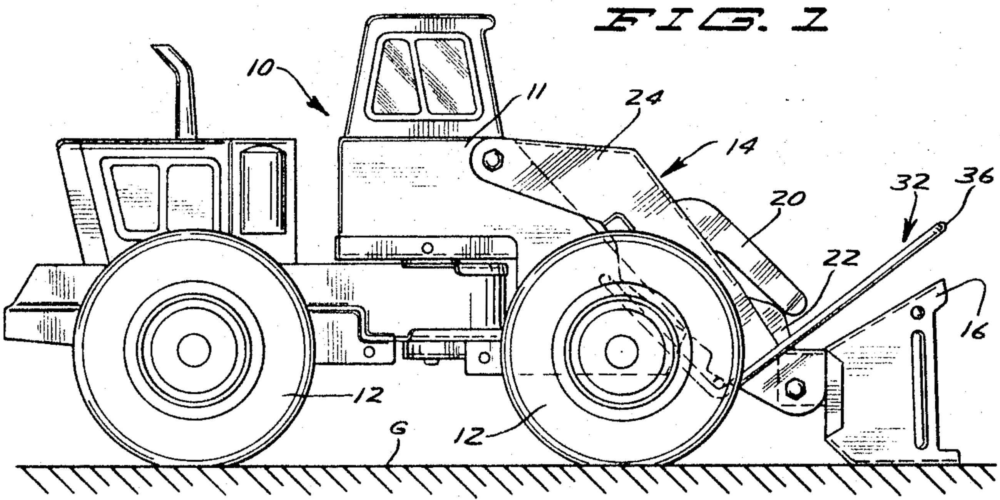
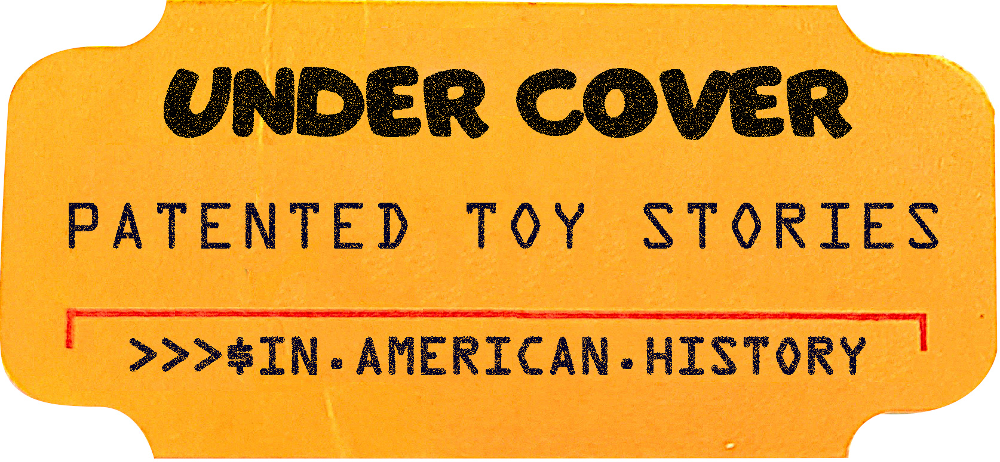
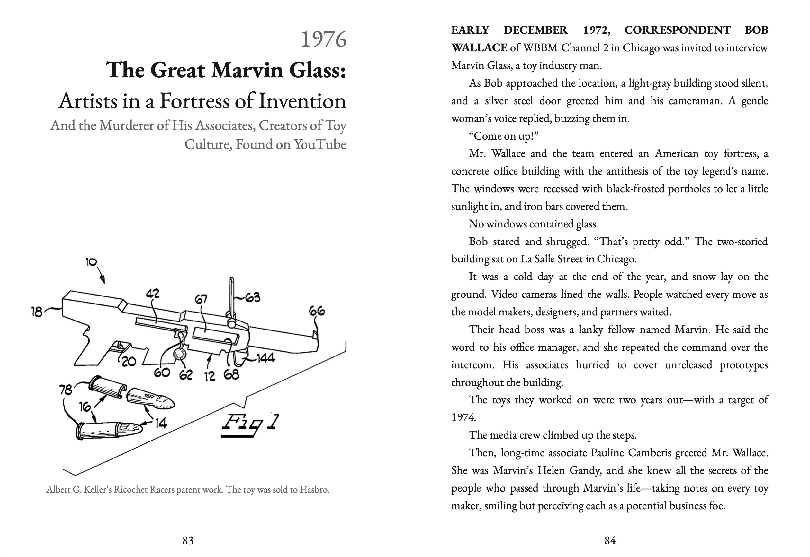

## ON TOY HISTORY
# Upcoming Book: Technical Toy Stories
## An Anthology of Real American Inventions

#Books, #Future, #Toys, #Stories, #Memories


What if a reader was treated like an adult, retelling the *best and worst* American inventive toy stories so few published works dare to write?

This blog is on a mission to publish those tales. These vignettes are authored using the mosaic theory of information and tell the truth based on sources and evidence.

Using artificial intelligence and old-fashioned storytelling, sources are combined to create unusual narratives about the toy industry. From podcasts to legal documents, patents to social media, and books to newspapers, these stories are free to read and will remain that way.

Now, each story will join an anthology compiled into a book tentatively titled *Technical Toy Stories: An Anthology of Real American Inventions, Volume One*.*

The target for the book’s release is Fall 2025.

## The Motivation

This author has been fascinated with [toy patent drawings](https://ipwatchdog.com/2018/12/23/iconic-patented-toys-games/id=91631/) and the stories behind their creation, seeking to uncover lesser-known engineers and inventors.

These beautiful sketches granted by the [UPSTO](https://www.uspto.gov/) have influenced American society. *Technical Toy Stories* studies patents close to the final product, filling a gap to retell their origins in a fascinating curated collection.

The intrigue started when this author realized his childhood toys had become "evergreen," meaning they are sold in similar forms today.

Then, this author started the quest to research their original technicians and recreate their human invention tales.



These expired patents, now in the public domain, have impacted the lives of millions of children and the wallets of adults.

Many stories remain scattered through various incomplete sources. This book pulls them together and recreates their drama. Discernible inventors are quoted throughout.

Each tale within *Technical Toy Stories* features timeless products that lasted over a generation, recognized by Americans.

### This Book is Not For Children

*Technical Toy Stories* is written in a way that is easy to understand. The goal is to make the content interesting and surprising. It's not intended for children.

What sets this anthology apart is its anchor to the patent and its unflinching attitude to truth in history. It contains selected works that streaming entertainment documentaries will not cover.

Topics include difficult subjects such as death, lack of safety, injury, shifts in manufacturing, injustice, etc.



This anthology reflects the industry's unease, focusing on American-cultured toys, many from powerful corporations. But make no mistake, "feel-good" origin stories are mixed within. *

And yeah, the industry has experienced some wild stories. *Technical Toy Stories* retells them.

### Chapters in the Book

Picking up *Technical Toy Stories* provides the convenience of having everything under one thumb. Read it (or this blog) to understand lesser-known American inventive toy stories.

*Technical Toy Stories* growing index follows. Each story contains a patent postlude(s). While focusing on "boy toys," alternative topics are being researched.

```
i. [An Introduction To Undercover Toy Stories](https://medium.com/@solidi/undercover-patented-toy-stories-e49676a29477)
ii. [Memorable Moments in Future American Toyland](https://medium.com/@solidi/memorable-moments-in-future-toyland-b919fdcbcba6)

I. A Time for Toy Stories

1. 1959: [Jack Ryan and Ruth Handler: The Power Ballard of American Coffee](https://medium.com/@solidi/jack-ryan-and-ruth-handler-of-mattel-the-power-ballad-of-american-coffee-2c19994e6732)
      *Sex, speed, guns, conspiracy, caffeine, and four letter words in toy making.*
2. 1967: [Rusting of America: A Pair of Mighty Tonka Trucks](https://medium.com/@solidi/the-pair-of-mighty-tonka-trucks-b361abe12c6e)
      *Toys based on real machines. Shifting US manufacturing.*
3. 1970: [Toys from Aerospace: Wheels, Wings, and Electric Space Juice](https://medium.com/@solidi/push-play-and-put-em-away-the-hot-wheels-kid-powered-trains-and-planes-80f6c2edeb40)
      *The toy company surrounded and influenced by Defense and Aerospace.*
4. 1970: [The First American Toy Team: The Fisher-Price Action Garage](https://medium.com/@solidi/the-fisher-price-action-garage-15b6a9556e2a)
      *Child injury, deaths, toxic paints within an iconc pre-school brand.*
5. 1976: [The Great Marvin Glass: Artists in a Fortress of Invention](https://medium.com/@solidi/the-great-marvin-glass-artists-in-a-fortress-of-invention-08e6a6da3399)
      *The murderer of his associates, creators of toy culture, found on YouTube.*
6. 1977: [East Remeets West: The Tomy Big Loader](https://medium.com/@solidi/the-tomy-big-loader-351139832616)
      *Japanese normalization Post WWII in American Toys before the 80s.*
7. 1980: [The Toy That Drove Us: The Hot Wheels Sto & Go](https://medium.com/@solidi/the-toys-that-made-us-the-first-hot-wheels-sto-go-playset-2f051fbd33c3)
      *When spaceage plastic meets the first portable car garagehouse.*
8. 1983: [The Last Toy Express: Golden Era Kid Powered Trains](https://medium.com/@solidi/push-play-and-put-em-away-the-hot-wheels-kid-powered-trains-and-planes-caefc9c49042)
      *The waning of toy trains and military planes in America.*
9. 1988: [How The Orange Tip Became a Standard-Issued Toy Accessory](https://medium.com/@solidi/how-the-orange-tip-became-a-standard-issued-toy-accessory-7c76d9b74ec8)
      *Toy guns in America, Daisy, and the tragedy of Leonard Falcon.*
10. 1994: [Wear Eye Glasses: Galoob's Sky Dancers](https://medium.com/@solidi/wear-safety-glasses-galoobs-sky-dancers-3c3b499288f3)
      *When toy makers launched a flying doll, and crash landed successfully.*
11. 2009: [Theo and Ora: Toy Craft From Israel](https://medium.com/@solidi/theo-and-ora-toy-craft-from-israel-317112446e05)
      *Board games and toys; persecution survival and lasting impact.*
12. 2014: [All Wet In The Great American Water Balloon Fight](https://medium.com/@solidi/all-wet-in-the-great-american-water-balloon-fight-596312c7a0f2)
      *Patents, legal challenges and independent inventors in backyard toys.*
13. 2020: [The Internet's Favorite Toy: The Tomy Screwball Scramble](https://medium.com/@solidi/the-tomy-screwball-scramble-9f4eab3681da)
      *When YouTuber's reviewed the fifty year old ball-in-puzzle game.*
14. 2025: The End of Cheap Toys: The Wicked Box Tariff Debacle
      *Packaging patented tech and connections back to American politics.*

II. America's "Jack" of Toyland

1. 1968: [An Engine of Perpetual Conspiracy: A Tragic American Toy Story](https://medium.com/@solidi/a-tragic-american-toy-story-f0c19e58534e)
      *Wild science, injustice, supression. The Toy Industry's CYA moment.*
2. 2003: [Automotive Dissonance: The Ulitmate Hot Wheels Legend](https://medium.com/@solidi/the-ultimate-hot-wheels-legend-0e3b9e2b2d88)
      *The prank hiding in toy history supporting [A Tragic American Toy Story](https://medium.com/@solidi/a-tragic-american-toy-story-f0c19e58534e).*
3. 2024: [Jack's Injustice: Corruption Within the State of Californa](https://medium.com/@solidi/jacks-injustice-corruption-within-the-state-of-california-9725cd0476eb)
      *Evidence suggests tensions which challenged Jack's warranted criminal manslaugther.*

III. The Man Who Made Magic

1. [Inside the Military Toy Complex: The Man Who Made Magic](https://medium.com/@solidi/the-man-who-made-magic-f2add97875c8)
      *The mystery and legacy of Jack E. Hartman, an All American toy inventor.*
        a. A Place to Create
        b. A Moonshot Engine
        c. Science by Press Conference
        d. Belief vs. Research Fields
        e. Investigating an Observer
        f. A Toy Legacy Written in Prank
        g. Toy Maker Crosses a Century
        h. The Mystery and Legacy of an Inventor
```

Each story is historically accurate based on sources. These stories capture the truth about the American toy business, for good or bad.

## Looking for Toy Story Tips

This author started the journey out of curiosity, reflecting on how toys impact people's lives and his children.

Countless inventors have shaped American culture without receiving credit. *Technical Toy Stories* highlights some of them. But not all stories can be found by this author alone.



If the reader has a tip, please contact the author through the platform by commenting below. No story is too small, and no invention controversy is too difficult.

---

* *The working title and content are subject to change. The book may contain bonus content*.