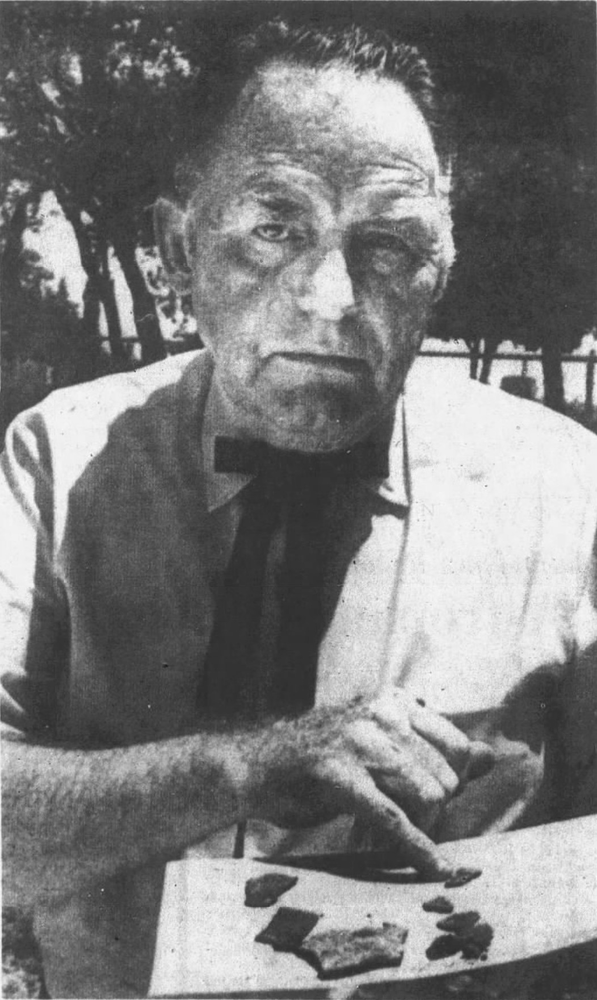
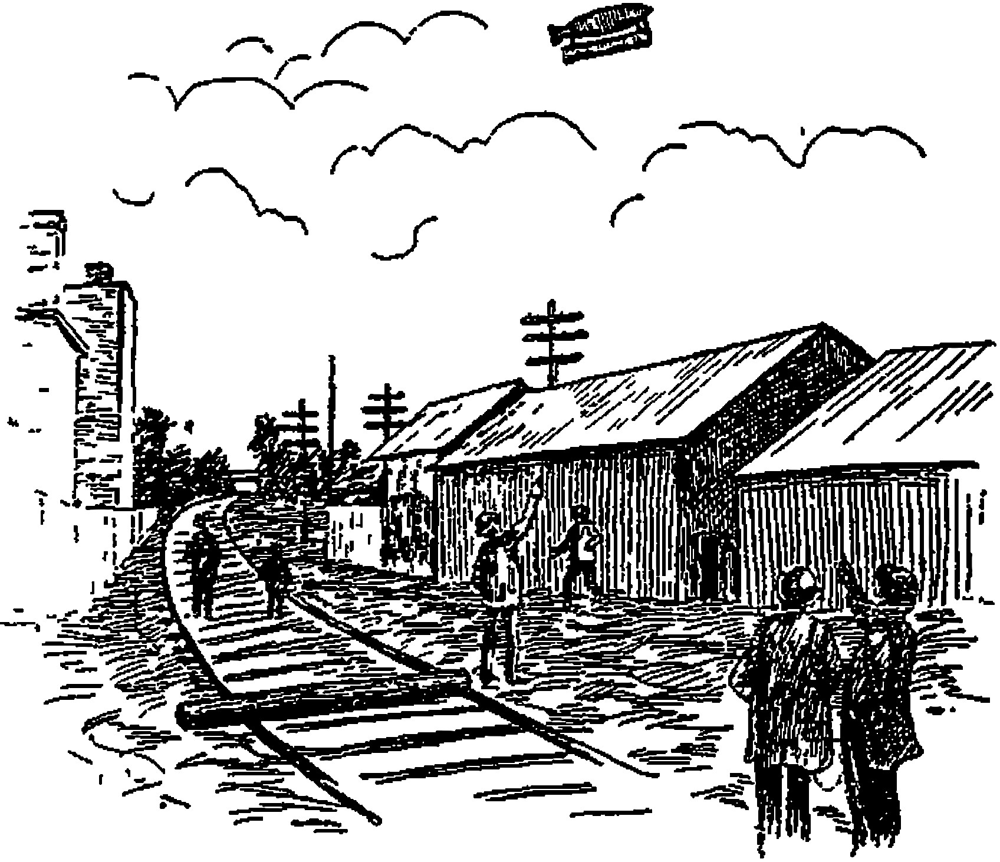

## UFO INTRODUCTIONS
# The Aurora Incident: Roswell of Texas
## A Legendary Crash During the Mystery Airship Invasion of 1897
#UFO, #Uap, #Series, #Intro, #Mystery

.](images/84-01.gif)

---

*What follows is part of a continuing series. **UFO Introductions** are short hooks to the greatest aerospace mysteries known to humanity.*

---

On the morning of April 17th, 1897, a large cigar-shaped silver object crashed into a windmill in Aurora, Texas.

With metal debris blown throughout his farm, Judge J.S. Proctor grabbed his shotgun and investigated. Nervous, he came upon a "small man" lying on the ground in a silver suit, badly injured.

J.S. Proctor attempted to revive the man, described as "not an inhabitant of this world." Sadly, the man "from Mars" died, leaving papers of "hieroglyphics" in his suit.

 had assembled a [trove of case information](https://web.archive.org/web/20070204053124/http://www.mufon.com/famous_cases/Aurora%20Texas%20Crash%20Part%201%20MUFON%20Case%20File.pdf) on this incident.](images/84-02.jpeg)

Mr. Proctor and his townspeople gave the man a "Christian burial" in the Aurora Cemetery. A headstone was installed, designating his resting place.

Two days later, reporter S.E. Haydon of the *Dallas Morning News* captured the incident in detail. A Fort Worth newspaper corroborated the story.

At the time, other unidentified flying objects were reported throughout Northern Texas. But the world soon forgot about them and the crash.

---

A century passed. In 1966, two British researchers investigated these strange balloons throughout Texas in the late 1890s. They developed a map of the April sightings.

In 1973, aviation investigator Bill Case of the *Dallas Times Herald* heard of the legend through a friend. Armed with a metal detector, he investigated its burial site around the headstone, uncovering just a few pieces of strange aluminum metal.

Mr. Case found more, but he needed time to excavate. This metal was an exciting find because, before 1905, no one knew how to make it. Its composition certainly wasn't natural.

After Mr. Case interviewed local townsfolk, authorities learned about its intruding investigator, and they pushed back for a time. They blocked entry to the cemetery.

As Bill's articles circulated, UFO organizations swarmed the area, attempting to discern what was true. Jim Marrs, a young reporter intrigued by the findings, also contacted Mr. Case.

Mysteriously, when Mr. Case regained access, the headstone was removed. And when he placed his metal detector over the same area weeks later, those metal pieces...

They vanished.

---

*From the Aurora incident, TV documentaries, countless books, and a 1980s Hollywood B-movie, The Aurora Encounter, were produced.*

 

*[The Aurora Incident](https://en.wikipedia.org/wiki/Aurora,_Texas,_UFO_incident) and its association with [Airships over Texas](https://wedentondoit.com/blog/2017/4/21/the-1897-texas-airship-invasion) have become extraordinary legends. Their tales are cemented by UFO and UAP storytellers like the late [Jim Marrs](https://en.wikipedia.org/wiki/Jim_Marrs). Investigations of validity continue into the 2020s.*
