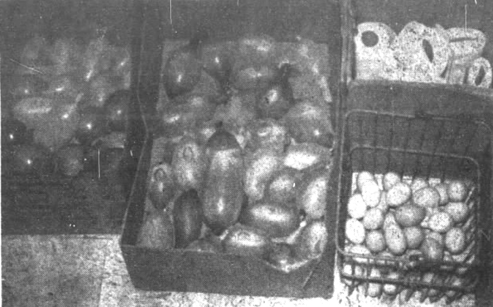
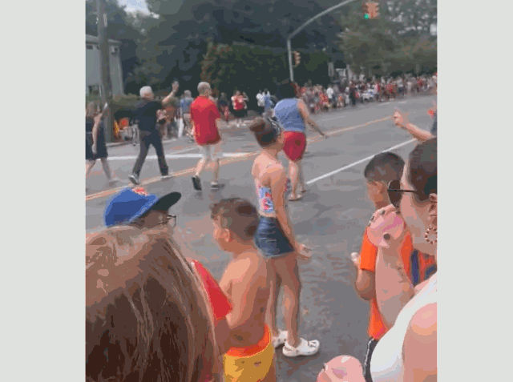
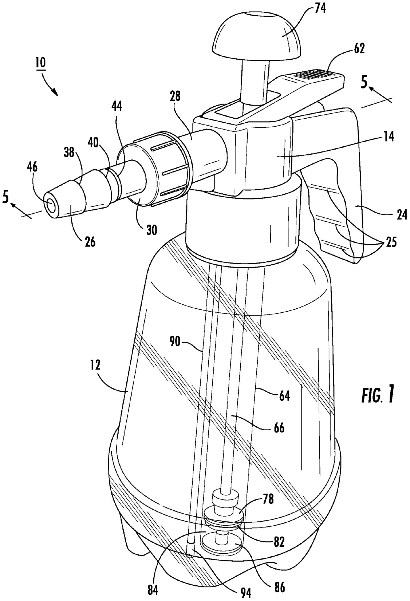
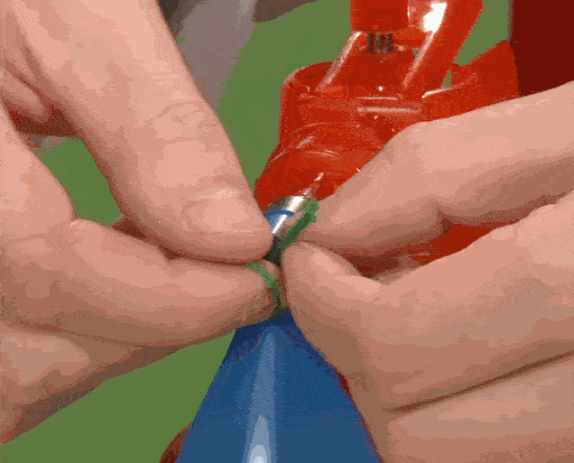
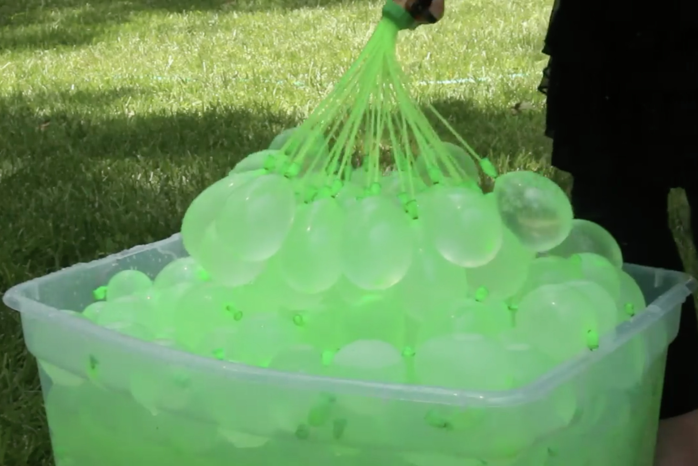
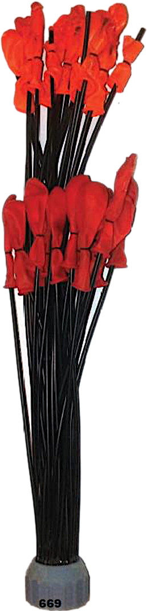
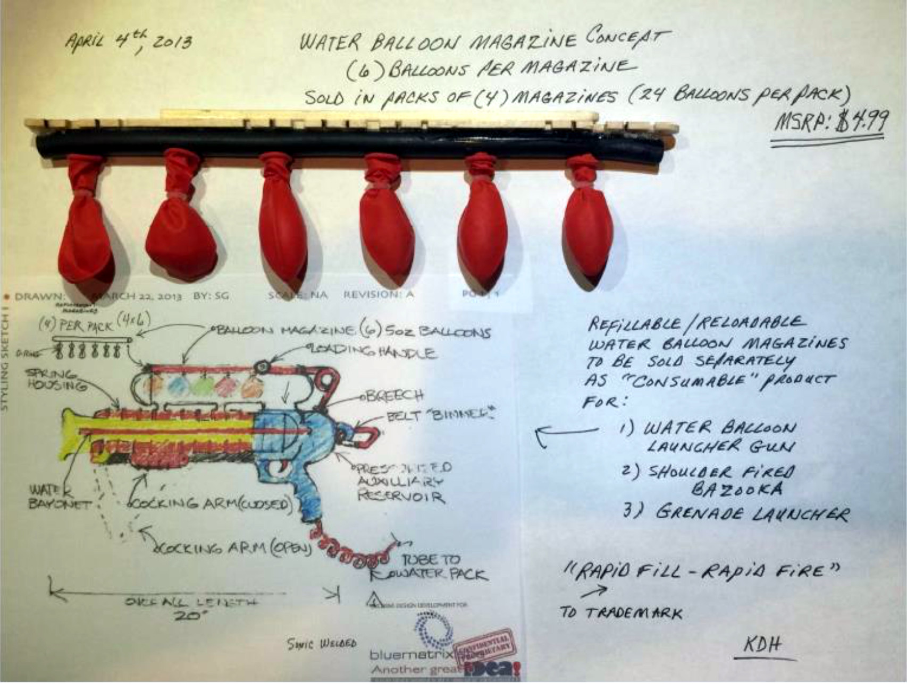
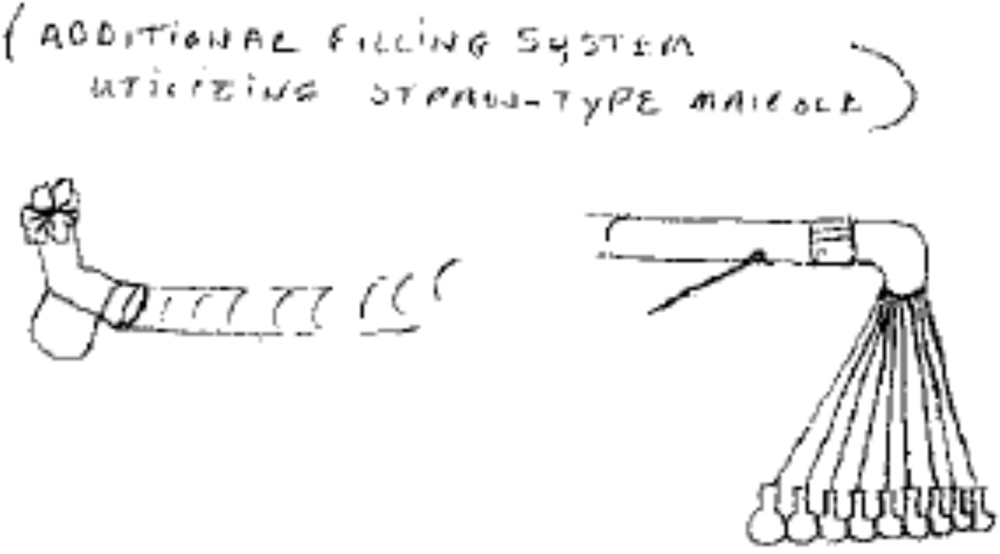

## ON TOY HISTORY
# All Wet In The Great American Water Balloon Fight
## Bunch O Balloons Battle For Market and Inventive Rights
#Toys, #History, #Water, #Balloons, #Business, #Legal

 is a 21st-century toy invention that has secured accolades. Its branding includes patriotic red, white, and blue and the American Flag. Its historical business story, among others, follows.](images/85-01.jpeg)

---

*This draft is part of an American Toy Anthology. For information on the upcoming publication, see this author's announcement, [Technical Toy Stories](https://medium.com/@solidi/upcoming-book-technical-toy-stories-80d5bfbd76c0): Volume One.*

---

The story of the modern water balloon is a remarkable 21st-century saga centered on rapid invention and the validity of American [patents](https://en.wikipedia.org/wiki/Patent).

As the American tale unfolds into its second decade, water balloon inventions have tested legal boundaries of misappropriation claims and alleged infringement.

 taught a generation of kids (now grandparenting adults) the importance of invention.](images/85-02.gif)

With toy inventors diving into its water muse, they appeared in the media. And they all answered the call: "Why do we fill and tie such a difficult water balloon knot?"

And so, American inventors partnered with domestic investors and foreign companies to fill its needs. But first, a definition. Patents are:

> a government authority or license conferring a right or title for a set period, especially the sole right to exclude others from making, using, or selling an invention.

---

## I'm a Sock Man: American Vandalism Into Toy Profit

Water balloons were an [accidental invention](https://www.ky-news.com/have-you-ever-wondered-who-first-thought-of-water-balloons--cms-12343)*. Edgar Ellington, a British inventor, attempted to solve the problem of [trench foot](http://www.historyofballoons.com/balloon-facts/facts-about-water-balloons/) by inventing latex-like socks.

According to *Time* magazine, Mr. Ellington discovered the pleasure of bursting these "water grenades." Shortly after, it was history. The water balloon joined a class of toy inventions tied to failed military applications alongside the [Slinky](https://en.wikipedia.org/wiki/Slinky) and [Silly Putty](https://en.wikipedia.org/wiki/Silly_Putty).

The water balloon (once known as "water bombs" or "water-filled toy balloons") has existed for decades. News articles note that the rubber balloon, a nineteenth-century invention, contained water *before* the 1950s.

Companies have mass-produced rubber balloons [since the 1930s](https://www.youtube.com/watch?v=_asrhvc4dPg). However, Mr. Ellington found a thinner version that was satisfying on contact.*

### Balloon Politics - Some With Water

Since then, water balloons have become an image of de facto American mischief.

The nation's conscience remembers water balloon fights, official contests, pranks, protests, and criminal vandalism. Their shenanigans started in universities.

As creative vandals found new filling material, people were seriously hurt, and their property was damaged. These themes continue today.

A look at historical news titles reveals "Jury Frees Man of Water-Balloon Assault" and "Another Youth Pleads Guilty to Water-Balloon Charge," either thrown at unwilling people, police officers, political officials, or vehicles. †

And a time when a snake "ignored the water-filled balloon" and instead "sank his teeth in the microphone." [WBZ-TV](https://www.cbsnews.com/boston/), CBS Boston went off the air.

In politics, water balloons have a record of being embarrassing, associated with [pie-in-the-face](https://en.wikipedia.org/wiki/List_of_people_who_have_been_pied), hitting politicians and business magnates around the world. These events, which happen occasionally, cause media attention.

Case in point: in one social media [video](https://www.youtube.com/shorts/nJVPlgpDnTA), an American county executive was hit so [satisfactorily](https://www.washingtonpost.com/nation/2023/08/03/yankees-water-balloon-politician-video/) and matched a profile that the Internet confused him with a former Vice President, going viral.

It was captured at an American parade that welcomed adults and children to throw water balloons at their elected [officials](https://www.cbsnews.com/newyork/news/water-balloons-help-make-a-splash-at-annual-stewart-manors-annual-4th-of-july-parade/).

The media later corrected the claim, and the girl with the impressive bean ball received a ticket to the [Yankees](https://www.mlb.com/yankees)' batting practice.

In toy history, the American presidential office is forever tied to the "Teddy Bear," but there is no accounting of water balloons. However, there was that time when [President Reagan](https://en.wikipedia.org/wiki/Ronald_Reagan) entered the toy balloon orbit.

While giving a [political speech](https://www.facebook.com/watch/?v=1195725234541988) in West Berlin in 1987, a loud bang interrupted him. He said, " - missed me!" as the crowd nervously laughed. The reply was in response to a balloon that popped.

It was a humorous response that was pulled more than [once](https://www.youtube.com/watch?v=CNbSidcPxx4), and each time, a reporter would write about it in their news column.

There are at least five written accounts, and one time in 1988, he said, "Again?" checking his chest after a second pop occurred later in the speech.

His quip is all thanks to failing latex toy balloons (and one camera battery).

### Trickling Profit, Now Raining

Today, the water balloon's home turf resides in the hearts of backyards, schools, and playgrounds. They evolved throughout the 20th century by reducing costs.

Military branding "grenades" and "bombs" have since been removed, but some references to "warfare" remain. Water balloon accessories include slingshots and "bazookas."

And there is a crossover to America's pastime. Water Balloon Baseball is a thing.

When it comes to profit-making, water balloons are low-cost toys. They remained unattractive to toy companies [Hasbro](https://shop.hasbro.com/en-us) and [Mattel](https://about.mattel.com/), which have developed icons such as [Mr. Potato Head](https://en.wikipedia.org/wiki/Mr._Potato_Head) and [Barbie](https://en.wikipedia.org/wiki/Barbie).

Disrupting the plaything offered little perceived profit to these juggernauts.

Since the 1960s, water balloons were among the toys parked next to the giant [Wham-O](https://patents.google.com/?assignee=Wham-O&country=US&num=100&sort=old). If one toy company used to own outdoor toys in America, it is them.

Wham-O invented frisbees, hula-hoops, Slip 'N Slide, and messy outdoor toys like [silly string](https://patents.google.com/patent/US3705669A).

But water balloons stood alone, generically sold, and sometimes themed. They hung near pharmacy [rack toys](https://www.amazon.com/Rack-Toys-Cheap-Crazed-Playthings/dp/0991692209), leaking into big box toy aisles as the century ended.

Modern water balloons are fluorescent in color, separating them from lethal-looking paraphernalia. Today, a new toy company leads the way, finding a middle ground between the generic and the premium.

Water balloons are included in the mix.

Companies like [ZURU Toys](https://zurutoys.com/), [Ja-Ru Inc.](https://www-ss-prod.jaru.com/), and others have cornered this market of backyard toys, becoming a billion-dollar business. They sell at a lower cost, a perfect spot to capture a parent's wallet.

 is pending patent from ZURU Toys.](images/85-06.jpeg)

ZURU Toys, like all toy companies today, manufactures in China and has made a significant profit. It invests in monitoring Internet trends, including TikTok, and marketing products through influencers.

ZURU licenses inventions by external inventors, which is part of this water balloon saga. They have succeeded in their [XSHOT series](https://zurutoys.com/brands/x-shot-water/warfare), soft-foamed dart guns, and water guns that are less costly than [Nerf](https://en.wikipedia.org/wiki/Nerf).

For companies like ZURU Toys, small-time American inventors went to work, making this new toy category possible. They have since learned the lessons of invention, problem-solving, patent negotiation, and navigating the legal system.

---

## There's Always More To Do: Ms. Glenn's Abandoned Patent

"Nia, I got a new invention," said Donna Ramere to news reporter Anna Lee of the *Greenville News*, reflecting on Lexi Glenn's invention story.

South Carolina grandmother Donna Ramere and granddaughter Alexis "Lexi" Glenn were new inventors in the space of water balloons. Ms. Glenn, aged eight, came up with the idea in the summer of 2008 after competing with her brother.

Her sibling was cheating, filling water balloons from the sink faucet. Instead, Lexi had problems with the hose and saw a nearby spray bottle. Attaching the water balloon to its nozzle, she filled it with water.

The invention idea was born: "I saw a nozzle, a pump, and a button," said Ms. Glenn.

As the fall took hold and the economy crashed, Ms. Ramere was down on her luck as a mortgage loan officer. Her granddaughter reminded her of the invention while The [Great Recession](https://www.federalreservehistory.org/essays/great-recession-of-200709) unfolded.

They got to work, inventing the [Pumponator](https://www.cnet.com/pictures/toy-fair-2010-photos/57/).

At [Toy Fair 2010](https://toyfairny.com/), a century tradition of gathering toy vendors and inventors who showcase their products in New York, everyone noticed. Pumponator made its first million by selling to accounts.

But the Pumpinator's story contained legal bumps. Their team brought a legal case to Water Sports LLC, which alleged infringement. Then, the patent application, which was pending status, was refiled and then abandoned.

A patent, with a child inventor's name as assignee, was never issued.

Donna Debelak of *Inventors Digest* [wrote](https://www.inventorsdigest.com/articles/trade-show-highs-lows/), "Someone filed protests under the Patent Office's [third-party submission program](https://www.hjkwlaw.com/post/2018/05/15/an-overview-of-third-party-pre-issuance-submissions-advantages-and-disadvantages) before the patent was issued."

The toy fair attracted interest to the point of challenge. That submission program is a part of the [America Invents Act](https://www.uspto.gov/aia_implementation/bills-112hr1249enr.pdf).

Their interest continued, and companies bought into the product. But without a patent, their sales loss was incalculable. Some estimates are in the tens of millions.

" - One claimed that the patent didn't even cover her product's current nozzle design. Ramere has never been able to get a patent and has given up trying."

While Ms. Glenn solved the problem of combining a nozzle and filling source, she came close to the knot problem. The Pumponator's company continued to invent, tying knots with strings.

As Ms. Glenn's Pumponator invention rolled out at the end of the 2000s, something was in the water. Further tying, filling, and biodegradable solutions were coming.

Why did it happen all at once? The obvious answer is that inventors closely studied the ideas from the market and at toy fairs. Some happen by chance, not a management's request.

But why were they popping up? This author raises his bruised fingers from tying water balloons for his children, blaming it on a generational divide.

---

## Tie a Knot In It and Hang On: A Gen X Water Balloon Device

After sixty years, inventors realized tying water balloons sucked. This author assumes its solution resulted from a generational change in attitude.

Demonstrating play may be a social side effect of [Baby Boomers](https://en.wikipedia.org/wiki/Baby_boomers) giving their "tying finger" to [old age](https://csunshinetoday.csun.edu/media-releases/baby-boomers-are-redefining-what-it-means-to-be-old-says-csun-prof/#:~:text=Chung%20said%20Baby%20Boomers%20are%20shifting%20societal%20perceptions%20and%20expectations,new%20things%2C%E2%80%9D%20he%20said.). Their successor, [Generation X](https://en.wikipedia.org/wiki/Generation_X), are parents who partner with their children in the backyard, identifying as "cool" kids themselves.

Many of these adults became parents at the end of the 2000s, amplifying the sentiment. They are engaged with their children, invented "[helicopter](https://en.wikipedia.org/wiki/Helicopter_parent)" parenting, and are empathetic about their success.

And these adults seemed unafraid of water. Some were maturing inventors with access to new rapid plastic molding techniques. Inventor Wayne Sikorcin was recruited.

"Everything I came up with, I needed three hands to do it," [Wayne Sikorcin](https://www.linkedin.com/in/wayne-sikorcin-a7966340/) said in an interview with Bob Hudson in *My Suburban Life* in 2012.

Wayne tinkered with ways to tie a water balloon. "[The] kids were just too small to tie them. So (my wife) puts me in charge of tying these things for the picnic."

.](images/85-09.jpeg)

But nothing was working. "I've got to find a way to make this simpler."

Then, the father examined the wooden pieces in a toy bin, recommended by his daughter. These [Tinkertoy](https://en.wikipedia.org/wiki/Tinkertoy) rods, an invention of Charles Pajeau in the 1910s, inspired the custom notches on which Mr. Sikorcin's invention operated.

His wife, Laura, was involved in its literal "tinkering," as they sunk over $200,000 into the efforts. Mr. Sikorcin finalized the device and filed [his second patent](https://patents.google.com/patent/US8307612B1) in April 2011, which combined filling and tying.

They desired to sell out wholly.

For a time, Mr. Sikorcin hawked the product on [www.tie-not.com](http://www.tie-knot.com/). Today, the website is gone. Consumers can find the product on [Amazon](https://www.amazon.com/Tie-not-Biodegradable-Balloon-Filling-Colors/dp/B00KY56H0I/).

### Fishing is Much More than Water Balloons

Tie-Not was a wonder product, a water balloon tool for an age-old problem.

The invention was striking enough that Wayne and Scott Smith, a sales consultant for Mr. Sikorcin's Craftsman Tool & Mold Co. in Aurora, Illinois, appeared on [Shark Tank](https://en.wikipedia.org/wiki/Shark_Tank) in 2014.

Shark Tank features a panel of investors who decide whether to buy in as entrepreneurs. These potential enterprisers make business presentations on their products. If the idea is profitable, they get offers for capital.

 clip is [licensed](https://www.youtube.com/watch?v=dABmAjBWqWI) to Ja-Ru, Inc. after buying Imperial Toy's bankrupt assets.](images/85-10.gif)

Mr. Sikorcin and Mr. Smith made the show's final, receiving an offer from [Barbara Corcoran](https://en.wikipedia.org/wiki/Barbara_Corcoran). At stake was $50,000 cash, a $75,000 credit line, and a 25% share of the business. They declined.

Mr. Sikorcin has yet to sell the product outright. However, he licensed his Tie-Not to [Imperial Toys](https://en.wikipedia.org/wiki/Imperial_Toy_Corporation), a company specializing in low-cost playthings.

Mr. Sikorcin's patent, seen above, protects the Tie-Not. Products took notice. Ms. Glenn's Pumponator added a tying apparatus.

In 2013, ZURU Toys did as well. They launched their XSHOT 3-in-1 Blaster Water Fill & Tie, throwing in a pack of water balloons to accompany their custom-tipped filling nozzle.

But Wayne and Laura's invention was a drop in a giant bucket, a prelude to tying a knot differently. The question remained, "How do we fill water balloons *rapidly*?"

---

## Act as If All the World Were Watching: Buy Water Balloons

Many Americans know the brand "As Seen On TV." Walk into an American big box store, and their products are on the shelf in major retailer outfits.

Their dedicated aisle offers an endless selection of utilities, offering "brands" from a single source.

"I had this idea to sell through direct mail," said [AJ Khubani](https://en.wikipedia.org/wiki/A._J._Khubani), founder of [Telebrands](https://telebrands.com/) and creator of the logo "As Seen On TV." He was chatting with David Cogan on the [Eliances podcast](https://eliancer.com/).

"I took my life savings and started a kitchen table operation." He first sold radios through the magazine [National Enquirer](https://www.nationalenquirer.com/). Then he had the idea to sell items on TV.

Starting in 1987, " - the product I sold on TV, and some people may remember this, is a product called AmberVision Sunglasses." Subsequently, Telebrands sold millions of units, their first mega-hit.

At the time, products advertised on TV were not sold in stores. So, Mr. Khubani had an idea to increase his market share. "Everyone recognized the brand." He wanted aisle space.

 was Telebrands' first successful product sold in stores in the Northeast.](images/85-11.gif)

Retailers considered Telebrand a competitor, so they resisted. But Mr. Khubani convinced defunct Herman Sporting Goods to do it differently.

At their office, an executive manager overheard AJ's pitch and walked in. "Let's give him a chance." They agreed to sell in-store.

In 1988, with two hundred orders, AJ needed a logo on the box. After sketching a starburst design, he drew the shape of the TV red box logo. That logo appeared on their boxes, landing in Hermans Sporting Goods store.

As the store footprint expanded, Telebrands pumped out products into the 1990s. In 2000, Telebrands filed for Chapter 11 bankruptcy due to numerous bad business decisions, but Mr. Khubani's determined spirit saved the company.

"I went down to below zero because I had more debt than assets. Back from the ashes, we rebuilt the company," said Mr. Khubani on [*Those Who Made It*](https://www.youtube.com/watch?v=v4rz3crl4Uw).

Then, Mr. Khubani created the fast-talking, fast-selling aura of [Billy Mays](https://en.wikipedia.org/wiki/Billy_Mays) and [Anthony Sullivan](https://en.wikipedia.org/wiki/Anthony_Sullivan_(pitchman)). Their booming "[PitchMen](https://en.wikipedia.org/wiki/PitchMen)" made their products omnipresent in American culture.

### The Only Thing We Have to Fear Is A Child's Toy Itself

While Telebrands succeeded at various utility products, they dared not venture into the cutthroat marketing of children's toys.

But at the beginning of the 2010s, this author assumes their market tests and research suggested toy competence. So, backed by thirty years of sales success, their billion-dollar corporation started a gamble.

In 2014, staff writer Joan Verdone of *The Record* wrote that Mr. Khubani said, "Playthings will also be on the shelves of the largest specialty retailer of toys." AJ's team rolled out the toy strategy.

"Our business model is so effective at selling innovative, interesting products, we thought we try the same business model on kids."

 was Telebrands first entrance to the water balloon fight.](images/85-12.gif)

After market research, Telebrands started with three toys. Their next batch included a pairing to their innovative expanding [water hose](http://www.telebrands.com/pocket_hose/).

Telebrands launched their first water balloon set in 2015, Balloon Bonanza. They placed them in [Bed Bath and Beyond](https://en.wikipedia.org/wiki/Bed_Bath_%26_Beyond), among other retailers. They received rave reviews.

The question was, where did the balloon concept come from?

Telebrands has had legal issues over the years, especially in their home state of New Jersey. The media noted, "340 consumer complaints since 2012."

*CBS News* has reported at least "100 infringements on [intellectual property](https://www.cbsnews.com/news/inventors-allege-family-behind-some-as-seen-on-tv-products-profit-from-knocking-off-creations/) rights" brought to them.

---

## History Will Do The Rest: Set Fire, Throw Water Balloons

"I believed in the patent system - I still do, all of us do."

Well-articulated [Josh Malone](https://www.linkedin.com/in/malonejosh/) spoke at a [rally in 2017](https://www.youtube.com/watch?v=GF5-aaGDS9s) to protest the burden of litigation his family endured. His 2014 invention is called [Bunch O Balloon](https://www.amazon.com/stores/BunchOBalloons/Homepage/page/777A93E9-2823-40A3-8065-AE1E92C236E6).

"[The patent] is what the [U.S.] [Constitution](https://capitolhistory.org/us-capitol-history-for-teachers/united-states-constitution-annotated/) secures to inventors the exclusive right to their discoveries."

 from 2014.](images/85-13.jpeg)

Josh Malone, a father of eight, chewed into his savings after leaving the tech sector to support his wife, Alison, who appeared in the 2018 documentary [*Invalidated*](https://www.imdb.com/title/tt9013862/).

As an inventor who worked independently at Tinnus Enterprises, LLC, he interacted with numerous companies for ideas and engineering.

Eight years later, with little money left, he devised an ingenious solution to fill one hundred water balloons in under a minute.

"I published it, I followed the law, I paid the fees. - [holding his water balloon patent] This is a pretty piece of paper; you stick it on the wall, but it's worthless to enforce that right."

Mr. Malone invented an o-ring clasping a water balloon on a plastic straw. Then, he realized his "light bulb moment" by multiplying the invention, bunching a group at the end of a garden hose. With a little tug as the balloons filled up, they released all at once.

Mr. Malone joined an organization called [USinventor.org](https://usinventor.org/). Then, at the protest, Mr. Malone burned his patents with others.

Unlike Ms. Glenn's Pumponator, who never secured the patent to its new contest process, Mr. Malone had his patent issued.

The [Patent Trial and Appeal Board](https://www.uspto.gov/patents/ptab) invalidated their patents associated with the [America Invents Act](https://www.uspto.gov/aia_implementation/bills-112hr1249enr.pdf) legislation.

The burning symbolized how little patents meant to the individual. To them, it was the antithesis of the American inventive dream.

Mr. Malone considers himself a [libertarian](https://www.texastribune.org/2022/04/12/van-taylor-texas-josh-malone/), and so he fought.

---

"When America created the patent system we have, it was so revolutionary in the world - the common person, no matter who he or she is - they can invent something, get a patent on it, and own it -," said [Randy Landreneau](https://www.linkedin.com/in/randy-landreneau-37b00a33/) president of [USinventor.org](https://usinventor.org/) on [John Butler's Buzz](https://www.youtube.com/watch?v=5ZrzHNgTcXQ).

The law of the land changed in 2011 through the AIA. Inventors could challenge patents anytime. Pumponator and Bunch O Balloons inventors learned of these challenges.

The PTAB, an administrative court of appointed officials, decides if patents issued are erroneous. The board provides a less expensive and faster alternative to federal courts for resolving patent disputes.

The AIA was passed to align with other countries' patent systems with [first-inventor-to-file](https://www.uspto.gov/patents/first-inventor-file-fitf-resources) over first-to-invent.

"In the old days - it was done through [contingency litigation](https://en.wikipedia.org/wiki/Contingent_fee)," said Mr. Landreneau. His organization believes the legislation is stacked against smaller inventors, making it easier to invalidate patents.

Mr. Landreneau's organization states that up to 84% of cases have the patent in question invalidated.

Since then, fewer lawyers have provided contingency. Small-time inventors must pay significant lawyer retainers.

Those with the means can contact PTAB with unlimited tries of gap-finding in their *claims*, which describe the invention in detail. Mr. Landreneau's organization believes the legislation is unfair to inventors whose livelihoods depend on patent protection.

"Everyone knows Bunch O Balloons-suddenly, these huge corporations find out about it, and *wait a minute*, let's just do it ourselves. In those cases, they don't even contact the inventor," Randy added.

### Ask Not What Your Water Balloon Can Do For You

Josh Malone's company discovered Telebrands infringed. After their product's success, a friend called the family and told them they saw something similar in a box, not their iconic silver bag.

It had a red TV logo.

From Mr. Malone's [story](https://jtbg.org/about), "I sent a cease and desist letter to Telebrands, the company violating my patent. They ignored it - ." Then began a journey of injunctions, which Mr. Malone won.

Telebrands then filed an "[inter partes dispute](https://www.uspto.gov/patents/laws/america-invents-act-aia/inter-partes-disputes)" via the PTAB. When an MIT expert hired by Telebrands argued there wasn't a clear definition of what "[sufficiently filled](https://usinventor.org/portfolio-items/josh-malone-inventor-of-bunch-o-balloons/)" meant within Mr. Malone's patent, it swayed administrative judges.

The PTAB invalidated Mr. Malone's patents. "Josh went through eight [PTAB hearings]," said Randy.

While Ms. Ramere gave up on the Pumponator before such a process, Mr. Malone fought. It convinced him to burn his patent on live TV.

Telebrands supposedly copied and reproduced the invention after participating in a purchase of Mr. Malone's [*Kickstarter*](https://www.kickstarter.com/projects/bunchoballoons/bunch-o-balloons-100-water-balloons-in-less-than-1) program, for which Josh raised close to one million dollars in the summer of 2014.

Telebrands released Balloon Bonanza in 2015, followed by [Easy Einsteins](https://www.globenewswire.com/en/news-release/2017/05/01/1483134/0/en/In-World-s-Longest-Water-Balloon-Fight-Easy-Einstein-Gains-Advantage.html) in 2016, and at least one other product in 2017, aligning with their push to disrupt the children's toy market.

Josh followed suit with his licensee, [ZURU](https://en.wikipedia.org/wiki/Zuru_(company)) Toys, a New Zealand-based toy company run by the three siblings of the [Mowbray family](https://podcasts.apple.com/nz/podcast/nick-anna-and-mat-mowbray-new-zealand-toy/id1664290911?i=1000634089201). They had the capital to prosecute the offender, merging as the new backyard toy company.

 of Bunch O Balloons and Balloon Bonzana.](images/85-17.jpeg)

"[We are] committed to vigorously fighting knock-off companies who try to undercut inventors," said [Anna Mowbray](https://en.wikipedia.org/wiki/Anna_Mowbray), COO of Zuru Toys, reported by Joan Verdone of *The Record*.

Both companies spent millions of dollars on several countersuits and newly filed patents, which Telebrands pushed hard to claim the novelty of their new seal technology, claiming Bunch O Balloons leaked water.

Then, a spat broke out, escalating the situation. The [Consumer Product Safety Commission](https://www.cpsc.gov/), a federal entity regulating the safety of consumer products, was notified of Telebrands balloon rings containing high levels of [phthalates](https://en.wikipedia.org/wiki/Phthalates).

A website, [www.toxicballoons.com](http://www.toxicballoons.com/), was authored with published toxicology reports. Telebrands pulled the product, but then CSPC ruled the balloons were safe to proceed with selling, confirmed by a Telebrands spokesperson on May 2nd, 2017.

Telebrands lost its infringement case, and under the weight of their legal victories, PTAB reversed its decision on Mr. Malone's patent.

In 2019, Telebrands ironed out the issues and paid a [multi-million dollar settlement](https://www.wsj.com/articles/four-year-water-balloon-fight-ends-with-31-million-truce-11558388873), a five-year ordeal. A Telebrands spokesperson said it "made a business decision to settle all pending litigation."

, an invention of Telebrands, was subject to published toxicology reports.](images/85-18.gif)

The validity of Bunch O Balloons became a battle between billion-dollar corporations ZURU Toys and Telebrands.

If Mr. Malone had gone it alone, capital from the developing sales would have dried up. This author assumes Ms. Glenn's Pumponator would suffer a similar fate.

But the victory moved Mr. Malone to millionaire status, becoming a veteran of "patent legalese" and its hard knocks.

Mr. Khubani, CEO of Telebrands, was quoted during the battles written by Joan Verdone, "The bottom line is I'm a fighter. I don't give up." But Mr. Malone suspects the fights chewed through Telebrand's bottom line.

Then, a holding company mechanically pitched water balloons of a different kind at Mr. Malone and ZURU Toys.

---

## We Are Tied to the Ocean: An Alleged Watering Source

Kendall Harter of Blue Matrix Labs launched his invention, [ZORBZ](https://www.youtube.com/watch?v=_S-RViKKnJA), in the summer of 2014. It took him numerous years of tinkering to find a solution for self-sealing water balloons.

Unlike Mr. Sikorcin's Tie-Not, which required numerous actions by a person, and Mr. Malone's Bunch O Balloons, which required a pre-packaged filler, [Mr. Harter's](https://www.linkedin.com/in/harterkendall/) invention baked in a self-sealing pill.

Each balloon is independent of an external filling device.

While the product did not scale at volume, it scaled on single-use, inviting a child to produce a balloon ready to throw. Find a spout, fill, crush, throw. ZORBZ was a biodegradable invention.

"We created the Snap and Seal technology so that ZORBZ can eliminate the frustration and pain of tying water balloons for kids and parents alike," Mr. Harter told Amy Fickling of *Austin American-Statesman*.

 patent.](images/85-19.jpeg)

Christine Ayala of the paper reported, "If the parents don't have to tie them, maybe some younger kids will get the chance to try out water balloons," said Mr. Harter.

Mr. Harter confirmed that rapid filling was possible with the invention.

"In the works, we have a Super-Soaker type gun that fills water balloons, and it seals immediately, then you shoot it like a grenade launcher, which is great backyard fun."

After a while, ZORBZ was deemed unsuccessful, and the water gun mentioned did not come to market. Mr. Harter battled knock-offs of his product, posting photos on social media by pointing the offenders out.

Kendall Harter's Blue Matrix and Hydro Toys LLC business, which carried the invention in name, went bankrupt in late 2015. Blue Matrix sold the company's assets to a holding company called KBIDC Investments.

### An Appeal to the Spout

In 2017, a case was brought against Mr. Malone and ZURU Toys from KBIDC, claiming Mr. Harter "was the original inventor of the system" and that Mr. Malone "used them to create Bunch O Balloons" with misappropriation on numerous alleged counts.

The supposed theft of ideas was conducted through third-party vendors invested in idea creation and water tech, of which both shared connections to advance their businesses.

Inventors who go it alone hire consultant companies to advance engineering concepts. To be effective, they share protected ideas. They sometimes consult or are employees of those very companies.

Inventors rely on their private investors or licensees. Mr. Malone and Mr. Harter had these connections and shared ideas separately.

 a filled water balloon closed.](images/85-20.gif)

After summary judgment in 2018 which ruled insufficient evidence, an appeal was brought by KBIDC.

[The Fifth Court of Appeals of Texas](https://en.wikipedia.org/wiki/Fifth_Court_of_Appeals_of_Texas) [documents](https://600commerce.com/wp-content/uploads/2020/07/KBIDC-Investments.pdf) revealed that Mr. Malone and Mr. Harter, both men based in Texas, were connected through the same vendor channels. A signed non-disclosure agreement was required to see Mr. Harter's designs.

The evidence presented by KBIDC included emails between ZURU Toys and Mr. Malone expressing concerns about Mr. Harter's invention during license agreements.

The evidence presented did not convince the court, and at least one law firm criticized the technical case as "[vague facts insufficient to support trade secrets claim](https://www.fwlawreporter.com/2021/02/vague-facts-insufficient-to-support-trade-secrets-claim/)." The Texas Court of Appeals affirmed the court's summary judgment that ZURU Toys and Mr. Malone did not misappropriate trade secrets.

The opinion revealed that ZURU Toys approached Mr. Harter and Mr. Malone simultaneously. "[ZURU] took notice of Harter's and Malone's products and began negotiations with them to manufacture and distribute the products."

Mr. Malone signed on with ZURU Toys, but Mr. Harter refused. It's not clear precisely how ZURU engaged both inventors. Both started their o-ring and rubber-banded journey in 2010.

What was the connection?

---

### A Water Balloon, If They Can Keep It

"Talk to me about Bunch O Balloons - do you know the history of how they [ZURU and Mr. Malone] connected? - "

"I believe it was pre-my time - they started a Kickstarter, it did quite well, and we reached out to him [Mr. Malone] on licensing the property -," said Zack Pentecost, senior e-commerce manager at ZURU Toys, to [Azhelle Wade](https://www.azhellewade.com/) on [Making It in The Toy Industry](https://www.thetoycoach.com/podcast/executive-tips-to-license-your-toy-ideas-with-zack-pentecost-of-zuru-toys) in 2024.

The judge's summary filed in June 2020 does not mention how Zuru Toys connected with Mr Harter. However, the opinion states, "Harter told Zuru that Bunch O Balloons was a design stolen from him."

The opinion also mentions that Mr. Harter gave a deposition supporting Telebrands, which was conducted in 2015.

The court opinion revealed Mr. Harter's water gun required a "flow meter" through its magazine design and claimed to have "filled multiple balloons simultaneously."

This engineered metering, assisted by a shared vendor, was one alleged connection between inventors.

---

## Don't Swear: "Before" nor "After" The Consitution; "Uphold" It

When a curious reader performs Internet searches on the invention of Bunch O Balloons, they are sure to find literature about the American Constitution. It is because searchable documents tie history with a modern successful trademark, a rare feat in this author's opinion.

It's crucial to stress that The Consitution contains what the lobbyists say. Article 1 Section 8 loosely defines the term patent without [writing the word](https://constitution.congress.gov/browse/essay/artI-S8-C8-1/ALDE_00013060/).

> To promote the Progress of Science and useful Arts, by securing for limited Times to Authors and Inventors the exclusive Right to their respective Writings and Discoveries.

Patents are pieces of government-backed paper essential for invention survival. They advance public knowledge, promoting information for the common good. They protect the inventor(s) with an exclusive invitation to potential termed profit.

Property rights are a core tenant in America. Novel, intangible ideas declared through a public process are firm. Today, patents protect modern water balloon fill systems among an endless library of toy inventions put into writing.

### Tell the Truth, Work Hard, and Come to Lunch on Time

The opinion of Mr. Malone's [patent case](https://600commerce.com/wp-content/uploads/2020/07/KBIDC-Investments.pdf) had a few other facts in store.

In March 2015, Mr. Malone and Mr. Harter met for lunch. Mr. Malone "was concerned that Harter may have been siding with Telebrands." Then, the lunch evolved into a patent conversation, which, by this author's assumption, broke down into disagreement.

Mr. Malone left the restaurant saying, "I'm going to tell your investors!" in a surprised spat with Mr. Harter.

There was also evidence of an existing "[provisional application for patent](https://www.uspto.gov/patents/basics/apply/provisional-application)" affirmed by Mr. Harter, the inventor of ZORBZ. Mr. Harter signed an affidavit confirming his sketch *similar* to Bunch O Balloons in 2012 before Mr. Malone filed for a patent in February 2014.

However, the presiding judge's opinion, retired Justice [Lana Myers](https://en.wikipedia.org/wiki/Lana_Myers), was evident from June 2020. She didn't mince words.

"Although the similarity of this drawing to Bunch O Balloons is apparent, the similarity of design is not evidence of misappropriation without evidence Malone knew of Harter's design."

Mr. Harter's claimed provisional patent described as "small rubber bands/o-rings that are applied to the neck of the balloon *after* it is filled that acts as a closure to restrict the flow of liquid or gas out of the balloon opening."

Based on the opinion, Judge Myers noted that the o-rings of Mr. Malone's invention were applied *before*, not *after*.

"[The] appellants failed to present any such evidence [that Mr. Malone misappropriated Mr. Harter's trade secrets brought by KBIDC]."

In 2021, KBIDC moved to petition the Texas Supreme Court. A [court document](https://search.txcourts.gov/SearchMedia.aspx?MediaVersionID=bd97822c-51a1-432c-a95f-b1d8e9ea0622&coa=cossup&DT=BRIEFS&MediaID=d9e5294e-7930-4eeb-b603-d83be9436003) from review contained a grounding statement important for historians:

> Following nearly 70 years of idleness in the water balloon market, Kendall Harter originated the first self-sealing water balloon and developed multiple mechanisms for filling several self-sealing balloons at the same time.

But a year later, [their supreme court petition request was denied](https://www.txcourts.gov/media/1453758/supreme-court-of-texas-orders-03-11-2022.pdf).

Siri Rao of the law firm Crowell & Moring [wrote](https://www.crowelltradesecretstrends.com/2021/04/bunch-o-balloons-trade-secret-dispute-results-in-bunch-o-appeals/), "[The court had to determine if Mr. Malone] had some access to Harter's trade secrets and knowledge of them. The Court simply found no such evidence."

"This case should serve as an important reminder for clients to gather as much evidence as they can before filing a trade secret misappropriation suit."

So, Bunch O Balloon's validity of Mr. Malone's invention and Zuru's product was upheld. Bunch O Balloons answered all the questions on tying and rapid filling, and a group of self-sealing water balloons completed this saga.

Mr Malone's invention has since impacted American culture.

---

## Helping Others Build Theirs: A Moratorium on Tying Water Balloons

"Hold on, let me fill these balloons. I'll drop it in the bucket. Then we'll count to three and have an awesome fight."

During this author's birthday, children battled with water balloons, thanks to Bunch O Balloons supplied by an astute engineer at the hose. The engineer was this author.

Some [Millennial](https://en.wikipedia.org/wiki/Millennials) parents stood aside, embarrassed to participate. The camera caught this drenched author in an endless volley of water balloons.

Laughing ensued, making him ponder how such a fantastic scene was possible close to [National Water Balloon Day](https://nationaltoday.com/national-water-balloon-day/).

This author was surprised to learn that the American water balloon involved concepts of contention, invention, legality, and activism.

### In Water Balloons, We Invent

All parties mentioned continue to innovate in all their arenas. ZURU Toys remains the dominant force in the water balloon fight.

In 2017, Bunch O Balloons won the [Outdoor Toy of the Year Award](https://en.wikipedia.org/wiki/Patent), and sales continue. One estimate from 2016 claimed $200 million in sales, with thirty million units sold.

Josh Malone is a full-time volunteer for [USinventor.org](https://usinventor.org/), fighting to restore independent inventor's rights. He champions inventive creators, a nod to the challenges he once faced.

Mr. Malone's licensee, ZURU Toys, fends off infringers of the invention into the mid-2020s. ZURU's owner's worth is estimated at over 20 billion dollars.

Mr. Harter, founder of [Lemi Shine](https://lemishine.com/), and Mr. Sikorcin continue their separate invention paths. Ms. Glenn's Pumponator continues to sell alongside new toys, and Wham-O sells a similar make and model.

Telebrands continues its quest to dominate sections of retail stores through the determined spirit of AJ Khubani. Since 2014, they have sold [children's toys](https://www.asseenontvlive.com/toys/) alongside their inventions in stores.

So, the never-ending fight for U.S. inventive rights continues. If it does change, it's because of the modern water balloon.

---

** [Coda] All I Know About Magnets Is This: The Water Balloon Question
There is the idea that water balloons are messy to clean up and harmful to the environment. There is also a need to support children who are allergic to latex.

Again, inventors are at the forefront of this problem, which, according to a patent lookup, was first filed by an ex-Mattel veteran who went independent a generation ago.

.](images/85-24.jpeg)

Attempts at reusable technology, either by capsule or sponge, began in the early 2000s. In the 2020s, the introduction of [magnets](https://www.prnewswire.com/news-releases/soppycid-launches-worlds-first-magnetic-reusable-water-balloons-301590212.html) into water balloons was invented.

Surprisingly, a simple Internet search of products reveals an unmistakable shadow over the technology, with results containing the words "dangerous" and "federal violation" between marketed products.

In 2023, at least one water balloon product contained magnets that children had swallowed. The CPSC then ordered a recall [of that product](https://www.cpsc.gov/Newsroom/News-Releases/2024/CPSC-Warns-Consumers-to-Immediately-Stop-Using-SplishSplashFuns-SplishSplash-Balls-Reusable-Water-Balloons-with-High-Powered-Magnets-Due-to-Ingestion-Hazard-Violation-of-Federal-Safety-Regulation-for-Toys). ‡

Data on the popularity of these inventions is not known. It's a sure bet they are questionably seen in quantity compared to single-use.

Importantly, having *a lot* of water balloons is required for fun, and purchasing a generous amount of reusable balloons remains cost-prohibitive.

That will change if inventors get it right. This author has no doubt these pioneers will solve its issue in time.

, granted in 2023.](images/85-25.jpeg)

As of this published writing, the story of these clasped devices is underway. The invention includes [a fresh legal challenge](https://insight.rpxcorp.com/litigation_documents/15738652) between Chinese inventors and an [American patent issued](https://patents.google.com/patent/US11786835B1/), all within an Illinois court.

Numerous products with similar designs are on the market, guaranteeing wild legal water balloon battles ahead.

---

* *The Internet has often reported the water balloon legend, but no one has provided a source. After this author searched thoroughly, he contacted the [Strong Toy Museum](https://www.museumofplay.org/), which had performed a cursory look. They, too, could not produce contemporary records of Edgar Ellington's claim. If you have information, please reply below.*

† Throwing water balloons on unwilling persons is assault. Please don't do it.

‡ Swallowing magnets can be fatal. In 2006, millions of [Mattel toys](https://www.cpsc.gov/Recalls/2006/serious-injuries-prompt-recall-of-mattels-polly-pocket-magnetic-play-sets) with embedded magnets were recalled for this reason. Since then, magnets in children's toys have become controversial, leading to new regulations, such as the [magnet rule](https://www.cpsc.gov/Business--Manufacturing/Business-Education/Business-Guidance/Magnets) by the CPSC at the end of 2022.

---

## Social Post

An inventive grandmother and granddaughter team; an #inventor team who went head to head in #SharkTank; the burning of #patents on live TV; two separate men from #Texas, and a TV retail company from New Jersey—it was an extraordinary legal water balloon battle in American history.

On this National Water Balloon Day, here is the semi-complete seventy-five-year story of the water balloon #products in #America. Its modern #history contains stories of numerous inventive people, investors, and companies. What follows is the surprising #business saga of the greatest #American water balloon fight.

https://medium.com/@solidi/all-wet-in-the-great-american-water-balloon-fight-596312c7a0f2

#waterballoon #nationalwaterballoonday #WaterBalloonFun #engineering #legal #patents #toys #retro #WaterBalloonDay #splash #toys