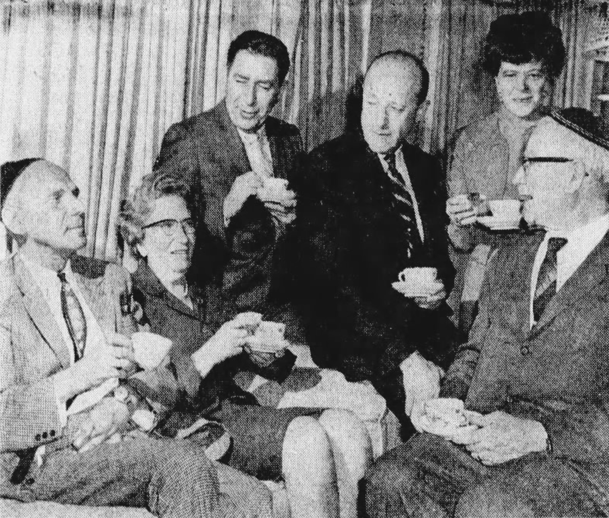
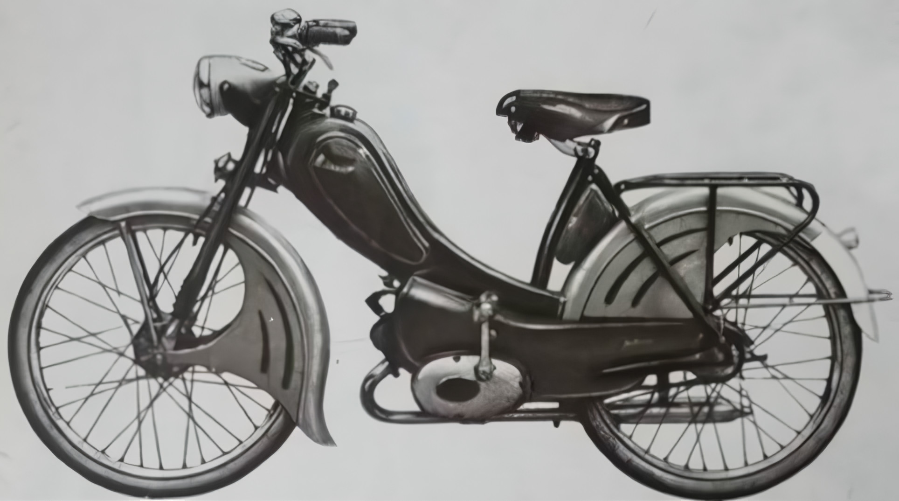
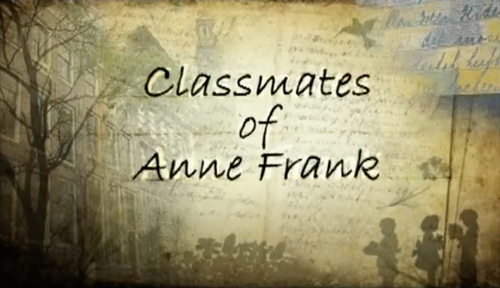
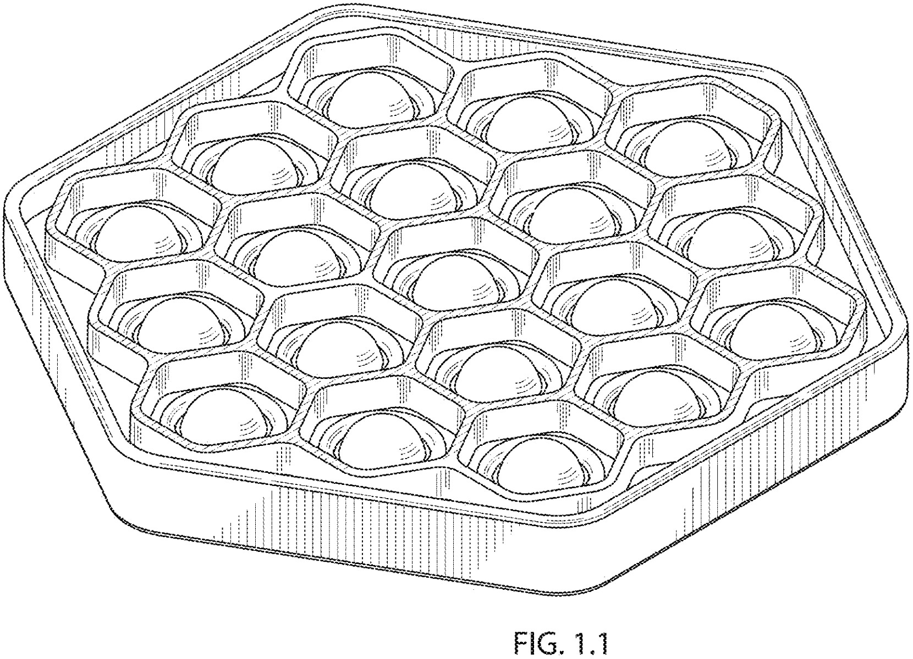

# Theo and Ora: Toy Craft From Israel
## A Story of Survival and Their Passion for Art, Games, and Toys

 filed in 1974 by Theo and Ora Coster.](images/86-01.jpeg)

---

*This draft is part of an American Toy Anthology. For information on the upcoming publication, see this author's announcement, [Technical Toy Stories](https://medium.com/@solidi/upcoming-book-technical-toy-stories-80d5bfbd76c0): Volume One.*

---

**DURING AN ACCEPTANCE SPEECH** for the [lifetime achievement award](https://www.chitag.com/2012-tagies) presented to his parents, Boaz Coster stood before the podium. He is one of two sons of long-time toy game makers Ora and Theo.

"In the late 1970s, Ora came out of the movie *[Deer Hunter](https://en.wikipedia.org/wiki/The_Deer_Hunter)*, inspired. The movie triggered her, the idea of making a toy for children."

Ora stood to the right of Boaz, surrounded by Theo and her son Gideon, her face prepared for what was to come.

"She said, why not make a little toy revolver and children can play [Russian Roulette](https://en.wikipedia.org/wiki/Russian_roulette)? They aim at their temple. But instead of losing their lives they just hear a big bang."

Ora started to smile, looking around as if the game idea was her best-kept secret. *Deer Hunter* was an epic film about friends surviving  America's Vietnam war, with the obsession of its deadly game.

"It was presented only once to Hasbro. It was dismissed in an uneasy reaction, negative feedback. We hid our idea quickly in our secret files."

 reviewed the game.](images/86-02.jpeg)

---

The Costers interacted with American toy companies, pitching unique game ideas. Their most successful presentation was to Milton Bradley called [Guess Who](https://en.wikipedia.org/wiki/Guess_Who%3F). It is a two-person board game in which players guess the identity of the other's chosen character.

Guess Who was Ora's idea; now Hasbro owns its rights.

"However, funnily enough, twenty years later, it was made in Japan. Not related to us - named [Kaba-Kick](https://www.youtube.com/watch?v=uCpmSLMBUsA)!" The game consists of children loading the toy device and pulling the trigger. If unlucky, the feet of a hippopotamus "kick" out.

Boaz Coster stood before the microphone as the crowd roared, laughed, and then realized how crazy it was. *Were they joking?* *

While the produced game "wasn't them," its idea came from a Hollywood origin. This author suspects it was an under-the-table transaction with [Takara](https://en.wikipedia.org/wiki/Takara), who partnered with Hasbro to invent [Transformers](https://en.wikipedia.org/wiki/Transformers). Their inter-corporate creative partnership *may have* led to one questionable toy game for children.

And from the mind of Ora, who was once an [army sniper](https://www.kveller.com/the-surprising-jewish-history-of-popular-childrens-toys/).

Mrs. Coster, an art teacher turned toy maker, was a wise-cracking mother who, along with her husband Theo, invented hundreds of games and inventions based in Israel.

Their stories include adversity, determination, inspiration, crafting, and love.

---

## A Path of Holocaust Survival

*WHILE THE FUTURE* Mrs. Coster was raised in Israel and served in the defense forces during the [War of Independence](https://en.wikipedia.org/wiki/1948_Arab%E2%80%93Israeli_War), Theo M. S. Coster experienced a journey to find her, one in which he survived.

In 2005, Mr. Coster, with a Dutch English accent, spoke to Dr. Jay Rawlings on [*Israel Visions Magazine and TV*](https://www.youtube.com/watch?v=Eop8YAhbIb0). They sat together.

Dr. Rawlings spoke. "[Today we speak to] [Theo Coster](https://research.annefrank.org/en/personen/4ac1d000-52e8-4e66-8e2e-0f5402dceecb/), whose creative genius, along with his wife, has made a tremendous difference in children all over the world."

"Theo and Ora are toy makers of toys and games, and they currently have over [150 concepts](http://theoradesign.com/projects) that have been licensed and manufactured the world over, many of which have become household names. These games include Guess Who - ."

Mr. Coster was Jewish, living in Amsterdam during World War II. He explained that, as a child, he went underground to avoid Nazi collaborators.

Before the brutal, systematic efforts to persecute and exterminate the Jewish population by the Nazis, Mr. Coster contemplated his time in Amsterdam.

In 1941, Jewish lyceums were established, separating the population's children in schools. Theo said "One of my classmates was Anne Frank, who we called Annelies Frank." Mr. Coster was a classmate of [Ms. Frank](https://en.wikipedia.org/wiki/Anne_Frank), who went into hiding in 1942.

Anne's family and friends who hid were discovered in time. Ms. Frank was murdered at [Bergen-Belsen](https://encyclopedia.ushmm.org/content/en/article/bergen-belsen) in 1945. Her sister and her mother were also exterminated, as well as those friends.

Many Dutch lyceum children disappeared during the war. Less than half of the [thirty children](https://research.annefrank.org/en/gebeurtenissen/29a57583-5617-4185-8ee0-9c51c193ef60/) in Mr. Theo's 1L2 class returned.

When the German occupiers came razor-close to his discovery, he found himself with a new family, the Van Beeks, an associate of his [hiding parents](https://en.wikipedia.org/wiki/Hidden_children_during_the_Holocaust). Through a network of reverend resistance, he took a train and fled to Appledorn. From there, he settled in [Vaassen](https://en.wikipedia.org/wiki/Vaassen).

"I got a good Christian education - no harm was done at all," said Theo. In 1942, Mr. Coster escaped and found refuge with a Christian family twelve miles north of [Arnhem](https://en.wikipedia.org/wiki/Arnhem). Mr. Barend van Beek, along with his wife Suus, was the school's headmaster.

In 1970, *The Buffalo News* wrote part of his story. When the grip of the Nazis came close to the Coster family's whereabouts, Mr. Coster's father, Coenaard, escaped to France, taking his daughter Freddy. Freddy separated into Belgium. Mr. Coster fled with his mother.

The efforts of Rabbi Klein, an American Allied forces clergyman in the war, reunited Freddy, coordinating her liberation trip back to Amsterdam.

Mr. Coster said at one point, he lived right under the [Schutzstaffel](https://en.wikipedia.org/wiki/Schutzstaffel), who commandeered rooms in the same building. Nervously, Mr. Coster said, "I think it's not a very funny situation."

While Mr. Coster avoided talking to the dangerous occupiers, one ranking as an [Untersturmführer](https://en.wikipedia.org/wiki/Untersturmf%C3%BChrer), he befriended a man who shined the officer's boots, described as an "underworld" character, Hendriks, a Dutch volunteer for the SS.

Volunteers who sympathized with the Nazis were known as the [NSB](https://en.wikipedia.org/wiki/National_Socialist_Movement_in_the_Netherlands).

Between the nights when Mr. Coster heard the V2 rockets launched into Britain, Mr. Coster remembered how they fished for food. "He [Hendriks] went to the canal with me and threw grenades in the water, and the fish would go belly up." Dr. Rawlings chuckled.

"I think he [Henriks] might have suspected we were Jewish, but he said, why should I bother them?"

After the occupiers left the house, it wasn't long before April 17th, 1945, when Allied Canadian forces liberated Mr. Coster and the community in which he was sheltered.

After the war, deep into reconstruction, Mr. Coster mounted his 49cc [Batavus](https://en.wikipedia.org/wiki/Batavus) G50 moped bike. He traveled from the Netherlands to Turkey.

Sailing from Mersin to Haifa, he settled in [Tel Aviv](https://en.wikipedia.org/wiki/Tel_Aviv), finding Ora. In between jobs, they decided to start a company called MATAT (gift in Hebrew) name which later was changed to [Theora Design](http://theoradesign.com/).

Dr. Rawlings shared that his father served in the liberation efforts. He served in the Canadian forces and was killed in action days before liberating Mr. Coster's hiding community—and thus a connection in their relationship.

Mr. Coster's journey with other former classmates of Anne Frank was published decades later.

---

## A Toy Connection In Canada and Into America

*"THEO WAS A CLASSMATE* of Anne Frank - thanks God, unlike Anne, he survived the Second World War."

". . . His original name was Maurice Simon, and the adoptive family that took him in during the war told him you cannot keep the name, Maurice, it sounds too Jewish . . ."

In 2021, [David Capon](https://www.peopleofplay.com/people/david-capon), CEO of [FoxMind](https://foxmind.com/) Games in Montreal, Canada, spoke to Phil Albritton of the *Toy Book Podcast*. Mr. Capon started an "Edutainment" store in 1992 and subsequently licensed games for kids, which became FoxMind.

With an Israeli-English accent, Mr. Capon said, "They formed Theora Design. They have invented over the years over 160 games that were licensed, including a very famous game that most of the listeners will know, called Guess Who - ."

In 1982, that game was licensed to Milton Bradley. "It is always the top fifty best-selling games, I think, in most retailers."

Through a connection in Israel, he bought the rights to the game Theo and Ora invented through their sons' 2009 sales efforts. Mr. Capon reviewed Mr. Coster's accomplishments, one of them being a game of "לחצניות," printed as "Buttons" on the packaging.

It was a plastic board with buttons on it called "Last Lost."

As Ora confirmed to the American press in 1975, early versions of "Last Lost" were designed for Israeli defense forces during the [Yom Kippur War](https://en.wikipedia.org/wiki/Yom_Kippur_War). As a toy for soldiers, Ora explained that it was a compact game played quickly and stowed just as fast.

 for her talented works.](images/86-05.jpeg)

The developing game's inspiration went from plastic to silicon. As told, it became a family member who inspired the game board of buttons, which was patented in the US office.

[Zvia Mayroze](https://zviamayroze.com/), one of two sisters to Ora, was a sculpturist in the UK. According to her biography, "she possessed an unusual combination of artistic and scientific accomplishments." Zvia experimented with plastics in her artwork.

A [1965 British documentary](https://www.youtube.com/watch?v=Gy4q9F61cX0) demonstrated Zvia mixing liquid plastics, with its questionable fumes rising. Sadly, she succumbed to breast cancer in 1974, aged 40.

An author wrote, "Ora had a dream about [long pause] filled with bubbles, call it. She came to Theo and [paraphrasing Ora] *I think we should make a game out of these bubbles*."

In a BBC [article, Ben King](https://www.bbc.com/news/business-58408570) wrote these bubbles were inspired by nipples from her breasts to memorialize her sister. Their son, Boaz, had confirmed the legacy.

"She [Ora] said, 'Theo, imagine a large field of breasts, ladies' breasts, that you can push the nipple.' She was very open, she said whatever was on her mind, to anyone," said Boaz Coster.

In the Coster relationship, Ora came up with the ideas, and Theo "came up a triangular form, which he put the bubbles - ." The novel [marker board](https://patents.google.com/patent/US4045013A/en) was filed and granted in the US patent office.

Theo told state-owned Israeli news station [Hadashot Hashabat](https://www.youtube.com/watch?v=zXc5F_7hNB0), "My wife usually comes up with a new concept, and I need to do it. *I'm the do-boy*."

However, due to high material costs, it went nowhere for thirty-five years. By this time, their original 1974 patent was in the public domain.

"In 2009, the game ended up on my table - we are gonna do that," said Mr. Capon. "Last One Lost!" has only one rule. Each player takes a turn, popping bubbles as they like on the same row. Rinse repeat.

The last person to pop loses. The board is flipped, and the game begins again. Last Lost is a uni-bodied [nim](https://en.wikipedia.org/wiki/Nim) game, a novel invention.

" - It's fun to play - a deceptively simple logic game." It took ten years for it to take off. In 2019, FoxMind convinced a buyer in America to take on the game. The buyer was [Buffalo Games & Puzzles](https://buffalogames.com/), and it went to the American big box store, Target.

Then, off it went. During the Pandemic, sales dropped. They were about to give up when it happened.

"Around September and October 2020, after we sent some samples to TikTok influencers, we suddenly saw all hell break loose."

Boaz went on. "It was like an atomic bomb. It was really a nuclear reaction." David described his interaction with an influencer and their thirst to buy tens of thousands of units.

The BBC reported the capuchin monkey in North Carolina enjoyed the game. Her name was Gaitlyn Rae, and Jessica Lacher adopted her. The monkey's obsession with bubbles caught the world by surprise.

, in Figure 2, leaves little room for interpretation—clearly they are nipples on breasts.](images/86-06.jpeg)

*Last One Lost!* was the game born during the oil crisis and resurrected during a global Pandemic. The influencers were reselling the game at a record pace. "She [Mrs. Lacher] called us, and I [David] said 'What do you need?' She says I need 25,000."

The podcast host, Mr. Albritton, broke out in laughter. The toy became one to copy.

Mr. Capon continued by discussing the challenges of the legal cases sought against those infringers. Mr. Capon said his company is using all legal means. By differentiating on brand, materials, and innovation, he believes his company, [FoxMind Canada Enterprises Ltd.](https://www.anylaw.com/case/foxmind-canada-enterprises-ltd-v-aaawwww/s-d-new-york/07-07-2021/UVQxzo4B0j0eo1gqTc7M), will prevail. Litigation can be readily found which confirms challenges to the blatant infringement.

This author's legal case search resulted in dozens of litigation claims brought by FoxMind. Defendant companies include unintelligible names.

"The story I just told you, about Theo and Ora, [Theo] being a Holocaust survivor, being known inventors, and the fact if somebody is essentially buying a copy is depriving them their moral dues - [and] from their financial dues - ."

"People have to be aware," said Mr. Capon.

---

## A Film, a Book, and Harrowing Stories of Survival

*LATER IN HIS LIFE*, Theo Coster engaged Dutch schoolchildren, answering questions about being Anne Frank's friend. At eighty years of age, he was getting tired, and a quote lingered in his mind.

"Maurice Coster [now Theo] is one of my many admirers, but he's a rather boring kid," wrote Anne Frank in her diary. [*The Diary of a Young Girl*](https://en.wikipedia.org/wiki/The_Diary_of_a_Young_Girl) became a book through her surviving father, Otto Frank.

Ms. Frank wrote in her diary about experiences in a secret annex above Otto's spice factory. But after a [betrayal](https://www.annefrank.org/en/anne-frank/go-in-depth/was-anne-frank-betrayed/), they were discovered and sent away to work camps, where they were snuffed out.

Mr. Coster’s wife, Ora, was Theo's bedrock for seeing the documentary through. "You're almost eighty," said Ora. "Why don't you make your story into a film?"

And so he did, teaming up with [Eyals Boers](https://www.imdb.com/title/tt1329123/) in 2008. His written book follows it, [*We All Wore Stars*](https://www.amazon.com/We-All-Wore-Stars-Classmates/dp/023011444X), translated into English by [Marjolijn de Jager](https://mdejager.com/).

Five of Anne Frank's classmates are in the writing, with firsthand accounts. On account included [Nanette Blitz Konig](https://en.wikipedia.org/wiki/Nanette_Blitz_Konig), who retold the tale of being shipped off to Westerbork, a transit camp, and laboring in [Bergen-Belsen](https://en.wikipedia.org/wiki/Bergen-Belsen_concentration_camp), a concentration camp.

She recounted seeing Anne in Bergen-Belsen before her murder. And while Nanette survived the labor, being liberated by British allied forces, her family members did not.

Nanette reflected on the loss of her brothers and the pain her mother went through in the loss of one son before the War. Her retelling foreshadowed the horror.

As she [sat Shiva](https://en.wikipedia.org/wiki/Shiva_(Judaism)) and entered the one-year mourning period, her mother gazed at a clock in the house. She said, "This clock only moves forward, never goes back again," which was a constant reminder of arduous times.

The clock survived the war. Later in life, Nanette authored a book called [*Holocaust Memoirs of a Bergen-Belsen Survivor*](https://www.amazon.com/Holocaust-Memoirs-Bergen-Belsen-Survivor-Classmate/dp/9492371618) in 2018. She was direct on memories of Ms. Frank: "Anne was very vivacious."

Four others recounted their memories to Theo: [Hannah Goslar](https://www.youtube.com/watch?v=ZFtj33U3weI), [Lenie Duyzend](https://www.liberationroute.com/fr/pois/2061/the-hidden-village-in-vierhouten), [Jacqueline van Maarsen](https://en.wikipedia.org/wiki/Jacqueline_van_Maarsen), and [Albert Gomes de Mesquita](https://www.youtube.com/watch?v=bTZlq1ZhNsc). All were children during the Holocaust.

". . . The number of eyewitnesses to the Holocaust is constantly shrinking . . . There are too many people today who say that this period wasn't that awful, or worse: that the Holocaust never took place," wrote Mr. Coster.

Mr. Coster's writing is a confirmation of [softcore and hardcore Holocaust denial](https://www.youtube.com/watch?v=BtfR31PGZVA) and rising anti-Semitism in the modern world's society.

---

## From Toy Planes to Worldwide Success

*WHILE THEO WENT* underground in hiding, he remarked on his nascent toy-making. At heart, he was a tinkerer.

"I once saw some boys playing with homemade toy airplanes - I didn't know what materials they used. - I used heavy oak and beech wood. I took cotton fabric to form the body."

It was apparent his plane didn't fly, but he soon learned how essential materials were. Theo recounted his failing Geometry after the war. His interest blossomed as he played [Monopoly](https://en.wikipedia.org/wiki/Monopoly_(game)), chess, and bridge underground.

.](images/86-08.jpeg)

" - As a game designer, I have also learned that when something does not work definitively, you can and should give up quickly." Instead of fulfilling his dream as a chemical engineer, he became an industrial designer of toy games.

After the war, Ora and Theo started their game business in 1965. Theo exited the printing business, bumping into Ora at a party through friends. Theo wrote, "It was dislike at first sight - until she heard I'd come to Israel on a moped."

They first met on a bus after Ora knew he spoke English, but nothing came of it. Then, by chance, they met again at a friend's party, and so began Ora's tenuous [Vespa](https://www.vespa.com/) lessons.

After a close call, they mutually decided to ditch the learning efforts. They married instead.

When their toy business started, they produced small tchotchkes for corporate companies. In time, with the help of a licensing agent, Theo and Ora entered board games while experimenting with novelties.

Ora had her moment in 1968 concerning the use of popsicle sticks. She thought plastic could replace wood used by her students in the art classroom. Dairy companies produce billions of wooden sticks for ice cream, so why not make them constructive?

So, she invented the idea of interconnected plastic popsicle sticks. Then, Theo produced these glueless wonders.

"She gives me a half-baked idea, and I bake it," said Theo to Marji Kunz of the *Detroit Free Press*. Then, the moment came when its rights were sold to [Borden](https://en.wikipedia.org/wiki/Borden_(company)), an American food and beverage company focused on dairy products.

Through the help of their licensing agent, [Jaap Bar-David](https://www.nytimes.com/1972/05/28/archives/plastic-sticks-for-ice-cream.html), billions of [Elsie Stix](http://blog.innovationcreation.us/2006/10/innovation-history-elsie-stix-how-to.html) were produced throughout the decade.

, A capture of the presented Guess Who prototype board from the late 1970s.](images/86-09.jpeg)

In 1979, Guess Who had its big break in gaming. The original, *Wie is het?* in the Netherlands was licensed by Milton Bradley International in Europe and then in the United States a few years later. Guess Who became a household product, the definitive board game of the 1980s.

In the 2000s, Ora had an idea for a picture-word matching game. She named it [Zingo!](https://patents.google.com/patent/US20030151196A1/en) It [was sourced](https://peopleofplay.com/company/josh-west) by an American company called ThinkFun! and became a hit.

Then, after another generation, their pre-post-legacy "Last Lost" saturates the visible realm of toys. It is somewhat credited with [easing ADHD](https://www.nytimes.com/2021/09/22/parenting/pop-it-fidget-toys.html), helping those [with autism](https://pridefulonthespectrum.com/blogs/spectrum-care/do-pop-it-toys-help-with-autism), and appearing in ASMR YouTube videos. To this author, the game is appreciated for its compactness.

It had become "Pop Culture!" as one clever [Israeli editor](https://issuu.com/jewishnewsuk/docs/1228) wrote.

---

*TODAY, THESE FLEXIBLE TOYS* of every size are found in toy bins, cars, goody bags, and children's backpacks. They are given out in schools with their logo mascots affixed as this author fiddled with one while writing this essay.

Unfortunately, these branded games are counterfeits, and the very one in this author’s hand.

But to this author, the question of who invented them was unclear, making him wonder-*who?* Theo and Ora invented the silicon marker board toy - a memory of Zvia Mayroze and to the soldiers who sat watch.

In modern times, the GoPop! brand from FoxMind battles its infringers. The Coster family continues to run the toy company their parents started in the 1960s.

As we started with Ora's big idea from the movie *Deer Hunter*, she was interviewed by Dafna Arad of *Haaretz* in 2015, years before the PopIt! took off.

When asked where all the ideas had come from, she swiftly responded, "From *Allah*!-." Ora's [2015 interview](https://www.haaretz.com/2015-04-13/ty-article/.premium/israeli-game-pioneers-still-having-fun-50-years-on/0000017f-e109-d804-ad7f-f1fb111f0000) reflected an independent mindset of anti-establishment, appreciation of American presidents, and recognized her husband as a “Dutch Cucumber.”

Towards their lives end, Ora told local journalists wild tales, and Theo sculpted numerous art pieces. His unique three-dimensional piece, [The Star of David](https://star-of-david.blogspot.com/2008/05/gan-yavne-star-of-david.html), sits at the entrance of [Gan Yavne](https://en.wikipedia.org/wiki/Gan_Yavne) in Israel.

But Theo and Ora are no longer with us, passing away in 2019 and 2021, respectively. Thus, a long journey of survival, determination, and Ora's humor ended. However, their toy company, [Theora Design](http://theoradesign.com/), lives on.

"Judaism has . . . created a great many beautiful things of which we can be proud," recounted Mr. Coster in a retelling of one of his classmate's experiences in 2008.

And the Costers forged a lasting legacy through these toy inventions.

---

 their TAGIE Lifetime Achievement Award in 2012.](images/86-11.jpeg)

\* *This author did not independently verify the story.*

† *Guess Who does not have patented material.*
