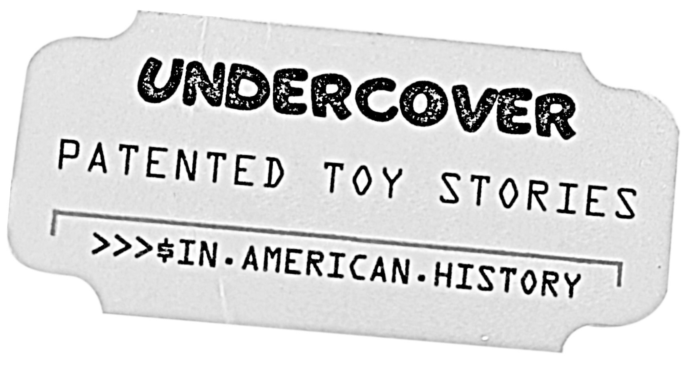

## ON TOY HISTORY
# Undercover Patented Toy Stories
## An Introduction to American Toy Invention and Their Cultural Impact

---

*This draft is part of an American Toy Anthology. For information on the upcoming publication, see this author's announcement, [Undercover Toy Stories](https://medium.com/@solidi/upcoming-book-technical-toy-stories-80d5bfbd76c0): Volume One.*

---

To the uninitiated, [Toys "R" Us](https://en.wikipedia.org/wiki/Toys_%22R%22_Us) was once a thriving American retail store chain. Each location was a vast warehouse filled with toys. It consisted of steel girders, large open spaces, and aisles archaically categorized by gender.

Children were escorted by loved ones throughout, many mismanaged and wonderfully lost in the aisles tall as the sky.

It was a vision of [Charles Lazerus](https://en.wikipedia.org/wiki/Charles_Lazarus), one of many businesspeople of his generation who would take advantage of the [American Baby Boom](https://en.wikipedia.org/wiki/Baby_boomers). New marketers of the trade would secure the orders, and system engineers would invent the toys that filled the aisles.

.](images/87-02.jpeg)

Choices were impossible to comprehend as a child, and the thrill of leaving with a toy in hand was unmistakable. The smell of paper packaging, sweet rubber, and exotic plastics forged memories.

Toys "R" Us no longer exists in its stature. What remains is a memory of the aesthetic of the brown and orange colors, which changed to blue and gray and then crumbled into postmodernity, taking generations of people who once experienced it.

It was a wonderful time in this author's life. It is where he connected with faceless toy makers. These playthings filled this once-iconic store, and their inventive stories are the basis of *Undercover Patented Toy Stories.*

---

## All Toys Have Creators. Some Have Patents

*Undercover Toy Stories* is a rolling toy anthology constructed from investigations of searching public records, speaking to people, reading books, listening to podcasts, studying patents, and uncovering and connecting truth.

This series required bravery to source, telling it like it is. *Undercover Toy Stories* is a curation of toy artwork supported by a mosaic of information printed in words.

The reader should consider this work a tour de force of the lesser-known toy stories bundled into decades of evolving technology. Many creators are or were gifted, capable engineers, genius marketers, and legendary business people.

This anthology will take the reader on a journey of credit-sharing in toy-making. It may shock, intrigue, or make the reader feel good.

From Jack Ryan, the inventor of Barbie, to many people in Mattel, Tonka, Hasbro, Fisher-Price, Galoob, and lesser-known companies like Tomy and Imperial Toys, the reader will learn where some of the most iconic toys have come from and the fanfare of smaller, inventive toys.

Patents are descriptions of inventions, and they, along with their sketches, are found throughout the book.

.](images/87-03.jpeg)

This work contains an in-depth look at toy inventors. Included is a man named Jack Edward Hartman. He was a design and security director at Mattel in the 1960s. He oversaw the security of Hot Wheels and Barbie toys. He ran an organization within the toy pipeline to invent and improve toys from the separate research and development department of Jack Ryan.

The reader will see that Mr. Hartman [would die on the job](https://medium.com/@solidi/a-tragic-american-toy-story-f0c19e58534e) under unbelievable circumstances. The incident included every undeniable modern element of Western American culture: high invention, law enforcement decisions, military and aerospace, corporations, a famous American, a madman, men in suits, questionable investors, and suspicious suppression.

After an explosion, his life became a tragedy defined by the ideas of what American morals were built upon. It's the [story of secrets](https://medium.com/@solidi/the-ultimate-hot-wheels-legend-0e3b9e2b2d88). It is the tale of an ascending American toy maker struck down from where he stood. It is a chronicle written on a hot-leaded typewriter, buried in archives, and in time for someone to unearth.

And so this author did just that, surrounding it with his contemporaries and successors.

*Undercover Toy Stories* explains and unrolls his unknown tale and many others. Each story is independent and intriguing, and each stands on its own.

---

## This Book Is About Their People and Technology

While these toy stories are about great feelings, Undercover Toy Stories focuses on the truth. Only some things are good, and bad things come with living life, as we all experience.

The concept of *Undercover Toy Stories* is a book about people, their work, and the tales surrounding toys. It is a unique piece with shocking tales that all relate to toys.

These stories include not-so-good things, like injury, death, injustice, changing times, or the malaise of American business, but also good things, like creation, success, impact, and lasting legacy.

What sets this work apart is that all the creators mentioned in the story have patents filed in a government office. These agencies have archived sketches people recognize. By law, these people created the kernel of what exists, but it took many others to make it happen.

.](images/87-04.jpeg)

Each toy that falls into a child's hands has a narrative. Today, many middle-aged men and women, like this author, write and produce videos or podcasts about toy story creations.

As a first volume, *Undercover Toy Stories* is an outlier for those who want to know. This work is a beacon for those who want to tell their history in the future. Therefore, the book is considered a volume series.

While many toy stories are mundane, the tales in this book are intriguing and rare. They were brought together with research and determination to tell the account as it was, curated by fascination.

*Undercover Toy Stories* salutes the toy maker's craftwork from the perspective of a child who experienced it, memorializing their passion forever in writing. And these works are dedicated to Mom, who encouraged this author to seek truth.

Doug Arcuri  
From a dining room table  
March 2023 - April 2025  
