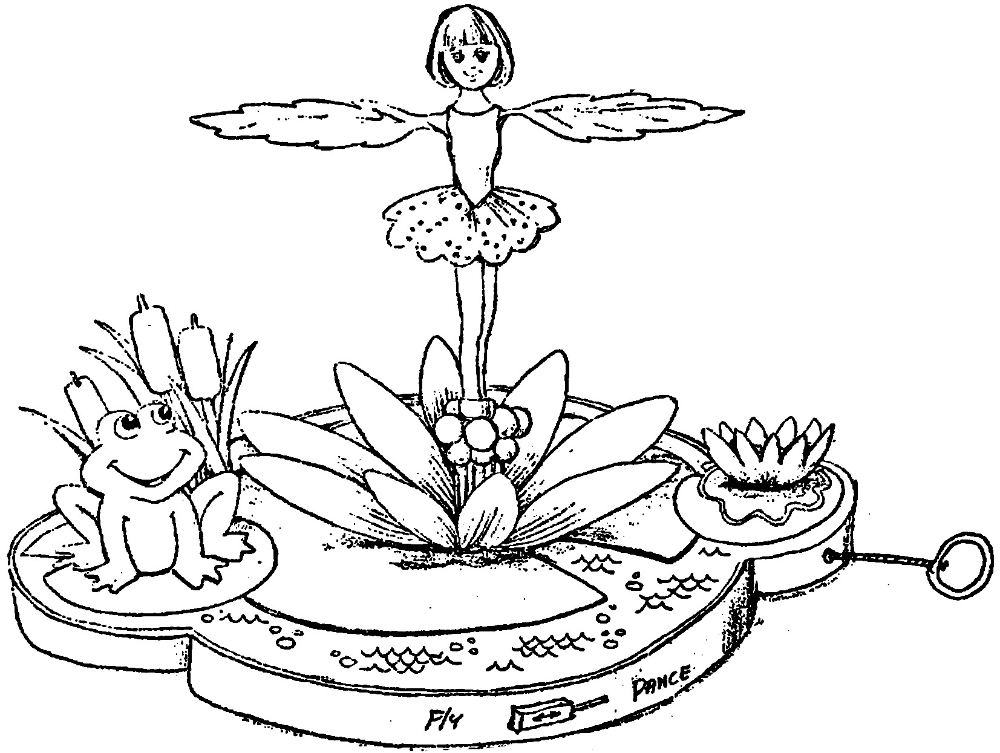
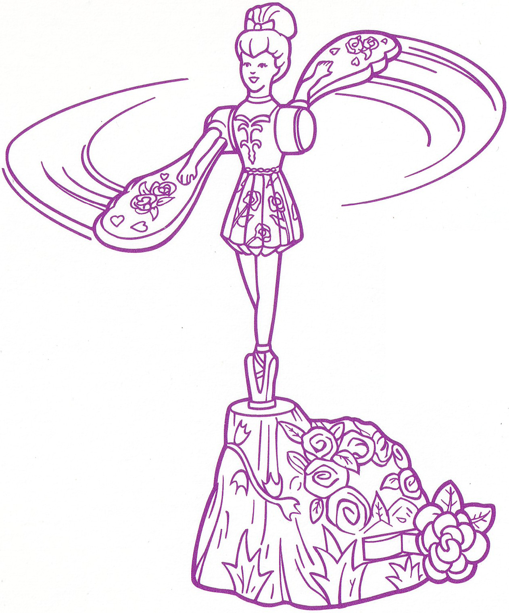
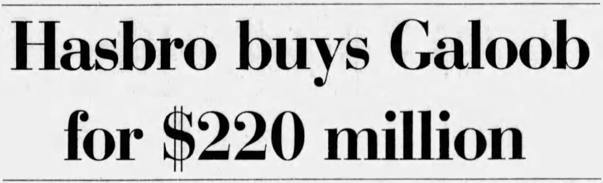
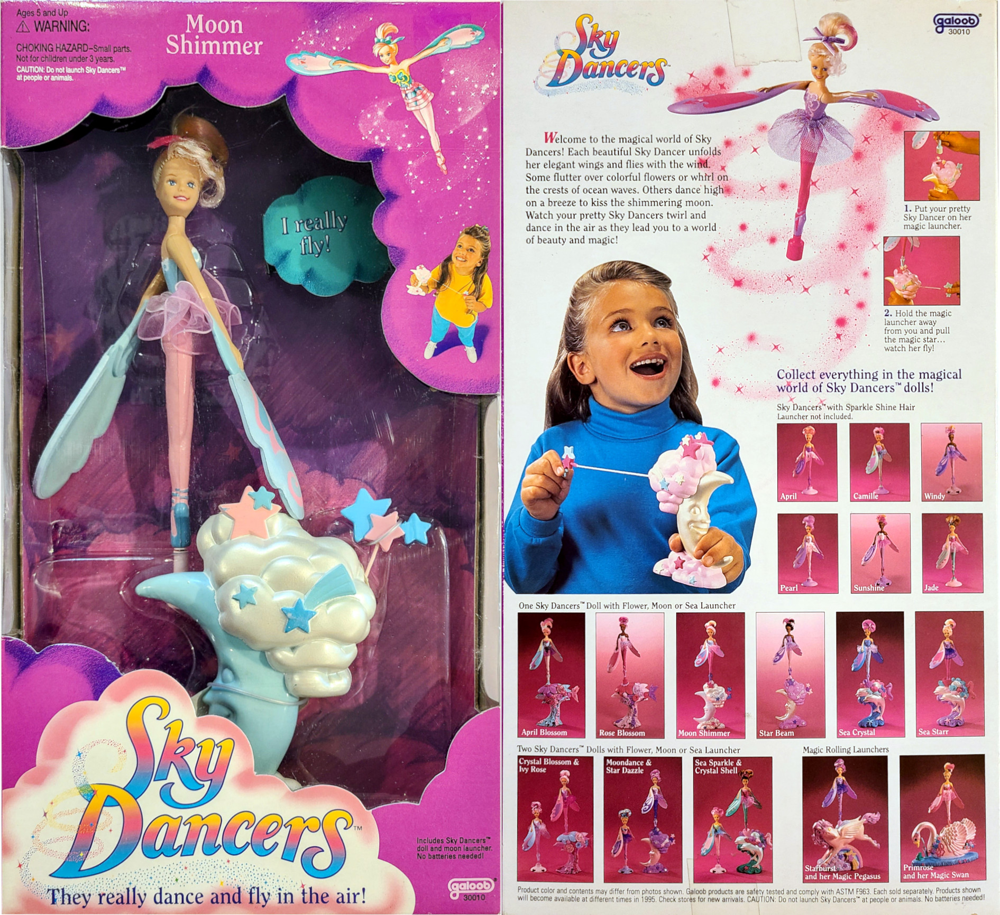
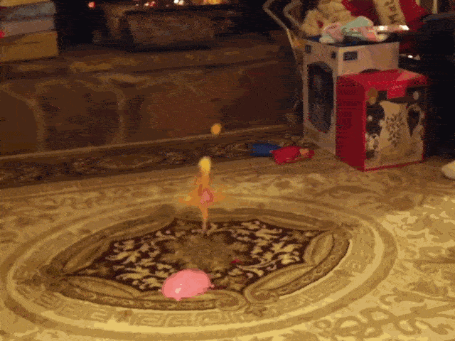
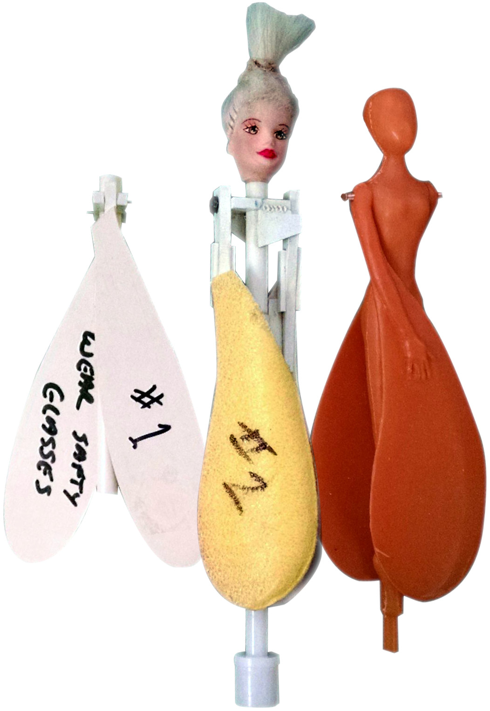

## ON TOY HISTORY
# Wear Safety Glasses: Galoob's Sky Dancers
## When Toy Makers Launched A Flying Doll, and Crash Landed Successfully

---

*This draft is part of an American Toy Anthology. For information on the upcoming publication, see this author's announcement, [Undercover Toy Stories](https://medium.com/@solidi/upcoming-book-technical-toy-stories-80d5bfbd76c0): Volume One.*

---

**"SOME PEOPLE SAY** that flying toys are only for boys. Is that true?" A group of girls testing an elegant toy product responded, "No!"

The late [Marshall Sella](https://www.outsideonline.com/culture/books-media/marshall-sella-obituary-outside-magazine-writer/), a New York Times magazine journalist and long-time writer from Midwest America wrote a seminal piece on toy history. For a moment in time, Mr. Sella went [Gonzo in toy-making journalism](https://www.nytimes.com/1994/12/25/magazine/will-a-flying-doll-fly.html).

Mr. Sella exposed how a toy named Sky Dancers grew up to become a shooting star in American business.

Getting into the secretive airspace of toy-making proved tough, but somehow, Mr. Sella landed. Their makers brought in the wordsmith, joining distinguished authors like [G. Wayne Miller](https://en.wikipedia.org/wiki/G._Wayne_Miller), who broke barriers into [Hasbro](https://en.wikipedia.org/wiki/Hasbro) and wrote well-researched books on the Hassenfelds, the company's owners.

Within this history of Sky Dancers, Hasbro shared a short field.

The crafting of Sky Dancers required significant industry experience. What was needed were independent inventors with a distinct artistic style and long-time insiders of toy products with the right connections. Of course, they required toy engineers. Then, they had to convince a buyer to place her on a shelf for children to take home.

A thirty-minute write-up outlined the birth of the product, a flying doll with wings wearing elegant attire and adorning beaming, beautiful eyes.

But it was half her story because sometimes, she'd punch out.

---

## How An Elegant Dancer Took Flight

**SKY DANCERS WERE** "a large series of ballerina-style dolls with foam wings under their arms, plus a launcher or stand. When the string on the launcher was pulled, the doll would spin away with their wings opening to catch a flight," said [Kelsie Lee](https://shows.acast.com/deep-nerder) of the Deep Nerder podcast.

In the early 1990s, John Gentile of Abrams-Gentile Entertainment had this vision while observing his daughters play under the New Jersey maple trees. His nascent love of Whirlybirds and his study of other modern flying toys motivated him.

It wasn't a new idea, as [Ideal](https://en.wikipedia.org/wiki/Ideal_Toy_Company), [Mattel](https://en.wikipedia.org/wiki/Mattel), and others had sold helicopter toys for boys. Those old enough to remember these playthings recall their call sign *Verti*, meaning "to be turned" in Latin.

And by no means were they looking for girl pilots.

 of Sky Dancers.](images/88-02.gif)

But Mr. Gentile brought back some maple sapling seedlings of an aerodynamic nature, convincing his allies to take the vision to flight. Add grace, style, and thoughts of his daughters - he had the concept of Sky Dancers.

Mr. Gentile was one-third of [Abrams-Gentile Entertainment](http://www.agebrands.com/index.html), and Sky Dancers was a line of flying dolls with a ripcord on a stylized launcher. She was an intricate device - a first in Toyland.

Mr. Gentile had his associates, brother Andrew and Marty Abrams, a toy trade veteran, take his licks from the leading defunct toy company, [Mego Corporation](https://en.wikipedia.org/wiki/Mego_Corporation).

"Anyone who has ever spoken of him describes Marty as a born salesman and marketing whiz," said Scott Adams of a Mego Corp [history write-up](https://www.megomuseum.com/catalog/index.shtml).

Gentile's AGE team was an invention and branding company. They had no resources to move her to production, so they shopped companies with the know-how. Companies passed on her, but Galoob, a San Francisco toy company running off the cash of [MicroMachine's](https://en.wikipedia.org/wiki/Micro_Machines) success, was interested.

Gary Niles, a man within Galoob, "a uniquely creative guy," made it happen.

"She looked like a scene from the Crucifixion. She was stiff and ugly, but the concept was there," said Gary to Mr. Stella. He handed the concept to marketer Scott Masline to kick off marketing, prototyping, and testing.

Everyone in her story served time in the former Top Toy Gun University, Mattel. Scott and Gary were both alum.

AGE and Galoob spent time developing the new vertical product through numerous talented engineers and artists. "John Gentile dubbed the dolls 'Twirlies.'" But the name wouldn't stick. Instead, the team called them Sky Dancers. The sleek ballerinas were cast in illustration by Marlene Dantzer. Kathy Bleser crafted the associated 'Barbie' face, and Shelley Daniels sculpted her.

Kathy painted those faces for Mattel generations ago, and this followed a trend of know-how. Endless lines of ex-Mattel veterans made her fly both in fashion and technology.

And Sky Dancers had an intriguing engineering story. Hints foreshadowed the product's peril, even in Mr. Sella's write-up. Every attempt was made to ensure safety, with foam wings and executives reminding the engineers of safety measures.

"But it is actually a very dangerous ballerina!" said one of the mothers who participated in the early prototype testing with her daughter.

"For every parent who doubts Sky Dancer's safety, though, there are ten who feel the foam wings and take their softness as an assurance of safety," explained Mr. Sella.

Galoob had senior engineers and executives who worked at Mattel, like technical coordinating director and engineer Karyn Silfies, model maker Terry Sanchez, and seasoned toy executive Gene Kilroy, among others too many to list.

Galoob was where some ended up after West Coast toy reorganizations occurred through the early 1990s.

Few became independent contractors, and many were full-time of the approximately 275 employees. These people crafted the technical engineering of Sky Dancers. No other toy product in history had the trifecta of professionals. It was as if NASA worked to send the doll to the Moon with a beautiful astronaut suit.

But before Galoob was cast in toy aviation history, AGE shopped the product to [Tyco Toys](https://en.wikipedia.org/wiki/Tyco_Toys) and Hasbro. Tyco passed due to safety concerns.

"Hasbro, too, was all smiles but clung to the belief that being able to fly was primarily a male fantasy and rejected Sky Dancers on the spot." Galoob took a progressive stance, a bet they cashed in on.

And so she was crafted and shipped en mass.

AGE fanned out a full-production cartoon series by [Gaumont](https://en.wikipedia.org/wiki/Gaumont_Film_Company) in 1996 and a McDonald's Happy Meal tie-in. Then, there was the board game, outfitting, Macy's Thanksgiving parade balloons, costumes, activity books, and other merchandising.

But in time, Galoob's safety measures wouldn't hold up with the CPSC, a government agency that holds corporations accountable for safety. A buyout forced a legal dogfight, exposing her flaws.

In any case, Sky Dancers became the most successful girls' toy in the mid-1990s, selling tens of millions of units until the turn of the century. They came close to outrunning Barbie herself, just as Galoob Micro Machines, little miniature cars, outshot Mattel's Hot Wheels for a time.

Her success was twenty years after [Derry Daring](https://www.facebook.com/watch/?v=669232310317421), a female motorcycle rider described by Ideal Toy as "Evel Knievel's friend." She was the first known female action figure to command a powerful machine - a motorcycle at a mass scale.

Syndicated Columnist Sara Eckel wrote, "Derry never made it to the big time-Sky Dancers [had] a much better publicist. " She was launched into the skies at a time of change from a dream team of modern toy makers.

---

## They Sold So Well Galoob Pilot Errored its Complaints

**"YOU ABSOLUTELY CANNOT** ground this doll. She will fly again. She's like a phoenix, rising from the ashes."

Youtuber Joey from the channel [Beauty Inside A Box](https://www.youtube.com/@BeautyInsideABox) broke down the history and legacy of Sky Dancers. This author believes the video is the best-researched historical narrative on the toy, with [The Jewel Riders Archive](https://www.jewelridersarchive.com/sky-dancers/) taking the award for best artwork collection.

In October 1998, Galoob, the third-largest toy company in America, agreed to a buyout from Hasbro for 220 million dollars.

Hasbro vied for the [Star Wars](https://en.wikipedia.org/wiki/Star_Wars) property, to which Galoob had its license. Hasbro's rights to Star Wars lapsed in 1991, while Galoob produced the properties toys under the Micro Machines line. Hasbro geared up for the new trilogy of anticipated Star Wars Movies I, II, and III.

Star Wars was a sought-after property after their original toy success by Kenner in 1977, by [Bernie Loomis and David Okada](https://medium.com/@solidi/push-play-and-put-em-away-the-hot-wheels-kid-powered-trains-and-planes-80f6c2edeb40), among others.

Importantly, Hasbro acted so that "buying the company [Galoob] kept them from Mattel, which also had been bidding to buy the San Francisco-based firm," found within the book *[Kid Number One: Alan Hassenfeld and Hasbro](https://www.amazon.com/Kid-Number-One-Hassenfeld-Hasbro/dp/1950339203)*, written by G. Wayne Miller.

Mattel and Hasbro were the two largest toy companies in the world. Mattel had all the engineering know-how. Sky Dancer's execution resulted from their veterans through the third company, Galoob.

After acquiring other toy firms, Hasbro was playing the long game of Hollywood entertainment licensing, first partnering with Steven Spielberg and eclipsing Mattel at this time. There were hints that Mattel was bidding for Galoob, too, which they lost out on.

With the Sky Dancers brand in Galoob's portfolio, Hasbro audits of the company files made a shocking discovery. They found that from January 1995 to November 1998, Galoob had incurred 165 reports of child injury from the doll.

On November 18, 1998, Hasbro picked up the phone and "made a telephone report [of the problem]," the [Consumer Product Safety Commission](https://www.cpsc.gov/) reported. Hasbro was caught in the act of doing the "right thing."

It remained unclear if there was a cover-up. Given the reported injuries, Hasbro wanted to keep its distance, devising plans to devest the toy brand.

"I really wanted to buy an original Sky Dancer to show you in this video, but unfortunately, they are really hard to find online, [and] incredibly rare. When they get posted on eBay, quite often the listing gets taken down because they are unsafe," said Joey.

Reports were filed with the CPSC between November 1998 and April 1999, confirming the actions. A later report from the CPSC said, "Galoob obtained information which reasonably supported the conclusion that the Sky Dancers contained defects which could create a substantial product hazard but failed to report to the Commission in a timely manner - ."

A year of legal process went by. On June 28, 2000, Galoob voluntarily recalled all known Sky Dancers products. Galoob estimated that 8.9 million units existed, which had the potential to cause injury, violating CPSA law.

Every product labeled "Sky Dancers" was recalled, and the air boss, CPSC, took her license away from U.S. skies.

"Galoob denies that Sky Dancers or Galoob has caused any injuries. Galoob further denies that it or Hasbro violated the reporting requirements," but they agreed to pay a fine, continuing with the recall.

The clawback was the largest in American history. This author asks: Did a third party contact CPSC before Hasbro? And if so, what was its response? We will never know, as CPSC confirmed to this author that all records were purged.

But neither an aggravated federal entity nor recall grounded childhood memories. Long ago, this author fired Sky Dancers at his sister or up at the ceiling fan, catching Mom's attention. Mom worried about safety- in her Bradford Exchange [collector plates](https://www.bradfordexchange.com/c/collectibles/15063_collector-plates.html) hung on the wall.

Mom's fear was confirmed when these saucers ended in a gravitated demise. At least one Sky Dancer kissed them ever so slightly.

And it's a certainty thousands of others did the same. A hundred reports included failed evasive maneuvers away from her delicate wings, causing physical injury, some [hitting their face](https://www.youtube.com/watch?v=fJRPlkRW7uw).

.](images/88-07.jpeg)

In her thirty-year wake, today's YouTubers describe every variation of the Sky Dancers from the 1990s, each stunning, quirky, and mysterious. But all Sky Dancers were elegant-and now deemed illegal.

"They literally thought of every possible gimmick under the sun for these dolls. And I want them all," said Joey.

Internet armchair commentary on her history remains competent and measured. For example, Reddit threads contain memes crossed with safety punditry. "The QA team failed to catch this in testing because they always wore protective glasses anyway," said one user.

Indeed, it is a near-miss in this narrative, as we will see.

---

## A Genericization of Toy Legacy

**"THE RIDICULOUSNESS OF THE TOY,** that anyone thought it was a good idea to sell a toy whose purpose was to fly in the air uncontrolled [laughing] - like what?"

Cristine from Simply Not Logical, a significant YouTuber of a generation, was unsure what to make of her while [reliving toy memories](https://www.youtube.com/watch?v=Yw2fFL5QVlo).

Since the early 2000s, Hasbro dumped her in the aviation boneyard. Aggressive toy companies attempting to make a name have carried the AGE brand. Knock-offs have recently appeared in the toy market after her original patent expired but infringe on the Sky Dancers trademark.

Regardless of brand, she is called a Sky Dancer if she has wings and flies elegantly.

, with distinct stabilizing mass labeled 42.](images/88-08.jpeg)

Sky Dancers created a generation of children who call their subsequent successors by their mistaken original name, a term cultural linguists call "genericization."

In 2013, [Spin Master](https://en.wikipedia.org/wiki/Spin_Master), a Canadian toy company that has since gained traction to compete with Hasbro and Mattel, launched [Flutterbye Fairys](https://stuffparentsneed.com/opened-fluterbye-fairy-experience-owning-popular-toy/). Unlike the original Sky Dancers, the product launches with the push of a button from a base.

It is guaranteed that no one will call the product by Spin Master's branding. These "Sky Dancers" made headlines in a family's 2013 Christmas video. She went right into a family's fireplace.

In response, a top [Reddit post](https://www.reddit.com/r/funny/comments/2kcyzo/poor_kid/) said, "That's what I call a Barbieque [sic]," further confusing brand names. Sky Dancers somehow secured a remarkable feat of a lasting legacy in this event.

Today, [secondary products](https://www.youtube.com/watch?v=nnG3p592D_Q) sell alongside the official ones. The Sky Dancers brand persists in different countries, with the latest iteration, in 2022, by the French toymaker [Lansay](https://peopleofplay.com/company/lansay).

In research, this author bought a pair of these Lansay flyers at a premium price so his daughters could relive the magic. He can confirm that the ceiling fan took licks from their gorgeous fantasy wings and doubts if it was the right decision as a parent.

Nah, she had the right stuff.

Battered by international shipping and at least one distress call from his daughter, this author confirmed that her magic flight is alive and well in postmodernity, providing fleeting moments away from digital technology.

While this author's daughters weren't looking, his son ever so slightly held her by the launcher and whirled the doll close to his face. "Don't do that," said this author, reminding him, "never launch Sky Dancers at people, animals, or unintended objects," printed on the box.

He then proceeded to launch the toy directly at the author.

---

## The Legend of a Fly-By Encounter

**"I WOULD LOVE TO FIND AN IMAGE** of the original Sky Dancers prototype, and I have scoured the Internet, but I cannot find a picture of her anywhere. So, if anyone knows any information about the original prototype, please let me know," said Joey from [Beauty Inside A Box](https://www.youtube.com/@BeautyInsideABox).

Of course, there were original Sky Dancers prototypes, each labeled by number. But before this author shares photos, there is a "legend."

 patent from 1935.](images/88-10.jpeg)

Sky Dancer's progression of the original prototypes moved the wings fixed to hinges. Her swept wings were curved from the side to the front and back, allowing for aerodynamic flight without stabilizing mass.

Not all inventions are management requests. To advance Sky Dancers, foldable wings were an idea based on [rubber-banded hobby airplanes](https://www.fai.org/Penaud-Planophore-150-years-ago) with folded propellers. These blades are retracted to make hand launching easy and maximize thrown velocity. When launched, the propeller expanded, taking stable flight without injuring the launcher.

Given the challenge of making her fly, at least one engineer considered their past experiences into a new invention.

With an "ah-ha" moment, prototypes were crafted from a vision. Then, David Galoob, former toy chairman, briefly participated in a sign-off during Sky Dancer's rapid development.

Mr. Galoob once worked in the company's traffic control room, earning his keep after he took the yoke of his parents' toy company to the top of the industry.

He was the responsible leader for crafting its household name to now middle-aged children. Icons included works like Micro Machines, Spice Girl Dolls, and Z-Bots, rehabilitating a failing 1970s trade company to the third-largest toy company in the world by the 1990s.

But in late June 1991, he abruptly left, setting up toy consultant services, remaining close to the toy game and Galoob. Of course, he was aware of Sky Dancers among his contacts. So, "[consultation](https://www.nytimes.com/1991/06/29/business/business-people-new-president-chosen-at-lewis-galoob-toys.html)" occurred through their Toy Concepts Group.

, which combines a launcher and flying figure.](images/88-11.jpeg)

In 1993, select Galoob executives gathered in a conference room with David. One of the designers took the newest variation and explained the vision: *the elegance, beauty, and intrigue of how girls can take flight*.

Then, a short demo of her functionality commenced. A designer took one of the newly cut prototypes laid on the conference table. They paused, smiled, and shot a Sky Dancer off the launcher, with wings extending, gracefully finding lift.

The prototype spun beautifully. Then, something strange happened. She veered off and targeted the former executive. She gracefully avoided his evasive maneuver and crashed into the former chairman's face, bouncing off his chest.

When she fell on the floor, he looked up, stunned. The design team in the room watched with exasperated faces. Perhaps the toy fell into the former executive's leadership gravity?

After a long pause, he said something prolific like, "What goes down... must come up?!" but his words are unknown. As he reached for the prototype from the floor, he discovered her wing was damaged, and the hinge was broken.

He examined her face and the intricate tech. Looking closely at the artwork on the table, he said, "She's beautiful," and started laughing.

Then sternly but with a smirk, David said, "Make this work for Galoob. Make it safe," handing it back to the host. He walked out of the room.

CEO Mark Goldman and a friend of David received the word, and the employees hurried along, scrambling to contact their Hong Kong engineering office to prepare for tooling. Marketers picked up the phones as Galoob received the wisdom of the once-airship captain who commanded the Toy Fair floor.

In her story, Mr. Goldman, a long-time Mattel executive, was the stealth executive who brought talent to his new hangar over his formative two years at Galoob.

Mr. Galoob was an aviator of toys. In the later 1980s, he told the media he had "the ability to recognize the product and to take chances - ." Sky Dancers was that product and a chance for the new Galoob of the 1990s.

But the engineer who made her fly was absent from the demo that day. So, the team wrote back to the creative aeronautical and former Barbie mechanical engineer responsible for the functionality.

It was out of respect and appreciation for cracking the problematic engineering - and seeking an apology for a damaged labor of love.

They wrote: "[We] are really sorry [about the wing], especially after you said to be careful of that." The note went on to explain that David was accidentally hit.

But the story is cast in a legacy that no one could see at the time, nor anyone wanted to tell. In black magic marker, she had on her wing:

"*Wear safety glasses.*"

And in this toy legend, Mr. Galoob was fortunate - wearing his signature prescription spectacles.

---

In the decades since Mr. Gentile's vision, Sky Dancers have created graceful mayhem. Prototypes #1 and #2 were smartly adorned with aero engineering tattoos for history toy books, which no one remembered.

Her body art proved Galoob's efforts to make the toy right, safe, and fun. The ink, her original battle cry, is a legacy written on the toy itself, and she will forever be part of obscure American toy history, proliferated globally.

Sky Dancers remains a combination of beauty and flight in the execution of brilliant American marketers, artists, and engineers. They were the first to unlock her potential into pure kinetic toy energy.

But will she ever regain flight clearance in the United States?

---

---

## Social Post

How a #doll took flight—here is my fascinating and surprising historical business story of #Galoob #Sky #Dancers, a flying doll that came very close to the "#Barbie stratosphere" in the mid-1990s, selling tens of millions of units. But could you please wear your safety glasses? She was then recalled (and banned) in America.

Today, she delivers magic to all in the face of adversity, and this essay is part of a growing anthology of American toy stories.

#retrotoys #90s #toys #history #business #mattel #hasbro #tyco #ageentertainment #ToyCollecting #ToyCommunity #Collectibles #ToyCollectors #ToyReviews

[Medium](https://medium.com/@solidi/wear-safety-glasses-galoobs-sky-dancers-3c3b499288f3)
