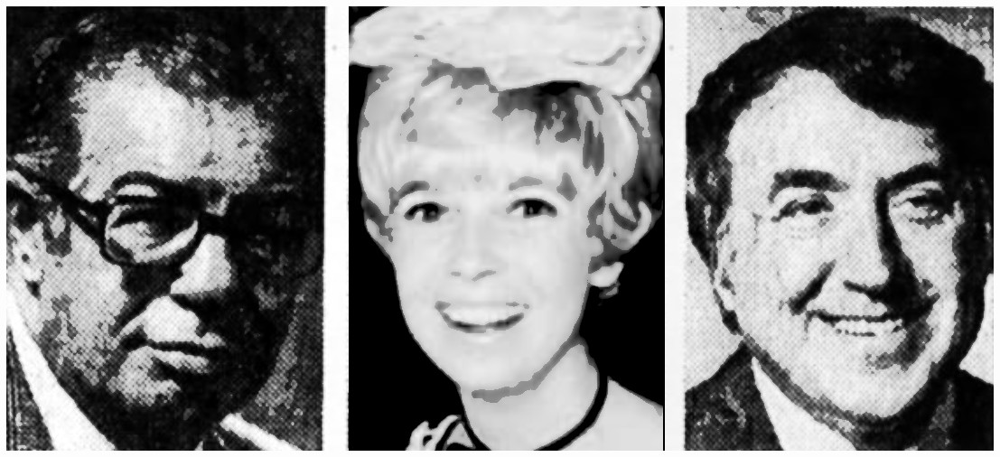
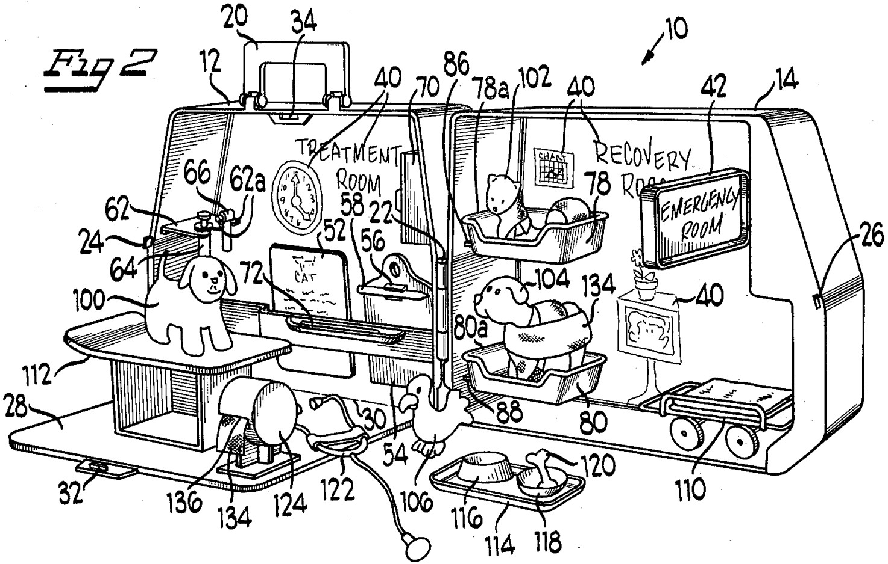

## ON TOY HISTORY
# The Great Marvin Glass: Artists in a Fortress of Invention
## And the Murderer of His Associates, Creators of Toy Culture, Found on YouTube

. The toy was sold to [Hasbro](https://www.facebook.com/watch/?v=753938058463986).](images/89-01.jpeg)

---

*This draft is part of an American Toy Anthology. See this author's announcement, [Undercover Toy Stories](https://medium.com/@solidi/upcoming-book-technical-toy-stories-80d5bfbd76c0): Volume One, for the upcoming publication.*

*The following contains troubling scenes of workplace violence, which can be disturbing. Brief dialogues were imagined based on collective facts. Reader discretion is advised.*

---

*EARLY DECEMBER 1972, CORRESPONDENT BOB WALLACE* of [WBBM Channel 2](https://www.cbsnews.com/chicago/) in Chicago was invited to interview [Marvin Glass](https://www.peopleofplay.com/people/marvin-glass), a toy industry man.

As Bob approached the location, a light-gray building stood silent, and a silver steel door greeted him and his cameraman. A gentle woman's voice replied, buzzing them in.

"Come on up!"

Mr. Wallace and the team entered an American toy fortress, a concrete office building-the antithesis of the toy legend's name. The windows were recessed with black-frosted portholes to let a little sunlight in, and iron bars covered them.

The glass inside was covered over with paper.

Bob stared and shrugged. "That's pretty odd." The two-storied building sat on La Salle Street in Chicago.

It was a cold day at the end of the year, and snow lay on the ground. Video cameras lined the walls. People watched every move as the model makers, designers, and partners waited.

Their head boss was a lanky fellow named Marvin. He said the word to his office manager, and she repeated the command over the intercom. His associates hurried to cover unreleased prototypes throughout the building.

The toys they worked on were two years out-with a target of 1974.

The media crew climbed up the steps.

Then, long-time associate Pauline Camberis greeted Mr. Wallace. She was Marvin's [Helen Gandy](https://en.wikipedia.org/wiki/Helen_Gandy), and she knew all the secrets of the people who passed through Marvin's life-taking notes on every toy maker, smiling but perceiving each as a potential business foe.

She knew Bob was coming for a fight, so a relaxant was suggested.

"Just wait a moment here; Mr. Glass is in a meeting. Gentlemen, would you like a scotch? [It was ten in the morning]."

"No thanks; we're on the clock," said Bob. Cameraman Peter licked his lips. Pauline smiled.

Marvin Glass, 57, greeted Bob and the cameraman in his office across from Pauline. A long-time inventor, [Harry Disko](https://patents.google.com/?inventor=Harry+Disko), stood beside him in an opulent office lined with wood and fine furniture, with his signature pompadour hairstyle.

The walls were adorned with paintings bearing European names. Marvin led Mr. Wallace on an art tour while Harry discussed his [self-propelled toy boat](https://patents.google.com/patent/US3300894A/en).

"Marvin joked that if we built enough toy boats, we could sail them across the Atlantic, towing a barrage of fine art from Europe." Bob was puzzled as Marvin laughed and then gruffed.

Marvin was an admirer of art and suspicious of others. So, he brought his home, featured in couture circles of 1960s living, into his workplace-both equipped with a high-level security system crafted by former OSS Navy spies.

The men sat down, and then Marvin shared photos of his home to break the tension of the first encounter. Bob asked, "Did you buy a part of the Louver Museum?"

Marvin smiled - he had the cash to do it.

Marvin's work and personal life were no different. He sold ideas to companies such as [Hasbro](https://en.wikipedia.org/wiki/Hasbro), [Mattel](https://en.wikipedia.org/wiki/Mattel), [Parker Brother](https://en.wikipedia.org/wiki/Parker_Brothers), and [Ideal](https://en.wikipedia.org/wiki/Ideal_Toy_Company); his team toiled within the Chicago fortress, avoiding manufacturing toys at scale while he smoked three packs daily.

Marvin's team concocted prototypes here, which his brilliant business people later sold for them to take on the burden of production.

Marvin collected the royalty checks.

As Pauline suspected, newsman Bob brought a printout of toy safety concerns that ran wild. Any investigator of the era was suspicious of the toy industry's safety record.

"I want to know about the toy business. I did my research," said Bob.

Bob placed a newspaper article on the table. It described the trend at the time: toys were a problem, and children's injuries were mounting.

Marvin glanced at the article. He went from bubbly to full-on defensive mode. His face started to shake, and he took a long drag on his cigarette.

 in 1960.](images/89-03.jpeg)

Marvin blew the smoke out. "What is that sh*t?" he said. "Another [ - ing] print on toy safety?"

Harry Disko, Marvin's "Sergeant," sat across from the news reporter, about to pincer attack him. Harry had a hundred patents and knew how to handle news reporters for Marvin. "Let's stick to Marvin's toys," he said.

Bob couldn't keep his poker face.

Mr. Wallace, an up-and-coming investigative journalist, was curious about the assignment. He prepared by reading a new controversial article about toy safety, from which Marvin's inventions appeared.

Marvin flipped through the multi-page article, looking at Bob. "Bob, this isn't for the record."

"These aren't our final toys," Marvin said. "It's up to the toy manufacturers to make them safe - and we want to help," said Marvin.

Marvin returned the newspaper to Mr. Wallace. He would never attempt to hurt a child. He turned earnest. "This author [of the article] is a crazy loon."

Peter, a WBBM cameraman with a blaring hot white lamp, looked through the lens. His eyebrows went high as he watched the candid exchange.

Of the millions of children who loved their toys-Lite Brite, Operation, Mr. Machine, Ants in the Pants, Mouse Trap, Rock 'Em Sock 'Em Robots-almost no one knew the man, Mr. Glass.

Sometimes, the media wrote about him in newspapers and appeared on TV. This was to be Marvin's last preserved recorded video interview, and Bob, unknowingly, wanted a reaction as a greenhorn investigator.

Bob did his homework, presenting the ideas in Marvin's toy fortress's lair. He started by discussing how the industry took advantage of children related to TV commercials.

As the room was engulfed in cigarette smoke, Marvin said, "We don't take advantage of children-we just show a toy in [pause] its most romantic, most beneficial aspect."

"Our commercials are more honest than the rest."

To the toy industry, Marvin was feared, respected, and its ultimate genius. He sold ideas, collected checks, and had the best toy dreamers worldwide - seen on regulated TV since Hot Wheels spoiled the medium for every vying toy maker. The FTC was catching on to its deceptive practices.

Bob moved to rechallenge Marvin. "But what of the thing - the oven with the light bulb in it? - " asked Bob.

Marvin replied, "The Easy Bake Oven is one of the safest toys that ever existed." Marvin was well-known in toy safety, and Kenner wanted him on their defense.

, the first 3D board game.](images/89-04.jpeg)

Peter continued to roll the film with Bob sitting beside Mr. Glass, challenging him in his safe, opulent quarters.

Marvin said, "There is no such thing as a safe toy, [pointing at Mr. Wallace] unless there is correct parental supervision-no toy is safe."

"Nothing in this world is safe - unless it's used right." A chilling foreshadowing was to take place in these words.

Bob and Marvin conversed, which was recorded in the film. After an exchange, there was relief. Bob was convinced he had a story.

"Go meet my wonderful team. I have to meet with Howard," said Marvin.

Slightly overbearing, Mr. Disko showed the men to the door. "Be nice," whispered Mr. Disko. Bob gave him a look as Peter dragged the camera out, avoiding eye contact.

---

*AFTER A CONTENTIOUS MEETING*, Mr. Glass cooled by smoking and taking swigs from his traveling bar.

As the media walked out, Disko gave them a mean smirk. Pauline welcomed them at the threshold, looked at Glass, rolled her eyes, and smiled. She closed the door. Mr. Wallace was about to meet other managing partners with whom Marvin distributed his power.

Mr. Glass reflected on the exchange; it rattled him because everything he worked for was challenged in one short conversation. So he reflected.

No individual in the industry wanted to hurt another. Still, it sometimes happens in collective actions - a faulty defensive mechanism programmed in their formative years.

Many years before the interview, Marvin lost the man who became an icon in the industry, [Eddy Goldfarb](https://en.wikipedia.org/wiki/Eddy_Goldfarb). He and Mr. Goldfarb created and marketed novelty items like Yakity-Yak Talking Teeth to Irvin Fishlove. Later, Marvin stiffed him out of royalties but knew full well that he had never created a toy.

Eddy filed many patents, with a long record that will remain unbroken. He created a popular game called Kerplunk, Shark Attack, and moving trucks, Stompers.

He was the man who introduced Marvin to plastics, and like the material, Marvin threw him away. It was a terrible mistake.

Marvin's wild childhood could have been to blame for tossing aside Eddy. Those that were meant to protect him instead downright abused him. His parents were horrible.

So, he did everything to defend himself into adulthood, and in the exchange with Bob, it was apparent what Marvin believed in.

, which placed MGA on the map.](images/89-05.jpeg)

Marvin had a second chance when [Burt Meyers](https://www.kingbruwaert.org/lillian-lapalio-turns-100-and-continues-a-full-and-active-lifestyle/) entered his life, rescuing toy boxers that had become robots. Mr. Glass learned from Eddy's exchange, and instead, he made Burt his first partner.

Mr. Glass knew that capturing child safety was crucial for business. He defended it to the end, and so did Burt.

From then on, patents from MGA had Marvin's name on it. Each invention was pitched to him, and he gave input to the design. It was well within the law, and he made it work, finding the right people by creating a place to do toy art.

Deservedly, Marvin's name appears first on patents. He always had safety in mind. And Burt got the biggest office in the model shop.

---

"Wow, it's a walled wonderland," said Bob as he walked with Pauline. Cameraman Peter had trouble keeping the equipment centered in the narrow corridor.

They bumped into a group looking to chat in the hallway, men of different stature in their early fifties.

Bob shook the hands of Joe Callan, MGA's partner licensing executive. Joe helped MGA finalize trademarks and work deals with companies. Notably, Joe secured the talent of a spokesperson through licensing agreements. He found [Evel Knievel](https://en.wikipedia.org/wiki/Evel_Knievel), a wild motorcycle maniac of the era.

Mr. Callan worked with companies to get the MGA stamp onto the product packaging, a rare toy-making achievement.

Joe and Marvin connected through Playboy's American Bachelor, [Hugh Heffner](https://en.wikipedia.org/wiki/Hugh_Hefner), a friend of Anson. Heffner was Marvin’s role model-partying hard with the beautiful women in skimpy outfits.

In the game of showmanship, Marvin hosted crazed parties in his opulent house. And he had to do one better-his Halloween parties were the stuff of legends. [Photos confirmed](https://www.amazon.com/World-Without-Reality-Inside-Marvin/dp/0578405261) his toy creators partied hard.

"Bob, when you are ready, we can invite you to one of the parties," said Joe. Mr. Wallace from WBBM blushed. Pauline started to laugh.

Bob smirked. "I read Marvin's centerpiece in Playboy."

"And those ain't 'safe' parties, Bob," said Pauline, smiling.

Adjacent to Joe was [Anson Isaacson](https://patents.google.com/?inventor=Anson+Isaacson), a veteran who crafted toys for Ideal, which filed his patents. Spending time at toy companies like A. C. Gilbert contributing to Erector Set, he was a character with big glasses-a logical, intelligent, and assurance-seeking man. And sometimes hot headed under pressure.

Anson spoke to Bob.

 on motorized model cars.](images/89-06.jpeg)

"I came from Ideal and gave Mattel a run for their money. Marvin and I connected when I was working there - I introduced Marvin at a rather desperate time. He pitched a game called Mouse Trap, and prior, Rock 'Em Sock 'Em Robots - oh and Mr. Machine, among others."

Mr. Isaacson secured Marvin's connection with the Weintraubs, owners of Ideal Toy Company based in Queens, New York. Ideal was one of the big three in the toy business, and their playthings had a quirky artistic charm.

In a sense, Ideal's style rubbed off on MGA. Or was it the other way around?

Marvin later "borrowed" Anson from Ideal. He excelled at making toys and had terrific connections. He later joined MGA as a partner, joining Burt, among others.

But at heart, Isaacson was a tinkerer, an craftsman who built model airplanes. Now, he worked in big business but wasn't Marvin Glass. Anson was a numbers man.

Bob exchanged pleasantries with the two men and moved on with Pauline, towing Peter with his camera.

While Bob walked through MGA's small hallways, cameraman Peter took wide shots and found model makers among their offices farther back in the fortress.

Bob met a designer, [Kathy Dunn](https://patents.google.com/?inventor=Kathy+Dunn), who was 29 and loved animals. She was a beautiful, petite woman with blonde hair and artwork to match.

She giggled as Bob walked in.

Kathy demonstrated the patented toy, sold to [Schaper](https://en.wikipedia.org/wiki/Schaper_Toys), called "Don't Blow Your Top." It was a game played on top of a balloon. Marbles were placed on its hat, and the person who blew its top lost. Her artwork adorned the toy.

"Oh damn, it's gonna ... blow," said Bob.

BANG [went the balloon]! Bob laughed with Kathy. She was a thinking, feeling person, an industrial designer who mixed passions with her work.

"Toys need love in the industry. I have an idea about caring for pets, which I cannot tell you much - ."

.](images/89-07.jpeg)

As Marvin ordered all unpatented work covered, Kathy could not discuss them with Bob. Pauline looked on with her eyebrows a little up. Kathy backed down.

"Kathy...," warned Pauline.

A small box-shaped cloth was laid in the corner. Between her other projects, she worked on her endless doodles and concepts for the love of animals.

From there, the crew went across the hall to [Donald Nix's](https://patents.google.com/?inventor=Donald+Nix) office, where they spent a short time. Donald, a lovely, intricate man, was a skilled artist. He crafted remote control cars, which he started as a boy.

Now at MGA, he showed Bob his work, which was sold to [Marx Toys](https://en.wikipedia.org/wiki/Louis_Marx_and_Company).

"Check this out," said Donald as he grabbed a fire truck and moved it with a remote control. "Nice, right?"

Bob bent down with Don and observed. "It's good, Don. Look at it move!" They were on the floor for a minute, enjoying the perspective. Both of them shook hands, smiling.

, sold to Marx](images/89-08.jpeg)

Don loved mechanical toys.

Then Bob and Cameraman Peter walked into Albert Keller's office across from Donald's. Albert was a quiet electronic engineer, a new skill set required as the 1970s unfolded. Toys began to integrate complex circuits that were difficult to assemble without training.

Albert was their first at MGA. He came from Strombocker, a toy car manufacturer. Al had nothing to show, joining MGA a few months prior. He was working on new walkie-talkies in their prototype stage, tackling the complicated short-wave electronics.

Al had to think - so he walked Bob through the tools he used. Then, a thought arose. He said, "Hey," smiling slyly, rolling a draw out between them. "I recently registered it."

"Whoa," said Bob, "Is it a starter piece?"

"No," replied Keller.

It was a Smith & Wesson 9mm handgun, which, to history, wasn't shocking in MGA; weapons were tolerated. Al's desk smelled of semi-sweet graphite gun lube, where he cleaned his guns.

 that shares elements of Coleco's Shoot and Score from 1978. Al Keller contributed but was never credited.](images/89-09.jpeg)

---

In Marvin's inventive fortress, he made money on toy guns in the 1950s. But it all transformed when a last-minute motorcade route change enabled two separate gunmen to fire-and the assassin to land the final shot in murdering President JFK in November 1963 from a grassy knoll.

The highway sign that took some of the bullets disappeared that day.

As soon as Oswald sat with a bottle of Coca-Cola in the lunchroom on the second floor - unsettled by an officer running through a back door-Marvin Glass hit the brakes on toy guns.

Another round of cultural cooling pulled toy guns from the shelf in 1968 when the Vietnam War became a full-blown American lie of President LBJ while RFK, who was rerouted - at the last minute through a kitchen - took four from an aerospace worker.

Both murders of the American Dynasty and a war of the military complex pushed the concept of toy guns into the bin of history.

Newspaper articles said toy guns were wrong, but others disagreed. This author theorizes assassination tragedies and mounting Vietnam pushback that even Mattel discontinued its [Marauder gun toy](https://www.usmilitariaforum.com/forums/index.php?%2Ftopic%2F396011-1966-mattel-m16-marauder%2F=), which could have been mistakenly built in a Colt factory.

Throughout the commotion, Marvin stated to the press in 1968, “A toy gun is made to pretend that one is killing.” Mr. Glass confirmed that since JFK, he refused to develop toy guns.

As the page turned into the 1970s, Space-age design fused with American nostalgia for Westerns-they were [Roy Rogers](https://en.wikipedia.org/wiki/Roy_Rogers) children grown up, idealizing Space, green plants, drab gray rocket vessels, and the West.

Many crossed over from Roy to [Buck Rogers](https://en.wikipedia.org/wiki/Buck_Rogers).

---

Albert was one of those gun guys.

If the folks at MGA were to build these toys, they needed something to imitate. The real thing was best. "We got ideas on toy guns, but I cannot say -," said Keller.

Discerning engineers wanted to hold the real thing. There are stories of pretending toy makers traveling to Toys R Us-and gun stores- to study physical art. Marvin himself watched endless hours of TV to farm for new ideas.

Al worked on a game of shooting cars that paid homage to Marvin's earlier work and set him on the map-the Hubley "[Ric-O-Shay](https://media.dlib.indiana.edu/media_objects/3r075b197)."

The eventual toy name was its very tribute, "Ricochet Racers." Then, Al moved to Tin Can Alley, an electronic target practice toy, both gun-centric.

Al, crazed for guns, gravitated toward their toy creations. Al was in his prime when toy guns returned in the 1970s.

, "Tin Can Alley," seen in a [patent filed](https://patents.google.com/patent/US4117282A/en) under Ideal Toy. He was never credited.](images/89-10.jpeg)

With Al having nothing to show, Bob said, "Sit at the draft board and sketch."

"Okay," said Keller.

The cameraman took a walking shot of him moving out of his office. Al slid the angled rule among the draft table, and while he seemed small in stature, he was a well-built man.

Pauline looked outside in the hallway, audibly saying, "Ugh," as she shook her head at the men. She walked Bob and Peter down to the model-making room.

"Hmm. Burt is downstairs. Let's go. I'll show you the two model shops."

The crew stumbled down the stairs, where the machine tools were not drab but colorful-yellow, blue, and red- separated by rooms. Toy makers walked in white lab coats as the crew filmed.

Bob was beside himself. Marvin popped by as he had to go to the back room for a conversation.

"These people are passionate artists," he mumbled as Peter, the cameraman, swapped the reels for another few minutes. Long shots were taken.

Pauline smiled and said - "Okay, it's time. Let's get back to the presentation office." Then they went back to Marvin's conference room.

Bob and the cameraman returned. They met with [Howard Morrison](https://patents.google.com/?inventor=Howard+Morrison), one of Marvin's partners. His other partner, [Rouben Terzian](https://patents.google.com/?inventor=Rouben+Terzian), joined. They demonstrated the toys.

Marvin walked into the frame, taking the lead. They showed off the toys the designers had shown them in the office. They demonstrated Kathy's work, the face-changing ragdoll, and Blow Your Top.

 doll.](images/89-11.jpeg)

It was caught on film.

"Nice stuff, thank you for showing us in," said Bob.

Bob and Pete left the fortress happy, adults who found their inner child. Bob threw the toy safety article into an open trash can as they walked toward the media van.

"But everything interesting was covered up," muttered Mr. Wallace.

---

These people made dreams-as a new American business. Marvin died of liver cancer a year later, in January 1974. The smoking and stress of "idea theft" did him at a young age. Personal friends swore he drank only occasionally.

As soon as Marvin passed, Pauline destroyed the dossiers of Marvin's enemies so secrets would never fall into the hands of rival executives.

Pauline shared whipsers with Isaacson, as he became the managing partner after Marvin's exit, keeping her at his side.

Anson's peers undertook the business as he became the managing partner. Isaacson forged the relationships that made MGA millions.

.](images/89-12.jpeg)

Anson assisted Marvin in orchestrating the Evel Knievel deal before Marvin's death. The friction motorcycle, produced by creators hired years earlier, was the best-known iconic toy of that decade.

Mr. Anson raised a new generation of partners and constructed their latest success as MGA secured hits from Kathy, Don, Joe, and the rest. They hired [Douglas Montague](https://patents.google.com/?inventor=Douglas+Montague), an excellent industrial designer.

Al worked on gun toys for Coleco and Ideal, growing frustrated, but kept to himself.

MGA grew to one hundred people and flourished without Marvin. But the unthinkable put their success on pause.

---

**ON TUESDAY, JULY 27TH, 1976**, Albert Keller entered MGA before 10 a.m. He walked up the back stairs without Pauline seeing him.

Running late, she was out of the office to pick up refreshments.

Albert went into Isaacson's office, which was once Marvin's, shooting him in the head. He fired at Joe Callan two times in the chest.

Isaacson died instantly, and Joe hung on, caught in a harrowing newspaper photo on a stretcher as emergency workers rushed him out of the building.

Joe died at the hospital.

Al then moved to the back of the office toward the model maker rooms. He shot Donald Nix one time in the back, engineer Douglas Montague three times in the abdomen, and then killed Kathy at her desk.

Al then attempted to murder Burt Meyer but missed twice, one ricocheting off Burt's belt, the other in between his legs.

A new engineer, John Spinello, looked on as Al refused to engage him. Al then moved out into the hallway, "where he killed himself, although it took four bullets to do the job," as written in the book *Toyland*.

Later, history confirmed Al botched the job, taking two to end his life.

Creatives and executives of MGA lay dead on the floor. And Al Keller's not-well-understood motivation was troubling. Even with his horrible actions, Keller's funeral had employees attend - as his work was respected, and he was the father of one young child.

Company spokesman Aaron Cushman said, "[Albert] was a well-liked, stable, friendly, hard-working, creative designer. He never gave anyone any indication of a problem."

Instead, Al became a killer, a monster-the ultimate destructive Trojan horse into a fortress city of creativity.

---

**THE IMPACT OF THE SHOCKING HOMICIDES** led Evel Knievel to attend Isaacson's funeral. In 1973, Anson worked with Joe to forge the iconic motorcycle toy for his alma mater, Ideal.

Now, Evel's toy sponsors lay dead, leaving broken families. Isaacson's wife was captured in a horrifying photo speaking to a police officer. Her facial expression was of shock and disbelief.

But in the dispatch of Kathy, Joe, and Anson, Donald Nix and Douglas Montague miraculously survived. The gift that Al gave Don was for him to sit in a chair, paralyzed from the waist down, in his attempted murder.

Don could no longer bend down to see the remote-controlled cars he designed but continued to craft for MGA.

Mr. Montague also continued to deliver for the design firm.

Chicago homicide commander Joseph "Joe D" DiLeonardi led the investigation of Al Keller. "What we had here is a mind that was apparently deranged," said DiLeonardi to Philipp Wattley of the *Chicago Tribute*.

"This proves again that good, honest people continue to commit murders because of the easy access of these handguns," said DiLeonardi.

A suicide note, which the author suspects consisted of numerous pages of slander, horrific slurs, and a list of multiple people who Al believed were out to get him.

As confirmed by the media reports, Isaacson was on Keller's list. Up-and-coming designer and partner [Jeffrey Breslow](https://www.peopleofplay.com/blog/jeffrey-breslow-nobody-really-ever-leaves-the-toy-business-announcing-pickle-everything) was also written as a target.

Mr. Breslow himself confirmed his place on the note. Other targets on paper have been speculated upon through public interviews.

Mr. Breslow escaped his fate as he had been with Isaacson and Callan minutes before. His account was written in *[A Game Maker's Life](https://www.amazon.com/Game-Makers-Life-Inventor-Executive/dp/1637584377)*, outlining details in two of the fourteen chapters of his memoir.

Jeffrey Breslow acknowledged handling Al's notes at the scene after the police examination. He had destroyed paper that contained delusions.

As Mr. Breslow recalled, the incident was captured over the telephone. Mr. Breslow left the phone off to investigate the horrors before him. The man on the other end of the line was recording his conversation and, in turn, the blaring gunshots.

Homicide detectives led by Joe D could never rule on the motive of Keller except to say he experienced creeping delusions and unmanaged paranoia that made him snap. Further notes are unknown to history - the Chicago police file of the investigation was "non-responsive" (not found) to the author, who requested it in 2024.

[Bill Paxton](https://patents.google.com/?inventor=William+B.+Paxton), a toy designer himself, claimed in 2019 that the police files were stolen, which appeared in his book *[A World Without Reality: Inside Marvin Glass's Toy Vault](https://www.amazon.com/World-Without-Reality-Inside-Marvin/dp/0578405261)*.

 from 1968.](images/89-15.jpeg)

This made the author ask, "Why?" Perhaps "stolen" was a misinterpretation. Most agencies are accountable for providing access to records. Agency document preservation rules are elusive, and their purge protocols are unlegislated, sometimes denying peering alternative perspectives with crystal clear hindsight.

And so history is left with media trails, speculations of Keller's family troubles, and his decaying mental health. There is also Al's mother, who died young as he grew belligerent.

There are speculations about poor executive behaviors within product demos directed at Al (among others) as he cracked under extreme stress. Perhaps he needed help understanding why his name did not appear on patent work in toy guns. And so, his anger mounted.

Months after the incident, court proceedings involving a corner investigation revealed an altercation between a named person and Al. Mr. Callan's family wanted answers, and a lawyer released information to media agencies.

Other theories swirl around the fifty-year-old closed case, but in the end, there will never be a conclusive ruling except to state it was an unspeakable crime of a quiet toy maker with no motive.

Without an answer, media agencies raised stories of other unsolved berserk crimes with a discussion of undiagnosed brain tumors and other archaic medical science, and all unsubstantiated.

Additionally, Marvin Glass housed stories of exploited inventors. Lite Brite inventor [Dalia Verbickas](https://patents.google.com/?inventor=Dalia+Verbickas) was stripped of her credit, so she sold another game idea to a toy company without MGA's consent. A wild escapade of lie detector tests determined she violated the terms, and she was fired on the spot.

John Spinelli, who saw the Keller tragedy unfold, created the now-famous toy prototype, which later became [Operation](https://en.wikipedia.org/wiki/Operation_(game)). In 1965, Mr. Glass bought his idea for $500 and made millions. Marvin promised John a job, but securing it would take over a decade. John kept the prototype, which Hasbro (now owners of Operation) purchased in 2014.

Stories of secret agreements within the industry between toy manufacturers and MGA were litigated, and one story was printed in the media.

In 1979, a New York Attorney theorized a rather hurtful unsubstantiated claim - that Al Keller had been put in a contorted position of signing an affidavit to secure the royalty checks before his rampage.

The lawyer theorized Al refused to co-sign and chose murder at the partner meeting. Al premeditated to run late, and because of that fact, many survived.

But three did not.

The lawyer's gross statement was made when Parker Brothers, an MGA client, was found guilty and ordered to pay a settlement of 400,000 dollars in favor of the wronged inventor. The lawyer claimed that MGA generated another game, Artifax, in a backdoor deal of ideas through Parker Brothers. Parker Brothers was accused of having laundered the ideas through MGA.

In the case, a Brooklyn jury found Parker Brothers guilty and awarded 70% royalties paid to the plaintiff. Parker Brothers appealed.

"[The lawyer] theorized in court papers that Keller, who was a scrupulously honest and religious man, might have been asked to swear falsely to an affidavit about his work on Masterpiece and other games and prevent the company's alleged illegal activities from being exposed," which was reported by a New York newspaper, *Daily News*.

.](images/89-16.jpeg)

The problem with the claim is that Al Keller couldn't have worked on the game. The work predated him, as did the other inventor's vision when he played Monopoly.

Finally, Keller was not a partner. There is no evidence that he was presented with illegal paperwork that would sink everything MGA built.

The claim on MGA in defense of Keller was fictitious.

---

*A TIME AFTER THE KELLER MURDERS*, the company stumbled along, rebuilding after tragedy. MGA was a magnificent toy idea company that matched the heights of Mattel's internal patent machine. MGA is the only rival in American history to have filed thousands of patents.

Generations of workers within Marvin Glasses's vision came and went into the industry.

In 1988, MGA closed, and a handful of their partners who grew up within Marvin's fortress of invention formed Big Monster Toys, generating ideas that have forged a generation of playful children.

BMT was an acronym for combining Marvin's former partners. Inventors created the toys that made Marvin and Isaacson successful, and their new offices differed from MGA.

 in the early days of BMT. Mr. Trump became the 45th American President. In November 2024, he also became America's 47th President-elect.](images/89-17.jpeg)

BMT was different. Instead of a fortress, it adorned a playful, sizable yellow door, inviting those into a world of toys decorated with trains, planes, dolls, and other magical creations.

The toy arms race was over, and patents entered the public domain. The practice of hiding inventions relaxed, and the public was invited in.

Mr. Breslow, a founder of BMT, appeared in the media in the 2000s. Bill Paxton, a BMT employee and inventor, wrote an ultimate compilation of MGA's history, publishing his magnum opus on [Marvin's life in 2019](https://www.amazon.com/World-Without-Reality-Inside-Marvin/dp/0578405261).

This author contacted the inventor for questions, but he did not respond.

---

As time passed, inventions were generated, and many deals were made. Toys became a commodity, and handheld devices took total hold.

And all good stories come to an end. Rumors of partner infighting caused BMT to shut its doors at the beginning of 2024, fostering a generation of toy makers in the industry to explore options.

Marvin Glass remained prevalent in business history, so much so that his name was not forgotten. Many games and inventions persist post-patent, impacting the lives of American children seventy years later.

For those who want to know, a documentary titled "[The Idea Man](https://www.history.com/shows/the-toys-that-built-america/season-2)" was aired on the History Channel in 2022. It told these invention stories to a new generation and covered the tensions.

However, storytellers skipped the part that made Mr. Glasses's team's journey grounding, human, sad, and historic. A man within his very secure fortress went psycho, ending the lives of beautiful toy makers and destroying families.

.](images/89-18.jpeg)

Their employees had to pick up the same pieces of symbolic and physical broken glass from the toy office sliding doors of which Keller delivered their fate.

This author assumes it was too hard for the History Channel to tell. But here, this document is a tribute to those who have created magic by collecting their truths - patent drawings that defined them-a horrible story wrapped in their crazed toy magic.

---

In 2015, forty years after the shooting, a screenwriter [pitched a script](https://scriptshadow.net/screenplay-review-mr-toy/) on Mr. Glass that has since been disseminated across screenplay-sharing sites.

If one told the complete story of Mr. Glass in a Hollywood film (the screenwriter did), one can assume how it ended. That's right, one version of the script depicts Keller's cold-blooded actions.

The screenplay appears stalled for unknown reasons, and speculations could be discussed ad nauseam-even after it made the "Black List" and received awards.

The script has attracted A-listers. "Jim Carrey [is] attached to Star in 'Mr. Toy'," as titled by tracking-board.com, a site dedicated to screenplay reviews.

Mr. Carey [was to play](http://jimcarreyonline.com/forum/viewtopic.php?f=2&t=12607) Marvin Glass; to this author, someone should re-enact him- for history's sake.

---

**AND WHAT OF** Bob's WBBM documentary? Bob Wallace died in 2021. His exchange with Mr. Glass was undoubtedly contentious.

Bob's work is a masterful documentary in a historical Chicago film archive. The final cut was uploaded to YouTube in 2017 and promoted by a site called [Boing-Boing](https://boingboing.net/2017/09/05/meet-marvin-glass-the-troub.html).

And here is a shocking fact. If a reader wants to see the killer described in the harrowing story above - *in a moving video* - the reader can. Al Keller appears in this WBBM documentary before a drafting board as the cameraman backs out of his office.

In a chilling profile shot from 1:12 to 1:30, Al Keller does not look at the cameraman, preparing to draw with an angled rule.

The author assumes the editors who archived the video were unaware. Even this author, who watched the film in preparation for an accurate write-up, caught the chilling fact after reexamination-months later.

Many of the insiders knew all along, important enough to preserve in history as a silent reminder - his deranged life-ending actions delivered by a broken engineering mind. We are forever left with internal questions of what-ifs.

Even today’s podcasters remind us of history. " - the entire crescendo was not Marvin Glass's passing [in 1974], but the murder and suicide committed by Albert Keller [two years later]. Behind everything is a story," said Tim Kirk from the [Two Zero Questions](https://shows.acast.com/twozeroq/episodes/2zqht119-the-incredible-amazing-marvin-glass) podcast.

But this author won’t leave the reader hanging on the tragic deaths of people. There is, in fact, poetic justice. Indeed, the story has a "full send" in the face of tragedy-an extended silent tribute to Anson, Kathy, and Joe.

The absolute beauty of MGA's resolution into modernity was born from an electronic game two years later, played by millions, without Keller.

, by Douglas Montague.](images/89-19.jpeg)

The game required an army of toy visionaries to program the idea in circuitry from MGA and Atari.

Critically, a man who survived taking in Al Keller's three bullets from his Smith & Wesson 9mm handgun designed its iconic ergonomic housing, which we all have touched.

The game's conception was orchestrated by creators who appeared in the frames of the WBBM video-and with former Atari employee [Ralph Baer](https://www.latimes.com/local/obituaries/la-me-ralph-baer-20141209-story.html). We all know the game as Simon by Milton Bradley. [A story](https://spectrum.ieee.org/simon-game) from 2023 covers its history.

And Simon's massive success is the swansong of Marvin's surviving team. A MGA copy is permanently displayed in the [Smithsonian National Museum of American History](https://americanhistory.si.edu/collections/nmah_1302005) without mention of Mr. Keller.

---

*Bill Paxton's book [A World Without Reality: Inside Marvin Glass's Toy Vault](https://www.amazon.com/World-Without-Reality-Inside-Marvin/dp/0578405261) contains detailed information about the MGA tragedy.*

 for the first highly successful electronic game in American history, nicknamed "Feedback," which later became Simon.](images/89-20.jpeg)
