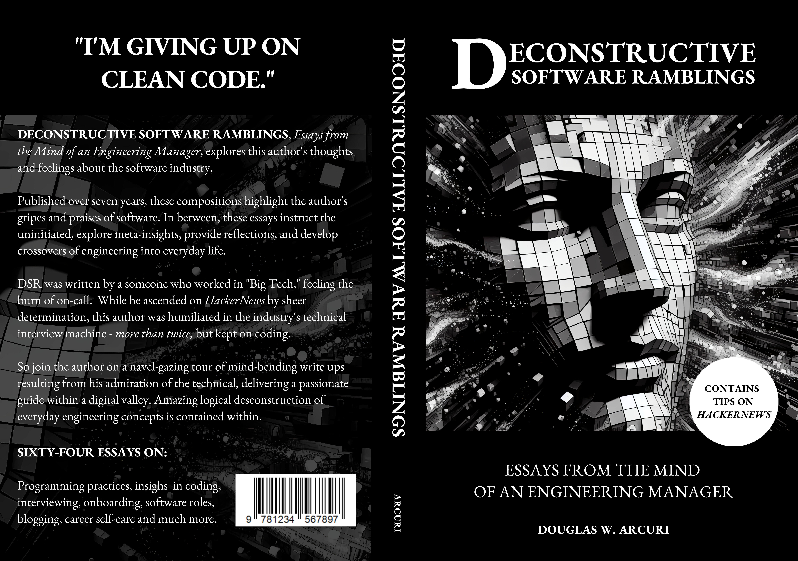

# Upcoming Book: Deconstructive Software Ramblings
## Essays from the Mind of an Engineering Manager During the COVID Era

DECONSTRUCTIVE SOFTWARE RAMBLINGS, *Essays from the Mind of an Engineering Manager*, explores this author's thoughts and feelings about the software industry.

Published over seven years, these compositions highlight the author's gripes and praises of software. In between, these essays instruct the uninitiated, explore meta-insights, provide reflections, and develop crossovers of engineering into everyday life.

DSR was written by someone who worked in "Big Tech," feeling the burn of on-call. While he ascended on *HackerNews* by sheer determination, this author was humiliated in the industry's technical interviews - *more than twice* - but kept on coding.

So join the author on a navel-gazing tour of mind-bending writeups resulting from his admiration of the technical, delivering a passionate cry in a digital valley. Amazing logical deconstruction of software engineering concepts is contained within.
And you'll be left wondering: Was this book worth your time? To the half million who viewed these essays, perhaps the answer is "*it depends.*"

---

DSR will be available for purchase by the end of the year.