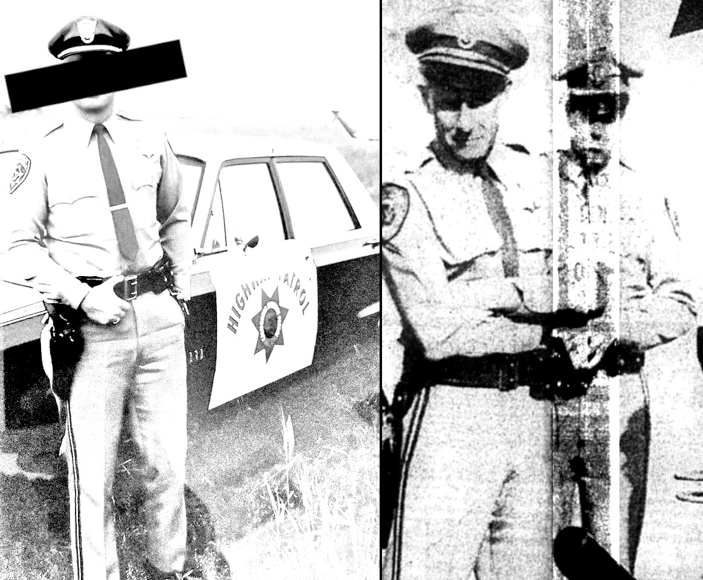

## OPINION ON TOY HISTORY
# Jack's Injustice: Corruption Within The State of California
## A Mattel Employee Dies Searching for Toy Tech. Was Justice Halted?
#Investigation #History #Legal #Crime #Mattel

---

*This document is the final write-up of Jack Edward Hartman's investigative trilogy. In 1968, Jack Edward Hartman died in a parking lot while working at Mattel in search of inventive toy technology that may have served their upcoming product, Hot Wheels Sizzlers.*

Part 1: [A Tragic American Toy Story: The Engine That Killed a Mattel Preliminary Design Director](https://medium.com/@solidi/a-tragic-american-toy-story-f0c19e58534e)
Part 2: [The Ultimate Hot Wheels Legend: Does Evidence Link a Fallen Mattel Toy Inventor to Hot Wheels?](https://medium.com/@solidi/the-ultimate-hot-wheels-legend-0e3b9e2b2d88)

This draft is part of an American Toy Anthology. See this author's announcement, [Undercover Toy Stories](https://medium.com/@solidi/upcoming-book-technical-toy-stories-80d5bfbd76c0): Volume One, for the upcoming publication.

---

*EUGENE MALLOVE, A DECORATED SCIENTIST* and former MIT press agent, was speaking to George Noory on Coast to Coast in [February 2004](https://www.youtube.com/watch?v=z9rG-B84sq0&t=5230s). Eugene recounted the [explosion in the parking lot](https://medium.com/@solidi/a-tragic-american-toy-story-f0c19e58534e), which killed a toy executive of Mattel.

[Eugene](https://en.wikipedia.org/wiki/Eugene_Mallove) said, "The engine was demonstrated on November 18th, 1968, in Gardena, California, at the company Environetics."

"[The engine] exploded and killed one - a person, an engineer from the Mattel toy corporation." That man was Jack Edward Hartman.

Eugene continued, "Feynman [was] a wonderful physicist but then very skeptical of this [engine]."

[Dr. Richard Feynman](https://en.wikipedia.org/wiki/Richard_Feynman) appeared in the parking lot before the explosion. During a final exchange, Mr. Papp plugged the machine back in, and the engine blew up in front of a crowd.

"[On Feynman's] theory - here's the problem - with that theory, later on, there was a lawsuit. - Feynman suggested that the reason [of the explosion]," said Eugene.

Eugene paused and said, "He [Feynman] thought that Papp [had blown up](https://hoaxes.org/comments/papparticle2.html) his own engine with surreptitious explosives. - Insurance companies were involved, and Caltech settled with this [case]."

Authorities found no explosives. Eugene went on.

"There are two possibilities here: either the explosion was real from an anomalous physics anomaly, - or some agency in - 1968 was completely incompetent in investigating."

Eugene and George Noory continued to chat over the airwaves.

Two months after his interview, Eugene Mallove was [murdered outside a childhood](https://www.oxygen.com/an-unexpected-killer/crime-news/eugene-mallove-scientist-murdered-after-housing-dispute) home on his driveway. Thus, we will never know what information Eugene held.

Some twenty years later, New York Times best-seller David Kushner, based on his 2016 essay "[The Coldest Case](http://www.davidkushner.com/article/the-coldest-case/)," unrolled Mr. Mallove's legacy in a series of podcasts titled "[Crime Waves: Coldest Case](https://qcodemedia.com/crime-waves)" in late 2023.

The presentation did not mention this case.

Now, this author suggests a possibility in the explosive engine tragedy. Authorities had relationships, money, and good names on the line. And within twenty-four hours, the incident shifted from a criminal investigation to an accident, which made no sense.

According to Eugene's rhetoric, this author agrees that authorities were undoubtedly "incompetent"-but conveniently in their investigative due diligence. The facts placed in the prosecutor's hands made it impossible for them to serve justice to the victim's family.

Underneath the authoritative cover, this author theorizes a triangle of conspiracy had existed all along.

---

Many pieces of information led this author to raise questions about Jack Hartman's homicide. As discussed in the [Ultimate Hot Wheels Legend](https://medium.com/@solidi/the-ultimate-hot-wheels-legend-0e3b9e2b2d88), this author suggests that Jack Edward Hartman's case was not an accident.

This write-up will unpack the theory.

Several people were involved in the incident. The "hosts" included Donald Roser, the engine investor coordinating media coverage, and Josef Papp, the engine inventor.

There was Dr. Feynman, a theoretical scientist at Caltech. There were "authorities," including the Los Angeles Sheriff's Department (LASD) and California Highway Patrol (CHP).

There was "media," like the Gardena Valley News (GVN), The Breeze, The Telegram, Associated Press, and UPI. There was "government," the Los Angeles Executive Office (EO), the US Navy, and NASA Jet Propulsion Laboratory (NASA/JPL).

A crowd of up to thirty-five people huddled in a parking lot [surrounding a modified auto engine](https://medium.com/@solidi/a-tragic-american-toy-story-f0c19e58534e). After numerous interactions with certain men, the engine exploded, violently killing Mr. Hartman.

## How Could the Engine Explosion be Declared an Accident?

Given these actors, here are the facts that challenge the definition of "accident," which all occurred on Donald Roser's private property:

* An [8mm film played](https://www.youtube.com/watch?v=p2tuk31pS2M) in front of the crowd minutes before the incident. The film included images of the gas mixtures blowing up a sealed metal pipe. Hence, the hosts knew the dangerous nature of the gases, sealed within another encasement - an engine.

* As confirmed by one reporter, Josef Papp intermittently wore a "crash helmet" during the running demonstration *while not affording* protection similar to the crowd, further confirming the engine's dangerous nature, secretive knowledge, and failure to protect the audience.

* There is an account in which Mr. Papp unplugged the engine *before* interacting with Dr. Feynman. Papp demonstrated to the crowd that the wires meant nothing-and caused an engine behavior change while the machine ran. Knowing the gases caused unusual behavior in the engine further doubts safety and invites others to question the wire's purposes.

* Because of Mr. Papp's unplugging action, spectators were confused (why the helmet?) while observing the actors' unplugging actions, supporting Dr. Feynman's conclusion that the engine could turn off.

* Besides photographic evidence confirming the in-era motor emblem patches, a written account affirms that at least one "Highway Patrol Officer" unlocked the gate to let in emergency workers. This fact confirms authorities were on site, within, *before, and while* the demo was happening. As another author stated, "armed security" in 1989, titled "[The Dream Machine](https://hoaxes.org/comments/papparticle.html)," but these men were *genuinely* official California state agents of the law, not private security.

* Later that evening, a politician, [Kenneth Hahn](https://en.wikipedia.org/wiki/Kenneth_Hahn), questioned why Mr. Roser and Mr. Papp did not shield the crowd as they stood around the engine. Their relations spokesperson paraphrased, "Why should we?" The politician was critical of the demonstration.

* This author could not locate investigative reports on explosives Dr. Feynman speculated about. Their use remains unfounded-authorities had to test the secret fuel in under 24 hours, which this author suspects is insufficient time to produce a competent report.

* Mr. Roser reported that police tested the engine at Stanford Research Institute, but no one recovered a report. This statement did not come from the police.

* Based on media reports, an accident was declared within 24 hours of the death of Mr. Hartman, lasting from Monday night to early Wednesday morning.

* The engine pointed toward the crowd, and Papp and Roser frequently walked behind it. The engine was placed in an unsafe area.

* Mr. Hartman was hit in the lower back, not the front.

*The media confirmed the hosts *refused* to support the police investigation, thus concealing evidence for a proper investigation and swift justice.

What is clear is that the hosts did not protect the observers on private property, and the media reported that they were uncooperative with authorities.

## Actions Pointing Toward Collusion

Now that we know the factual information, here are the troubling conclusions inferred from the media documents.

* The LASD declaration of an accident by the media ended within 24 hours, a swift closure for an unknown reason. At least thirty-five witnesses, seven injured and one dead, with at least one media reporter and a recorded film, said the demonstration was amateurish, dangerous, and had exotic, unknown technology. Why conclude so quickly?

* The incident involved a complicated engine, ballistics, chemicals, and radiation detectors thoroughly tested within hours. Dismissing justice as processing was happening doesn't make sense.

* The hosts blocked authorities from accessing the engine details, which was reported within those 24 hours. What were they hiding?

* The Los Angeles Corner ordered a separate radiation detector test on Mr. Hartman's body a day later. Chief Corner [Dr. Thomas Noguchi](https://en.wikipedia.org/wiki/Thomas_Noguchi) was notified and ordered tests through the acting doctor, further speculating heightened authority interplay.

* At least one financially interested observer provided overt statements of uncorroborated actions to authorities, which AP and UPI relayed early on (within 24 hours). This person and the hosts informed the media and authorities of the "semi-secret" nature of the incident involving the "Navy." He was a former Navy man himself.

* Photographic evidence confirmed at least two seasoned CHP agents were in the parking lot before and during the incident. They did not intervene. Acting is a matter of police policy; if the demonstration became "dangerous," they had a duty to act.

* The media did not record CHP police actions but *would be in history if they struggled*. Thus, Dr. Feynman's *culpability* is unlikely, as he was overseen (literally, agents were staring at him) by an authority acting reasonably. Remember the hosts' previous actions, as they, too, unplugged the wires for a time prior based on contemporary evidence.

* A California [executive office politician](https://en.wikipedia.org/wiki/Kenneth_Hahn) visited the site after the explosion. After talking to the media and asking the right questions for the crowd's safety, this author found no record of his concern at the executive office, for which this author conducted a log search. An archivist found nothing. Why were charges dropped so quickly?

* Why was Hartman hit in the back when everyone watched an interaction and looked at the engine? Did someone in the crowd call for protection?

* Little public records are left in this case. This author believes police reports of this case are misfiled. With such a crazed incident involving numerous agencies of a homicide, preserving these documents would be critical, as the civil suits demanded their preservation.

With the above, this author drew three conclusions during his investigation. The logical summaries of the incident are informed, based on media, documents, and photographic evidence, along with the above facts and opinions.

## 1. Government Immunity Defense-Do Us No Harm

The Gardena Valley News, a magazine, and another newspaper confirmed government involvement in the engine. If so, the prosecuting district attorney's job would be difficult. Government involvement involves sovereign immunity, setting a high bar for justice involving authorities.

Legal prosecution for the ill-fated demonstration may not have been possible if American defense and contracted aerospace had invested in the engine for the government.

However, no documented evidence proves the district attorney, Ray Daniels (assumed), had this problem. It is unknown if the government was involved-at all. This author found statements by the hosts, given to authorities and the media, and one interested financial observer who recounted knowledge while within the parking lot. This investor confirmed in an interview that the engine could explode, doing little to inform the crowd until the last moment.

A former Navy officer, Cecil Baumgartner, acted for a private corporation and appeared to be involved with the hosts in a supportive way, appearing in the film shown to the audience.

This former Navy officer informed Eugene Mallove's investigation decades later, disclosing that Papp knew the engine could explode while the demo was occurring and *let the actions happen*, which is a damning written hearsay statement found in this investigation.

If the invention were for "the government," the demo would have been protected, secretive, and in a secure laboratory setting- not in a parking lot on private property.

FOIAs were filed to find evidence of government involvement, including "NIS," the Navy's former civilian authority, who confirmed to this author the incident was not in their jurisdiction and had no record of an investigation.

This author filed public record requests at the state and federal departments but was unresponsive.

## 2. Government Collusion - In Favor of an American Image

It's November 1968, and America is about to circle the moon with men for the first time.

Authorities determined, by an unknown overseer, that charges would disrupt current events and the image of America during the Cold War. Dr. Feynman's presence in a public legal process, pulling in NASA/JPL, Caltech, and the US Navy as a Nobel Peace Prize winner, would overshadow and sink the gravity of the scheduled Apollo missions.

Both agency's involvement, the Navy and NASA/JPL, which Roser wrote into this story, remain unsubstantiated.

Caltech, which Dr. Feynman represented, was undoubtedly associated with NASA/JPL working on the Apollo missions. Dr. Feynman's [post-contemporary story](https://hoaxes.org/comments/papparticle2.html) suggests he acted alone in the parking lot. Caltech defended the "errant" professor.

However, this author believes he was not "errant" at all.

There is no evidence of NASA/JPL involvement except in one magazine article in Private Pilot, December 1968, which mentioned that the agency was "looking into it." We don't know how that magazine author received the information, but we assume it was from Mr. Roser to the media. It remains unlikely that Dr. Feynman was acting/investigating for Caltech JPL.

At least one student was present with Dr. Feynman in the parking lot, whose photographic evidence confirmed his existence and thus was identified in 2023, Ron Gregg, who died in 2003.

Mr. Gregg added to Caltech's liabilities. Paying protective restitution was in the university's purview for survival-of their students' protections under the care of Dr. Feynman-not to defend his perceived blame. Based on facts, this author believes Dr. Feynman's actions were reasonable.

In 2012, at least one person raised a "[stronghold argument](https://www.mail-archive.com/vortex-l@eskimo.com/msg69679.html)," which this author agrees with, but for a specific reason. The stronghold was to protect incoming Caltech students and secure future tuition revenue.

This author theorized that Caltech would pay dearly to secure its future and protect an essential American educational institution. They were dealing with a financially leveraged situation. The hosts could (reasonably) blackmail Dr. Feynman's good name for uncorroborated actions that twisted the situation to extract cash from that stronghold.

To history, the hosts collected money out of court. This author assumes the investment was a small fortune. And Caltech will never say, which makes total sense. Why would they even acknowledge it?

Then we have a famous politician, [Kenneth Hahn](https://en.wikipedia.org/wiki/Kenneth_Hahn), who dropped all questions after asking them the night of the incident. This author could not locate any record of FBI special agent involvement in overcoming local authorities and the district attorney. It is unknown if the information reached the desk of then-governor [Ronald Reagan](https://en.wikipedia.org/wiki/Ronald_Reagan).

Our only evidence is an individual's work through an appealed FOIA decades later, and it doesn't say much.

An FBI file revealed that LASD provided cursory information about Papp with their agency in 1973, five years after the incident, making it possible that Mr. Papp remained un-surveilled until his escapade with his kidnappers.

There is a chance Josef was suspected of being a communist. He originally came from Hungary and escaped the revolution, but his wild behaviors aligned him more as an entrepreneur and capitalist.

However, the LASD had [strong written ties](https://www.amazon.com/Whiteys-Career-Case-insulin-murders/dp/1463706499/) to the FBI during the acting assistant director agent, Wesley Grapp "Los Angeles - LABureau," before 1971, so a connection is probable.

Dr. Feynman was on an FBI do-not-call list, confirmed by a 2012 responsive FOIA secured by [MuckRock](https://www.nbcnews.com/id/wbna47830290), so Feynman's tracking ceased with the order of Hoover, and the FBI was unaware of his immediate parking lot presence.

Former OSS and FBI agent Grapp's opinion of Dr. Feynman is unknown. Even if FBI plants watched this demo in the parking lot, which this author believes so, authorities appeared blindsided.

And when the FBI found out, they wanted the situation dismissed.
Alternatively, it is plausible that the FBI was alerted soon after, as LASD had to locate Dr. Feynman within 24 hours before declaring the incident an accident. By then, the FBI knew of the event, but the outcome they "influenced," if any, remains unknown.

This author theorizes that Dr. Feynman may have been "instructed" during the authority interview. Before his death, Dr. Feynman retold the story, of which there is a written account. Dr. Feynman mustered enough courage to bring up the story; someone wanted it published by 1989.

Additionally, the GVN contemporary newspaper accounting strengthens Dr. Feynman's button-up behavior during the demonstration. We can place Mr. Feynman's posthumous account aside because contemporary media evidence supports Dr. Feynman's professional exchange with a media reporter who wrote his observations.

Dr. Feynman's remained steady while CHP overwatched that exchange-with no blame called out.

Johnny P. O'Donnell, a decorated journalist who went on to write for the Los Angeles Times and magazine articles for Time, told the whole story, denying it was an accident or of Dr. Feynman's doing. He placed full blame on the hosts - Papp and Roser.

But Mr. O'Donnell's story remained obscure and suppressed for decades.

Regardless of truth journalism, if indictments were served on Roser and Papp, we must consider the media circus. Consider at least two involved CHP officers and their perceived inactions, numerous corporations representing the space race of which countless people were hurt, and a famous American representing Caltech, extending to NASA/JPL, all on the stand.

The raucous would tarnish the image of America, Caltech, and the Space Race. The secondary result would have been Mattel's famous brand, Hot Wheels, linked to a story that would have been "not good" for business- all on the world stage as men were being launched for the moon.
The "government" wanted the disaster dismissed.

Regardless, these visions never stand in the way of justice, and this fairy tale above is a perfect mythology. Let's return to earth for our last gritty and grounding theory - and then a twist.

## 3. Prosecutorial Discretion-Authorities Knew Donald Roser

As a concluding theory, authorities, LASD, and prosecutors could have reached a problematic impasse within minutes of investigating, as at least two CHP officers were scratching their heads as what unfolded before their protection - in a parking lot of negligent behaviors throughout.

Charges against the hosts would destroy their business and reputation-*not like it mattered to justice*. What is critical is CHP's lawful reputation, which was on the line in this case-a contoured mess of law and metal debris.

The collective authorities had everything to lose after the state of California supplied the resources to protect the peace-and in favor of the host's assets, company, engineering, and Mr. Papp's engine. CHP's failure to protect the innocent exposed inaction means they could not safeguard bystanders in the parking lot - on private property, behind a locked gate, and around a private business building.

One could raise "qualified immunity," which the Supreme Court ruled less than a year prior. However, imagine that the optics and cultural understanding from sixty years ago-that police protect people regardless of legal realities-would make prosecution impossible.

And do we know that they, the CHP, were unaware?

Reportedly, Mr. Roser invested at least half a million dollars to defend the engine in courtrooms later. He was the man who advanced Papp's engine to the media before their partnership broke apart.

Roser's money and reputation were on the line. He believed in technology and had good intentions.

As we know through photographic evidence, CHP was on private property *before* the incident, and citizens could theoretically schedule authoritative connections-but good luck. In 1968, cultural problems strained police forces, which this document cannot fully tackle, but even so, there were no reported dignitaries in this parking lot.

So why should such protection *from the state and not local authorities* be prioritized over private property for such a small media presser? They have been called in for other means, which could further heighten this case's intensity. Were they flagged off the street and invited into the private property as the demo began?

Either way, why were they protecting - private property?

CHP's decision to *proactively* protect the peace, *in uniform*, encased within private property, became quite hazardous to authorities. If things "go down," which they did, it would fall on the police's watch and, ultimately, their accountability in a court of law.

But get this: there were reported waivers signed by men, of which a copy is lost to history. So, did this waiver challenge protections afforded by the state of California? Did CHP read and agree to uphold them as they entered private property?

Certainly not.

There are conflicts for a rational person to consider, and understanding their complexities requires a legal scholar.

And to make authoritative proactive peace "happen," there had to be a direct connection to them; in this case, Roser knew people in law enforcement.

After blatant missteps and apparent negligence by the hosts, which one reporter *wrote 72 hours after the incident*, investigators weighed CHP's lack of intervention and, in the case of Dr. Feynman's actions, perceiving no wrongs happened when he challenged Mr. Papp. Add a list of prior liabilities even before Dr. Feynman materialized, all too incomprehensible to wrangle.

There is no evidence to suggest Dr. Feynman was belligerent or even passive-aggressive; CHP officers oversaw the actions with Smith and Wesson Model 19 long pistols, as confirmed by at least one photo.

If the incident had been declared manslaughter, which this author believes was a fair legal burden on the hosts, civil lawsuits would have been filed against CHP's authorities, expanding its public eye and spilling into the media as the adversarial countries watched on.

Everyone would have been pulled in, including the state of California and intelligent engineers on the stand, arguing in a court of law. A criminal trial would have included Dr. Feynman, whose parting manuscript was clear - he'd fight for the truth but instead rested on "wisdom."

Having all these conflicts is no excuse for serving a toy maker's injustice.

---

What follows is "new" evidence supporting this author's corruption theory. Photograph evidence suggests a connection between the investor and the authorities. Donald Roser and LASD Homicide Detective Harold Whiting appear in the same frame, validating an authority connection.

The photo was unsurprising, as this case is an endless buffet of intriguing, challenging, befuddling questions of law, technology, and a true drama of covering each other's ass - and, in this case, significant government, education institutions, and state agencies.

And a famous American, Dr. Feynman, who this author believes did the right thing.

Somehow, this photo shocked the author as he tested the theory. *These are the same men from the engine and this investigation.*

Mr. Roser wears sunglasses and looks at the camera in an awkward bend as if facing the wrong way toward another unidentified man-as if he should be looking forward toward Mr. Whiting.

And left, then retired Homicide Detective Harold Whiting is facing forward, as if to avoid the impending camera, wearing an in-era LASD star ring on his finger.

Why are these men together-at all? Why weren't the hosts held accountable for Hartman's life? Indeed, information is out there, and photographic evidence appears to support an alternative story.

## Corruption Within The State of California

It's this author's opinion that the death of Jack Edward Hartman was not an accident. Instead, significant tension and collusion in covering one another's agency to thwart a justified investigation and dismiss those who knowingly set up a treacherous, dangerous demonstration.

This author didn't come to this conclusion alone. Because of GVN's newspaper, which seemed to have been protected by pseudo-scientific storytellers, they made it possible. Within, a media reporter told it like it was, publishing these photos. The preserved newspaper had its theory and an answer for history.

The author, Johnny P. O'Donnell, wrote the story and saved the lives of two other men in the parking lot. He died in August 2024.

The contemporary officers of CHP were the lynchpin in the incident because they unknowingly allowed the sloppy demonstration to proceed, which became dangerous. Even if justified, their inaction placed investigating prosecutors and homicide detectives in an uncomfortable situation, with CHP present and *knowing* the engine investor.

The hosts, Roser and Papp, tampered with their engine in a parking lot with an experimental engine without affording any protections *before* Dr. Feynman's interaction.

This theory answers the question about the politician who visited, who was so invested in road safety, and learned that CHP oversaw the tragedy. This author theorized that it was time to shut up.

Even if this author's CHP theory above is dismissed through a brick wall of *qualified immunity*, the mounting contemporary facts of negligence add up - and how Johnny's story slipped through authorities is unknown.

Hartman's manslaughter by the hosts - the knowing of explosive dangers on film, the helmet, lack of protections afforded, the hosts unplugging and plugging prior, and an agent and former Navy officer on the host side saying nothing while it was happening -until it was way too late - is so damning that it's a mystery how they escaped the scales of justice.

It is unbelievable that it was an excusable homicide; instead, critical dangers were ignored by the hosts, and they discarded the safety of the crowd.

So while debunkers say, "Follow the energy [to the battery]," and theorists say, "It could be real [, check out this Russian report]," this author followed a human principle: "Follow the conflicts." Whether engine technology existed (or not) never mattered.

Close to sixty years later, we are waiting for the sale of such an engine. And here comes the twist.

---

In 2003, Eugene Mallove interviewed Cecil Baumgartner, a former Navy and terminated TRW employee, in his magazine.

Eugene said, " - even if Papp wanted to blow this engine up and Roser was in cahoots with him to blow this engine up somehow or let's just say that Papp wanted to blow the engine up, why did they do it in front of a crowd?"

Cecil replied, "I think that Papp just told Roser he was going to blow it up, and Roser couldn't do anything about it."

Eugene said, "Blow it up in the sense that 'if they don't believe me, I'm going to show them the real power by blowing it up,' so to speak."
Cecil replied, "Right. The conversation that I had heard weeks or days before [the demonstration] - ."

Eugene asked in the interview, "Why was the Mattel toy person there?"

There wasn't an answer.

Cecil went on to work for Rockwell, participating in the Space Shuttle thermal shielding efforts of the 1980s. He died in 2022.

---

If one sits with the evidence, a conclusion arises. And what follows is this author's proposed theory of Mr. Hartman's manslaughter.

It was the corruption of the police connection, the involvement of an innocent famous American, and the premeditation of blowing up the engine despite people not believing them, retold from Cecil to Eugene, is shocking and confirms the conspiracy.

To this author, this case appears as a definite homicide, and with an indication of foul play with aforethought malice, voluntary manslaughter is a certainty.

But could it be murder? California has no statute of limitation on such a charge.

---

In October 2024, a close source to Mr. Hartman did not know that Dr. Feynman was involved in the incident. This author then revealed this information, confirming the significant suppression of the era.

The source confirmed Mr. Hartman wore his black suit that day and was to be promoted to Vice President at Mattel. They said Jack was present to investigate a potential toy invention into Hot Wheels, which the author theorized because of the finding of the [written toy prank](https://medium.com/@solidi/the-ultimate-hot-wheels-legend-0e3b9e2b2d88).

However, tying it to the specific brand remains partially corroborated.

While we confirmed Hartman was on the job, worked for Mattel, was an R&D director, and supported the development of Hot Wheels and Barbie, complete corroboration can only be obtained from an inventor's written log or by searching Mattel's restricted documents (which was [reviewed](https://www.jezebel.com/the-strange-sad-story-of-the-ken-dolls-crotch-1839221635) in 2008), to understand the corporation's understanding of the situation.

What we are left with is a sad truth. Mr. Hartman's death is the definition of a tortured American injustice, a B-level conspiracy, and a tragedy that this author believes is solved - manslaughter in the state of California.

As Mr. Hartman died on the job, partial evidence supports the idea that the company's founders, the Handlers, supported the family. The full extent of the support is unknown.

A 2014 obituary of Hartman's second wife confirms their commendable, quiet, steadfast support. But this author disagrees with the obituary; Hartman's death was *not* a freak accident - justice fell within the protective hands of the state of California agents and, quite confidently, within a triangle of a conspiracy among enterprising men.

All three of the men knew that the engine would explode.

Ultimately, authorities' failure to stop the mounting negligence was a perfect failure of justice while someone - in the know - failed to stop Hartman's impending death.

This author maintains that the case should be reopened, and all public records should be searched and collected.

---

