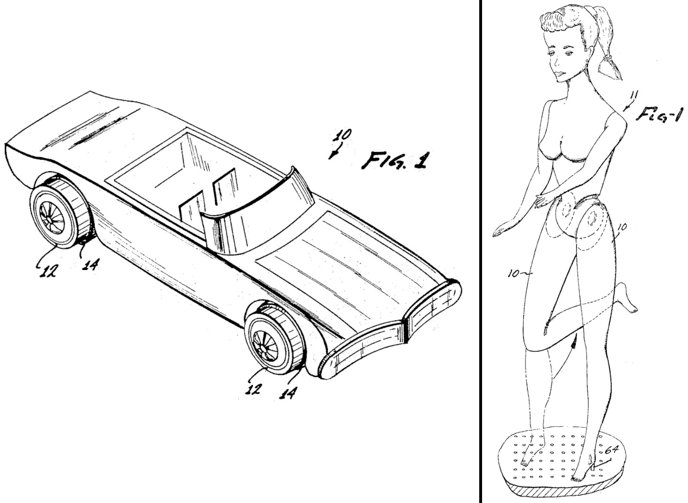
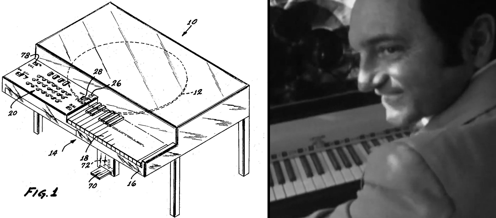
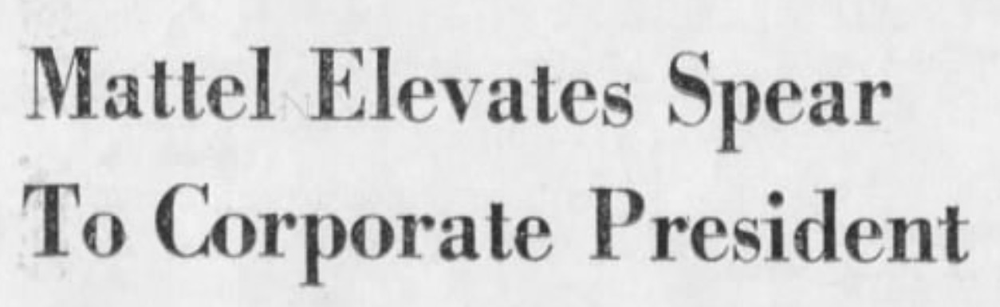
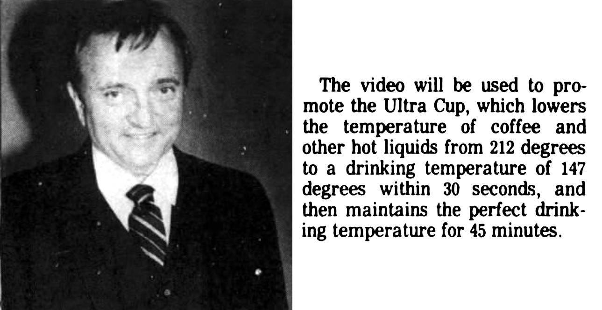

## ON TOY HISTORY
# Jack Ryan and Ruth Handler of Mattel: The Power Ballad of American Coffee
## Sex, Speed, Guns, Conspiracy, Caffeine, and Four Letter Words in Toy Making

---

*This draft is part of an American Toy Anthology. See this author's announcement, [Undercover Toy Stories](https://medium.com/@solidi/upcoming-book-technical-toy-stories-80d5bfbd76c0): Volume One, for the upcoming publication.*

*This author imagined dialogues based on collective historical facts revealing crazed real toy-making stories. This reading contains a scene of suicide and drug use, which can be disturbing.*

---

*ONCE UPON A TIME*, there was a young corporation called [Mattel](https://en.m.wikipedia.org/wiki/Mattel). It contained the three most critical industrial icons of toy making.

They were Americans - [Ruth](https://en.wikipedia.org/wiki/Ruth_Handler), [Jack](https://en.wikipedia.org/wiki/Jack_Ryan_(designer)), and [Elliot](https://en.wikipedia.org/wiki/Elliot_Handler).

Their collision with modern society is immeasurable, and their stories are legendary. They are the creators who impregnated American Aerospace's womb - and out popped smoking hot mass-produced toys delivered to a monumental population boom in human civilization.

Business historians and gossip journalists alike cannot get enough of Mattel. Neither can this author, who mainlined on their stories. [Overdosing, metaphorical Narcan was then administered to him - by buying second-hand playthings from his childhood.]

To a collective society, Mattel has enabled two distinct brands that live in each of our minds - one part sex, one part speed - surrounded by the origins of American Anti-Communist obsession with guns, conspiracies, the Space Race, Cold War, Russian espionage, and weapons of war.

The legend of Jack, Ruth, and Elliot Handler's estranged triangle is a wild story yet to be written entirely in our hearts. And all three lived the utter totality of the American dream.

Today, Ruth, Jack, and Elliot's seventy-six million customers of the *Baby Boomer* generation are beginning to age out. And to the Millennials and Generation Z, who will eventually romanticize the atmosphere. So it's time to write *even more* stories packaged in perfect American plastic, revealing a saga grounded in cold facts.

To this author, all three are American heroes. And Jack Ryan, supported by Ruth and Elliot Handler, had an obsession-a cup of hot coffee.

So begins their power ballad.

---

"Elliot, I get it. I'm trying to find a last-minute fix for Cathy. The disc is skipping over on the pull, causing the needle to move off the track," said Jack.

"It seems like she's having a seizure; the voice is playing backward. El... it's a bit f - ed," said Jack.

"But I have an idea."

Jack was sketching something on his idea pad, which he always carried. Underneath his notebook was an airline magazine.

"I'll phone Sesto when we land," said Jack.

, above. Ryan took the Handlers for the ride of their life (and so did the Handlers to Ryan.)](images/92-02.jpeg)

"I'm sure you will get it fixed - otherwise, Ruth will kill us," said Elliot.

Elliot Handler was a gentle R&D leader who treated his employees fairly. His wife, Ruth, was uncompromising about manufacturing quality as much as increasing sales.

Ruth Handler was to become the most powerful woman in America. Like America's [Kelly Johnson](https://en.wikipedia.org/wiki/Kelly_Johnson_(engineer)), Ruth was an organizing genius.

And Jack Ryan was different. He was a dedicated consultant to Mattel—not an employee. Jack and Elliot were friends, and Jack yearned for Ruth’s respect. Jack and Elliot were friends, and Jack yearned for Ruth's respect.

And it was 1960. Jack and Elliot were sitting in suits.

Jack Ryan, 34, and Elliot, 43, his senior, sat together on a TWA flight flying at thirty-five thousand feet. They were investigating an incident involving a Mattel plaything bought from a local store. Somehow, a child fired a real bullet out of the toy.

Headlines printed titles like "Toy Pistol Fires Live Ammunition."

Jack spoke in a measured rhythm. His voice was higher pitched than usual - and quite nasally. He was of average stature and looked like a fit version of [Hubert Humphrey](https://en.wikipedia.org/wiki/Hubert_Humphrey).

A sensual stewardess with a proper dress uniform approached them from the aisle. She was beautiful.

 covers a toy and a firearm. It is a rare example of patent dual-use and is part of this unbelievable story.](images/92-03.jpeg)

The flight attendant asked, "Would you like a coffee?" Ryan said yes as Elliot passed. Elliot wasn't a drinker, but Jack enjoyed coffee - and dabbled in vice.

Jack looked over the woman in the aisle and daydreamed. He winked. She smiled.

[Looking back at Elliot] "Coffee is one of those historical stories that goes quite deep," said Jack. "Lots of strife, barbarism, imperialism, and things like an American Revolution. Today, it's about business."

Elliot, next to him, nodded.

Jack was on the genius spectrum: a Yale grad, a peer of CIA Director [George H.W. Bush](https://en.wikipedia.org/wiki/George_H._W._Bush), an electrical and mechanical engineer, and a technology genius. His educational travels included MIT and Harvard-an unsung all-American educated hero.

Ryan was so brilliant that his [dyslexia](https://www.dreamhouse-thejackryanstory.com/) didn't have a chance to slow him down.

Inventing was Jack's drug of choice, but the high it delivered wore off quickly. He had ruminations to experiment in the illicit. But right now, he's a nervous passenger,* flying on [Librium](https://en.wikipedia.org/wiki/Chlordiazepoxide), feeling loose.

"Now... coffee is an American drink," said Jack. "Thomas Jefferson said it's 'the civilized drink of the world.'"

"There is just one problem. It must be hot." He smiled as if calculations were occurring in his head.

Elliot smirked.

---

Jack was a die-hard American born into real estate wealth in Yonkers, New York. But he wouldn't ride his father's coattails. He found a beautiful wife, Barbara.

They struggled, had children, and then worked for the military-industrial complex in Massachusetts, building radar-guided missiles as [Senator McCarthy](https://en.wikipedia.org/wiki/Joseph_McCarthy) went on a wild goose chase to find suspected communists.

Détente was a word of science fiction. Well, at least two people were trying, one was dispatched too soon.

A businesswoman, Ruth Handler, met Jack Ryan during her travels. She then networked with sad military brass who sold them toy ideas at Point Mugu Naval Air Missile Test Center.

It's not clear how Ruth networked in. Perhaps the military contract from 1951 of which Mattel executed a re-tooling? Or just local business connections? Regardless, Mattel was in the center of these battlements.

Mattel married the military complex and brought toys to children, which is why their toy making was "weird" and "secretive." Eventually, Ryan brought the Aerospace process to Mattel.

And Ruth was married to Elliot, and they struggled for business until they found their man. Elliot had great ideas and led Mattel's secret research and development department. Their marriage was like a fairytale, a steadfast rock of dedication.*

They picked up inventors from [Northrop](https://en.wikipedia.org/wiki/Northrop_Grumman), [North American Aviation](https://en.wikipedia.org/wiki/North_American_Aviation), Douglas, and Lockheed, many from "the war machine." Later, Ruth directed Jack to recruit engineers from aerospace military spheres, such as the UK.

Now, Jack worked for the toy industry, making a royalty on each patent for Mattel Corporation.

---

Jack gripped his TWA porcelain mug with red stripes. He sank back in his chair.

"Jefferson's quote is a double entendre. Who drinks tea?" said Jack. Elliot started to chuckle while working on another sketch of [his failed toy car](https://www.imdb.com/title/tt16364920/) for a fourth time.

Elliot wasn't getting anywhere with the toy cars. Then he asked, "Are you ready to meet Jesse James?"

Jack replied silently. He simulated Western pistol guns firing in the air. They weren't going to El Dorado. They were flying to North Carolina, to the entrance of the deep American South.

Jack squinted and said, "[Yancy Derringer](https://en.wikipedia.org/wiki/Yancy_Derringer) will come to town." Elliot started to laugh.

And Jessie James was the sheriff who called Mattel from California to investigate.

"We have to get to the bottom of it. The three-year-old blew a hole through the kitchen cabinet and narrowly missed their five-year-old brother," said Elliot.

Elliot put down his trusted pencil and reflected - rubbing his head.

"The child is a girl," said Elliot.

Jack replied. "Jesus Christ, I cannot believe they could have done it. How did she get the bullet? How did she bypass our engineering on the derringer? It's not supposed to take bullets - I made it that way."

Jack smirked, "She probably had a Barbie in the other hand."

Elliot's eyes got small as he sunk into the chair.

Jack's [patent](https://patents.google.com/patent/US3026642A/en) was dual-purpose-one part firearm, one part toy. Jack adjusted the chamber so the bullets would not enter. However, some sized bullets fit, albeit not perfectly. The firing hammer and pin blunted, and the patent went on about the mechanism that swung out.

Yes, the toy had real "Shootin' Shells," accepted "Blast Caps," and the patent even had this:

*"This invention is not to be restricted to use as a toy, but is adaptable for actual police work, whereby an actual firearm may be supported in the device and discharged in the same manner as described above . . ."*

Jack took a sip from the cup of coffee. "Ah, it's lukewarm." Jack thought about his immediate problem, thinking of invention. "Yeah, temperature is another problem to tackle. I could mock up a mug device."

Jack got into the weeds and muttered, "Something about the coefficient divide... not sure. No way I can power it without a plug."

"What holds heat?" Jack said to Elliot.

Elliot perked up but went back to his drawing in his airline seat. "Jack, think toys," he grumbled.

Jack lived for mock-ups, prototypes, and solving problems that plagued him. But he was not interested in fixing what was on the production line. Jack dragged his feet with Chatty Cathy as it went out the door - as they flew, coasting on a strong tailwind from the west.

They left a metaphorical Santa contrail across the country.

Jack invented a way for a doll to play voice recordings without electronics, but he no longer found that problem attractive.

Then Jack assisted Seymour Adler on the softer plastic roto casting process, making Barbie different from its hardened sex doll. She was smooth, supple, and with no nipples.

Through labor in Japan, Barbie was a first at scale.

---

[Sneeze.] "Gesundheit!" said Ryan, looking behind Elliot in the next aisle. He gave a strange man a nod.

Two men were sitting behind Elliot and Jack on the TWA flight. They both wore black suits, and one had a hat.

The FBI was tailing them - likely from "a tip" from the press.

---

Jack, Ruth, and Elliot had their smash hit, Barbie, a doll they invented and sold by the millions. The plaything was based on a sex doll from Germany-Bild Lilli - from a company called Greiner & Hausser.

Jack and Elliot had their future inventions before them.

Jack looked at Elliot, reflecting on how wild it had all been in five years. A year prior, Barbie had broken the mold of baby dolls. Now, Barbie was a cultural wildfire, selling [three hundred thousand units](https://www.harpersbazaar.com/uk/culture/entertainment/a44129282/barbie-real-history/) the first year.

Ruth's doll would be a disaster, but the miracle happened. Parents started buying that summer. Then, it exploded in Christmas 1959.

Jack thought about all the work he, Elliot, and Ruth had accomplished. Ryan put away his sketch pad and flipped through the airline magazine when he saw a familiar advert - a Barbie doll.

Jack muttered something cute.

"We are [three planets](https://www.goodreads.com/book/show/2017136.Toyland) that form a Christmas star," said Jack. "There will never be anyone like us, El - and to Ruth." said Jack as he looked over the magazine, pointing at the "Teenage Fashion Doll" advertisement.

Looking at Elliot, Jack said, "Good composers borrow… El." Elliot smiled, then looked back at his sketch pad as if someone on the plane was overhearing the convo.

Jack grinned like no one's business.

And the men in the aisle behind Jack and Elliot were working for Hoover. They were taking notes.

, 1955 (left), and [Ryan's joints](https://patents.google.com/patent/US3009284A/en) are from 1959 (right). The leg joint was the center of the Barbie lawsuit between Greiner & Hausser and Mattel until 1964 - when they settled.](images/92-08.jpeg)

Jack was an orchestrator of a plastic opera, but he couldn't compose a child lullaby or play instruments. His inventive intellect would fix that, taking part in old Hollywood film tech as he did with a vinyl record with [Chatty Cathy](https://patents.google.com/patent/US3017187A/en).

Jack went back to his sketch pad. He and Elliot were doodling. Jack was collecting a hundred dollars an hour, and Elliot, Jack's boss, was collecting his thoughts.

"One day, El - one day, a toy car will happen," Elliot muttered.

---

[Two months later.]

"Hello? Yes, this is Jesse James again. We have another incident."

Ryan looked at his secretary and took the phone. "It happened again?" said Jack. "Yes, well, boy, it did," replied the sheriff through the phone.

“Christ. What a remarkable coincidence,” as Jack grinned.

Jack had to fly again as another child fired a bullet - *in the same state*. In the second case, the gun exploded, and the incidents remain a troubling, obscure conspiracy.

The patent tells the tale: Ryan's firearm [acted as a toy](https://patents.google.com/patent/US3026642A/en). However, the reader can see the patent applied to a mechanism for a firearm.

Or perhaps the families were to collect from the toy-making stronghold.

Was any of this real?

As Ryan was on the phone, he signaled to his brother Jim. "Jim, go out and get a sh - load of bullets, all kinds."

"And get me a f - ing coffee.* The one I got is getting cold," snubbed Ryan.

What is true is Mattel's R&D department constructed a shooting range to test the theory, purchasing hundreds of dollars worth of ammunition to debunk what wasn't possible.

To troubleshoot, Mattel purchased an armory made of the best weapons in the world.

Jim, his brother, raced back to the audio lab. Jim waved to his engineers in the audio department, "Ryan said to pick up as many bullets as possible."

The engineers didn't know what to do. Then, Jim raced out, and an engineer pointed his finger out - "Bang!" they said.

Another engineer playfully held their heart and dropped to the lab floor. They all laughed.

Charlotte Johnson, critical to Barbie's wardrobe, watched on in disbelief.

Jack led the gun research as a rumored [Yale sharpshooter](https://www.amazon.com/Toy-Monster-Big-World-Mattel/dp/0470548584)* and hung out with Skull and Bones members. Even before Mattel shipped the toy, Ryan ensured it would not take a thirty-two caliber bullet.

But somehow, a child loaded it. And how they obtained the bullets - well, one can speculate.

Jack experimented with Mattel's toy gun, providing a block in the pistol's barrel. But then, Mattel gave up and pulled the toy from the market.

And to history, The Teenage Fashion Doll and the Derringer's patents were never assigned to Mattel - they were squarely Ryan's.

The legend direct from Ryan's mouth was that at the moment before mass production, Ryan "blinked," shaving the nipples off the Barbie doll.*

Society has yet to learn that Jack invented a modified gun mechanism for real weapons in toys. Most aging Boomers know of the toy gun-even when this author interviewed a family member, they certainly remembered - but they didn't know that Ryan had to troubleshoot and then piece-tie a real child's toy.

Like Barbie, Jack also shaved off the derringer's "metaphorical" serial number-after the fact. And before there was the Barbie Twist 'n Turn [trade-in](https://community.creations.mattel.com/forums/topic/141644-whatever-happened-to-the-dolls-traded-in-for-an-original-twist-n-turn), Mattel's Derringer Lock 'n Stock program ruled.

Ultimately, Mattel offered a gun buy-back program for the remaining one million units in circulation, the first (and only) in American toy history.

---

*Mattel contains mystical stories that are too wild to believe. In the above tale, there wasn't much information on the interactions - but scanned newspapers began appearing with the story just a short time ago. It is where the facts were sourced.*

*In a digital Parthenon that continues to grow, ***some tales are impossible to imagine.****

*Years passed, and Mattel went on the New York Stock Exchange. Hot Wheels was a smash hit in the Spring of 1968, concluding Elliot's vision. It was time to expand the toy to race uphill on its own.*

---

"Check this out. I just got it," said Jack.

In the summer of 1968, Jack and a few members of his research and development team at Mattel gathered on the third floor, where Ryan performed his magic.

Barbie was an American icon, and Jack was looking into the next steps of Hot Wheels. That brand, too, small miniature diecast cars, was selling at a furious pace.

Sweating a little, Jack worked through the next toy problem. But this time, he felt "powerless" - not knowing how to motor a miniature vehicle at scale.

Jack mumbled, "There isn't a battery to do this - yet."

.](images/92-12.jpeg)

Jack always made things happen for Elliot, inventing the Hot Wheels car suspension, the bearings, and the plastic wheels. Elliot's fifteen-year drought of doodling car toys for boys finally succeeded.

Ryan was sipping coffee as he masterfully worked the complicated controls. "Ah, sh -, this coffee is tepid," he muttered.

Someone from the crowd said something as Jack stood before his engineers. "Jack - get going on it!"

Jack refocused. "Anyway, it's the newest version of a portable video player." Jack had an Ampex 700 model, a small reel-to-reel player. Jack surprised his audience - a bootleg copy of Green Berets.

Jack was a liberal hawk in American politics. But he was backing Nelson [Rockefeller](https://en.wikipedia.org/wiki/Nelson_Rockefeller), and primaries were coming up - as confirmed by a NY Times advert he sent out. "McCarthy should resign."

And the movie was right up his alley.

"You guys like John Wayne?" Fred Adickes, 43, said, "Hell yeah." Fred was a Texan who was critical to Hot Wheels' success.

"Blow them away, Jack," shouted Fred. Jack started to play the film.
Jack commented intelligently about waffling in Vietnam, pointing out Rockefeller's word salad. Jack once worked for the complex himself, which powered the action-"It's a pro-war movie," said Jack.

Fred said, "We need more of it - what a bunch of yellow-bellies."

A former D-Day veteran, model supervisor Donald Maurer was in the crowd. The movie played, and people went in and out. Gwen Floera, their audio expert and voice of the dolls, close to Ryan, made a complimentary gesture and left.

Their body language loudly suggested a fling as the movie played on for a time.

"Wait, what was that?" said Donald. Jack looked back at the screen while thinking about the cup of coffee. John Wayne smashed an M16 rifle against the tree.

"Play it again," said Donald. Jack worked his wizardry magic and redubbed the reels.

"Wow, that's our Marauder!" cried Donald. They played the film a few times. Gwen caught the commotion and came back into the room, watching.

Jack smiled, knowing something they didn't.

Mattel had created a toy M16 rifle called the "Marauder" months earlier. It combined Don Maurer's mechanical genius with Ryan's oversight. The Marauder looked and felt like the real thing. It was a toy M16 that a child wound up by pulling the bolt action.

A child then pulled the trigger that sounded like "Braap-brraaaap-brap-brap," as if they, too, were in a rice paddy shooting at shadows and serving lies.

"Ugh, I don't like war," said Gwen. "But I'll say, it's impressive that Mattel's toy gun appears in a Hollywood movie."

Jack and Donald sat together as they discussed the formation of the toy. "Yeah, it looks like they stripped the sticker of the 'Mauarder Division.' It was a little inside joke," said Donald.

"A little wordplay of our team - and there ya go." Donald smiled.

Jack spun the film back as he sipped the cold coffee in his white collared shirt. "I gotta do something about this problem," said Jack to himself as he looked into the coffee.

While gun toys trended, Hot Wheels was Jack's baby, a solution Elliot and Jack worked through together, supported by numerous engineers in his department. Hot Wheels was selling millions of units.

The accurate M16 rifle was developed within a subsidiary of an Aerospace company, of course. Mattel was a toy company at the heart of that complex.

At the time, Mattel was a toy corporation that produced a 75-percent-scale toy gun modeled after an M16. Indeed, it didn't last long.

---

Later that week, Ryan gifted one of his assistants a mink shoal. And the present was a public affair within the office. People gathered around. They clapped and smiled as the secretary thanked Jack.

A new engineer watched and wondered, standing on their toes, two people deep - saying something like, "Wow, this sh - is unbelievable. This would never happen in aerospace."

"How does Ryan get away with this?" said the young aero engineer.

The crowd stirred, and Jack looked into her eyes. Jack flashed back to a bed surrounded by wax candles. The secretary, a beautiful woman, lay in bed. He remembered. Candles were blown out, solidifying on the floor.

Jack snapped back out of it.

The line of employees surrounding the raucous was three people deep. Ruth was looking at the time-wasting commotion. She said, "What is this crap? Get back to it!" And the employees broke up.

She approached Ryan.

"Jack, where are we with the Hot Wheels prototype?" said Ruth.

"We are working on some concepts to power it uphill," responded Jack. Ruth frowned.

Ruth was matter-of-fact and knew what needed to be done for the business. Sales were her specialty, and Ruth knew how to get Ryan to do things.

Ruth looked at him. "Jack, just get it done. This battery thing is important." Jack nodded. "But wait, I got ideas for [Major Matt Mason](https://en.wikipedia.org/wiki/Major_Matt_Mason)."

Ruth ignored him.

As she walked away, she looked at him to signal that the battery was essential - and Matt Mason meant nothing.

"Bernie keeps pushing me for this car battery sh -t ," said Ruth as she threw her hands up.

Jack took another sip of cold coffee. He felt trapped, feeling Ruth's heat to produce inventions repeatedly.

 patent.](images/92-18.jpeg)

Jack thought about the candles he saw in his daydream. "That's it! Paraffin wax!" screamed Jack.

"The coefficient will work!" as Jack raised his fists into the air.
Ding, the aha moment.

As he walked down the hallway, Ryan wandered back to his office, working out a plan. At that moment, he bumped into a chemist who experimented with food devices on the side.

"Wally, I just got the idea. Perhaps somehow we try to recapture the heat from the coffee."

"Maybe that will stabilize a drinkable temperature as the heat-storage material resolidifies - a mix of paraffin and [sodium acetate](https://babelniche.com/2024/06/05/obscure-creators-of-the-world-3-jack-ryan/)." The chemical engineer lit up and nodded.

Jack sipped his cold coffee. They were moonlighting on Mattel's dime.

"And thermodynamics is a bitch, Wally - heat finds a way out of my coffee every time." declared Jack. Wally smiled.

"Now, about that battery, Ruth keeps asking about it. Any leads?"

Wally said, "No dice. [The battery is huge](https://www.youtube.com/watch?v=2tlqeit2Vi4)... and we cannot shrink the cells. We can, but it's too expensive at the moment."

Jack nodded. "Get it done, Wally; call your friends at GE."

 in human history was invented by Mattel.](images/92-19.jpeg)

Ryan scoffed. "I'll contact the engineer in Hong Kong, who is working on the plastic body to keep the weight down - I'm sure it's almost there."

---

*There is an age-old rumor that an existing Mattel military contract contributed to the Vietnam War effort. The claim has no evidence. At best, the military may have used the toy weapons in [honor guard efforts](https://www.youtube.com/watch?v=dFcue0oYv4M), or the toy appeared in training, all unknown by Mattel.*

*To history, it is true that Mattel competed for and then executed a military contract for tank electronics by Ruth and Elliot. A separate author* revealed this information in 2009.*

*Theorists on the Internet discuss "plastic furniture," grips, and gun parts, for which Mattel had experience in military retooling, spins furiously on the Internet. And if a company has the muscle to do it once, it's plausible to do it again. But to be clear, the claim remains unsubstantiated.*

*Like every American, Ryan eventually flipped on Vietnam support. The effort wasted human life and tarnished the image of America.*

*And before the war ended, America was deep in the Space Race, and men were about to go to the moon. What follows is not a rumor - but a certainty.*

---

Ruth was working on her weekly W report with marketers. She took a cigarette up to her mouth. Bernie Loomis, senior marketer and future VP and legend in the business, was in the room.

"Guys, we gotta move on these sales. We have to push hard on the buyers," said Ruth.

Ruth looked down and reflected. She took another puff on her cigarette. "We are in it for the long term. No matter what happens, we got to hit these numbers."

Bernie, a prominent gentleman who once fought bravely in Guadalcanal, was eating a piece of cake, dropping some crumbs on a designer next to him.

Ruth looked at each individually. She said, "The government will fly men around [the moon](https://www.goodreads.com/book/show/2017136.Toyland) next month. If they can do it, so can Mattel." Some people in the room had their eyebrows go up.

As she continued, a secretary hurriedly rushed into the room - "Ruth, sorry to bother you, but you are needed."

Ruth flinched, being interrupted, but then composed herself. "Excuse me," said Ruth.

"Bernie, take over this item here." He nodded.

---

Ruth and the secretary walked out of the conference room.

"What the f - k do they want?" The secretary shrugged. "Law enforcement? These guys look serious."

Ruth was directed to another room and walked in. The atmosphere felt like death. Her flying high feeling with the marketers suddenly crash-landed hard.

She was met with a hardened government agent looking at her with piercing eyes. Ruth slowed and sat down. She lit another cigarette - remembering the times of dealing with crooked law enforcement of yesteryear - and of the dealings with the military.

A man spoke. "Mrs. Handler, this is my special agent, and we are here to let you know we are investigating the incident. One of your employees is dead - a director."

Elliot already sat in the private office at Mattel, surrounded by law enforcement. One person wore the tan suit of a local authority, and the rest wore dark suits.

 on November 21, 1968, contains a third-person report and a personal eye-witness account from a two-time nominated Pulitzer, Johnny P. O'Donnell, supportive of Dr. Feynman. Mattel did not comment.](images/92-20.jpeg)

A sully agent was chatting with them, looking grim, like evil death.

"He was in the parking lot in Gardena. An engine blew up, and he bled out," said the other agent. "Another employee... with him... told us he was on company time."

Ruth looked into the coffee she was drinking. She sighed and then got angry - nervously puffing on her cigarette.

"Oh f - , what do you mean he's dead?" said Ruth. Jack Ryan entered the office after being flagged by one of his secretaries.

Elliot looked on the ground, not knowing what to say. "He was a good man, a great inventor," he cried.

Jack said, "What happened to Hartman?"

The special agent repeated the story in full to Jack. "He was hit in the back - of the shrapnel of the engine," said the agent, looking perplexed.

"I told Hartman that the engine isn't possible. What the f - was he going to do with it, bring it back to toy research? Why would he... [pause]... the man was out of his mind," said Jack.

Ryan looked down at the floor. "Most of our engineers refused to go - they didn't believe."

The Special Agent looked at the three. One was angry, another sad, and another was trying to understand how to conduct business - Hartman would be Mattel's next step.

But instead, Hartman died in a parking lot like in a space-aged Greek opera. Complete with low-slung Smith and Wesson Model 19s, a 16mm camera, surrounded by police agents of California state on private property.

And just like NASA held back the facts that three brave men were recorded screaming as they cooked in a metal cauldron a year earlier, Jack died in a parking lot surrounded by enterprising spacemen attempting to save his soul - recorded in harrowing writing before [Gonzo journalism](https://en.wikipedia.org/wiki/Gonzo_journalism) was coined.

"The engine inventors aren't cooperating with the investigation, and we continue to understand what happened. We are reviewing the film," said the agent.

"A cameraman captured it."

"Unbelievable," said Jack. He was holding a cup of black coffee.

They sat there for some time, not believing what they heard [nor this author who found the story fifty-five years later.]

"How is Arthur?" said Ruth. "He's gonna be ok," replied the agent.

"We are doing everything we can to investigate the issue. We suggest no media comments. We aren't sure what occurred. Something with a fuel we don't understand," said the agent as he looked down at the floor, conflicted.

"We will take care of the film."

The room was silent. The Handlers were dealing with very powerful people and were in the middle of something that would go unreported in American history.

Except for [one newspaper](https://josephpapp.com/gardena-valley-news-nov-21-1968/) that told the operatic tale (with photos) - universally protected in a basement by time and access. Then the Internet happened, and eventually, researchers would find it, and everyone would know.

"Thank you, officers," said Elliot. The agents stood up, "we will be in contact," said the towering men in suits. They left the room.

"My coffee is cold," said Jack. Jack was motivated to pour a new cup.

Jack was walking out of the room - "He went all the way... and no f - ing way we can disassociate atoms," said Jack.

"There is no way we would get a battery from that hoax engine," he scoffed.

The door closed.

Ruth looked at Elliot. "I'm not sure what we can do - El. Hartman was a great man and loved his family. I liked him a lot. He was a different cut, great engineer, well respected," said Ruth.

"Walt phoned me last week and said he was impressed with his work - the employees love him - and we were getting results," said Elliot.

"Hartman took on failing engineers and made them produce."

"Alright, let's get the employees together; we have to let them know - and to not speak to the media," said Ruth.

Ruth and Elliot hugged.

As they exited, people outside scattered quickly. Then, the leadership team delivered an awful speech, and the rumors came in time.

People started to whisper to others - "Did you hear what happened to Hartman?"

One whispered back, "I heard the guy got hit in the back by a piece of an Apollo engine?"

---

*Jack Hartman, aged 40, [died on the job representing Mattel](https://josephpapp.com/gardena-valley-news-nov-21-1968/) in 1968, leading Ryan's competing R&D team, and he was to be the future of Mattel.*

*He perished by a **literal engine of invention** no science fiction writer could ever dream of.*

*And Dr. Richard Feynman was part of the puzzling incident. The engine, which contained a spinning fan, exploded as California state police looked on.*

*It was a proposed perpetual engine that puzzles researchers to this day.*

*The truth about Hartman's death remains a mystery, and if one starts piecing information together- it certainly wasn't an excusable homicide.*

*Based on contemporary sources, the demonstrators of the engine were sloppy and afforded the onlooking crowd no protection - for example, one host protected himself with a crash helmet - and a two-time Pulitzer nominee, John P. O'Donnell, wrote in contemporary history their damning negligence - after surviving his injuries, and supporting Dr. Feynman.*

*Adding to the mystery, Hartman was hit in the lower back, not the front of his body. He likely was in an awkward position at the time of the blast or, plausibly, knew something was about to happen, turned, or began to run away.*

*This author believes Hartman was killed with aforethought and with malice by the negligent actions of the engine inventors. And there is modern evidence of foul play.*

*Later in modernity, a printed source confirmed a triste of prior knowledge that the engine **would cause harm before the demonstration** - establishing the "conspiracy." [Hartman died officially of excusable homicide](https://medium.com/@solidi/jacks-injustice-corruption-within-the-state-of-california-9725cd0476eb).*

---

"Lenny, what the f - [are you doing](https://www.amazon.com/Hot-Wheels-Years-Performance-Attitude/dp/0760315736)?" said Ryan.

Leonard Moquin, 35, was standing on a chair, hanging a contraption from the ceiling in the office at Mattel. It was late at night, and Ryan, exiting for the evening, caught him in the act.

"Jack - yeah, look at it, it's beautiful," said Lenny.

"Ah. A motor, propeller, and some juice in a cup - but what is it?" inquired Jack.

Lenny smiled. "It's our next invention - or at least their attempted patentable engine. It's time to bring Barcus and them on a wild goose chase."

Lenny, the son of a former Canadian actor and wrestler, was on Ryan's engineering team, and soon after Hartman's death, a new team was challenging them in the office.

"Lenny, you know you are going over the edge with this prank. First, it was the ladybugs, then the chained animal-and now this? Don't you think it's a little bit too much?"

Ryan had a cup of coffee with him, growing cold.

"No one will know - people don't know about Hartman."

"Barcus does, though; he refused to go," said Ryan. "He probably won't squeal - he loves his country, a total American hero."

Lenny attached a small electric toy motor with a propeller, connected wires to it, and dipped them in a cup of yellow liquid. The toy propeller spun brilliantly.

Lenny took out a magic marker. "Alright, I'll make it clear."
Lenny wrote "Urine Battery" on the cup hanging between the two team office spaces. The propeller spun without any energy source.

"No gas, nor electric. It's not a car nor an experimental prop. It's a f - king Papp engine, alright. Piss and vinegar." said Lenny.

"And no way I'm gonna put piss in my coffee to make it warm," quibbled Ryan.

Together, they both stared at the spinning fan-like propeller for a time. Ryan took another sip of cold coffee and said "his prototypes will go to the morgue."

---

Time passed at Mattel. After expanding their toy manufacturing plant, Ruth and Elliot flew back from New Jersey. The company split into verticals and launched the "Standard Plastics" division, which developed vinyl-stay-vinyl toy cases.

Elliot and Ruth were sitting together in an aisle.

Elliot looked at Ruth. "I'm doing what I can, but getting Barcus up to speed will take time."

"He keeps barking orders at the engineers, scaring people, and he's just not like Hartman. He's too new," breaking down with a tear in his eye.

"Well, he's not as expensive as Ryan," quibbled Ruth. "We got to cut costs. Otherwise, the mounting royalties will sink this ship, sink everything."

"Stockholders are demanding, and I cannot keep up. We have to keep growing. Rosenberg will do it," said Ruth.*

Seymour Rosenberg also came from Aerospace and defense contractor Litton.

Elliot shook his head, not in agreement or disagreement. He was shaking like it was all too impossible to understand.

"Hartman was a great guy," said Elliot.

Elliot took his coffee from the stewardess who had served him fifteen minutes earlier and drank it from his mug. Elliot needed vice to relieve the pressures and grief, and he gave in to coffee drinking.

"Damn, it's cold. Miss?!!" said Elliot, flagging a stewardess down.

---

*Ruth was diagnosed with breast cancer a year later. After surgery, she spent time in recovery. She survived.*

*Jack Barcus commanded the VP position of R&D in 1971, obtaining a dozen Mattel patents. Ryan was becoming isolated in the company - and eventually left, slapping Mattel with a lawsuit.*

*Already entangled in a mystery, Hot Wheels Sizzlers would eventually become the center of a fraud case. Pushed by [Bernie Loomis](https://medium.com/@solidi/push-play-and-put-em-away-the-hot-wheels-kid-powered-trains-and-planes-80f6c2edeb40) under the Wheels and Wings Division,* sales weren't materializing, and the battery had low performance.*

 compounds the mystery. Hot Wheels Sizzlers was a first in consumerism.](images/92-26.jpeg)

*Besides a written Hot Wheels story of Lenny's "prank," a follow-up commercial reflects a bizarre intrigue that did not match any other [kid's toy commercials](https://www.youtube.com/watch?v=PqoK8GaFI_4) at the time - another "tell" to some weird space/advanced technology.*

*[Vic Perrin](https://en.wikipedia.org/wiki/Vic_Perrin) appears in a 1970 Hot Wheels Sizzlers thirty-second commercial, narrated by [Paul Frees](https://en.wikipedia.org/wiki/Paul_Frees) - complete with a scientist bow tie.*

*Hartman's story is genuinely of [The Outer Limits](https://en.wikipedia.org/wiki/The_Outer_Limits_(1963_TV_series)) - of America. This author suspects that people in the know never had the strength to tell it or were afraid of what would have happened. But now, everyone directly involved is gone, and this author is left detangling its mystery.*

*Jack's end was manslaughter, overseen by a low-slung pistoled state authority and then directly challenged by a famous LA politician. The incident has connections back to UFO and UAP researchers.*

---

"God damn it, how is it not staying on the track?"

Ryan was fiddling with one of his toys at his castle-a mansion he purchased years prior. It was his forever project, and Ryan invested money from his royalties into castle construction.

It was now the 1970s, and culture was swinging. Jack was working on toys on contract. He was wrenching with slot cars for the [Ideal Toy company](https://medium.com/@solidi/the-great-marvin-glass-artists-in-a-fortress-of-invention-08e6a6da3399).

Jack popped a Valium and sipped coffee with Baileys, reflecting on his time at Mattel.

"Damn, it's cold again," said Ryan.

Jack reflected on mistakes in the coffee mug project. Wally wasn't cooperating, and there was a falling out. But he kept it close and continued to tinker with ideas.

Jack's former marriage with Barbara ended, and he became estranged. They had another part of Jack's castle. A wall and door separated them.

An intercom buzzed: "Jack, the film crew is here." Jack stumbled down the long staircase. He met the production crew filming a documentary about millionaires in California.

Filming started in his signature tan suit.

He smiled and said, "Hello, I'm Jack Ryan; I'm an inventor, and I'm reassembling a castle here in Bel Air."

Jack took the film crew on a tour. He demonstrated his pride as they climbed up into his tree house - before them, the Optigan synthesizer.

The optical organ, or "Optigan," was a collection of inventors' works that solved Jack's main problem: his inability to play an instrument. While not his original thinking, Jack applied Hollywood Silver Screen technology—how a film projector played sound in a theater.

Ryan was the definition of a genius. He understood that genius meant identifying the similarities from the dissimilar. In between, he borrowed to solve the problems at hand. The Optigan was another application of this fusion.

And Jack was always the center of the theatre. The Optigan's initial vision was from Elliot, and a team of engineers made it happen, partnering with Jack.

And now, with a loaded track on an optical disc and pushes of buttons, a bossa nova beat played. "Umpa Umpa Umpa," as Jack hit buttons.

"I can't really play. That's why I invented it," said Ryan. He keyed simple melodies for the TV crew, smiling like a child.

---

After filming, the crew left, and Jack found Zsa Zsa Gabor, his new and immediately estranged wife, in his five-car garage, standing beside his Reno Fire Engine. She was looking at her car, all in pieces.

"Darling, hunny, I need the car back together."

"Of course, sweetheart -," said Jack.

"No, NOW, Jack," said Zsa Zsa, about to throw a piece of automobile at him. Ryan held his hand out to calm the situation.

Ryan had a cup of coffee in the other hand and was taking a sip. "Damn, still cold," said Ryan. He thought about the coffee mug again but failed at advancing the idea.

"The only thing cold in this relationship is your royalties," said Zsa Zsa.

Jack agreed. The royalties on his toy inventions were drying up, and the Handlers needed time to catch up on payments. And so his lawsuit started against Mattel.

One "project" more significant than Zsa Zsa, which was draining his dwindling bank accounts, was his unfinished castle project.

Jack was annoyed at a quote from Zsa Zsa on the Merv Griffin show. She said, "Oh, that terrible man. He took my car apart and never put it back together."

He took a sip of his cold coffee as Zsa Zsa’s Rolls Royce sat in pieces.

Soon after Jack sold the castle, Zsa Zsa divorced him; he hosted savage parties of cocaine and shenanigans in animal suits and Tom Jones parties to keep himself afloat.

And the castle sale nearly destroyed him - he was giving up every asset he worked for to stay solvent.

Some of his UCLA assistants bunked above the garage and overheard the fallout.

---

*The Optigan was set up and sold by a subsidiary of Mattel. It would only last a few years before the debt sealed its fate by the mid-1970s. Its legend included a business leader who didn’t have the courage to end the project when it made sense.*

---

Arthur Spear, 54, Mattel's manufacturing SVP, sat at a conference table with other bankers and board members surrounding him.

Arthur looked quite old, with very little hair on his long forehead and a distinct jaw. His lower left of his face had a distinct cut.

"Okay, what do you propose to save this heap?" said Arthur.

One of the bankers looked at him. "We need to save this ship. This company is a gold mine, but there were missteps in the past few years."

One banker shot back. "The group did in this company - sales with buy and hold. Lying to stockholders on quarterly sales until the bottom dropped out."

Arthur said, "Yes, of course, we know this -I was in the mess too- and so do you all have a plan for righting the ship?"

One investor put their cup of coffee on the table - and so did all the others in the room. All stared at him.

"Me?" said Arthur. They all started to shake their heads.

Arthur sighed. "It wouldn't be my first time dealing with crisis management. But this one - is going to take a complete miracle."

Arthur thought of his children for a moment - and the joy their toys brought them. And a young person he once respected.

An assistant was giving refreshments as the business people spoke - and Mr. Spear took hold of his new coffee and sipped, which was somewhat lovely.

Mr. Spear shook his head. He started at Mattel in 1964.

"Okay, I'll do it. I've always believed in the Handler vision, but we will do a few things differently here. It's time to create a plan to carve out what needs to be carved-and we must push hard on off-shoring."

He said, "Global 'good' things." The investors chuckled. They knew they had their next leader.

Mr. Spear was a manufacturing genius originating from New York. He worked for Revlon at one time.

The meeting continued until it ended. Then, Mr. Spear found himself sitting at the conference table, alone, thinking. He experienced an involuntary flashback to a moment in history.

"Ah sh - , what happened? Where is he? [Looks down, sees a man] Oh f -. Wake up. WAKE UP."

Arthur was transported back to the conference room. And he thought about a person who died - and so he stared on.

Arthur took another sip of his cup. He grumbled. "Alright, it's time to do this -."

Arthur Spear went on to protect Mattel for the next generations, saving it from failure and growing the business from 281 million to one billion dollars.

He was an executive about to take all the risk of a ship already broken in two and on its quick descent into the Pacific Ocean.

Business [historians have yet to question](https://wondery.com/shows/business-wars/season/16/) Mr. Spear's motivation: "*If Mattel was doomed, why take all the risk when he could have secured another powerful executive role elsewhere?*"

Money? Power? Greed? Fame? This author doesn't believe Mr. Spear was that executive, in fact he was written as a [trusting saint](https://www.nytimes.com/1996/01/04/us/arthur-spear-who-led-mattel-through-fiscal-crises-dies-at-75.html) in his obituaries later - and a man from the highest MIT education in engineering, and an Army Corp veteran in WWII.

He also drop everything to support business such as [Shindana Toys](https://en.wikipedia.org/wiki/Shindana_Toys).*

Yes, his name was on a lawsuit for "knowing" of wrongdoings, but he was likely motivated to do "the right thing."

Criminals do not stick around to clean up their mess. If they can, they leave voluntarily. And in the case of Arthur, he stayed - and Ruth, Elliot would have stayed too - but they were forced out.

Without Arthur, Mattel would have ceased operations by the mid-1970s - ending in a fire sale of the two most iconic brands in American history.

If so, they could have been Ideal's or, interestingly, Hasbro's.

Art Spear looked back up, being startled. “Oh Ruth, you made it? Welcome back.” Out of nowhere, Ruth sat down, and spoke briefly to Art. 

---

Judge Takasagi looked over the consul of Ruth Handler and Seymor Rosenberg, both looking sad.

Ruth stared at the judge's cup of coffee on his bench and then back at the Judge. After losing her left breast, Ruth Handler beat breast cancer but was now vying to beat a prison sentence.

The defendants were at their sentencing - convicted of mail fraud, among other charges, which destroyed Mattel years earlier.

By 1975, most employees had lost their jobs, and Mattel no longer had any of their founders: Ruth, Elliot, and their engineer, Jack.

But a toy miracle happened, and the company found a way to survive. They were saved by Arthur Spear.

To save Mattel, Arthur had to undermine and sabotage Ruth with new investors in a clandestine fashion. Some see him as the ultimate business villain. But he may be a hero to hundreds of millions of children.

Arthur directly observed human drama- while conducting business - too.

Ruth looked up at the bench. She cringed. Elliot, clear of any charges from a polygraph years earlier, sat in the gallery behind her. He was determined to be too involved in making toys, and not enough time in business dealings.*

"Mrs. Handler, I am giving you the maximum sentence for your conviction: 41 years in prison," the Judge said.

And Jack Ryan was sinking - somewhere else doing hard drugs.

"… but because of your age and health condition, it would be unusual for you to serve out this sentence. You will serve no time," said the Judge.

"You will perform the maximum sentence of community service and serve probation. The amount I'm giving you is twenty-five hundred hours." The amount was the first in the court's history.

Ruth perked up a little, knowing that a sentence was doable for her and, most importantly, would give her time back to her new company, Nearly Me, which served cancer survivors with prosthetic breast replacements.

The Judge took a small drink of his cold coffee and examined the criminals closely, focusing on Ruth.

Judge Takasaki moved forward from his chair.

"These crimes each of you committed, in the opinion of this court, are exploitive - ."

"They are parasitic, and I think disgraceful to anything decent in this society."

The Judge lashed out at both of them, and Ruth and Seymour felt the heat of the statement. The judge then released Ruth from the court.

---

Elliot consoled Ruth out in the hallway. Some of their grandkids were there, too, and one boy was racing Hot Wheels on the walls and floors - oblivious to the gravity. "Vroom-vroom," he said.

Ruth looked at him and smiled - then looked back at Elliot.

Elliot gave Ruth a cup of coffee. She took a sip. It was ice cold. "Sorry, Ruth, it's all they had."

"El, I'm not sure what we will do-then looking down at her coffee."

"You know what happened here? I was away from the business fighting cancer. I trusted some people, and well, it all went sideways."

Elliot shook his head and then hugged Ruth.

"But I guess the sentencing wasn't that awful - and you got work to do, Ruth," said Elliot.

Ruth had launched Nearly Me that year. Rosenberg walked by, smirking at Ruth. Ruth gave back a dirty look, extending the bird. Rosenberg continued to smile.

"I should have fired him and the rest," Ruth said.

"And that f - ing Bernie. Kenner and Star Wars can kiss my ass. Pushing me for a battery and overselling that sh -. Then this."

"I should have fired him twice."

Elliot started to laugh. Then he shook his head.

Ruth and Elliot's relationship was solid- no matter what happened, they always supported one another.*

---

*After sentencing, Ruth was convicted of an elaborate "buy and hold" scheme to inflate toy sales to elude stockholders under ten counts.*

*Ruth Handler pleaded no contest. To this day, Ruth maintained that she wasn't lucid of the illegal behaviors and, instead, was fighting cancer.*

*In 1982, she completed her service.*

*Ruth sold her company, Nearly Me, in 1991 to a medical company. Two years later, a 1993 patent confirmed that Nearly Me's product gained "nipples" from a filed patent.*

---

The sound of waves soothed from a window. A few men sat around a table, and Jack Ryan's latest wife, Magda, observed the conversation.

They were in Santa Monica sometime in the 1980s.

Jack was destined for new toy inventions, lawsuits, and a torn legacy, and now, Jack sat in the bathroom with sunken eyes and a line of cocaine on the vanity.

Jack's fallout from Mattel was total. Elliot, Ruth, and Jack were estranged and had become enemies.

"[Snort]... ah, yeah," said Jack. He slumped back, regaining his balance.

Outside, the business people were chatting. "Okay, so what's the business plan for the coffee mug?" said one.

"We have something in the works, but you know, can the coffee cup hold on to heat this long? Energy doesn't come out of nothing," said another.

Jack overheard the comment and muttered to himself, "Unless it's a Papp engine." He chuckled as he felt the overwhelming high.

The businessperson continued. "Alright, alright, we can market it out a little... maybe put a time limit on it. Say, 'Keeps coffee warm for 30 minutes!' on the packaging… the chemical reaction inside works somewhat - ."

Jack walked out of the bathroom into the conversation, sat down, and slumped back, looking like he was falling asleep as the business people kept talking.

He was high as he was tired. But Jack was lucid and perked up.

Jack said, "We do not know how to keep the heat on the cup; the best we can do is keep it warm for a short while,"

"We need time to crack this; it's against the laws of thermodynamics to maintain heat... but I promise a breakthrough."

"Some of the electronics are too expensive to keep it warmed… and the battery situation is too nascent - it did us in with Hot Wheels some time ago - the rechargeable battery was crap. NiCad is still sh - ."

The business people nodded.

A coffee mug was on the table. Jack reached out and sipped it, which was now ice cold. "Sh - , it's ice," as his eyes opened up widely.

And he fell back into a stupor, dreaming about how the coffee cup could change the world.

The business people looked at each other, not taking him too seriously. Being cracked out was now Jack's style. One person imitated his stupor, opening his mouth like a corpse as they chuckled.

Without looking, Jack noted and smiled. He raised the bird mightily among the people. They all laughed hard.

A person said, "And the name, *Magic Cup*?*... sounds like something from the 1970s. Do we know what to call it for the 80s?" said one.

"Certainly, not 'cool'..." They all laughed.

"Ultra.... let's do *Ultra* - kind of like the new word for the generation. Ultra Cup. Yeah," said a person from Silicon Valley. They imitated robot poses.

"But what of these microwaves? Or that people are digging iced coffee?" asked a business person. "What's the data on it?" The conversation went on into the background.

---

*And Jack experienced a massive stroke weeks later - from the drugs.*

*He became paralyzed, a person stuck in the mind with limited capability to craft ideas. It became his prison.*

---

[It was the early 1990s.]

Ruth was writing a letter on her kitchen table. She was alone, and no one was with her. She clenched a pen and started to scribble.

"Dear Dr. Harris.* I hope you are well, and I'll get right to it. I read about these new combination treatments. What do we know so far - for Ken?"

Ruth was drafting another short letter to Ken's doctor, who was treating her son for HIV.*

"He's beginning to question the drugs. And I just found information on new medical hope. Do you see the same?"

Ruth wrote on.

At a point in their journey, Ken began to refuse treatments and instead went for all-natural remedies in a foreign country. And he began to fade away.*

Ruth grabbed her mug and sipped the cold coffee. "Ugh," she said.

She walked over to the microwave to heat the coffee. And thought and waited. "Beep - beep - beeeep." She took the mug out and walked back to the table.

She set the coffee down and picked up a Ken doll lying on the table. She took an earring. She hovered over the right ear.

"No, no," she said quietly. Then, she placed it on his left ear and smiled.

"For Ken," she whispered.

Elliot was painting in the other room.

Ruth was a steadfast supporter of her children and her one sister. She flashed back to the late 1940s when her "Sister-Mother" was dying of cancer.

"Sarah, I'm going to find you treatment. I'm going to do everything I can."

And Ruth did, saving her sister another three years of life.* In her son's case, she fought bravely as much as desperately. But Ken would succumb to his disease, dying of complications of AIDS in June 1994.

Ruth crumpled the letter to Dr. Harris and threw it across the room. She held a soon-to-be Ken doll close and cried.

And lots of things happened at her kitchen table. Ruth picked up the phone and called a friend as she continued to inspect the new Ken doll.

And in time, Ruth was accepted back into Mattel by a friend who looked up to her.

---

*Time passed.*

*Jack Ryan's wife left him briefly on August 13th, 1991. After a while, he struggled to walk up to a mirror and scribbled, then sat back down.*

*Jack held onto a Star PD .45, glistening in the bedroom sunlight.*

*[Gun shot].*

---

A man said, "Ah, f -. " looking over a body and feeling the uncanny.

While most days Jack was parked in bed due to his debilitating stroke - this time, he lay quietly on the floor. A chief detective looked over the crime scene. Jack had put a gun in his mouth and ended his life.

Jack couldn't eat or drink alone as it took away his last abilities. But somehow, he found a will to end it. Jack unalived himself by gun. 

The detective with a mustache bent down and looked over him; a gold shield hung from his belt. He noted Jack's position and scene specifics.

"Yeah, this one is cut and dry. Let's begin the interviews with Jack's wife and the people downstairs," said the detective to an officer.

The chief detective sipped his coffee from a small paper cup. He looked up at the mirror, which had blood and matter washed red onto the wall.

"I Love You," the detective said. "And I don't know how to read Polish."

He let out a sigh. "My coffee is cold again."

And so was Jack. He was there for hours, alone.

Parts of mock-ups and incomplete toys lay bare in his bedroom. So, too, the Ultra Cup parts scattered around the crime scene. If Jack had time, he could have perfected the invention, but his body failed him.

Instead, Jack exited his body into the expansive toy universe.

The detective picked up pieces of toys: a prototype Hot Wheels car and an old '59 Mattel Derringer. He gripped each hand tightly and shook his head.

"... is this the guy who made my childhood?" muttered the detective.

And then he rifled through parts of a mug… holding a half-developed Ultra Cup. His eyes became watery.

Looking at the vanity, a worn black-and-white photo from the 1950s stood out. It showed Ruth, Jack, and Elliot smiling for the camera. As Ruth and Elliot beamed -

Jack grinned toward a glorious future.

In the debaucherous notes of all other authors who ever wrote about Jack, they failed to mention one thing- Jack Ryan, aged 64 and 275 days, died clean of drugs and alcohol, a sober but heartbreaking undoing in business history.

---

*All inventors have one project that defeats them. Their idea remains unrealized, unmonetized, or sometimes constrained by the technology surrounding them.*

*Each darling project will lead to a bitter, cold end, trapped in an inventor's idea book. But before they meet their maker, they tell people just enough about their idea-as this narrator knew - but not enough to steal it.*

*It never ends well. Or does it?*

---

“WE’RE SWEATING IT OUT HERE.” A squad of soldiers overlooked by a brave leader were sitting around a small encampment around a tank column far outside the Pusan Permimeter. Their squad was a part of the defense forces of the 17th, an attachment of UN command forces, consisting of US forces. They were fighting North Koreans and Chinese, and now broke close to the 38th parallel. Now, they were at the line at Haean Basin called Punchbowl.
“Are you going to share that C-ration?” said the sergeant of the squad member, zoning in on one individual under his command. A burly looking man, holding a tommy gun and dressed in green jungle fatigues, looked over at a corporal who was hovering over a small case of rations. Once the leader spoke, the others sat upright, showing respect as much as fear to the man.
“No sir,”said the corporal.” The sergeant trailed over the man.
“Hand over some of that instant!” The corporal handed him the instant freeze dried coffee. The corporal broke open a c-ration package, and handed him the small silver packet. It said “Nestle Corporation,” and somewhere manufactured in the midwest, Indiana.
“Ah, yeah, that's the stuff.” The sergeant ripped over the bag and poured it into his mug. He quickly mixed it, and took a sip.
“God damn, that's some good joe,” said the sergeant. He took a few further sips, keeping his morale up. He was glancing over furthe positions up, intot he clearing. His commander and low level brass where in the area, behind them.
The sergeant looked back at his men, knowing how they were breaking through the lines. With them, some of the finest armor and equipment known to war, as the jets above fought brilliant in dogfights with Russian and Chinese aces. Heat seeking missiles were just deployed to them, and so their chances became less likely to be strafed, but more so to be blown right out of the sky.
And then for a moment, the silence was broken into a brilliant cresedon of what advancing democracy sounded like—total destruction.
[Whirring noises, radio’s go on fire with communication.]
“S—!” said the sergeant. As fast as the men were huddled around, the sergeant shouted to take cover. They were about to take heavy artillery fire. The sergeant ran to give overs and they covered. As soon as it happened, a barrage of explosions occurred. He hurled up right against a tank of beautiful armor.
The sergeant himself was pinned down and he had a view some thousand years out to the other squads, with his boss his “first louie.” As soon as he saw him run for cover, an explosion enveloped him. The sergeant involuntary screamed at the top of his lungs, pointing, “THAT’S MY LOUIE!” as he was blown to pieces. He was vaporized from existence.
Then, after the barrage stopped, so began the rolling armor from the North Koreans. And so the sergeant ordered his men into the tank they commanded, and they moved forward through radio commands. The turret turned and the motor began to blow smoke. And so, the sergeant was commanding his half broken squad to the battle forward.
Inside the tank were parts made from Mattel, protecting the men, and advancing commercialism as much as liberty.

---

"Ruth! There you are," said a news reporter. It was around Thanksgiving 1951.
Virginia, a news reporter, waved at Ruth as the correspondent's children ran through Mattels' new toy plant.

"Hey Ruth, I'm Virginia."

Ruth was smoking a cigarette and smiled at her. She walked over. "Hey, how are you? Do you like what you see?"

"We do; my little moppets are running through the factory - ." Ruth cut her off - "Make sure to keep them safe. These machines are dangerous."

Next to them were millions of Uke-A-Doodles being pressed by a new plastic injection molding machine. There were lots of workers fiddling with buttons and smiling at the kids.

One worker got down on their knee and gave a young one a high five. "Can I try?" they said. "Absolutely not! It's time to go back to your mommy," the worker smiled. He looked back at Ruth, giggling.

 for businesses to navigate their finances direct from Washington D. C.](images/92-37.jpeg)

Ruth watched and also smiled, exhaling smoke. She said to Virginia, "I have a few of my own."

Virginia started the questions - and then asked about what she saw.
"Ruth, what is that over in the corner over there? It doesn't look like toy parts?"

Ruth's eyes went up a little, and she puffed on her cigarette. "I hate it, but it's there to keep us going. Like many companies, we got lending to keep this ship afloat through the DPA."

Virginia was taking notes. Ruth looked at the ground and said, "We try to make peace as much fun to play as war. Truman is giving us cash to survive."

Virginia grinned.

"Excuse me, I have to get back to work." Ruth puffed and let out some smoke. She exited.

Ruth went back to her seat. Ruth looked afar as Virginia took notes with another factory worker by the tank parts production.

Elliot walked over and placed his hand on Ruth's shoulder. He handed her a cup of hot coffee. "Here, dear."

Ruth smiled. She took a sip of coffee. “One-hundred, ninety two thousand dollars, Elliot,” said Ruth. Elliot shook his head. 

Without such support, Mattel Creations Inc. would have failed.

---

[Four years later.]

"Ruth, Ruth, okay, okay - I'll do it - I'll do it," said Jack Ryan. It was 1955.

Jack, aged 29, was walking out into the parking lot of a Naval Air Force base. Ruth was meeting another depressed Colonel who sold toy inventions to fledging Mattel and caught Ryan racing out.

Found initially by Elliot, Ruth now chased the bright, young engineer from Raytheon. After a year, she had the answer she was seeking.

"Jack, you're gonna accept? [her eyes opened up widely]."

"That's wonderful! We are going to change things, I promise," said Ruth.

They walked into the parking lot, meeting Elliot in the driver's seat of Ruth's Chevy convertible, waiting-the car was Ruth's pride.

Ruth gave Elliot a thumbs-up as they walked toward the car.

"Yeah!" Elliot was raising his fist out the window. "Yes, Jack! We are going to do it!"

Both Ruth and Elliot now had their man.

Ruth smiled and embraced Jack. Ruth looked at him as Elliot watched, smiling and beeping the horn. Ruth looked into Jack deeply, holding his shoulders at length.

"Thank you, Jack," said Ruth.

Elliot butted in. "Jack, I got you a cup of Van Kamps, your favorite," Elliot extended his arm out the driver's side with the cup. Jack took a sip, looking at Ruth.

"That's some hot coffee, El!" said Jack. He smiled at Ruth.

Ruth said, "I'm about to call Walt about a deal we are working on. It will get us where we need to be - it will be a gamble. We're going all in."

Jack’s grin became incredible as two Northrop F-89 [Scorpion](https://en.wikipedia.org/wiki/Northrop_F-89_Scorpion) fighter jets inaudibly roared over the parking lot, equipped with Ryan’s radar-seeking sparrow missiles and with custom parts from Mattel Engineering Company.

They all looked up.

Jack left the destruction of terrible war machines to deliver toys to the American masses - and then, these three, among the armies of people at Mattel, changed the world we all live in.

Ruth and Jack were friends at one time, too.

---

[A year later.]

"Ruth, are you there?" said Jack through the speaker.

Ruth gripped the phone. "Yeah, I'm here. What's the update?" It was late at night.

"After I spoke to Adler, I think he cracked it. He got the mold to spin around so that she pops out correctly. It's worked about a thousand times - she's coming along beautifully," said Ryan.

Ruth grinned. "F - yeah, Jack." She took a sip of her hot coffee and puffed on her cigarette - she despised tea. She was inspecting a Bild Lilli doll.

"And how is Charlotte doing?" asked Ruth.

"She's keeping the girls in line - and making 'her' look like a swimming zebra."

Ruth chuckled.

Then, she looked at Elliot across the kitchen table and began to nod slowly. Elliot began to smile. Ruth flicked her cigarette and brought it back to her mouth. She got up and walked to the threshold into the living room.

She stared at a photo of her children, younger Barbara and Ken.

Ruth smiled, "Jack?"

"Yes, Ruth?" said Jack. Ruth took a long drag. "What do you think if we call her Barbie?"

Jack laughed through the phone, knowing what it meant. And Ruth smirked, looking back at Elliot.

"And Elliot, why the f - ***do they*** think I drink tea?"

[Elliot and Ruth turn toward the reader, breaking the fourth wall. Ruth sips her coffee.]

And Barbie was born. She is an American tiger.

---

John W. "Jack" Ryan, who died in 1991 short of his 65th birthday, is a prolific toy inventor in modern American history. His name is associated with thousands of American and International patents.

His first toy patents, including Barbie, were assigned exclusively to him, not Mattel.

Mattel does not acknowledge Ryan's tremendous contributions to Barbie and Hot Wheels. His works are often disputed in Hollywood and mainstream media. In Hot Wheels company literature, he is only described as an unnamed "rocket scientist."

He is Mattel's persona non-grata. And will remain that way forever.

Regarding Barbie, Ryan was instrumental in the technical aspects of the doll. A few years after its success, Mattel settled an out-of-court dispute over an infringement hip joint patent with Marx/G&H on the Lilli doll.

Forty years later, that agreement was contested by Rolf Hausser, the "H" in G&H, claiming Mattel defrauded their company of royalties. In 2003, the 9th Circuit of Appeals dismissed the case with prejudice due to the [statute of limitations](https://www.judyrecords.com/record/so16tadlefa0).

Mr. Hausser died in 2010.

Halfway through Ryan's journey with Ruth and Elliot, sources show that the Handler's relationship soured. Some blame it on his wild lifestyle and drug use, the image of his broken marriages, massive royalty checks, or severe stockholder pressures.

Some say that Ruth was oblivious to Ryan's royalties.* Honestly, that cannot be true.

Mattel spent fifteen years with Ryan, leading their R&D department under Elliot. By 1968, Mattel set up two other "Jacks" at the director level to compete with Ryan.

From how it appears to this author, Mattel most likely employed a cost-cutting measure as pressure mounted from stockholders to break his royalty hold on toy development.

Ryan's first challenge, Jack Edward Hartman, was well-liked. He was an aeronautical engineer who worked on America's secretive X-15 before joining Mattel. He contracted with Walt Disney on their animatronics.

This author could not corroborate information that Jack, before joining Mattel, saw test pilots die in experiments or that he died with a promotion to VP in hand. However, he was undoubtedly a Purdue aeronautical graduate.

Hartman was awarded an unknown prize for being the first consumer to walk baby dolls with Jack Ryan.

Hartman died in a suppressed explosion, hastily dismissed- this author theorizes the dismissal was motivated by police and state corruption, but later sources and contemporary evidence clearly define the inventor of the engine in the wrong - with printed evidence sealing the probable homicide to definite homicide.

The Nobel Peace Prize winner, Dr. Feynman, who was a part of the tragedy, was innocent and that the demonstration hosts were grossly negligent. This author believes Dr. Feynman had to keep quiet on the case not because of guilt (of which there is none) but because his name was leveraged for monetary blackmail.

This author theorizes that Caltech, Dr. Feynman's employer, had to pay out from a position of power since one of its students was involved. His identity in the case was photographically confirmed in 2023 - and he was an undergrad at the time of the incident.

Dr. Feynman left the world in 1988, claiming that the engine had surreptitious explosives. An essay [was published](https://en.wikipedia.org/wiki/Josef_Papp). Three decades later, a verified source revealed a contemporary newspaper that told the tale and pointed the finger at Josef Papp and Donald Roser.

In the end, Jack Hartman's death was a case of [conspiratorial injustice](https://medium.com/@solidi/jacks-injustice-corruption-within-the-state-of-california-9725cd0476eb), complete with film, photos, state agents on private property, and police connections - of the most damning in American Business History.

Unbelievably, Hartman died on a job of which stockholders were never notified-nor was it written in contemporary history. Apart from Dr. Feynman's posthumous story, somehow, toy creators hinted at the tragedy in the brand Hot Wheels, and one newspaper with low circulation survived authority suppression to tell its operatic tale.

Mattel's next inventor leader reporting to Elliot was Jack Barcus, a former liberation fighter pilot and navigator who survived a plane crash in Europe during WWII. His unliked management style was a part of Mattel's reported downfall in written opinions and on a podcast.*

Barcus's behaviors are disputed.

Eventually, Hartman's and Barcus's Prelim became a streamlined force in Mattel in the 1980s, securing the company's next generation of customers. Numerous people from that generation, including directors who led the group, have appeared in video documentaries and spoken to authors.

They led the charge as Arthur Spear, who saved the company in the 1970s, set the stage for Mattel. He retired in late 1986 after missteps on the Intellivision bust. [A new book on all that detail [can be found here](https://www.amazon.com/Intellivision-Videogame-Battled-Bankrupted-Platform/dp/0262549506).]

Now, this author suspects that "dishy" Hot Wheels stories, which the Internet wants - and famed products like Barbie have - have been problematic because if so, the story above would become unearthed.

The Hartman case touches on challenging subjects we all suspected of former authorities. So Hot Wheels will remain buttoned-up until storytellers want to tackle a historical truth.

Tragedy? Yes. Also, Hartman is essentially America's "Jack" of Toyland - an untold tangled American cover-up.

Regardless of whether anyone will acknowledge Jack Ryan's accomplishments, patents document his victories. There is no doubt that Ryan engineered the sex of the Barbie doll and the speed of Hot Wheels.

To anyone who knows Jack's story, neither people nor corporations deal with cold facts; they tell stories they want, and that's okay.

In the end, Barbie and Hot Wheels are products - only surpassed by Coca-Cola - that impacted the lives of billions of people. Above all, the love of American coffee kept their success [and failures] going.

---

At the end of Ruth and Jack's relationship, Ryan bitterly exited Mattel, suing in December 1974 for missing royalties. He settled for half-damages in 1980 without interest.

Three years later, one newspaper stated that Jack was the undisputed "Edison" of toys. Jack Ryan told the *Palm Beach Daily News*, "Art and Science are one and the same," a quote highlighting his intellect.

"The Barbie was named after [my] wife [Barbara] at the time and was one of the most successful toys ever made," said Ryan to reporter Michael Sallah in 1983.

This statement is a rare example of Ryan's stated inventive ownership of Barbie.

Eleven years later, Ruth wrote her story, Dream Doll, posthumously deflating Jack's efforts. An Associated Press story from 1962 confirmed many of Ruth's claims.

After Jack's suicide, his obituaries echoed the sentiment this author discovered during research.

"Jack Ryan helped to form the mind of a whole generation: his name should be sung, his story be told from one child of an era to another," wrote BillyBoy* in the newspaper, *Independent*.

It is written in [Toyland](https://www.goodreads.com/book/show/2017136.Toyland), of anecdotal notes, that Ruth broke through by networking with military brass. How she got there is a mystery - our only evidence is the military contract executed in 1951,* in which she secured Mattel through a downturn.

Of course, the locality had many business leaders who cross-pollinated between industries. But to connect to the military feels like a stretch without something that was worked through, and therefore, we have an answer.

Ryan was Ruth's critical find through an employee associate - within business networking.

And to Jack Ryan, "who designed missiles for the Pentagon, and also created the Barbie doll - primed to show [his] artistry on both battlegrounds and playgrounds," wrote astrologer Rob Brezsny.

---

In 1994, Connie Chung of CBS interviewed Ruth Handler. In that interview, [Ruth said](https://www.youtube.com/watch?v=od_rfAAoe2Q&t=480s):

"I had a lot of bad things happen - and so - "

"The problem with me is, the extremes are so great - the heights are so high, and the depths are so low," said Ruth.

And to author M. G. Lord, her most impactful quote through her writings on Barbie, "Only Ruth Handler dared to blur the line between fetish and toy, taking an object familiar to readers of Krafft-Ebing and recasting it for readers of Mother Goose."

Ruth, Jack, and Elliot story is about sex, speed, conspiracy, felonies, guns, war machines, tragedy, and the pursuit of power in American coffee - from three incredible people who built a toy corporation deep in Aerospace.

They are the definitive American business story - an extraordinary drama of unmeasured proportions. Their tale will live on forever through customers like this author, who caused raucous at the checkout aisle.

---

*In 2022, author Teresa Martin of Cape Cod Times wrote, "[The quest for warm coffee seems a very American quest](https://www.capecodtimes.com/story/news/2022/01/11/transformational-coffee-warming-mug/9158223002/)," which eloquently covers caffeine inventions.*

*After Jack's death, different inventors tried many coffee-warming inventions. The problem was commercially solved in 2017 using modern micro-electronics and new battery technology.*

*And hot coffee was an unwritten legacy of the late Jack Ryan. It is believed he liked his coffee scalding at 147F/64C, which was thus the initial cooling target of the Ultra Cup, which kept it above 120F for 30 minutes.*

*The device was Jack's continuous burden. It was patented in the 1960s and continued until 1988. Even with a reported five million invested into the project, the product failed to launch and died with Jack - dissolved in his consulting company, The Jack Ryan Group.*

---

* *Sources, including the author's endless hours of research, were used to reconstruct the story. Robin Gerber's [Barbie and Ruth](https://www.amazon.com/Barbie-Ruth-Worlds-Famous-Created/dp/0061341320), Jerry Oppenheimer's [Toy Monster](https://www.amazon.com/Toy-Monster-Big-World-Mattel/dp/0470548584/), and M. G. Lord's (refreshed for 2024) [Forever Barbie](https://www.amazon.com/dp/1324095075) are included.*

---

[March 14th, 1968, New York City]

Elliot Handler was at a podium, giving a dinner speech on Mattel's history to a high-brow technical society.

He was rolling through the toy industry's ups and downs, carefully articulating through the part where Barbie came to be.

In the room were famous business leaders, all well-dressed, in an expensive hotel across the street from The Plaza.

Ruth was present, as was Jack Ryan and his beautiful acquaintance.

Elliot said, "We introduced the first doll and her beautiful garments at the 1959 New York Toy Show."

Ruth cringed from her seat, looking at her cup of hot coffee, knowing what was coming while smoking a cigarette. She took a long drag.

"She received a rather cool reception - or, as some buyers phrased it, 'You're out of your mind. It won't sell.' Nevertheless, we decided to go ahead."

"Barbie - named after our daughter - has become the most famous doll ever." Elliot looked towards Ruth, shaking his head, and reached out his hand in a direction.

The dinner reception followed and looked at Ruth. Ruth raised her hand briefly, smiling as the crowd jeered. Jack Ryan, in the distance, smirked, shaking his head. He turned to a young, well-dressed woman as his coffee sat at the table.

Mattel was pondering the fate of Hot Wheels; weeks prior, they revealed the product at the Toy Fair down Fifth Avenue.

Across the room sat another couple - a well-dressed man younger than Jack Ryan. He was tall and handsome, wore dark glasses, and had a short, slick haircut.

He held tight a beautiful young woman, his wife.

Elliot continued, "Millions of Barbies have been sold in the U.S. and through the world, and she retains her popularity to this day."
Elliot went on - hitting on what was important to him.

"Mattel has been most fortunate from its early years in attracting and retaining imaginative talented people who provided the spirit, the drive and skill required . . ."

Elliot glanced at the man wearing glasses and smiled. Jack Ryan realized and shot a glance with a hint of threat.

"A good example of this is our more than three hundred member Research and Design Department . . . [with equipment] normally associated with a space-age facility."

"Mattel's designers are free to, and are encouraged to, investigate and work in any material and any process. This flexibility permits us to take quick and timely advantage of any advances in technology."

The dapper young man shook his head and looked at Elliot as he smiled at him [without the crowd knowing]. Elliot recognized his immense talent and curiosity about technology.

Elliot finished his speech. "The past, it is said, is prologue. Mattel is already charting new horizons. In the development stage are new and exciting products to charm, captivate, and educate the young people of the world."

"Ideas [at our company] are germinating that would daze even Jules Verne."

Ruth, Jack, and the man at the other table gave a standing ovation for a time. Elliot glanced at Jack Ryan and Jack Hartman, who looked and smiled.

Elliot had the best rocket men in America.

He attempted to finish the speech over the raucous. "Mattel is part of the world of dreams and imagination - dreams that will be transformed into reality through creative minds and hands."

And the crowd roared as Jack Ryan shot another glance over at Hartman. Hartman smiled right back, sipping his hot coffee without breaking his stare.

[The ovation fades, [rolling to the next section](https://medium.com/@solidi/a-tragic-american-toy-story-f0c19e58534e) of the saga.]

---

[Seven years later, in an industrial area.] A older well dressed woman with a pearled necklace pulled up in an expensive Rolls-Royce. She got out of the car and walked up to a rolling locked gate. It was rusting, and had some barbed wire above it. A palm tree stood on the left side.

On the right, there was a worn warehouse that was abandoned. A for sale sign hung in the window. Inbetween there was a long parking lot of which the gate kept guard.

Since the dinner in New York that happened a life time ago, she left her toy company. Now, she was keeping the company on life support with millions of stocks. It was a time of extreme pressure of keeping her dream alive.

She looked long into a sad parking lot, to the right, the warehouse wall had dark vertical stripes every few feet. She sighed and lit a cigarette. She took the first drag and exhaled.

“Jack . . . why?” she said.

Ruth held on to the gate for a little while, remembering. She completely broke down. Then, after a time, she walked back to the car.

She sat in the driver's seat, sipped her lukewarm coffee, and drove off. In a short time, with a new partner, she started a new business a short distance away.

Gardena was a place she and others gambled in capitalism and the military-industrial complex. An endless cup of coffee is the American symbol for business; some gave everything to history, and others, like Jack, were completely unpersoned.