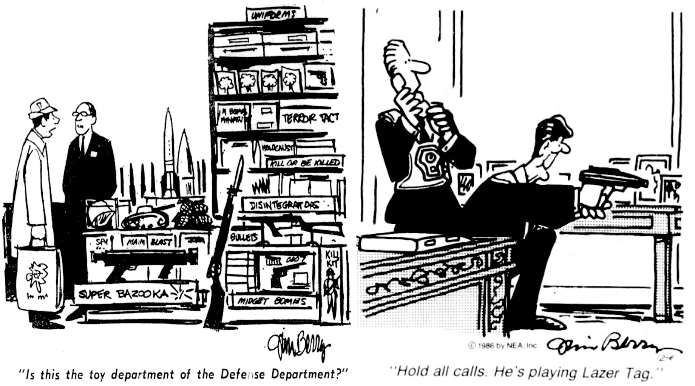
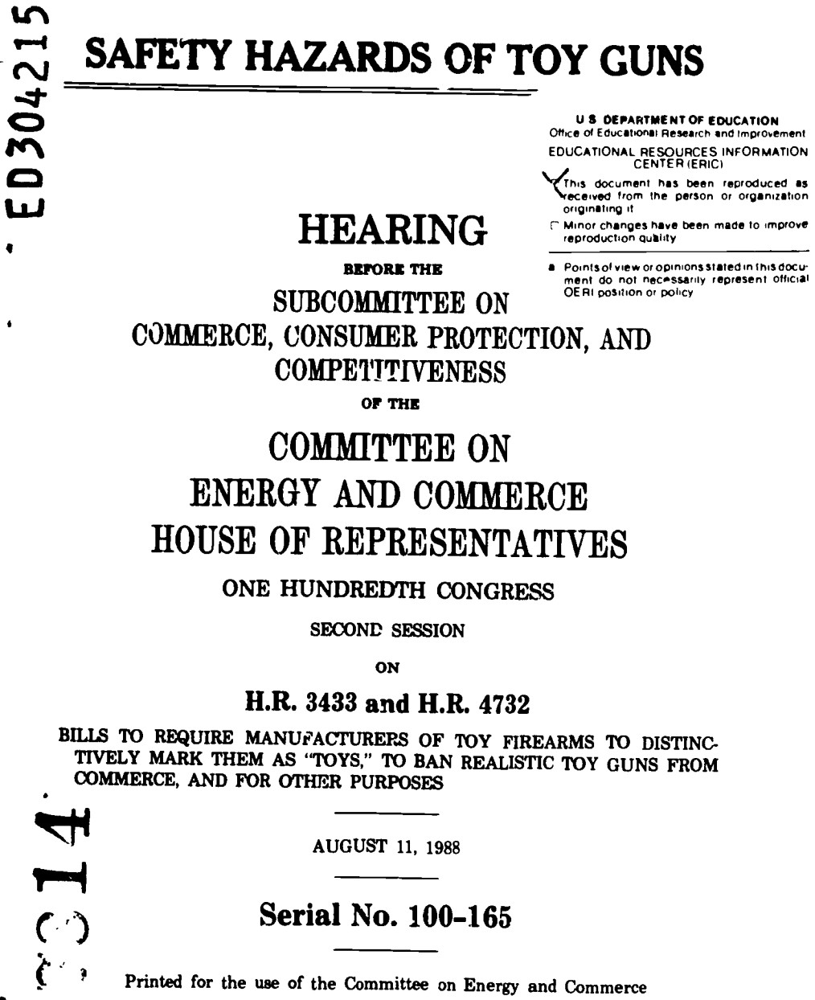
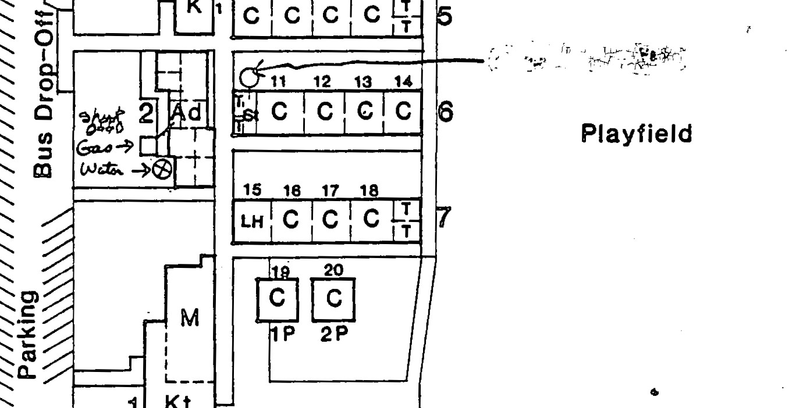
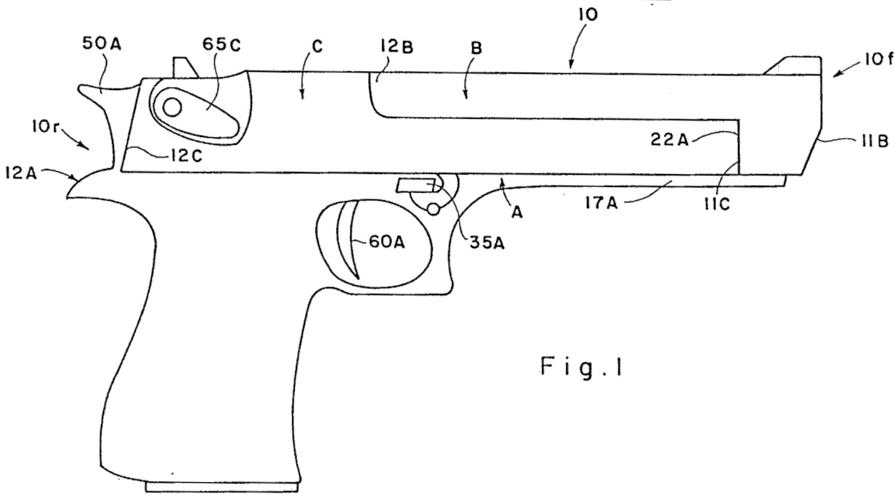
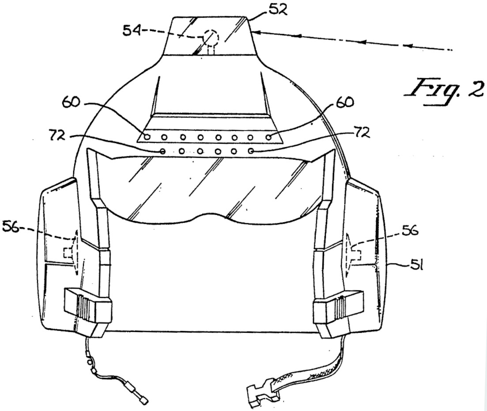
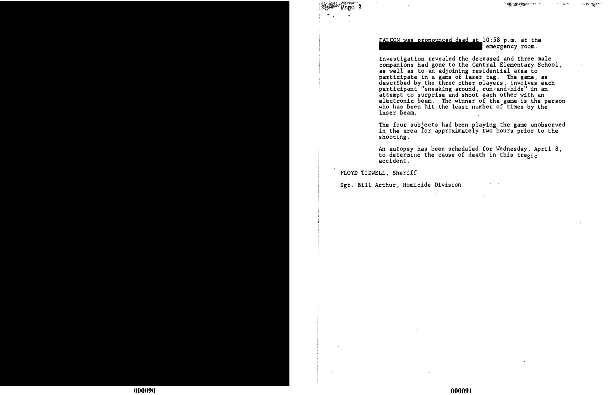
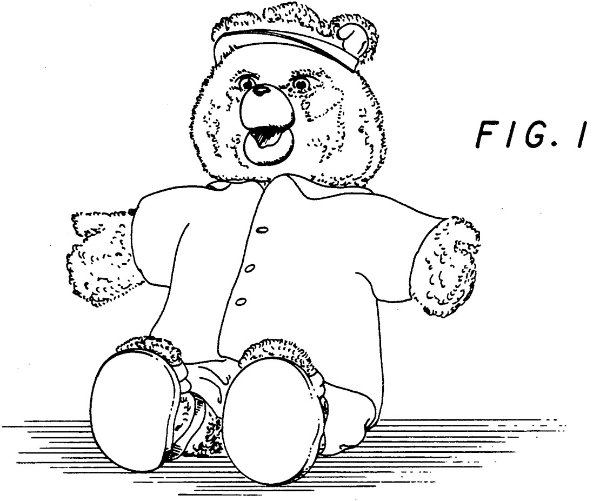
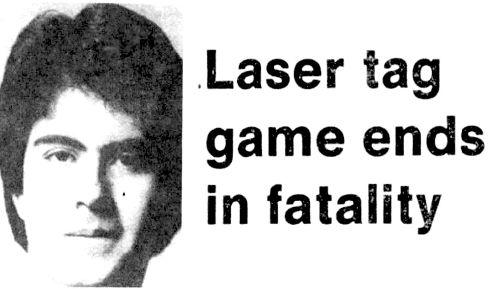

## ON TOY HISTORY
# How the Orange Tip Became a Standard-Issued Toy Accessory
## The Time When a TV Hostage Lobbied Safety Through a Deadly Game of Laser Tag
#Toys, #Law, #Investigation, #History, #Laser Tag

---

*This draft is part of an American Toy Anthology. See this author's announcement, [Undercover Toy Stories](https://medium.com/@solidi/upcoming-book-technical-toy-stories-80d5bfbd76c0): Volume One, for the upcoming publication.*

*What follows contains a troubling scene of a police-involved shooting. This author based the following dialogues on congressional testimony, police reports, and facts revealing how the orange tip on toy guns [finally] came to be.*

---

[August 11, 1988, Washington, D.C.]

**NEW JERSEY CONGRESSMAN** James Florio, aged 51, was leading along a clean-cut middle-aged man who came from the West Coast.

They were in the Nation's Capital, walking into a room where lobbyists discussed an essential aspect of American life.

They were talking about guns.

"David, take a look [as James extended his arm out to a table]." David Horowitz, also aged 51, was neatly dressed. They gazed at a buffet of the finest weaponry Americans could buy.

It was a time before the assault rifle ban and a time when parents (or minors) could gift their loved ones TAC-9s, Uzi's, and real-looking M-16s.

Their looks were intimidating, but they were harmless. Instead of bullets, these weapons fired water, disappearing ink, or infrared.

Parents and kids could also buy new laser tag systems. The two major brands, Lazer Tag and Photon looked like large pistols. They flashed a red light as kids dressed in futuristic riot gear.

James noted the weapons on the table, "D. C. Police brought these weapons of war - *lots of metal*. They had to cart them off the freight elevator."

He paused and looked at David.

 (D-CA) was part of the efforts, pushing for a total realistic ban.](images/93-02.jpeg)

"David, which ones do you think are real?" said James. David picked up two MAC-10s and held them in his hands, akimbo style.

"Oh sh -, look at these. I'll be careful not to point them at anyone," said David. James laughed.

"Rambo got nothing on me," said David. He crossed the guns across his chest. Mr. Florio smiled.

Then David put the guns down on the table and caught a glimpse of a handgun. "Ah, man, I know that one. It's a Daisy."* James nodded.

"That's why you are here," said James. David Horowitz, a consumer advocate from KNBC in Los Angeles, was invited to the Commerce and Energy panel to discuss the ongoing trouble with toy guns.

David smiled and replied - "I was lucky I had my reading glasses on."*

Like clockwork, police mistakenly fired at minors as the teenagers hesitated on how to conduct themselves to commands. These tragic stories brought them together.

And in David's Emmy-winning experiences, he learned that adults used toy weapons for crime.

As congress people looked on, some smiled, and others had blank, grim faces. They were in a subcommittee room. David was about to give testimony on children and young adults who were tragically killed by police.

David sat at the table, prepared his speech, and began reading the record on the "Safety Hazard of Toy Guns." The room's atmosphere became serious.

David looked up at the committee. He said, "What should a parent think about a toy gun these days?"

"You cannot blame parents for being concerned when they read in newspapers, and they see on television that a child has been killed holding a toy gun."

David paused and removed his reading glasses. He then looked down at the table of weapons, focusing on the handgun, experiencing a temporary flashback.

---

DAVID HOROWITZ WAS SITTING in front of a live TV broadcast in Southern California. A man behind him approached, handing him a note.

"Pardon me?" said David.

David was in the KNBC studio when he turned around and saw a man with a handgun. The [television cameras](https://www.youtube.com/watch?v=ZXP43jlbH_o) caught the interaction, as he was on live TV.

"He has a gun to his back," said a news anchor as he slowly inched away on a rolling chair.

"We have someone standing here who would like me to read this - copy."

 by Gary Stollman live on KNBC in August 1987. The handgun was later determined to be a Daisy airgun, a lynchpin to the story.](images/93-04.jpeg)

Gary Stollman handed a letter to David. David calmly and collectively read the statement on the topic of CIA and aliens as Gary shoved the gun in his back.

The TV director cut the feed.

David ended by reading Gary's final statement, "There is no way I can harm anyone with this empty BB gun."

Gary Stollman placed the Daisy handgun* on the table and was then detained.

---

[Back to Congress.]

DAVID PUT HIS glasses back on to read the statement to the committee. The others in the room listened, and Mr. Florio continued to look on.

"The young man demanded that I read a long, rambling statement on the air," said David.

David then signaled to the committee to hand him a pair of TAC-9s. An assistant gave him the weapons.

Mr. Horowitz held on to an [Entertech](https://en.wikipedia.org/wiki/Entertech) water gun in one hand and a real weapon in the other.

"One is real and one is a replica-I mean, in any detail, if a police officer were looking down the barrel of this weapon, would they use the ultimate force and shoot?"

Mr. Florio spoke in and said, "I think the record should reflect that it's very difficult to distinguish the toy from a real weapon . . ."

David then said, "Thank you, Congressman Florio."

"Now, we heard that guns don't kill people, [but] people kill people. Well, toy guns don't kill people either, but [a young man] ended up dead nonetheless."

David took off his glasses again and remembered. He thought back to when he read the police reports of another tragedy.

---

[A spring night, crickets in the background.]

IN THE SPRING of 1987, four friends met in a parking lot. They lived in a place that looked like an American paradise, with beautiful mountains in the background. It was a warm night in a place of extremes - California.

A teenager stepped out of his van and met other young adults preparing for a game of laser tag. Behind them was a school.

A tall young man with bushy hair and wired glasses exited his bright-colored car and approached his friends. He was the definition of an introvert, looking older than his age.

He said, "Hey guys. Are we ready to play?"

The young man looked over the other's equipment, being the best-equipped and most knowledgeable, and noticed something was off.

"What's that over there -?!"

Another teenager held onto a "Photon" unit with a red helmet and pistol. He hurriedly grabbed the unit as he was invited to play.

Photon, a laser tag system, was gaining popularity across the nation. The inventor had developed the concept of laser tag centers called "Photon Arenas." At this point, there were dozens of locations, and centers began to pop up in California-first in Fountain City and then smaller outlets in Fullerton.

And for those that liked the new game, they found open public areas to play.

The young adult said, "It's not going to work with our equipment," as he put on a silver baseball cap with a red blinking triangle. He clipped the StarSensors to a red belt and gripped the large black gun tightly, which resembled an oversized pistol in his left hand.

That pistol was called a "StarLyte."

The other teenagers had the "Lazer Tag" equipment, including StarCaps (the baseball caps), a StarHelmet, and StarSensors, which were red orbs with silver casings worn to register "tags."

 depicts the space age technology and the dystopian aesthetic of Photon Arenas.](images/93-07.jpeg)

The tall young adult said, "Here, take these instead." He handed the player the extra StarSensors and said, "Strap these on and evade! - and leave the Photon stuff in your van."

There was a reply of "Okay, Edgar." The tall young man smirked, knowing it wasn't his name - feeling like a legend with a nickname.

The StarSensors were activated, making loud beeping sounds. Then, it smoothed out, pinging a quiet heartbeat to indicate the player was alive. Each player could take six tags before it sirened, signaling their player's demise.

Then, the tall young man said, "We will be laser champions tonight!" They all chuckled.

So they divided into two teams and played within school grounds. The janitor, working the shift that night, knew of them but thought nothing of it.

They completed one round, and now it was dark.

Later, one team of two bordered the fence line with the laser guns and saw a person walking a dog as they hurried off to avoid tags.

The young man on the second team lay in the grass, watching them and waiting. He attempted shots but missed. One hit-"beep-beep-beep-beep"-went the sensor. Then, they dispersed to the other side of the school.

Minutes passed as the tall young adult found another grassy hiding spot. His sensor was relaying a heartbeat.

[Sound of a car pulling up.]

The young adult walked through the grass, muttering, "Okay, I'll get them through the side."

The young adult ran through the center buildings and met someone wielding a dark weapon at the corner. He fired his toy laser pistol, and the other person racked a shotgun and returned fire-with real buckshot.

The player crouched and bent forward, dazed.

"[inaudible] -." He got back into a stance, not knowing what was occurring. As he came up, the StarLyte followed him forward.

The other person fired their shotgun once more. The victim was hit in the stomach, chest, and arm. He then fell to his knees and then to the floor, lying in pain. His sensor continued with a heartbeat as his wired glasses came off.

At about the same time, another officer commanded in the distance, "Freeze! Drop your weapons!"

That officer across the field was detaining the other players closer to the parking lot. In a moment of confusion, one of the teenagers said, throwing down their StarLyte, "We were just playing a game!" as they lay prone on the grass.

Then, the player who was shot lost consciousness; he bled from his heart and stomach.
The officer involved in the shooting walked up to the young adult and kicked away his StarLyte. The plastic U-cap broke off, and the toy pistol's six batteries expanded across the scene.

In a minute of realization, the officer understood what couldn't be. In desperation, they attempted aid by rolling him to the side and calling an ambulance for the young, tall man with a last statement.

"[inaudible] - ."

An assisting officer arrived and disarmed the deputy, attempting to save the young adult as first responders were en route. The officer who accidentally shot the man then sat in a separate area, realizing what had happened, and broke down, sobbing. They were taken away for questioning.

Emergency workers loaded the player in an ambulance.

Later, detectives arrived and began marking the area with identification placards. They found the StarLyte lying bare and damaged, with its black plastic scattered at the scene.

Buckshot brushed the StarLyte in hand, chipping away its form. And some buckshot landed in a fence bordering the school hundreds of feet away.

And as emergency workers turned the young man's StarSensor off, it stopped beeping. He succumbed to his injuries as he arrived at the hospital.

Four friends played that night, but only three survived.

---

THE MAN WHO died was Leonard J. Falcon. Leonard died from a game of Lazer Tag on school grounds, which he played more than once.

In time, the media reported the deputy's confusion between the StarLyte pistol and a large handgun called the "Desert Eagle."

The *New York Times* [reported](https://www.nytimes.com/1987/04/10/us/toy-laser-gun-brings-death-to-a-teen-ager.html) from a police spokesman, "This kid was in all likelihood thinking he was in the game and that this officer coming around the corner was one of his opponents."

Later, a sheriff's investigator reported to the Associated Press that all players were "clean-cut young men" with no evidence of drug or alcohol use.

Worlds of Wonder, the maker of Lazer Tag equipment, provided no comment on the incident. And all responding officers from the first car at the scene [resigned in the following years](https://bjs.ojp.gov/media/document/17586) - because of the trauma inflicted by the horrific event.

---

MR. HOROWITZ CAME BACK from the nightmare, finding himself at the congressional table. He stumbled and shook a little.

"[The] Deputy fired a second round. As [they] brought the shotgun from hip to shoulder, took aim at the man's face, and at that time, the subject said . . ."

"**Please, don't shoot me. It's just a laser gun.**"

David paused, about to crack, but maintained composure. He took off his glasses again.

The room went silent as people coughed. For a minute, people felt the absolute pain of the Falcon incident.

Then, placing his glasses back on, David explained other tragedies in America [of which there are countless stories]. Mr. Horowitz performed his somber homework - reading police reports and relaying to the subcommittee that the government must prevent future tragedies.

Even in his pending demise, David did not single out Daisy, who had been the maker of a toy gun that was shoved up his back, confused as a real weapon. At a similar moment, everyone thought it had the power to take a commentator's life - as two anchors and tens of thousands watched the live event.

David's testimony moved Congressman Florio, and then, before Mr. Horowitz completed his speech - he said, "Excuse me, Congressman Florio. Before I leave, could we thank the D. C. police department . . . providing us these real weapons."

Mr. Florio nodded.

David quipped. "I'm going to let them return their real guns as I get my toys."

"And it's time to *fight back*," said David.

---

EVENTUALLY, THE GOVERNMENT passed legislation requiring orange markings on toy guns in 1992. However, it came after repeated attempts by interested parties and in written opinions from authors like toy critic [Edward Swartz](https://medium.com/@solidi/the-fisher-price-action-garage-15b6a9556e2a).

The Department of Commerce and Consumer Product Safety Commission enforces this law today.

What is clear is that Mr. Horowitz's testimony assisted society in understanding the dangers of realistic toy guns and applied pressure to a conclusion.

While [Senator Bob Dole](https://en.wikipedia.org/wiki/Bob_Dole) is credited for the push on the toy gun legislation amendment, to this author, David Horowitz is the last critical person who made the law real- and to find that he relayed the story of Leonard [among others] was crucial in toy history.

And the KNBC video, deemed "bizarre" by the Internet, is an essential [sociological artifact](https://www.youtube.com/watch?v=ZXP43jlbH_o) of American society.

The spear of the orange tip came before America because a deranged individual forced a commentator to read about Aliens and the CIA. At the same time, David thought his life was about to end - by a then-unknown Daisy handgun - live on TV.

This author theorizes that if Gary Stollman had used another air gun for David's false imprisonment [for which he later served three years probation], manufacturers would have dragged their feet on supporting a compromised measure.

Instead, the result is a standing federal law applied to all, and David Horowitz would go on to champion the removal of real toy guns in America.

The orange tip was born of heavy compromise, as Mr. Horowitz sought a total toy gun ban with California congressman Mel Levine and California state legislator [David Roberti](https://www.nytimes.com/2014/12/21/magazine/off-target-on-toy-gun-regulation.html). While the measure was not a panacea for rectifying social wrongs, and with perpetual questions of effectiveness, visual indicators aided a little safety after expending taxpayer dollars.

When the orange tips arrived, the toy manufacturers of Lazer Tag by [Worlds of Wonder](https://en.wikipedia.org/wiki/Worlds_of_Wonder_(toy_company)) and Photon by LJN failed. They took licks from the market crash in 1987 and the bad publicity of real-life interactions - including what was happening on Capitol Hill.

In between, World of Wonders, which produced the iconic toy [Teddy Ruxbin](https://patents.google.com/patent/US5074821A/en), made a desperate move: they cast the StarLyte pistol in [white instead of black](https://brian.carnell.com/articles/2008/not-all-improbable-events-are-urban-legends/) as Daisy dipped barrels in orange before laws of compliance.

Convergence of one standard was necessary, and Daisy made the introduction. If this author had to guess the origin, perhaps [hunter-vest experiments](https://www.onxmaps.com/hunt/blog/hunter-orange) of the 1960s influenced the marking [although this author could not verify how it happened within Daisy.]

Without federal law, manufacturers would return to what others did not want to do, as apparent in their attitudes in their letters of opposition to Congress at the time.

Mr. Falcon's homicide case followed an immediate internal police investigation led by a California district attorney, who cleared the deputies of any wrongdoing in the incident within a month.

What remained was the pain inflicted on all parties, which disrupted their lives forever.

Even after bankruptcy, a 1994 civil lawsuit was brought to the gutted Worlds of Wonder for the death of Leonard Falcon. However, after a short deliberation, the jury found the manufacturer not guilty of any wrongdoing.

Additionally, Sheriff Floyd Tidwell, then chief of the San Bernardino County Police, wrote a summary report of the Falcon tragedy as it happened and commented to the press.

A contemporary sheriff spokesperson told *The Los Angeles Times* that Leonard fired his StarLyte a *second time* after the initial unannounced volley from police. However, this action could not be found in the redacted public record.

And back in Congress, Mr. Horowitz dared to place Mr. Falcon's last audible quote into the halls of the democracy of the people. He read from the typed homicide report, reliving the pain of the unthinkable.

---

THE LASER TAG SYSTEM, which included the improvement called MILES, was an original invention of the US Navy. Albert H. Henry's inventions and patents led to its creation. The system was designed to train soldiers to fight without lethal consequences.

.](images/93-14.jpeg)

After Mr. Henry developed weapons of war, such as the TOW wire-guided personnel missile launcher, which was enigmatic in global politics of the 1980s, he was awarded the [Meritorious Civilian Service Award](https://www.simulationinformation.com/hall-of-fame/members/albert-henry-marshall/).

The MILES technology was reimagined and commercialized by [George Carter III](https://en.wikipedia.org/wiki/George_Carter_III) by watching Star Wars, who was the "brainchild" of a property called Photon. Partnering with toy manufacturer LJN made Photon a commercial success.

Their product contained no lasers; instead, they used customized infrared electronics, similar to remote controls for TVs.

During the mid-1980s, Worlds of Wonder invented a system called Lazer Tag, which had a similar connection to Star Wars fantasy. Finally, Mattel and Hasbro campaigned laser-type toys with their action figures, BraveStarr and GI Joe. Taiwanese product groups attempted to "share the wealth" by launching their systems.

But after Mr. Falcon's death, among the endless gun violence stories [also relayed by David Horowitz], the laser tag wave abruptly ended, which was accelerated by a market crash.

Photon Marketing Ltd. would have IPOed in 1987 but also felt the turbulence. Mr. Carter sold the entity [in 1989](https://www.youtube.com/watch?v=Re5KheC_KbY), and the name passed hands. It survives as a [Tencent Gaming](https://en.wikipedia.org/wiki/Tencent_Games) property.

And in toy stores like Toys R Us, wooden rifles obtained orange tips. Into the new century, long rifles disappeared and were replaced by bright plastic to exceed federal law and meet local city legislation.

Later, entrepreneurs in the United States imported laser tag businesses like [Q-ZAR](https://en.wikipedia.org/wiki/Q-ZAR) and other franchises, which superseded Photon Arenas. This author surmises the laser tag revival occurred because time healed the perception problem [or people forgot them].

 of the later 1990s. The toy had an orange tip. Jakks Pacific bought out the failing Long Island based company in 2002.](images/93-15.jpeg)

Today, laser tag has found its place in modern society along arcades and higher-paid event arenas. As historians looked back, Mr. Carter was fundamental in pushing for infrared tech. He was recognized by the International Laser Tag Association as the "inventor and founder of the Laser Tag industry" in 2005.

Now, there are troubling trends about [mixing bright paint on real guns](https://myfox28columbus.com/news/local/police-warn-that-orange-tips-no-longer-mean-toy-gun) and stories of youths receiving airsoft guns without orange tips [or that were later removed by customers.]

These countless stories have horrific endings, such as the 1987 case of Marcus Norris in Memphis, Patrick Mason in 1983, and the 2014 [Tamir Rice](https://www.news5cleveland.com/news/local-news/a-look-back-its-been-10-years-since-tamir-rice-was-killed-by-police) case in Cleveland, all involving conversation of physical markings, the demarcation of toy and real guns, and police officer behaviors and actions.

Further legislation to combat modern societal failings, increased police awareness, and where to draw the line on toys and airguns remains unclear.

And the color of international orange [or blazed orange] has become symbolic not just of toy guns - it means [ending all gun violence](https://www.bradyunited.org/resources/campaigns-toolkits/wear-orange). As each year passes, retailers like Walmart have stopped selling toy guns.

For those that manufacture them, they are fluorescent and make every attempt to avoid confusion.

---

LAZER TAG WAS the invention of Worlds of Wonder, originating in 1986. A year prior, their first smash hit was Teddy Ruxpin. The talking toy doll achieved over 100 million sales within six months, making it the fastest-growing start-up in the world, explained toy industry veteran David Small in a [2020 inventRight interview](https://www.youtube.com/watch?v=wsKtgW8ttwU).

And Lazer Tag became World of Wonder's second smash hit. Paul Rago, a key person within the company, interviewed by the New York Times in 1988, revealed the origins of Lazer Tag - "tapping his pencil, in and out of a beam of sunlight through the window."

Further from Anne Zusy's article, Rago said: "[Lazer Tag was] Star-Warzy, all of those people have seen in the movies and TV that they always wanted to do . . . like throwing a lighting bolt."

World of Wonders felt the pain of the Falcon incident and the market crash in 1987. But Lazer Tag, with a "Z," survived all of it. It remains a trademarked property of a decorated independent toy invention company, [Shoot the Moon Products](https://www.stmproducts.com/), which sells concepts to manufacturers.

And "[Laser Tag](https://lasertagmuseum.com/indoor-laser-tag/indoor-time-line/2020s/) proper" lives on. In the last decade, inventors created and licensed a 21st-century integrated laser tag system for buyers of game arenas. One flagship outdoor rifle system is called the "Tagger FALCON."

Stock footage of impulse-recoil "FALCON F1" and "FALCON F2" rifles can be seen in a 2022 episode of [The History Channel's Toys That Built America](https://play.history.com/shows/the-toys-that-built-america/season-2/episode-7), which commented on the Lazer Tag tragedy.

. The toy is a postmodern water gun that contains bright plastic dyes and an orange tip. It sold millions of units, according to the [History Channel](https://play.history.com/shows/the-toys-that-built-america/season-2/episode-7). The toy series became a permanent part of American culture. Today, Hasbro owns the property.](images/93-17.jpeg)

It is unknown if the Tagger FALCON laser tag system is named in honor of Mr. Falcon, a former Key Club member and 19-year-old electronics student who died playing the game with friends on April 7th, 1987, in Rancho Cucamonga.

Either way, Leonard's name lives on through the play of others, which [if true] is a comforting salute and a quiet memorial.

---

SO WHEN THIS author asked, "Where did the orange tips come from?" Well, from tragedies, of course. Perhaps a profound meditation on the subject can be found in academic [textbooks](http://www.jaclynschildkraut.com/publications/books/guns-in-american-society/), but this writing is of rich physicality centered on toys.

The story of toy guns and American society is vast, and there were periods of moratoriums on toy products that go back a century. As American assassinations and Vietnam-related incidents ham-strung a generation, [victory culture](https://www.amazon.com/End-Victory-Culture-Disillusioning-Generation/dp/155849586X) waned, and so increased the objection to toy guns.

And into the 1980s, legislation was destined-as manufacturers provided hyper-realistic toy guns. Compounding the issue were laser tag systems, misunderstood by a society that hadn't caught up to acceptance.

This author's research quickly revealed a natural vindication. At the precipitous of actual federal toy gun legislation, Leonard's story pushed Congress to act, crossed by a TV man who thought he would die - and forced the lobbyist's hand by bringing Mr. Falcon's dying statement to the record.

Jammed in a macabre of pretend, buckshot, a safe place, and the irony of Leonard's orange car that detectives walked from to the fatal scene, it was inevitable that his death wasn't forgotten.

Somehow, his memory would go on to protect those who wanted to play without the shiny, sleek veneer of war.

Mr. Falcon died innocently doing what teenagers thought was cool back then. And David Horowitz was a hero who stuck supreme toyed light where power lurks, forever attaching blazed orange to toy guns sold in America.

---

* *The Daisy handgun used in David Horowitz's false imprisonment was confirmed in 1989 by an AP press reporter in "Consumer Advocate Continues Toy Gun Fight." Mr. Horowitz appeared on children's shows during that era and was a 15-time Emmy winner.*
