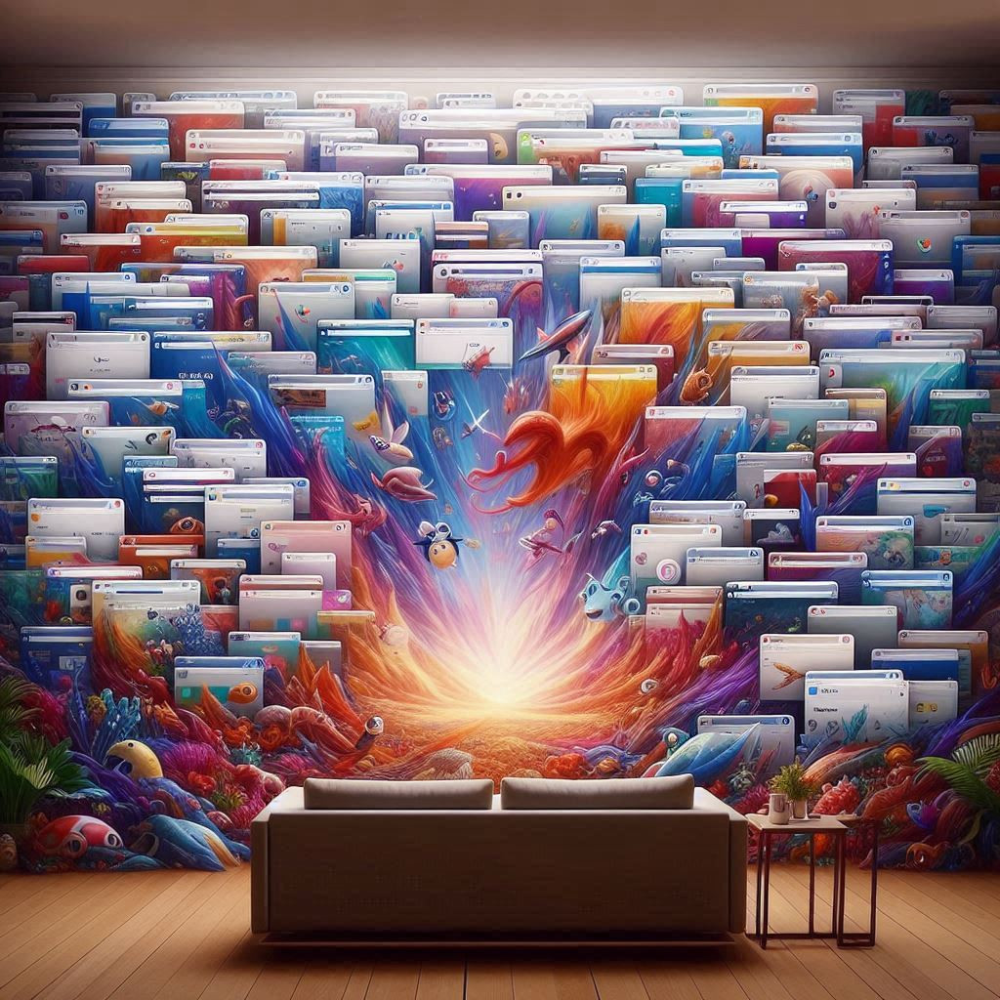

## DIGITAL LIFE
# Don't Be Afraid to Close Your Tabs
## One Second of Sanity in a World of Information Hoarding
#DigitalLife, #Technology, #Social, #Browsers, #MentalHealth

You're on a web conference, demonstrating hard work to peers. To communicate your intricate work, you share a beautiful screen. And all your lovely little tabs.

"Look at that!" Seventy-seven tabs are dancing, distracting from the work presented to the stakeholders.

Then you stumble to find a new tab, "Which one is it again?" So you shimmy a mouse pointer to the right, not knowing where that tab went.

Or perhaps you are alone, logging into a website. The expectation of its smooth operation erodes, and the browser chokes on the glut of your tabs. So you hope that something will work - "Please, no. NO. I will not blow my tabs away."

You'll bargain, closing some and jettisoning others to a bookmark manager, but it's not enough!

And then comes the day the browser demands an upgrade. You must comply- and eventually, you give up. "Okay, I'll follow through."

Then, you throw up your hands and restart your browser to find that it *failed* to restore the tabs.

"Wait, those were so important - !" Panic sets in.

This social problem is so ingrained in everyday life that every browser developer has placed *more* than one gentle notice. "Yes, your tabs will return. We promise."

Yeah, right.

---

This is your life in a time of tab hoarding. And as [Nicholas Bamonte](https://differentbrains.org/adhd-and-tab-hoarding/) of *Different Brains* reports:

> *"So, you keep the tab you've already finished open, just in case. This is called loss aversion, the fear of losing things, either new opportunities to learn or enjoy something, or of losing something that you already have."*

Indeed, *canonical loss* can strike fear into the hearts of technology workers, administrative assistants, artists, and everyday people.

But there is hope.

This author discovered a path out of the madness. Today, he proclaims that tabs will no longer rule his screen. The real estate above the URL bar will be precise, and his focus will be on *one task.*

He whispered, "Today, I am not afraid."

At a tap of a button, this author closed all his tabs, letting go of the digital baggage of learning and those seventy-seven tabs this author will never revisit. Then, he proceeded to do the same on his mobile phone.

Relief is here. In the words of [Ali Jaffe Ramis](https://www.nytimes.com/2023/10/24/magazine/browser-tabs-forever.html) of the *New York Times*:

> *"Keeping those tabs open is a practice that connects me to my intentions, big and small . . . Sometimes I click through my tabs just to remind myself what's there. Oh, right - you, old friend!"*

Now, this author's *friends* have permanently left his screen, as his real friends have since left his life.

This author whispered, "Goodbye, tabs - ." And so he is now searching for his first new friend. It's time to start fresh.

All the memories of failed relationships-that unending research project, abandoned shopping expeditions, and weird health searches-were part of his everyday routine.
Now, there are none.

And so, this author started again, repeating the cycle of hoarding beautiful tabs - but not on purpose. It's a slow seep of slipping on the discipline of letting go to holding on.

"No, I'll keep this one," and so the new tabs are safe to multiply again on the screen - from one to seven to seventy-seven.

## Social Post

Stefan's comment captures it perfectly: "Tabs are like bookmarks—except bookmarks are where browser memories go to die." 

In our digital lives, managing tabs effectively can enhance our efficiency but cause friction. It's a reminder to regularly evaluate what's important.

For further insights, check out this article: https://medium.com/@solidi/dont-be-afraid-to-close-your-tabs-d709e57dda5f. 

#digitallife #efficiency #technology #mentalhealth #browsers #tabs #memory
