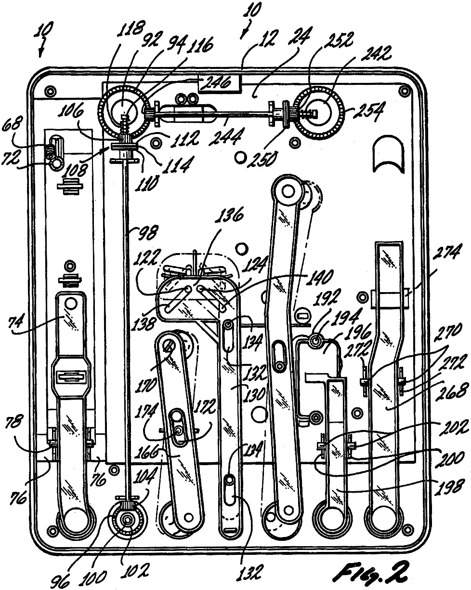
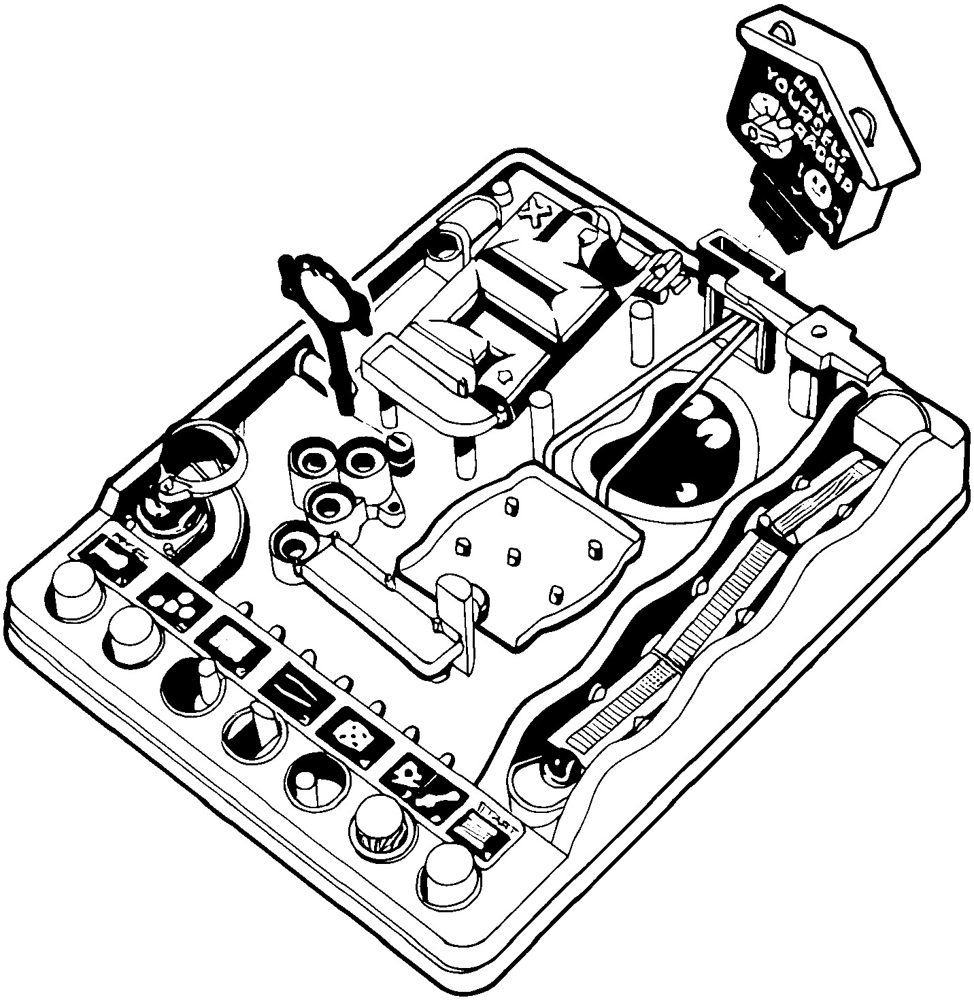

## ON TOY HISTORY
# The TOMY Screwball Scramble
## Precise Balls of Steel on a Sea of Tricky Slick Plastic

 of the Screwball Scramble was filed in 1979. The Associated Press described it as "a challenging game, based on a clever concept."](images/95-01.jpeg)

---

*This draft is part of an American Toy Anthology. For information on the upcoming publication, see this author's announcement, [Undercover Toy Stories](https://medium.com/@solidi/upcoming-book-technical-toy-stories-80d5bfbd76c0): Volume One.*

---

"THIS THING HERE - right - Screwball Scramble [pointing to the gameboard]. This was the sh - ."

[Drinks On Me](https://www.tiktok.com/@drinksonmemusic/video/7389248243676269857) from the UK passionately reviewed a childhood game to his TikTok viewers. His video chalked up over fifteen thousand views as he demonstrated scoring on the tricky gameboard, delivering a hilarious analysis.

"Now we come up to the most dogsh - bit of this whole thing [pointing at the maze piece] . . . But the reward when you got to this bit. . . just smashing this button." He was pointing out the catapult at the end.

And there was captainepeper on [Reddit](https://www.reddit.com/r/playmygame/comments/13jhg9d/i_made_a_web_game_version_of_screwball_scramble/) who replied to a thread, "I would love some feedback!" posting an impressive website called [screwballscramble.net](https://screwballscramble.net/). The developer carefully rebuilt the plaything as a virtual game.

After positive reviews, the inevitable occurred. TOMY asked them to cease their unlicensed in-browser adaptation. "Yup, I got asked 'nicely' to shut it down," replied captainepeper.

Reddit users were disappointed as the passionate side project vanished. However, [videos](https://x.com/FreeGamePlanet/status/1660745204549255168) of the recreation remain online.

In the United States, Michael from [Vsauce](https://en.wikipedia.org/wiki/Vsauce) recently [reviewed the game](https://www.youtube.com/watch?v=PF9prMWA7_I), stressing the correct size of the ball used in Screwball Scramble.

He said, "I love mechanical toys that require no batteries." Michael described parts of the game, then gazed at its iconic magnetic steel sphere.

"A lot of you people are thinking, 'Ah, what is that, a ten-millimeter ball? A twelve-millimeter ball?' [Laughs] Wake up! It's a *fourteen-millimeter* ball."

This author confirmed his steel ball measures 13.98 millimeters and weighs 11.34 grams. The timer's average run length is about 53.4 seconds.

Michael went on. "I have studied the ball, and this is all I ever see [the catapult launches the ball, hitting the bell, signaling the end of the game.]"

Michael's video on Vsauce received over twelve million views. Even if the conversion rate is less than half a percent, it will positively impact TOMY's balance sheet.

But whatever is posted online, Screwball Scramble's timescale is impressive, spanning fifty years. Within an old plastic plane with eight activities and seven toggles, a player is challenged to move a steel ball bearing across the board without dropping from its elevated path.

Not much on the gameboard has changed.

 of the Screwball Scramble, released in 2020.](images/95-03.jpeg)

It's an ingenious [ball-in-a-maze](https://en.wikipedia.org/wiki/Ball-in-a-maze_puzzle) puzzle that has survived generations of children. Today, the sport is celebrated by scores of players and gifted to their loved ones- such as Rachael, who posted a [Symths review](https://www.smythstoys.com/uk/en-gb/toys/pre-school-and-electronic-learning/tomy/screwball-scramble-game/p/100167) giving Screwball Scramble four out of five stars.

She replied, "Fun for young and old . . . [my grandson was] frustrated with the wobbly bridge as [it] takes a little practice . . ."

Screwball Scramble has potential untapped viral potential, and this author agrees that the touchy bridge requires precise timing.

The secret is to push the bridge button twice at a constant rhythm, then hit the lever a third time at twice the speed to pop the ball up to the crane.

---

## The Product History of Screwball Scramble

THE PLAYTHING MAKER, Tomy Company Ltd, also known as TakaraTomy in Japan, invented and patented the novel concept in late 1979. Screwball Scramble was released as "Athletic Land Game" in Japan.

That same year, the game was released in the United States as "Run Yourself Ragged," which remained unchanged for seven years. When Coleco took over Tomy distribution in [1987](https://www.youtube.com/watch?v=zxUejWtqKIA), the unique [dexterity puzzle](https://en.wikipedia.org/wiki/Mechanical_puzzle) was reboxed as "Screwball Scramble."

For forty years, the name has stuck permanently with customers in the West. And who came up with the toy name is a mystery.

At a similar time, TOMY sold the product [in the United Kingdom](https://www.youtube.com/watch?v=7SNEkh_duxM). While its historical sales data is elusive, today's YouTube reviews demonstrate the impact of the culture of gameboard players-viewers can find a clean split of British and American videos.

 of the Screwball Scramble, released in 2023.](images/95-04.jpeg)

In the 1990s, TOMY changed the color scheme of the toys from brown and orange to primary colors, blue, green, and red. Screwball Scramble adopted the color pattern, and in America, the name changed to "Snafu" in 1992. The moniker was later dropped by the company.

While product names come and go, TOMY is consistent for its intriguing toy engineering. Jeff of [jeff-z.com](https://www.jeff-z.com/pinball/toys/ryr/ryr.html) said, "In typical TOMY fashion, the inside of this mechanical game is as interesting as the outside."

Jeff's review is spot-on. TOMY is a pioneer of mechanical inventiveness, as seen in their toys like [The TOMY Big Loader](https://medium.com/@solidi/the-tomy-big-loader-351139832616).

Screwball Scramble remains anchored in [nostalgia](https://www.newspapers.com/image/1028412549/?) next to toys Scalextric and TOMY's Waterfuls, a water-based game where a player teases floating rings onto pegs with the push of a button.

---

## Speed Runs and Modern Updates

"THE FACT THAT I discovered this random game thanks to a Vsauce short and immediately told myself 'hey this is speedrunable' and went to check if anyone had done so says a lot about our society," said zubaydi on Reddit.

As a viewer of Michael of Vsauce, zubaydi discovered that the world record for Screwball Scramble is [8.5 seconds](https://www.youtube.com/watch?v=MG7O5kdZLVY) - without illegal operations or moving the board while playing, which Martinon [employed](https://www.youtube.com/watch?v=n6Xej67Wf5k) in his impressive hacked 4.14-second speedrun [and [this one](https://www.youtube.com/shorts/Lwjt4Vacq-k), too].

x-productions5456 replied to zubaydi's thread - "I'm so glad this exists." Due to the recent interest in the game, this author believes someone will break the record soon.

But hold on. The video above was bested (and with the hoop) at [7.3 seconds](https://www.youtube.com/watch?v=ZmSki67BrQE). And while these are recorded truths, they are not official. As of October 2024, the [recognized](https://www.guinnessworldrecords.com/world-records/fastest-time-to-complete-the-screwball-scramble-game) record is [17.5 seconds](https://www.thecomet.net/news/24686069.stevenage-boy-breaks-screwball-scramble-world-record/).

Speed records aside, customers can purchase the game in its original format today via [Amazon](https://www.amazon.com/TOMY-T7070-Screwball-Scramble-Game/dp/B00005M22M) [while publishing, it was out of stock!]. In addition, TOMY offers two alternative configurations. The first was released in 2020, labeled Screwball Scramble Level 2, an extension that requires an element of luck to complete in time.

 of a TOMY game concept, issued in late 2024.](images/95-05.jpeg)

Now, players can connect both Screwball Scrambles, increasing play time, difficulty, and, most importantly, enjoyment.

TOMY kept its steel ball rolling. In 2023, a third version was released. The game is called [Screwball Scramble Level Up](https://us.tomy.com/screwball-scramble-level-up/), adding a vertical element and a unique set of controls. An alternative [unreleased version](https://patents.google.com/patent/EP4306189A1/en) can be seen in a European patent.

And yes, [all three](https://www.youtube.com/watch?v=arTc9vuCEQk) Screwball Scramble boards can be linked together using TOMY's [unique linking accessory](https://www.takaratomy.co.jp/english/product_release/pdf/p230131_en.pdf).

Finally, a Japanese patent was recently issued to TOMY. This author suspects it's an unreleased Screwball Scramble layout [or a compact Japanese version]. There isn't information about the new design, but *the thought* of a fourth-game version is wild.

---

## Screwball Scramble's Analog Legacy

FROM THE OFFICIAL product review from the original packaging, "[Screwball Scramble is] a game of skill, coordination, and quick thinking."

"Set the timer, then struggle across the tilting walkway, strain across the parallel bars, and slide over the unstable table. Then bounce over the tire obstacle, swerve through the blind maze, and spring through the catapult to land the ball on the bell."

Screwball Scramble is a rare toy that has survived the digital age - from video games to the Internet and the advent of mobile phones to the modern shift of toy manufacturing from [China to India](https://economictimes.indiatimes.com/news/international/business/toy-manufacturers-shift-from-china-is-no-childs-play-as-countries-struggle-to-match-up/articleshow/106880581.cms?from=mdr).

In the 2020s, the game has sold over [one million units globally](https://www.takaratomy.co.jp/english/product_release/pdf/p240131_en.pdf).

It's an enduring analog legacy.

The maze thrives into the 21st century as voices on the Internet echo their love and admiration. And with new patented extensions filed as this document is written, Screwball Scramble is a toyed miracle.

Screwball Scramble was designed by Masaaki Yoshimura and engineered by Takao Matsumoto within TOMY. It remains a secret of how its initial contraption came together.

If there is one product suggestion from this admiring author, the request is to make the enclosed maze semi-transparent. But perhaps it's the perfect mind-bender as is- for the past half-century.

In 2022, [TOMY reintroduced](https://www.takaratomy.co.jp/english/product_release/pdf/p220201_en.pdf) the Screwball Scramble to the world. Their domestic product contains a paper insert that outlines the eight challenges and includes a review by a professor emeritus at the University of Tokyo, Toshiyuki Shiomi.

Mr. Shiomi gives a warm review of the product on the sheet. Translated in English, he said, "[In Screwball Scramble] repeated attempts, even if unsuccessful, inspire us to develop resilience, which is the spirit of persistence and never giving up, something that today's society needs."

---

*If you are a TOMY enjoyer, you'll love this author's [Big Loader](https://medium.com/@solidi/the-tomy-big-loader-351139832616) write-up, too.*

---

## Social Post

If you like ball-in-maze #puzzles, you'll enjoy the #TOMY #Screwball #Scramble. This #toy game is close to my heart as it was a part of my childhood. And naturally, I wanted to write something #technical about celebrating its #engineering.

What sets TOMY's Screwball Scramble apart is its modern focus. Recently, the product scored tens of millions of views due to a well-established YouTuber, Michael of #Vsauce. And if you dig a little under the surface, there are countless stories of its admiration, and some have attempted to recreate the experience digitally. The product's success continues as it expands on the Internet and into its fifty years.

In writing this draft that will eventually appear in a toy history book, I contacted #TheStrongMuseumofPlay for a cursory look at its history. Still, there wasn't much material as I suspected.

So [what follows](https://medium.com/@solidi/the-tomy-screwball-scramble-9f4eab3681da) is just a tiny part of its #history.
