## ON TOY HISTORY
# Micro Machines: A Small Chronicle
## When Galoob Created Magical Finger Food for Boys

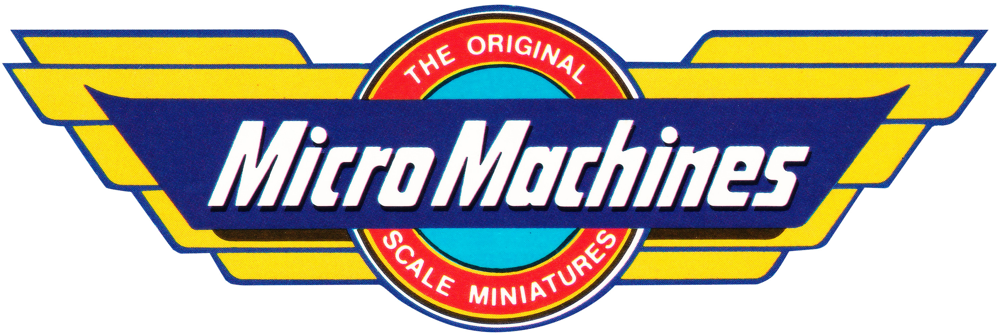

---

*Read to the end to learn about a never-before-written connection on the competition between **Hot Wheels** and **Micro Machines!***

*Also, check out this author's book, Undercover Toy Stories: An Anthology of Real American Inventions, [available now](https://www.amazon.com/Undercover-Toy-Stories-Anthology-Inventions/dp/B0FR9RVRVH).*

---

## There Was Once a Toyman From Oklahoma

**GALOOB, THE MAKER** of children's toy paraphernalia, was booming in the 1990s. America was, too. Galoob was led by a small team of executives, the best in the industry. And so was America, fresh off the victory of the Persian Gulf War. It was at this time that Galoob made the best toys by a crack design team, as President Bill Clinton paid back America's national debt while he smoked cigars at the Resolute Desk.

At this time, ". . . the Gulf War, short and televised, had accelerated sales of military toys . . ." [wrote](https://www.simonandschuster.com/books/Barbieland/Tarpley-Hitt/9781668031827) Tarpley Hitt in *Barbieland*. To Galoob, the success of Micro Machines fused both concepts, TV and war, achieving a short-lived commercial "victory," a reflection of American society.

Galoob, then operating as a "vertical disaggregated" company, caught the media's attention. Jim Brooks of the ** wrote, "It is interesting that smaller toy companies . . . Galoob . . . have been most aggressive in bringing out new 21st-century toys."

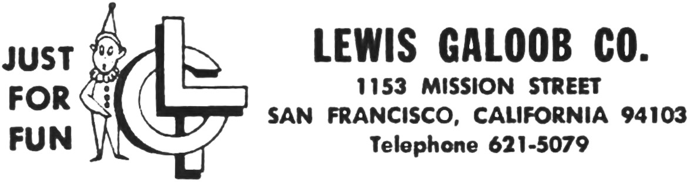

Thirty years earlier, Galoob had neither toys nor TV spots. It was Lewis Galoob, the company's founder, who began changing the lives of American children. He journeyed from Healdton, Oklahoma, [after the war](https://www.newspapers.com/image/871989744/), leaving his family's ironworks behind.

Starting a lineage in San Francisco, California, he entered the enthusiastic sales business, selling [weatherproof pocket lighters](https://www.newspapers.com/image/458243191/) and stationery wares by 1957. Then he collected, categorized, and hocked toys to salesmen and jobbers with his wife, Barbara.

Mr. Galoob also dabbled in screenwriting, developing a script called "[The Toy Salesman](https://www.newspapers.com/image/382327800/)" with eventual director of *Star Trek: The Next Generation*, Robert Scheerer. That script is lost to history - but through his sons, toys would become his legacy in name.*

---

## Hollywood Was Their Dream-But Sold Toys Instead

**LEWIS GALOOB COMPANY**, founded by the very man, was located at 1153 Mission Avenue in San Francisco. Lewis set up a trading company while collecting and distributing toys to buyers in the industry. During his ascent in the 1960s, his name appeared in the *San Francisco Examiner*, the area's official record.

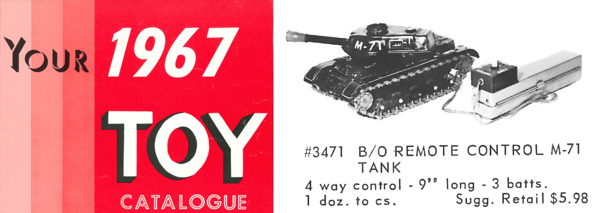

The host of the YouTube channel *Epic Badger Games & Toys* [said](https://www.youtube.com/watch?v=FWK8rR6h9IA), "This was definitely the time that [Mr.] Galoob wasn't directing anyone in making the toys; [he was] going to toy fairs where people were making the toys and then selling to toy companies."

In 1967, when trading through third parties in Japan, Mr. Galoob had to deal with dangerous toy monkeys after synthetic fibers accidentally [caught fire](https://www.newspapers.com/image/842587644/). A year later, Galoob officially incorporated as Lewis Galoob Toys, Inc.

Some years later, Lewis suddenly passed away. His son, David Galoob, took over the business in 1971, with his mother, Barbara, as chairwoman. Twenty-one-year-old David found himself at the helm of a budding corporation, wearing thick glasses, supported by his brother, Robert. David was a cinematography major, and, like his father, who wanted to make movies - a Hollywood dream - he sold toys instead.

 recently reviewed Galoob's 1973 catalog. Above is the kitsch Funky Monkey.](images/96-04.jpeg)

David Galoob learned the ropes of toy sales early on. For example, Mr. Galoob once [said](https://www.newspapers.com/image-view/632874625/) to reporter Joyce Rosenberg, "[Galoob must have] a constant flow of products to survive." And his brother Robert knew that ". . . [Their] business is one of relationships," reported by J. W. Wilson of *Businessweek*.

Throughout the 1970s, mercurial David Galoob rode that flow, trading toys and distributing a variety of wares to the industry. Whimsically curating a set of playthings year-over-year, David's team made controversial picks: Drinking Bear - a doll with an animated bottle of beer; Funky Monkey, a plush with crazy eyes that spun; and the infamous Miss Sexy, a proportionally correct, naked rubber doll.

As the decade dragged on, David Galoob offered electronic, miniaturized pinball games. In 1976, Galoob grew, specializing in collecting and distributing the first wireless remote-control toy cars from Japan. In 1982, Mr. Galoob began toy licensing efforts under the Smurfs. "Military toys . . . and [those] Smurfs . . . are getting strong," [said](https://www.newspapers.com/image/233910816/) David to *Sun-Sentinel's* Kathy Rayson.

In 1984, Galoob became a "vertically disaggregated" company, [according](https://books.google.com/books?id=oUw1AAAAMAAJ&focus=searchwithinvolume&q=%22vertically%22) to *Businessweek*. They went public, offering [1.25 million shares](https://www.newspapers.com/image/959930550/) at $10 each. Galoob brought in a new team of inventors and began manufacturing toys under its banner. Their biggest hits were a truck-with-claws called The Animal, A-Team action figures in the same format as *Star Wars* toys, an animated infant called Baby Talk, Blackstar characters, Punky Brewster, and [General Patch](https://www.youtube.com/watch?v=Lm7mNqsuSlQ), among others.

"[General Patch] was designed to be a cash-in on the hugely successful G.I. Joe . . ." said [8ByteBrian](https://www.youtube.com/watch?v=Lm7mNqsuSlQ) on his YouTube channel.

. Right: From Joe's Curios' [massive](https://www.joescurios.com/1987.html) collection, a 1987 package of Micro Machines with attention to its unique rear-view packaging.](images/96-05.gif)

---

## Small Cars From Wisconsin, Lawsuits, and a Man Who Was Their Very Trademark

**AND THEN, THE PLASTIC UNIVERSE** smiled on Galoob. Expert model maker Ned Cain and husband-and-wife team Clem Hedeen, a U.S. district [attorney](https://www.newspapers.com/image/191009739/) in Wisconsin and toyman himself, submitted an outside idea that became Micro Machines - little toy cars, planes, and military machinery. His wife, Patti Jo, shopped prototypes for their company, and David Galoob absolutely loved it.

Mr. Hedeen shared on his [company website](https://www.funcitytoys.com/about-us-2/micromachines/), Fun City Toys, "I had talked with someone from Galoob at Toy Fair who said they wanted to develop a new, reasonably priced car line."

Mr. Hadeen [said to Pat Conner](https://www.newspapers.com/image/165338951/) of *The Arizona Daily Star*, "We made 30 prototypes, experimenting with axels, wheels, and designs." After a time, Micro Machines was soft-launched in April 1987 and became official in retail stores that August.

 of various boys' toys. Tim Smith, from his book [Micro but Many](https://www.bitmapbooks.com/products/micro-but-many-an-unofficial-micro-machines-collection) wrote, "Dave Kaplinsky [VP of Design] . . . preferred the chunkier look as he believed it would be more appealing to kids."](images/96-07.jpeg)

For boys, there was a 1988 Galoob toy line called Army Gear, which enabled children to transform military equipment - such as canteens, handguns, grenades, and M16 rifles - into small worlds of play. Army Gear is scary to society today, but back then, "The Real Thing" ruled. This author wrote about the [disarmament of real toy guns](https://medium.com/@solidi/how-the-orange-tip-became-a-standard-issued-toy-accessory-7c76d9b74ec8), which appears [in this author's book](https://www.amazon.com/dp/B0FR9RVRVH), *Undercover Toy Stories*.

And this author speculates that Galoob's Army Gear was the very nexus of Micro Machines playsets, in concept. David and team likely held on to the idea; they just needed its star player - and as the brand took off and Army Gear failed, Micro Machines was a miniature toy platform that intellectual property landed.

Galoob kept the "secret" Army Gear concept, ditched the weapons, and applied automotive machismo - like a gas canteen, toolbox, and distributor cap that transformed into wicked "car play."

The men on The Good, The Bad & The Ugly Show [said](https://www.youtube.com/watch?v=mdN3t7_Q-TI), "In 1989, Micro Machines brought in 50% of [Galoob's] revenue . . . [and] they hoovered up licenses." Galoob certainly did, and they took over the TV screens.

 that forced Galoob to use human fingers in TV advertisements. The debacle was covered in the 1989 documentary, [Buy Me That](https://www.youtube.com/watch?v=LaVM2XG4wvE), hosted by Jim Fyfe. Many of Galoob's earlier commercials used "stop-action" techniques.](images/96-08.gif)
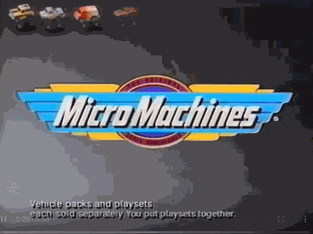

Galoob relied on Towne, Silverstein, and Rotter (TSR) to create TV toy magic, as the Federal Trade Commission investigated the Micro Machines brand. Anthony Giorgianni [wrote](https://www.newspapers.com/image/246368508/), ". . . 'Sold separately' appeared on the screen so briefly . . . commercial[s] used stop-action camera techniques . . . [Micro Machines] move by themselves."

"[We] believe that the respondent has violated the said Act," [wrote the FTC](https://www.ftc.gov/sites/default/files/documents/commission_decision_volumes/volume-114/ftc_volume_decision_114__january_-_december_1991pages_152-249.pdf), finding Galoob guilty of deceptive practices. The complaint originated from the interest group, Action for Children's Television, led by the late Peggy Charren. However, the verdict lacked much teeth.

While Galoob was paying its lawyers to resist the FTC, the company successfully defended itself against a lawsuit over its physical Nintendo accessory, Game Genie. After spending $1.1 million in lawyer fees, Galoob was successful. "The court has completely vindicated our position . . ." [said](https://www.newspapers.com/image/175380819/) Galoob executive Steven Klein to *Los Angeles Times* reporter Martha Groves.

Thus paved the way for Micro Machines' successful video game journey with British developer Codemasters, published in America by Cameria.

. The creator of RetrospekTV, Leif Andersen, [noted](https://www.youtube.com/watch?v=05YfDaAr_iw), "The best memories of Micro Machines have nothing to do with Galoob . . . I remember John."](images/96-10.gif)
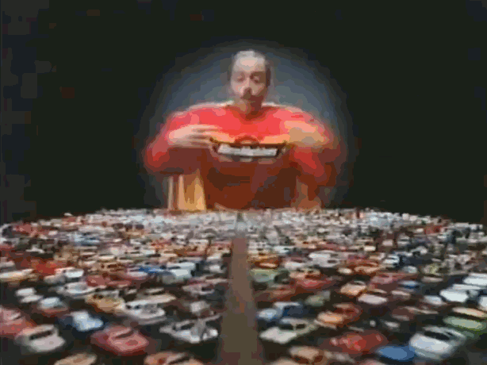

With the boost of Galoob's market geniuses, fast-talking Long Island native, John "Amazing Micro Machine Man" Moschitta Jr., was hired and spat lines like, "If it doesn't say Micro Machines, it's not the real thing!"

The contract between Mr. Moschitta and Galoob was a brilliant advertising play and served as the very enforcement of the Micro Machines [trademark](https://tsdr.uspto.gov/documentviewer?caseId=sn73812999&docId=ORC20081230092959&linkId=7#docIndex=6&page=1), as the line generally lacked patent protections.

---

## The Loss of a General, Finger Food, and the Height of the Licensed Micro-Industrial-Collector Money Machine

*AS THE 1990s CAME INTO* high gear, David Galoob [said](https://www.newspapers.com/image/460917398/) to the *San Francisco Examiner*, "The trick, naturally, is to end up guessing right many more times than not." Micro Machines was the correct guess. According to British author Tim Smith, the company produced 2 million of each vehicle per year, totaling 6,000 models over its original 12-year run.

And Micro Machines was a money machine. The team cranked out endless lines of civilian and military gear in 1:125 scale. Jason at *Toy Rewind* [said](https://www.youtube.com/watch?v=gccgXRsLw5I), "Galoob had somewhere in the range of 6,000 different vehicles . . . [and] they hurt like a son-of-a-bitch if you stepped on one barefoot."

 for their "Race In A Case" line. Another was the [Military Chopper Command Base](https://www.youtube.com/watch?v=7dHtmv2T3ck), a flying helicopter by the late [Richard Chang](https://patents.google.com/patent/US5433669A/en). Richard was a legendary toy maker.](images/96-12.jpeg)

Indeed, Galoob's cars were featured in the 1990 movie *Home Alone*, written by John Hughes and directed by Chris Columbus, as offensive foot weapons deployed against two numbskulled crooks.

Many of Micro Machines' playsets launched - such as the modular Travel City collection, including the Fish and Chips drive-in, Car City Wash, Aircraft carrier, and Cargo Plane - and expanded sets like Super Van City, its centerpiece. Included in the mix were versions of military trucks, jeeps, and warplanes. Then, Galoob reimagined Super Van City as a Battle Tank-an M1 Abrams-that unfolded into a playtime battlefield.

Galoob launched [Sun Color Changers](https://www.joescurios.com/sun-color-changers.html), cars that react to UV light, and the Insiders, a Matryoshka-car concept featuring a 1:250 vehicle inside each. Also included in the product line was a miniature slot-car series, Race in a Case, protected by a [utility patent](https://patents.google.com/patent/US5006090A/en).

The patent's assignee was a legendary inventor, Melvin Kennedy, of Nagel, Kennedy, Arad & Associates. And Arad [was seen](https://www.youtube.com/watch?v=Eeq4uQXkizk) in a 1989 CBS documentary, *48 Hours*, titled "Toy Money," featuring a segment on Micro Machines. Mr. Arad "would go on to become the CEO . . . of Marvel Studios," [wrote](https://nacellestore.com/collections/books/products/the-toys-that-made-us-polly-pocket) Maude Campbell, author of *Toys That Made Us: Polly Pocket*.

 by Katherine Thuman, David Galoob stands proudly with his brand. In the lower left are somewhat unique to Micro Machines - "City Scenes," a Fire and Police station. The brand experimented with these light-up playsets and cars, called [Micro Lights](https://m2museum.com/Microlights.htm).](images/96-13.jpeg)

The [narrator](https://www.youtube.com/watch?v=hK6Ph_GSIzo) on the YouTube channel, *Industrial Craft*, said, "By 1989, Galoob was pulling over 120 million dollars a year from Micro Machines sales alone." And in the record books, Kathleen Pender from the *San Francisco Chronicle* wrote, ". . . [David] Galoob and [Saul] Jodel came up with some major successes - Micro Machines . . ."

Back then, Mr. Jodel was a free-thinking radical toyman. "I don't do research to validate my position to management," written in the book From *Workshop to Toy Store*.

In 1991, Galoob rolled out a massive line of military-focused playthings. Micro Machines was a boy brand; designers catered exclusively to that audience. They pandered to the military-industrial complex sensibilities, offering B-1 and B-2 bombers, the F-117a fighter, tanks, mortars, military men, and playsets that stole hours from children and this nascent author.

But at the very height of Micro Machines, David Galoob abruptly left the company, "In what some analysts called a forced ouster, David Galoob resigned, leaving Lewis Galoob Toys with no Galoob in management and ending an era for the family business," according to [FundingUniverse](https://www.fundinguniverse.com/company-histories/lewis-galoob-toys-inc-history/). 

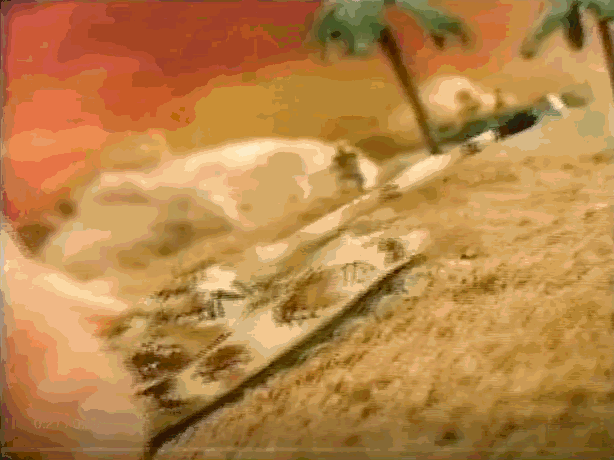
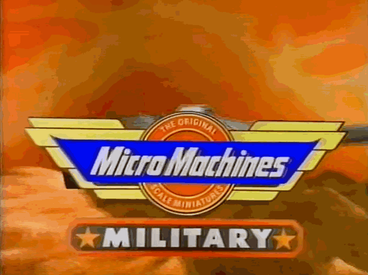

Potential failure of Galoob was all over the news - "Projected losses of about $30 million for 1990," [wrote](https://www.newspapers.com/image/79671065/) an AP journalist. Martha Groves of the *Los Angeles Times* [said](https://www.newspapers.com/image/175911916/), "[Those] Bumbling burglars . . . The [*Home Alone*] scene is a metaphor for [Galoob] . . . which stumbled badly in 1990." However, Micro Machines was the only brand that stumbled cash into the company's evaporating toybox.

The reason for David's departure is unknown, and no author has captured Mr. Galoob's position. "Clearly a decision was made that changes were needed," [said an industry expert](https://www.nytimes.com/1991/06/29/business/business-people-new-president-chosen-at-lewis-galoob-toys.html) to *New York Times* journalist Lawrence Fisher. Galoobs' sales were way down, and the board was looking to sell after ousting their one loyal toy general.

However, ex-Mattel executives like Mark Goldman, who served as COO alongside David since 1987, also appeared in the *48 Hours* Special, "Toy Money." Mark followed  in the footsteps of David's brother, Robert, who said, "Licenses have been so important to the industry . . ." to [Michael Hiltzik](https://www.newspapers.com/image-view/400529435/) in 1985.

Robert [left](https://www.newspapers.com/image-view/405080494/) Galoob in the late 1980s as Mark stepped forward. Then, once David departed, Mark took over the company and instilled fast-moving toy lines, a salute to his early training at Mattel. More vehicles and playsets were constructed. And Mr. Goldman was instrumental in attracting ex-Mattel talent, streamlining the business, and securing those licenses. "I WANT that [Star Wars] license," he said to newspaper [reporters](https://www.newspapers.com/image/142384388/) in 1995.

, Left: David Galoob and Right: Mark Goldman in 1991.](images/96-16.jpeg)

Through Mark Goldman's tenure, his team secured profitable licenses of every boy's fantasy. Marvel, *Star Wars*, Predator, Indiana Jones, NASCAR, Power Rangers, and Star Trek. Galoob launched "head-shaped play-sets to complement Micro Machines . . . Starting in 1994, kids could open up R2-D2 to reveal Jabba the Hutt . . ." [wrote](https://nacellestore.com/collections/books/products/the-toys-that-made-us-polly-pocket) Maude Campbell, in *Toys That Made Us: Polly Pocket*.

And at this moment, Clem Hedeen, the original creator, filed a breach-of-contract lawsuit against Galoob over its expanding line. [From](https://books.google.com/books?id=NZjPRNWRQRYC&pg=PA177) the *IP Attorney's Handbook*, ". . . some estimates [Micro Machines as] a $700 million line of toys." FunCity, the company that held the contract from the beginning, made $18.5 million. Following the complaint regarding the *Star Wars* and Star Trek expansion, Galoob filed an unlicensed use claim against FunCity for its use of the Micro Machines trademark. Ultimately, Mr. Hedeen settled for an additional $32 million, resulting in an estimated 7% royalty.

The toy expansion attracted more lawsuits. Such as from the late Sonny Landham, the actor who portrayed the Predator character "[Billy Sole](https://www.avpgalaxy.net/characters/billy/)," claimed that Galoob violated his "rights of publicity." His character appeared in the Predator series, but the case was ruled in Galoob's favor.

As the 1990s wore on, millions of military Micro Machines were stamped. What was happening at Galoob was of special interest. A designer reflected on the toy industry and coined the term "finger food" in [*ToyFare Magazine*, Issue 132, p. 64.](https://www.parrygamepreserve.com/images/media/magazines/toyfare/2008/08_August/toyfare_2008_08_August_36_M.jpg) "Finger food is the stuff you can play with on the toy," said artist [Paul Kirchner](https://en.wikipedia.org/wiki/Paul_Kirchner).

These Micro Machine cars, like their articulating hoods and doors in the "Deluxe" line, were just that. When it came to military vehicles, missiles, turrets, and other small attachments, they were delicious. Notably, the cars and planes acted like mental fast food-tasty, tactile, and numerous. And under Mr. Goldman's vision, Galoob continued to branch out with Z-Bots, small-scale figures, and an odd brand called Biker Mice from Mars. However, both failed, as Micro Machines marched on.

, transformed playsets into two separate play areas.](images/96-17.gif)
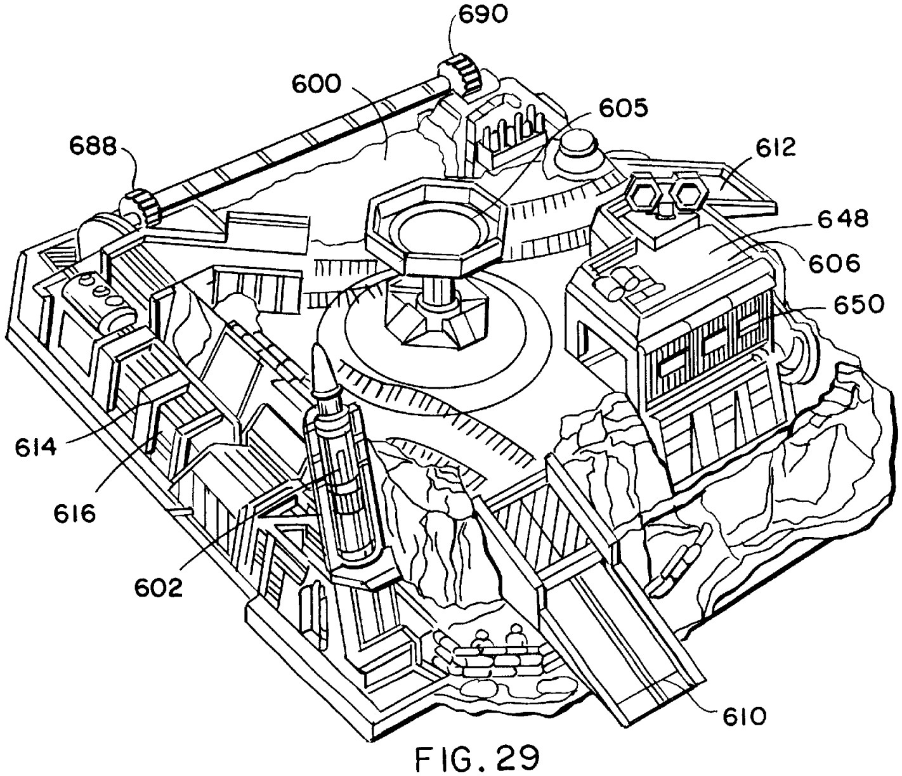

The Micro Machines line of military vehicles was so expansive that generations later - and deep into the 2020 Pandemic - collectible sites like Micro Machines Military went online. After discovering these Micro Machines in storage, their [author typed](https://micromachinesmilitary.com/about/), "Opening the container was like the gateway drug to collecting." This "finger food" became a fast drug, a hefty dose of nostalgia.

The military line would last seven years, from 1991 to 1998, and collector sites would pop up on the Internet from time to time. Supporting the nostalgia rush were amateur collectors, publishing galleries, and free-to-see content on the Internet. And the virtual garage sale site, eBay, had endless lines of second-hand vehicles, playsets, and "new old stock."

And because of Mr. Goldman's stellar moves in licensing acquisition, Galoob was acquired by Hasbro for $220 million in 1998. This author wrote about that buyout and its associated [Sky Dancers](https://medium.com/@solidi/wear-safety-glasses-galoobs-sky-dancers-3c3b499288f3) legend in 2024. Which "David" discussed in the tale is still up for debate. And with the sale, the original Micro Machines line effectively ended, as all of the "Core Four" designers left the merging company, as discussed by author Tim Smith in *Micro But Many*.

At the time, Mr. Galoob's sister, Linda, [commented](https://www.newspapers.com/image/1233727863/) to the *San Francisco Chronicle*, "There's not going to be any toy companies left," a battle cry to resist the mergers of the era and to preserve options for the customer.

The inevitable acquisition laid the groundwork for generational nostalgia. For instance, Wolf Architect posted an expansive collection of Micro Machines military vehicles. That author [wrote](https://review.wolfarchitects.design/military-micro-machines-1991-1998/), "Military Micro Machines introduced something truly different: realistic, scaled-down military toys at a tiny size and at an affordable price point." To date, Wolf's collection has the most beautiful (and threatening) photos of the toy line, appearing like a Victory Day parade.

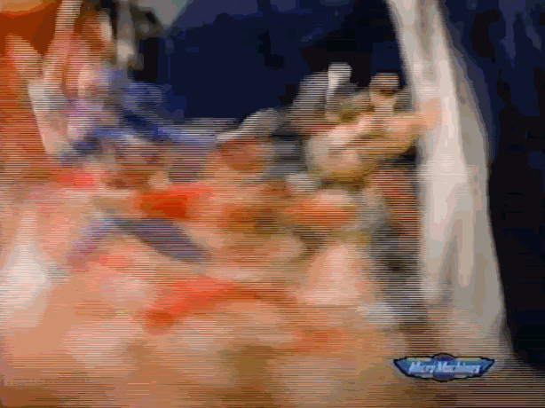

And if one prefers the civilian approach, there are plenty of sites, like Joe's Curios, that collect the gentler side of civic play. "My collection is by no means complete, however, nearly all of the Micro Machines production vehicles known are shown. . ." [wrote](https://www.joescurios.com/foreword.html) Joe.

The artistry, detail, and precision of Micro Machines remain unmatched some thirty years later. A collector and British author named Tim Smith published the only post-modern book on the subject.

[*Micro but Many*](https://microbutmany.co.uk/) is a wonder, capturing Galoob's toy machine and rare prototypes that were not crushed by their private steamroller. This author speculates that the original team's art-subterfuge was done because "Toy Knight" Hasbro, who saved Galoob in name, would take away their art. So instead, one morning, "art" was created right into the pavement for the greater good.

, released in 2020. As seen on British author Tim Smith's X profile, he spent [three years](https://x.com/microbutmany/status/835417652956966913) crafting Micro Machines' visual history. It is available for purchase today.](images/96-21.jpeg)

Clearly, many authors hold strong opinions about Hasbro. YouTubers at *The Good, The Bad & The Ugly Show* commented that Hasbro was the "demons of toy manufacturers" when discussing Galoob's corporate takeover, and David Land's YouTube channel [noted](https://www.youtube.com/watch?v=sqO7kXRLL3Y) Hasbro as "our evil overlords" when they cancelled promised Indy Car Micro Machines at the time.

But some collectors had everything. "I have 1,172 cars, planes, trains, trucks, boats - you name it," wrote Mr. Smith on his about page many years ago-now his curated wonder is hovering at 10,000+. His associated [YouTube account](https://www.youtube.com/@micro_machines/) has amassed almost every Micro Machines commercial from the source-a rare Internet treasure. How he obtained every TSR commercial VHS tape remains a mystery [and an inspiration for plastic aficionados].

And to American society, Chris Byrne, an industry expert, once wrote, "... the toy industry reflects society; it does not lead it." The success of Micro Machines' military line was an enduring symbol of the first Gulf War before society rejected the toys during the War on Terror.

---

## The World Is No Longer Micro - A Century of Macro Toy Decline

**SINCE THE SHELVING** of these miniature toys in the 2000s, the legacy for Micro Machines has continued to grow. Realizing the potential, toy maker Hasbro unveiled a new line. Partnering with manufacturer Wicked Cool Toys, a subsidiary of Jazwares, the playthings appeared from 2020 to 2024.

Unlike the cultural impact of Micro Machines in the late 1980s, Hasbro attempted to revive the brand throughout the aughties. Hasbro's 2020 relaunch did not have the same effect as it had two generations ago. Speculation on the Internet is clear.

 by Bill Kelley in the 1990s and was picked up by Playmates Toys.](images/96-23.jpeg)

A Reddit user named OrphanKripler [wrote](https://www.reddit.com/r/MicroMachines/comments/1dgzi7j/comment/l8u86ww), "The reboot feels lazy and a cash grab on nostalgia." Others speculated that the product's demise was due to poor quality, with less investment in "spray ops,"** and a cheaply made design.

GenFan12 [relented](https://www.reddit.com/r/MicroMachines/comments/1dgzi7j/comment/l8y5ipa), "It's a real shame, because regardless of what we think about the quality or selection, the fact that we got a lot of new stuff was huge."

This author speculates that today's market is crowded, that children want both physical and digital play. Additionally, there are plenty of options for parents to buy similar toys without the premium brand name - Canadian manufacturer Battat has taken market share with its "Driven" products, which feature voluminous micro aesthetics at low cost.

, ". . . I forgive Jazwares for the previous releases that made us angry as collectors, because [the Corvette Raceway] made me feel like I was playing with Micro Machines again."](images/96-24.jpeg)

The host of *GiggleBlaggle Toys!*, who has reviewed many Micro Machines playsets, [said](https://www.youtube.com/watch?v=ELDS96_ea4M), "I guess I have mixed feelings about some of these [new] Micro Machines . . . I definitely think the older ones had a little bit more personality." "They're just plastic-y feeling, slightly less inspired feeling than those older Galoob Micro Machines . . . [but I'm] certainly happy to have a revitalization of them."

In this author's opinion, Hasbro could have offered a highly detailed line to make Micro Machines stand on their own. Details would attract collectors, as they are the core of the Micro Machines consumer base - and they have children, who would enjoy the basic lines.

Most of all, Micro Machines' military and its strategy of good vs. bad guys are absent. The 2020 relaunch avoided Galoob's original vision: no war machines nor military fatigues (okay, "Protection Force" was the only exception). Instead, Chinese toy manufacturers have delivered in this area, without recognizable brand names.

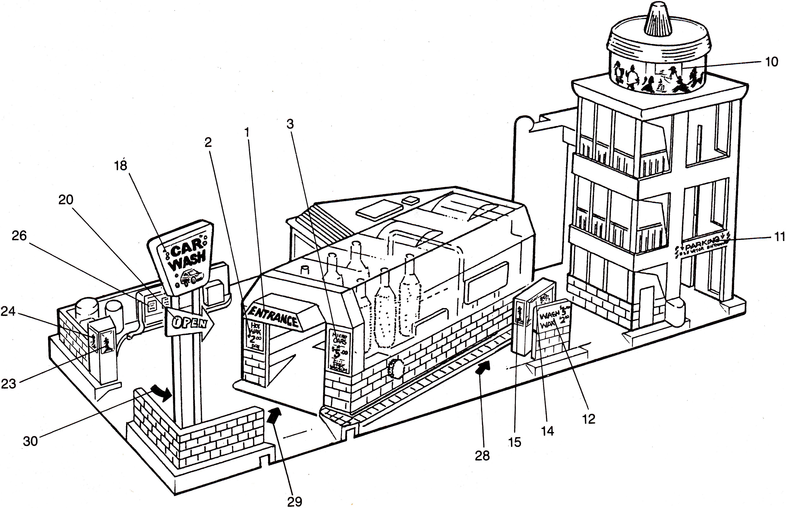
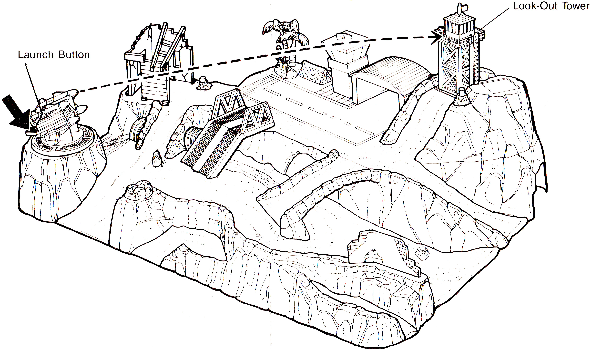

The only "war" in the modern brand was that of deception. In 2022, Jazwares was called out during the relaunch, as Galoob in 1989 - the Children's Advertising Review Unit (CARU) raised concerns about deceptive practices and "found the ads unrealistically depicted how the toys can perform," as [written](https://www.hunton.com/hunton-retail-law-resource/caru-requires-toy-company-to-modify-ads-to-show-limited-scope-of-playsets-adult-assembly-required-and-real-toy-play) on the Hunton website, which analyzes retail law decisions. The Corvette Raceway playset was to blame. Jazwares acknowledged to "comply with CARU's instructions."

But Micro Machines' magic remains. Editor of *Toy & Hobby World*, Rick Anguilla, [wrote](https://www.newspapers.com/image/764753113/), "Parents so quickly try to understand [Micro Machines] allure, but you can't understand them unless you play with them."

Inventor of Micro Machines, Clem Hedeen, [wrote](https://www.amazon.com/Million-Secrets-Successful-Inventor-Attorney/dp/1978132670) in his book, *Million Dollar Secrets of a Successful Inventor/Attorney*, "People are tactile. They like to feel . . . [and] see things actually work . . ." And this statement is the ethos of Micro Machines, as this author once experienced.

The name Galoob still lives on. With 220 employees at its height, this author believes the organization was one of the most underappreciated toy companies ever. Their Micro Machines playthings were certainly "finger food" in the minds of American boys at the time. Today, they are aging adults who deal with a world no longer micro.

---

## Wowee - Hot Wheels Had 'Em Before Your Parents Were Alive

*IN 2020, DAN LARSON* of *Secret Galaxy* [said](https://www.youtube.com/watch?v=_tv8QF8RwNI), "Back in the 70s, Ideal had a line called Skeeters that were the same size as Micro Machines. Skeeters featured amazing packaging design with a plastic bubble that featured a built-in magnifying glass."

As a historical courtesy, every American Toy Story *should* mention Mattel. And no, this is *not* the repeated fact that Galoob's Micro Machines "[whizzed past](https://www.newspapers.com/image/405922139/)" Hot Wheels and Matchbox for three to four years [which remains unverified].

However, before Micro Machines and [Skeeters](https://www.puremicros.com/xb-ideal-sk.html), there is a tale that has never been written - an event that happened *decades* before Mattel introduced small-scale Hot Wheels in response to Micro Machines, and years before the Shell Oil promotional product, [Zowees](https://hotwheels.fandom.com/wiki/Zowees).

In June 2023, this author spoke with [Derek Gable](https://pvsunsetrotary.org/stories/the-power-of-pie-(positive-interactive-experience)-derek-j-gable), a prolific figure in the industry and a former director of Mattel R&D. Mr. Gable once worked for [Jack Ryan's](https://medium.com/@solidi/jack-ryan-and-ruth-handler-of-mattel-the-power-ballad-of-american-coffee-2c19994e6732) team, patent holder of Barbie and Hot Wheels. And Derek told this author an unbelievable tale related to Micro Machines.

 above. According to former employee Derek Gable, Elliot witnessed similar micro prototype products in 1970.](images/96-28.jpeg)
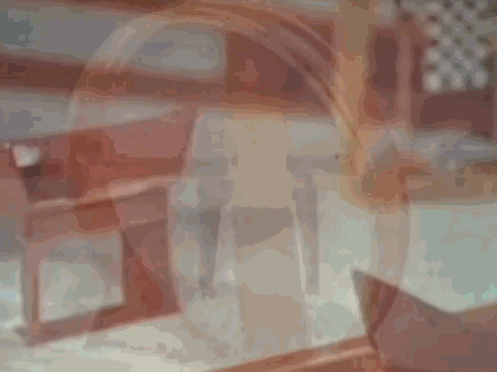

Mr. Gable said, "We [Mattel] came up with Micro Machines before Galoob even thought of them. And we called them SAM cars - we made all kinds of sets."

Derek continued, "We used to make our [product] presentations to Elliot Handler." Mr. Handler, along with his wife, Ruth, founded Mattel. They invented the Barbie fashion doll and diecast toy cars, Hot Wheels, in 1968.

Mr. Gable said, "Maybe it was 1970 . . . I can see it right now." Derek set up the presentation for Elliot, ". . . with loops and accelerators . . . all kinds of stuff. We put these tiny miniature Hot Wheels on the track - and zip them around in a little, tiny space . . . it was magical."

In her [book](https://chireviewofbooks.com/2025/12/04/dispatches-from-barbieland-an-interview-with-tarpley-hitt/), *Barbieland*, Tarpley Hitt wrote, "Ruth called them her 'young tigers.'" One tiger in the demo room was [Ray Wagner](https://medium.com/@solidi/the-toys-that-made-us-the-first-hot-wheels-sto-go-playset-2f051fbd33c3), leading Wheels and Wings at the swift departure of Bernie Loomis, a toy industry legend.

With Elliot, Ray, and management ready for the product presentation, Derek pulled the cloth like a stage magician, revealing the wonder to them.

Mr. Gable explained that Elliot was immediately blown away, but after a brief minute, Mr. Handler's facial expression turned pensive and conflicted. Then, resolution.

, tuned toys that raced fast in the 1990s. The book Micro But Many stated, ". . . [Radicators] were faster than their Hot Wheels counterparts . . ."](images/96-30.gif)
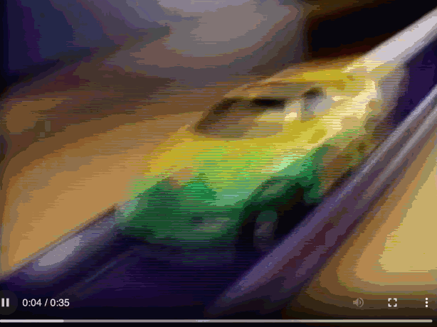

Derek recalled, "Holy smokes! What's going on?" Elliot's real business sense kicked in. After a pause, Mr. Handler said, "This is amazing; however, it's going to compete with Hot Wheels . . . We don't want to do that." Elliot said nothing else and placed the reveal cloth back on the presentation. He walked out.

Mr. Gable was in shock-*all that work*-and Ray Wagner could do nothing.

Then, upper management dismissed the engineers and the prototypes. Everything was shelved and idea disclosures secured, forever locked away in Mattel's aerospace archives. "We should have had that [two decades] before Galoob," said Derek.

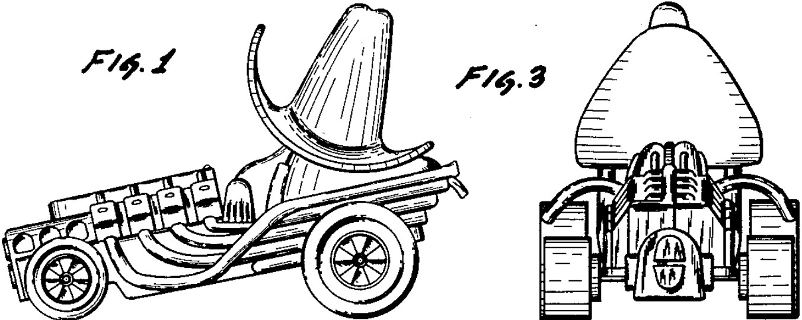

Mr. Gable confirmed that Hot Wheels Zowees shared the lineage of "SAM" cars. Zowees were not regular cars but "weird stuff . . . [like] a boot with wheels," and were larger, said Derek. Designer Larry Wood had at least one [design patent](https://patents.google.com/patent/USD227386S/en) on the plaything.

Derek ended, "Galoob could have been non-existent if Elliot hadn't done that [laughs]!"

Decades later, Mattel took a micro-chance, risking a core brand - not on Hot Wheels - but on Barbie. In 2025, Maude Campbell wrote, ". . . Mattel was eager to cannibalize its own sales with another top-selling girls' toy," which was the miniature doll, Polly Pocket - written in the book *The Toys That Made Us: Polly Pocket*. Later, Polly Wheels were released, miniature car toys that Polly drives.

In the end, Mattel was *more than* successful with Polly, but left the primordial "SAMs" literally running on the table before your parents were born. And this author will forever leave the acronym "SAMs" for Mr. Gable to explain what it meant.

---

If you liked this highly detailed, forty-five-hundred-word historical write-up on toy lore, you'll find this author's book, [Undercover Toy Stories: An Anthology of Real American Inventions](https://www.amazon.com/Undercover-Toy-Stories-Anthology-Inventions/dp/B0FR9RVRVH), intriguing. The iconoclastic book is available now - and it's not for the faint of heart.

 is available now.](images/96-34.jpeg)

---

*This is a handcrafted post; AI was not used in its authoring.*

* *Newspapers had [misstated](https://www.newspapers.com/image/762399598/) Lewis Galoob's company name. While this author was unable to verify the story independently, a [movie call sheet](https://www.newspapers.com/image/382327800/) under "Louis Galoob" was located. Still, it was likely Lewis, a toyman, who wrote an original story about being a "toy salesman."*

* *Filmmaking was a generational ambition in the Galoob family, but it remains unrealized. "There is a very close relationship . . . between the toy industry and the film business," [said](https://www.newspapers.com/image/632874625/) David Galoob to an Associated Press journalist in 1987. A century has passed, and this is now the strategy of the toy industry's survival.*

** *The term "spray ops" first appeared in Maude Campbell's Polly Pocket book through a source she interviewed. Its definition relates to efforts to decal, tampo, and paint applied to toys during production.*

---

## Social Post

Discover the fascinating history of #MicroMachines by #Galoob, a beloved American toy. This "small" chronicle unveils a never-before-told story about Micro Machines' unique association with #HotWheels, highlighting the rare lineage between the two. Enjoy the insights and learn more about this iconic toy line. 

https://lnkd.in/efm7HvxD

