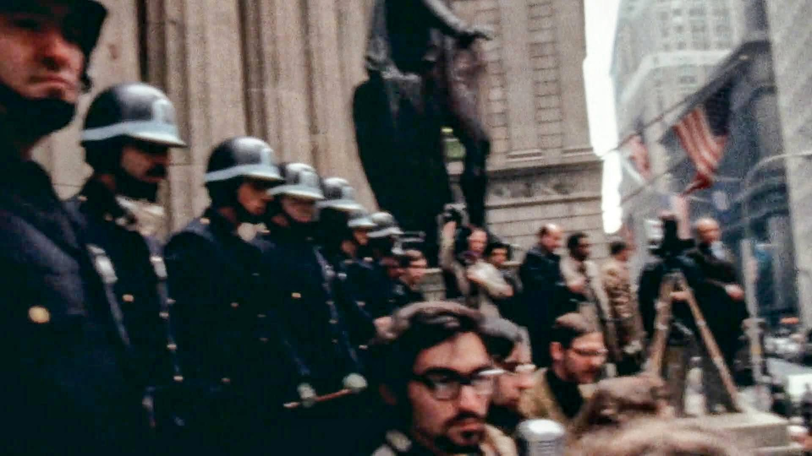
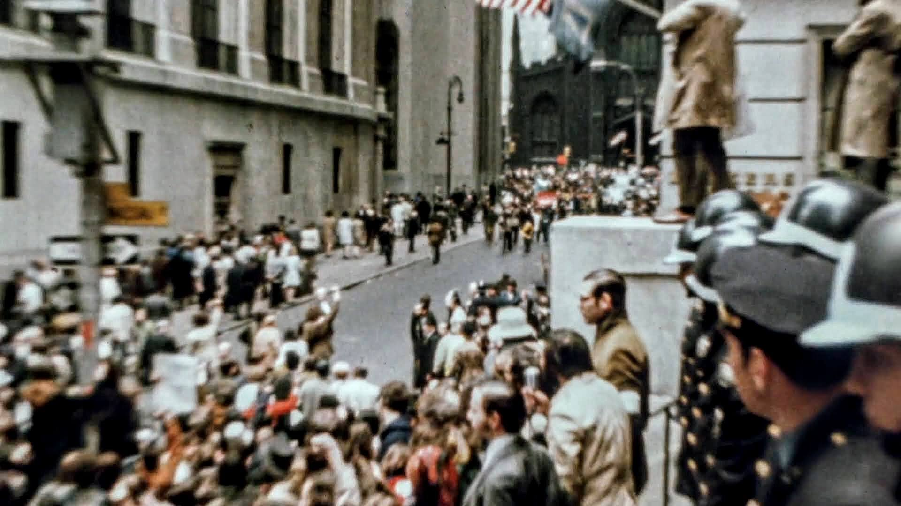
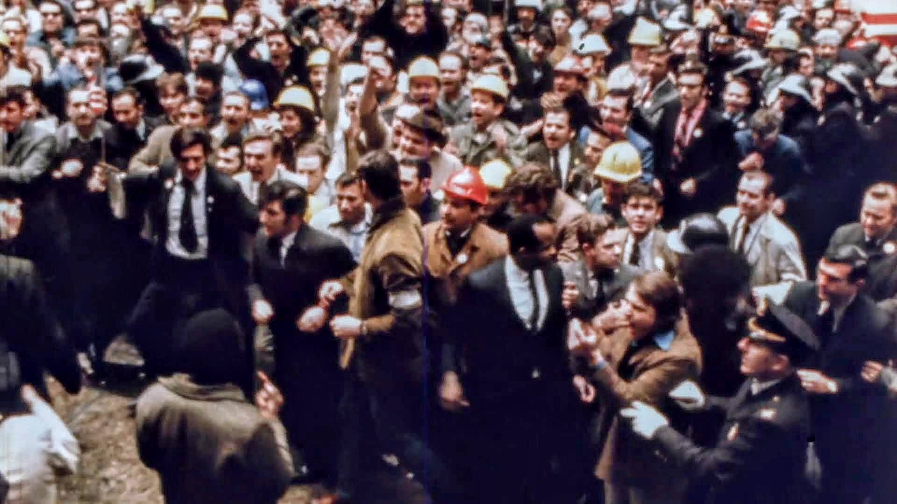

## ON AMERICAN HISTORY
# Dad Was at the Hard Hat Riot
## It Was May 8, 1970, When Students and Workers Clashed

*AFTER MOM PASSED*, I helped Dad through a lot of bullsh-  that comes with people dying. Dealing with the agony of loss, keeping the family together, and learning about my father, as he analyzed his "quiet desperation."

When Mom was around, Dad would be tight-lipped about his past. Now, I'd sit with him at his kitchen table.  We talked about everything. And I'd come to understand that he was once politically active.

From PBS, a federally defunded American public broadcasting entity, I learn what the *Wall Street Journal* called "Bloody Friday." Dad admitted he was there - I asked what happened.

Dad rebuffed me. He told me, politely, to " f-  off." To him, the thought of that day, in 1970, in his seven hours of participation, delivered him immense emotional pain - "The saddest day in American history," he said.

But my insistence piqued his interest. Dad, being an open-minded individual, found relics of American history that had been hidden away.

Then one day at the kitchen table, he gifted his sacred memorabilia. A well-worn original edition of Steal This Book by Abbie Hoffman; a folded newspaper, Pace Press, dated May 15, 1970; protest pins that read "SDS," "War Machine Off Campus," "SMC," "People's Peace Treaty," "Stop the Rape of Vietnam," and his draft card, which he didn't burn - he used it for drinking instead.

"I didn't keep the white armband," he lamented. Then, I opened Abbie's book and read the chapter titled *People's Chemistry*, which explained to "[always] direct [violence] away from . . . people."
"What the hell is this?" I asked. "Abbie told them to f-  off, but he never showed up," said Dad at the kitchen table. Then, I asked him to watch the [Hardhat Riot documentary](https://www.pbs.org/wgbh/americanexperience/films/hard-hat-riot/) with me, which included never-before-seen film.

"Dad. Is that you?" There he was in the tumult.

---

*MAY 8, 1970*, was twenty-five years after V-E Day, and Dad had appeared in scenes featured in the PBS special. To better understand my Dad's experience, I read David Paul Kuhn's book, *Hardhat Riot*, to understand the backdrop.

Mr. Kuhn is the world's expert on the riot's analysis, and he had unearthed thousands of pages of unprocessed police reports-even after the New York FOIL system told him to "f-  off." He appealed,  working around these agencies to piece together American history.

To my understanding, the Hard Hat Riot was a boilover between two groups: students who wanted the Vietnam War to end and men building the Twin Towers who witnessed the students desecrating the flag.

After a continuous week of political s-  happening with Vietnam, including President Nixon's incursion into Cambodia, firebombings of ROTC locations, four people shot dead on a university campus called Kent State, minor skirmishes between tradesmen and students in New York over Viet Cong flags, and under the pressure of "draft lottery," the tension broke.

On that Friday, May 8, students from various universities marched to Federal Hall near Wall Street. It was the place where Congress wrote the First Amendment. And during this day, students from Pace, Colombia, NYU, among others, had an assembly permit - the police were supposed to protect them.

"The protestors pushed forward and shouted their opposition to the 'f- ing war'," wrote Mr. Kuhn. And there is Dad, right there, telling the government to "f-  off."

Tensions escalated after men wearing yellow hard hats from the World Trade and US Steel construction sites took control of the legal protest. Assisted by businessmen on Wall Street, they broke through the lines, and the police did little to stop them.

Mr. Kuhn reported instances where police refused to arrest, even after bystanders witnessed assault with battery. In one example, a young litigator, [Michael Belknap](https://www.kpbs.org/news/2025/09/25/american-experience-hard-hat-riot), was beaten unconscious by the workmen. The hardhats assaulted women (a fourth of all injuries) and [journalists](https://www.archives.nyc/blog/2020/5/8/the-hard-hat-riots).

Dad was up at the "colonnade" next to protestors with microphones when a Viet Cong flag appeared across the way - and then my father fell into the crowd, where the men fistacuffed students, and threw them off the steps to reassert the American flag ". . . just like John Wayne taking Iwo Jima," wrote Mr. Kuhn, retold by underwriter, Jack Friedman.

Dad, an intellectual from blue-collar Ridgewood and a Pace student, appeared. Dad said, "I've blocked it out - I don't remember the moment." And as we watched the documentary together, he was sullen. In fact, I felt uncomfortable watching with Dad - it was hurting him.
 
"Nobody is listening to one another," he said.

We had to stop. Dad revealed that he followed the crowd up Nassau Street to Foley Square, City Hall, and then Pace, where hardhats broke into the college. Police, again, did nothing. Their instructions were to say "f-  off," which the police told the student assembly to do when they lost control.

![Man hurt at Pace University. "[Belknap] wasn't moving." Later, [Mr. Belknap](https://www.kpbs.org/news/2025/09/25/american-experience-hard-hat-riot) led an ACLU class-action lawsuit, which failed. Dad confirmed he was right outside the frame. (Credit: Pace Press, May 15, 1970 - finger gesture censored in print.)](images/97-04.jpeg)

Ultimately, laborers beat those who loved America, and the students beat them back, though not as decisively. The tradesmen told students to "f- off." The morning after, President Nixon met with students, whom he called "bums," and with unionists weeks later, with their political fixture, Peter J. Brennan. Neither side ever reconciled.

Then, the Vietnam War ended with a tally of 58,220 American body bags. And years passed - America's hyper-capitalistic economy told the hardhats to "f- off," too.

After the riot and "politics in Queens," Dad changed after finding Mom in 1976. He conformed to society and "f- ed off" - and had a family, joining the ranks of the middle class on Long Island.
But fifty-five years later, Mom was gone. And as we sat at the kitchen table, Dad told stories about the people he knew, like "John Lindsay, Florynce Kennedy," and how "Eugene Debs was jailed for [a draft resistance] speech." And Dad shared a short story I was unaware of.

---

*THE WORLD KNOWS* what happened in 2001, and in this story, it is a landmark linchpin. The author, Mr. Kuhn, ties the building of the Twin Towers to those hardhats who, later, were "decimated by globalization and free trade."

And so, the Twin Towers fell, and in the wisdom of America, it invaded Afghanistan and Iraq - but the war went on too long. At its height, the ROTC, which recruited men and women to serve in the military, called the house. My Dad picked up the phone.

The gentleman on the line asked for "Douglas," but I wasn't there. He was interested in recruiting me. By then, there wasn't a draft - it was all volunteer.

)](images/97-05.jpeg)

Dad said, "He's not interested."

The man replied, "How do you know?"

My Dad said to the lieutenant colonel to "*Fuck off*," and he hung up the phone.

Dad insisted I "keep at it" in college as he paid my tuition. And a few people around us were killed in the Global War on Terror. Some died in a place called Fallujah. Later, many committed suicide from the trauma sustained. It turned into a politically motivated war.

And Dad's refusal of his son's military induction was core to what he once lived. He told the new "Campus War Machine" to "f-  off."

Mr. Kuhn wrote "that winners write history . . ." and on page seventy-eight of The Hardhat Riot, those many winning men, when called from high places, once told the draft to "f-  off," too.

Dad said, "[David] missed a few others," then proceeded to name those not appearing in print.

---

*BACK THEN, DAD WAS* immersed in the vitriol. Through the hurt, it bonded him with educators. He said, "[Gordon Potter](https://www.newspapers.com/image/915358250) [a professor at Pace] was a great guy - we [later] spoke about the event at length."

And he discussed the outcomes. "[The riot] was a stain on the [then] NYPD. I saw it with my own eyes. They won't talk about it."

Many decades later, I often joke that my father will never be "awarded medals" for all the trials he endured. And he remains a quiet but intense man who told people to "f-  off."

, who was questioned about police conduct in the riot, appears in the center with white gloves. (Credit: PBS/Original Film)](images/97-06.jpeg)

"When you're in the middle of it all, you have no perspective . . . no ability to step back and understand what is going on," David Paul Kuhn once wrote. What remains is printed on film. Dad is captured, looking into the frame - between both warring classes - in the middle of American history.

And sometimes, steadfast investments in beliefs come full circle. Dad was never fortunate; he came from the lower-middle class and paid his way through college, which cemented his optimism about education.

---

[My Dad appears in scenes starting at 44:00.](https://www.pbs.org/video/hard-hat-riot-ocptxr/)

--

## Social Post

"And there is Dad, standing where the First Amendment was penned, boldly expressing to the government to 'f- off.'"

And so, I captured his perspective and shared photos, including a rare and impactful image from the Pace Press. I learned by chance that Dad was captured in the American Experience hashtag#PBS film about the Hard Hat Riot, a significant event that took place on May 8th, 1970. 

https://lnkd.in/eG85Xe2B
