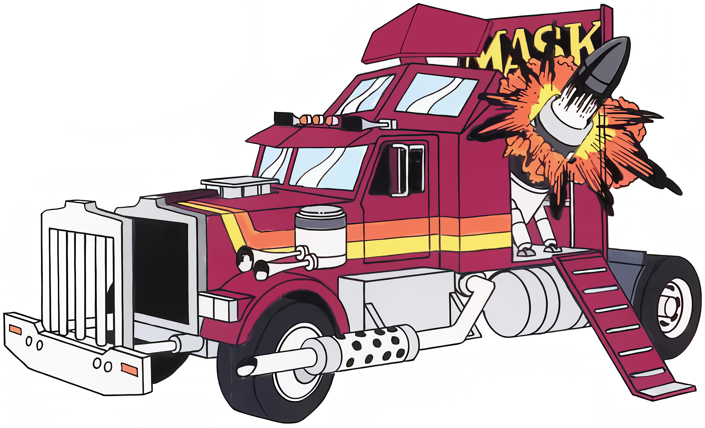
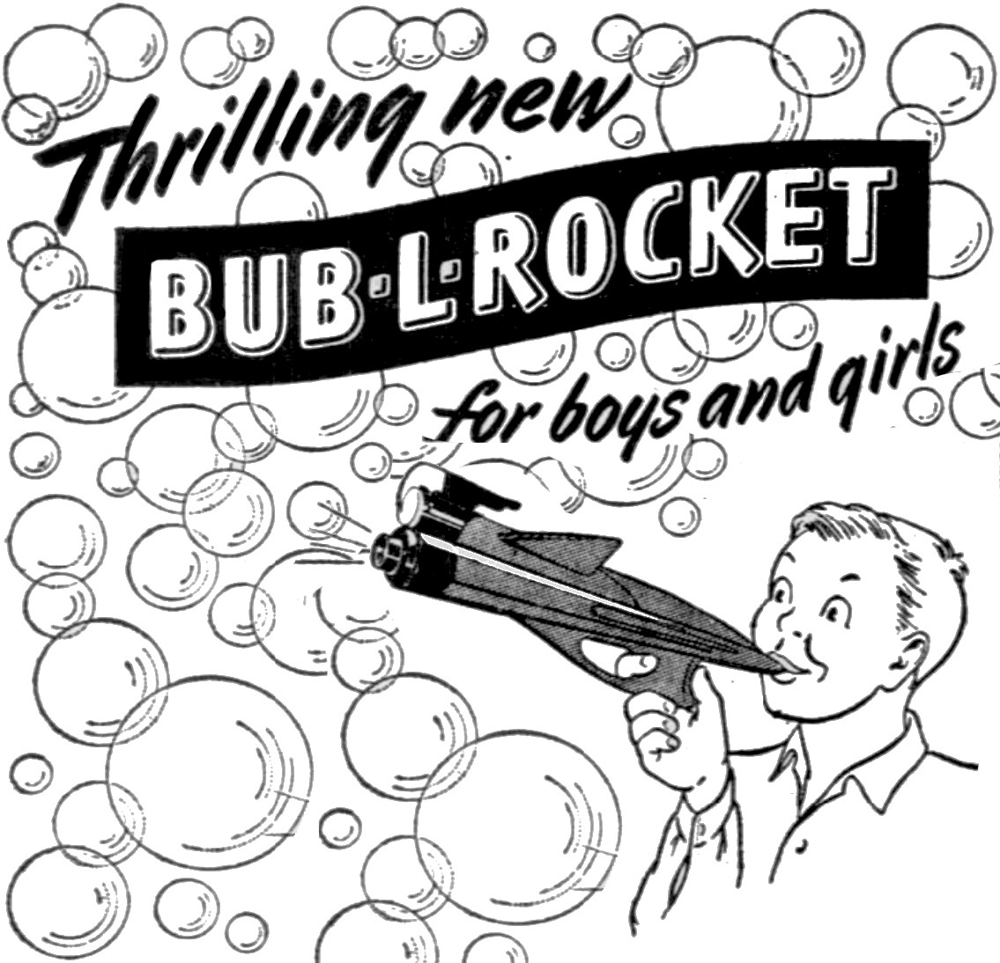
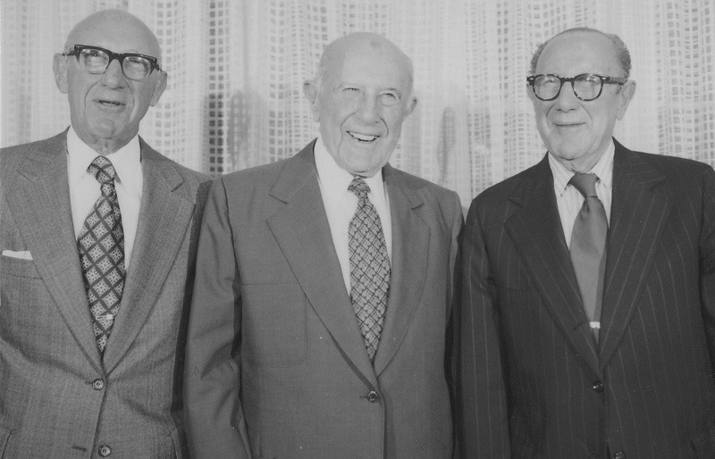
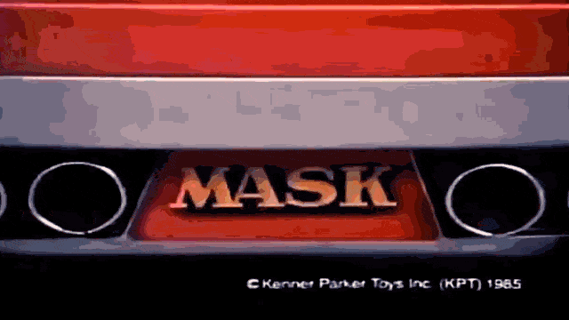
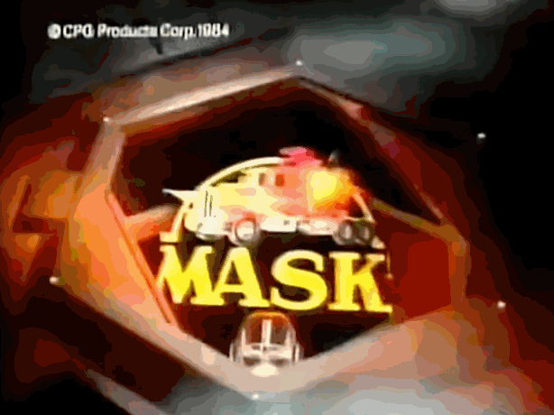
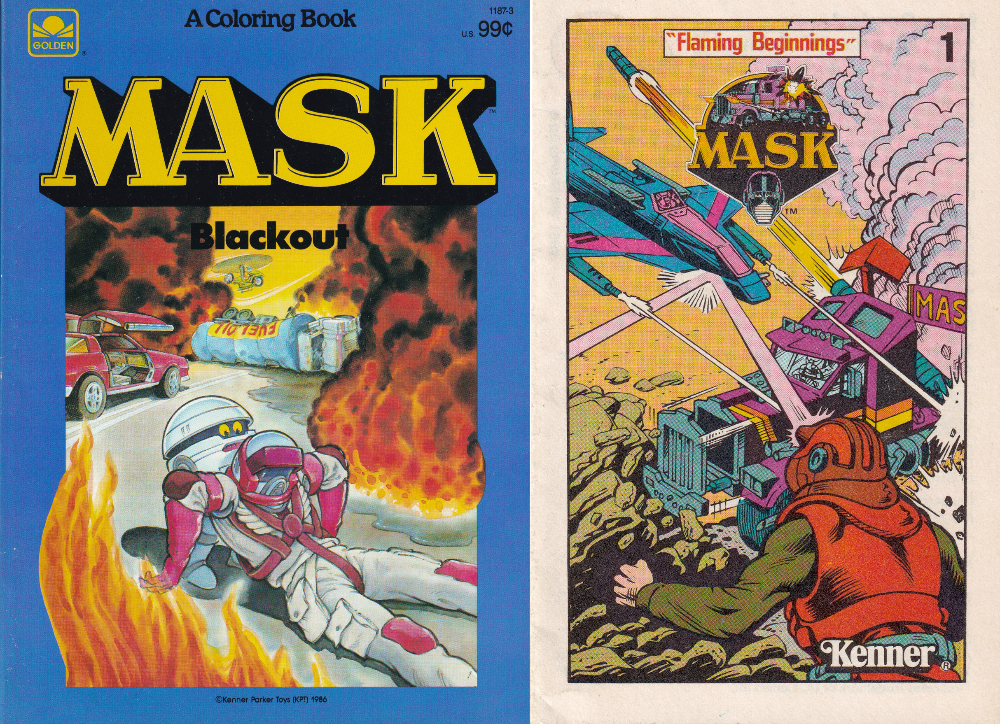
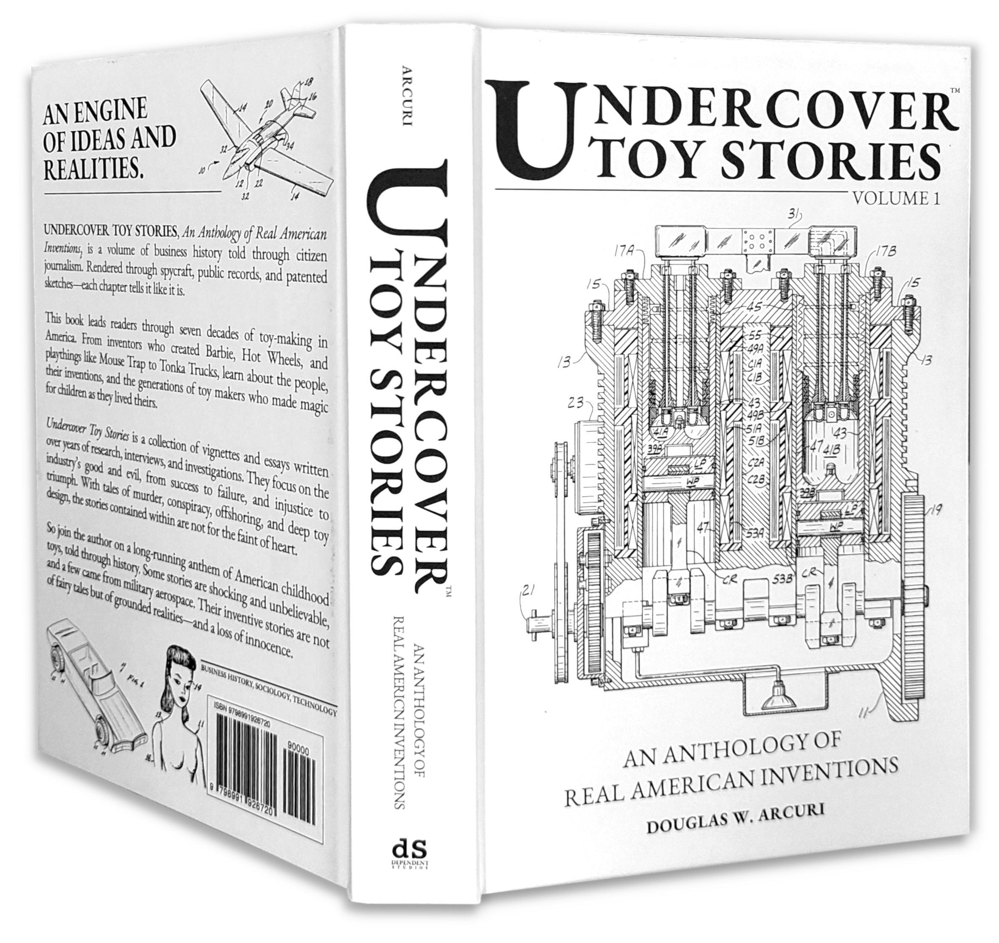

## ON TOY HISTORY
# We Really Do Care: Drive-By Scenes of Kenner's M.A.S.K.
## When Toy Bros Made Vehicles with Weapons as Primary Characters

*What follows is a critical review of Kenner's M.A.S.K. Also check out this author's book, [Undercover Toy Stories](https://www.amazon.com/Undercover-Toy-Stories-Anthology-Inventions/dp/B0FR9RVRVH): An Anthology of Real American Inventions, [available now](https://www.amazon.com/https://www.amazon.com/Undercover-Toy-Stories-Anthology-Inventions/dp/B0FRB318L4).*

---

## Part 1 of 3: Arms Division, Toy Bros With Bubble Guns
[On the streets of Cincinnati, Spring 1946]

**THREE DAPPER AMERICAN MEN** in fedora hats were sitting comfortably in a stylish Chrysler. They were cruising the streets of downtown Cincinnati, Ohio. And one of the men noticed a group of kids playing with bubbles on a street corner while running around with atomic mini-guns.

"Al," said the driver, pointing out the front window. "Check it out!" As the two discussed what they saw, the third man in the back was sipping "[Sudden Discomfort](https://whisky.auction/auctions/lot/61218/sudden-discomfort)," an elixir the entrepreneurs had invented through their failing business, Par Beverage. The man cut in and said, "We gotta find something, this bev business is about to kick the sh- bucket."

 and [1948](https://www.newspapers.com/image/98171758/?match=1&terms=Bub-l-rocket) were sold by Sears Roebuck and Co. The Bubbl-matic was redesigned and patented in the [1960s](https://patents.google.com/patent/US3398479A/en).](images/98-02.jpeg)

The backseat driver went on, "And your damned soap bubbles, Al," said Joe. But the driver, Philip, was awaiting Al's response in the passenger seat. Joe and Philip looked up to their older brother, Al, with respect. He called the shots.

Al thought long, but couldn't come up with anything. He shook his head, "No - I'm thinking about the weapons surplus. I'm not sure if we will get the contracts."

Philip paused for a brief minute and said, "Well, instead, could we make a toy gun do that?" And Al turned slowly. Then, he began to smile. "Yeah, Phil, [that's it](https://books.google.com/books?id=nx0DAAAAMBAJ&pg=PA56&dq=%22Philip+Steiner%22#v=onepage&q=%22Philip%20Steiner%22&f=false)."

YouTube's The History Guy [noted](https://www.youtube.com/watch?v=66NawyNr9qE&t=974), "We will always have toy guns as long as we have children . . ." and during America's post-war era, the drive to profit centered on these toys. For the Steiner brothers, this was it.

Joe, in the back seat, tossed the empty bottle of booze out the moving car window. He laughed as he pulled out a [Snoot-Flute](https://toytales.ca/snoot-flute-from-par-beverage-corp-1940s/) and began playing a funny tune. The brothers were all beside themselves.

These "toy bros" were legends in American business. "Toy guns... yeah. We'll start a division!" said Phil as he hit the accelerator, driving back to their office. Al held on to their hat while Joe in the back held his hand out the window and fired his pretend gun, smiling. "Bang, bang!"

The brothers formed a new product company with that idea, creating an *[arms division](https://www.kennercollector.com/2010/10/kenner-logos-2/)*, before they went all in on toy products. And these three quickly followed with heavy weaponry - the Bub-L-Rocket.

The brothers named the new entity Kenner, [written](https://www.newspapers.com/image/101967991/) by *The Cincinnati Enquirer's* Meghan Henterly, "Borrowing from the name their offices were on . . ." The business lasted fifty years, impacting the lives of millions of children. They "Really Did Care."

](images/98-06.jpeg)

To be clear, there wasn't any ***real arms development at Kenner***. As with Par Beverage bottles, these brothers' practical jokes were stamped directly on the children's Bubbl-matic box.¹

[Toys We Remembered](https://www.youtube.com/watch?v=didC7cRta2M) said, "During its first twenty years, Kenner created products like the Bubbl-matic gun, the Give-A-Show projector, and the Easy-Bake oven." When the bros retired in the 1970s, corporate successor Bernie Loomis ". . . saw the potential of the [alien creatures](https://www.newspapers.com/image/101361396/) as entertainment [with *Star Wars*,]" who made Kenner a permanent part of Americana.

"Kenner [became] one of the survivors of the golden age of toys . . ." wrote G. Wayne Miller. As *Star Wars* toy sales declined in the 1980s, the core team had an idea: conceal pretend weapons within transforming vehicles at 1:24 scale-they called it M.A.S.K., ". . . [death-dealing](https://www.newyorker.com/magazine/1986/12/08/on-comet-on-cupid-on-donder-and-blitzen) piece[s] of armament[s], thus creating what the Kenner people call 'a total play environment.'"

---

## Part 2 of 3: Taking Flak for Cost-Quality, The Modern Toy Bros
[Decades later, Toy Fair 2026.]

**SOMETIMES TOY BRANDS LAST** a century. And in today's toy business, products are built on collectibles and the overwhelming scent of nostalgia, *sans children*. Back then, men made toys for boys. Now, modern men make toys for other men who live in yesteryear - charging a wallop of cash.

Kenner, which survived numerous corporate takeovers in the 1900s, had developed a toy brand called M.A.S.K. (Mobile Armored Strike Kommand). Newspaper reports described its functionality in [February 1985](https://www.newspapers.com/image/942560208/): "By pushing several buttons, the vehicles transform into weapons that form the backdrop for the battles . . ."

.](images/98-07.gif)

M.A.S.K.'s original motto was "Illusion is the ultimate weapon," which featured an array of vehicles that transformed into fighting units. ". . . Matt Trakker, leader of the Mobile Armored Strike Command peace-keeping unit, and his archenemy, Miles Mayhem, head of V.E.N.O.M. (the Vicious Evil Network of Mayhem), were about two-and-three-quarter inches high," written in the 80's literature, *Toyland: The High-Stakes Game of the Toy Industry*.

The property was the typical good-versus-evil trope, anchored deep in TV advertisements and the corporate excesses enabled by the Reagan Administration. YouTube channel [Blue Harvest Toys](https://www.youtube.com/watch?v=pe5Byoo3n7o) said, "In short, [M.A.S.K.] was basically a hybrid of G.I. Joe and Transformers, two of the most important toy lines in the 1980s . . . a cash grab idea from Kenner."

M.A.S.K. lasted three years. Fast forward four decades, and the brand's roadside recovery  is successful. Designer John Warden - a plastic saint in the toy industry - is front and center of the M.A.S.K. reissue.

When Kenner [sold the lightsabers](https://www.newspapers.com/image/102350961/) to the toy Sith Overlord, Hasbro, John was young and dreamed of being a toy designer. [WPRI](https://www.wpri.com/news/local-news/blackstone-valley/hasbro-employee-laid-off-after-25-years-reflects-on-remarkable-career/) reporters Sarah Bawden and Kayla Fish quoted John, "When I was a little boy, I played with these toys and made up my mind that I wanted to design them someday . . ." and thus the gestalt of John Warden's mechanical prophecy is living on every collector's shelf, working for decades on the brand, Transformers. Because of his skill, he's hailed by Redditors.

YouTuber Optibotimus [said](https://www.youtube.com/watch?v=gcOeudRlLog&t=1523s), "John Warden really did usher in excellence with the Hasbro Transformers line." However, John was targeted under Hasbro's new CEO, Chris Cocks. In somewhat of a public affair, John Warden was [laid off](https://www.reddit.com/r/transformers/comments/1gakw99/john_warden_has_been_laid_off_from_hasbro_due_to/) by the very company that owned the M.A.S.K. intellectual property acquired by Kenners' dissolution.

John wasn't alone. Lately, Hasbro's leadership has been dismissing talent, sacrificing quality, and navigating uncertainty. For example, its toy overstock has been parked at discount stores, namely the national chain Ollie's, as documented by YouTubers at [World Class Bullsh - ers](https://www.youtube.com/@WCBs). Stockholders have sued the company for "overproducing."

Corporate drama aside, Mr. Warden now works with a California company called The Loyal Subjects, which snatched the dormant M.A.S.K. license [in 2024](https://toyhabits.com/mask-mobile-armored-strike-kommand-trademark-renewed-by-hasbro/). Ben Montano, SVP and their "license guy," carefully worked the deal.

TLS's secret illusion lies in its small-business agility and living-hinge know-how. Mr. Warden joined LTS in [April 2025](https://www.linkedin.com/in/warden-design/) under Jonathan Cathey's leadership. And Mr. Cathey has extensive experience with boutique collectability. Jonathan "ha[d] worked as a drummer in various bands. But at some point, he went in search of an activity that would bring him greater recognition [toys]," written in [*Dot Dot Dash*](https://books.google.com/books?id=drnrAAAAMAAJ&q=%22Jonathan+Cathey%22&dq=%22Jonathan+Cathey%22&hl=en&newbks=1&newbks_redir=1&printsec=frontcover&sa=X&ved=2ahUKEwibiseR1eqSAxXOvokEHUWiHzQQ6AF6BAgIEAM).

Mr. Cathey joined Super Rad Toys in 2006, specializing in vinyl collectibles. He has twenty years of experience developing plastic figures and branched out to create TLS, successfully picking up retro toy lines [Rainbow Brite](https://theloyalsubjects.com/collections/rainbow-brite), Strawberry Shortcake, and M.A.S.K. These investments, which appear to be a rebirth of OG Kenner, are a gamble for greater payoffs with Mr. Warden on board.

The drama of whether TLS will succeed has become real. At Toy Fair 2026, TLS announced that its team is moving into Wave 2 of its M.A.S.K. reissue (Gator, Piranha, Jackhammer, and Hurricane), with Wave 1 stock in the market as of December 2025. The feedback has been mixed.

![TLS restyled their logo to mimic the iconic 1980s Kenner logo. Jonathan Cathey, the company's founder, said, ". . . we're serving [M.A.S.K.] hot and fresh like '85 never left."](images/98-10.jpeg)

In their early 2026 product demo, which YouTubers [recorded](https://www.youtube.com/watch?v=xlfVSDOMM04) recorded, Mr. Warden spoke with confidence. He said, "The original [M.A.S.K.] molds do not exist, so when we rebuild these things, it's a very arduous and complicated process . . ."

"But the thing about M.A.S.K. is that . . . in toy history there has never been a brand mechanically complex with spring-loaded reveals . . . There's really nothing [else] out there. That's what's really exciting about it," said John.

Mr. Warden followed, ". . . [all because] Ben [Montano] got that licensing deal done." Mr. Montano smirked and replied, "Fans, when they get angry online, it usually means that they really, really, really love the brand," acknowledging the QC issues collectors reported on their first-issued toys.

On YouTube, expletives are numerous, and examples are easy to find. Cool Toys [said](https://www.youtube.com/watch?v=pXRUAt7EUmk&t=336s), "Bruce Sato's leg snapped right off from the hip. And I'll show you why. And it's bad design, and bad quality," demonstrating a molding error. Enthusiasts have also noted fingerprints baked into the chrome.

And [Sarlacc Digest](https://www.youtube.com/watch?v=LTQmW37tjlI), a critical YouTuber that had covered the situation of misaligned stickers, CMYK color issues, limp and loose parts, and jank in the toys, negotiated the ails. He said, "Don't look at [original] M.A.S.K. with rose colored glasses. Right? The cartoon was terrible. The toy line was great, but it got a little janky . . . Well done, Loyal Subjects . . . not bad at all."

Apart from quality issues, toy collectors balked at the price. YouTuber TRDQ [said](https://www.youtube.com/watch?v=CUgL3lZ_WbU), "We can see if [TLS M.A.S.K.] are worth, uh, excuse me here. I don't mean to be crass. The ***f-ing*** money?"

, "It was a very crowded market that put heavy demands on a ten-year-old kid's time and their parents' wallets." In 2025, TLS has rebuilt and tooled four vehicles, including the Condor.](images/98-11.jpeg)

Even so, the toys are for adults [aged 8+] with thick-chrome wallets. After accounting for inflation, their offering of four toys (Rhino, Thunderhawk, Switchblade, and Condor) requires loyalty. For instance, the Thunderhawk, based on a red Chevy Camaro in 1985, sold for $12.99, and adjusted for inflation, that's about $39.99 today. However, the TLS sticker price is $64.99, which is why there is outrage - and a real reflection of President Trump's new tariffs.

Thus, Jonathan Cathey's [frustration](https://apnews.com/article/trump-two-dolls-tariffs-toys-7b0e5d3a9035471317e6dc4ee1fbfbc1) was picked up by AP reporters Anne D'Innocenzio and Didi Tang. Mr. Cathey said, "[Trump is] COMPLETELY out of touch . . . [I] love how toys and the dolls have become THE martyr metaphor for this nonsensical trade war incoherence." Mr. Cathey remains outspoken about the administration - "Trump and his dumb/illiterate tariffs," Cathey wrote on his [LinkedIn](https://www.linkedin.com/posts/jonathancathey_wrapping-up-the-year-highlights-toty-activity-7407540634590281728-WueY/).

In the land of high toy prices, [Optibotimus](https://www.youtube.com/watch?v=_2M8SzzfMUk&t=570s) said, "There's a lot of tariffs that [*are*] playing into certain aspects of things . . . it is what it is. I'm not trying to get political, [but tariffs] increase prices."²

Regardless of global politics, YouTubers have made it clear: "But I care, and I know the company cares. So they need to fix [the reissue]," said [ActionFigures](https://www.youtube.com/watch?v=hTTWJfNLmHk&t=1235s). TLS is working through M.A.S.K. issues and has pushed back the release of the Gold/Black 40th-anniversary editions.

LTS had released an [apology email](https://www.reddit.com/r/MASK/comments/1qbt36z/mask_message_from_tls/) early this year, and Internet voices like Bill Faries, creator of the early Internet website matt-trakker.com, have been [critical of the response](https://www.youtube.com/watch?v=TSlY77ygnSk).

 Wherever the customer stands, its clear John Warden, Ben Montano, and Jonathan Cathey "Really Do Care."  And like the Steiners so long ago, these are the newest "toy bros" shifting into collectability while driving their business through survival. And while TLS is running on a three-banger [really, 15 employees], Kenner once had the biggest toy body shop.

---

## Part 3 of 3: Grandfathers of Concealed Toy Guns in the Glovebox
[Somewhere on Interstate 75, 1983.]

**AN INDUSTRIAL ENGINEER WAS** driving into Kenner Toys off Interstate 75. It was a typical commute for the designer. Like many artists with difficult problems, this person was daydreaming at the wheel. While thinking about [SilverHawks](https://patents.google.com/patent/US4571206A/en), a short-lived figure design that he was finishing, a loud honk broke his concentration.

 said, "The Rhino is a commanding presence . . . you can tell that this rig was meant to be the main focus of the toy line . . . it's meant to be Matt Trakker's main vehicle . . . this thing will blindside you by how big it is." The [original patent](https://patents.google.com/patent/USD291816S/en) of the MDU (Mobile Defense Unit), aka Rhino, included artists Howard Bollinger and engineers Earl M. Wood. Jr.](images/98-12.jpeg)

"What the hell was that?" said the engineer, who was driving a Chevy Camaro. Behind him, a large Kenworth truck of a deep color. The trucker was being aggressive, atypical of those whose commercial driver's licenses are worth their livelihood,  but every hour counted.

The truck changed lanes and passed him, and as the toy engineer looked up, he saw a large cab, a long hood, and a monster-looking thing with all the chrome. The truck driver flipped him the bird, and perhaps his mouth was obscured, but he did "mouth" a four-letter word. The engineer glanced, albeit briefly, at his glovebox.

Then the driver calmed, and his design ethos came to the fore. "Wow, that truck looked f - ing great!" All because the Kenner engineer was blocking a lane as he mentally worked through a problem on the drive into the office. And *thus*, the legend of the M.A.S.K. property was born.

Carol Motsinger of *The Cincinnati Enquirer* interviewed Corky Steiner, son of one of the Kenner bros, and once product leader of Kenner himself, said, "A Kenner engineer spotted a massive truck on the way to the Downtown office from his home in Kentucky . . . That real-life encounter turned into a line of vehicles that transformed . . ."

Hence, the drive-by is why the M.A.S.K. logo features the MDU (Mobile Defense Unit), aka the Rhino, with a man in a full mask. The brand is All-American, conceived in *Kentucky*, and hot-stapled in *Ohio*. The last part of production, common at the time and as it is today, was foreign.

And perhaps early on in the toy ideation, someone mentioned the Dolorean, fashionable back then, and thus the addition of Thunderhawk (matched to the redesigned '83 Camaro) with gull wings.³

At least, this is the tale the author wants to believe. We will never know, *precisely*. President John F. Kennedy was quoted on his failed attempt to invade the Bay of Pigs, "Success has a thousand fathers . . . but defeat is an orphan." And for tales like Kenner's *Star Wars*, many Obi-Wans cashed in on the legends later, retelling history in *The Toys That Made Us*.

In the creation of M.A.S.K., there's not much of a legend, but a driven persistence. Its narrative is simple: capitalism, wrapped in extreme mechanical cost engineering and beautiful art, executed by an articulated corporate army of grandfathers serving the Boomers' children.

 in his hand as he saddles vehicles, [Hurricane](https://www.transformerland.com/wiki/toy-info/mask-original-mask-series-series-2-vehicles-hurricane/38709/) and Jackhammer. "M.A.S.K. is as every bit a blockbuster as Star Wars and Strawberry Shortcake," said Mauer. Credit: [The Cincinnati Enquirer](https://www.newspapers.com/image/101826365)/Mark Braykovich.](images/98-15.jpeg)

In the 1980s, M.A.S.K. prototypes were revealed to leadership, such as former president Dave Mauer, during product demos. In an [oral retelling](https://www.agentsofmask.com/2020/09/new-retrofied-magazine-showcases-unproduced-kenner-mask-toys.html), Jamie Greene of defunct *Retrofied Magazine* interviewed Kenner engineer Bill Kraimer, who created the Slingshot. Mr. Kraimer said, "We had regular design reviews with upper management, including the president Joe Mendelsohn . . . we would often stay up all night working on our presentations."

Mr. Mendelsohn became the [chairman of Kenner](https://www.newspapers.com/image/101739833/) at the end of the initial development as Dave took over.

In the forefront was Howard Bollinger, credited on patents with growing and scaling all the M.A.S.K. products. [Mr. Bollinger](http://bollingergallery.com/), an accomplished artist now in his mid-80s, was such a believer in the brand that Emperor Hasbro reclaimed the trademark back from his consulting company in the 2000s. They settled out of court.

Tim Effler provided artistic design for the brand, along with toy powerhouses [The Real Ghostbusters](https://books.google.com/books/about/The_Real_Ghostbusters_A_Visual_History.html?id=quw2EQAAQBAJ) and [Centurions](https://patents.google.com/patent/US4723931A/en). And there is an endless list of industry model/design bros, managed by a [race car driver](https://www.youtube.com/watch?v=1wMDxUyUNWE), Tom Osborne, who shepherded the M.A.S.K. design (adding racing aesthetics), managed a department of [thirty-five people](https://www.facebook.com/watch/?v=389715996673918) - the "John Warden" of yesteryear.

For marketing, Louis Gioia, Jr. positioned the brand and spent up to twenty million dollars [sixty million in 2025]. M.A.S.K. was Kenner's first [out-licensing](https://www.kennercollector.com/kenner-history/) to third parties, had DC comic books, and an animated TV cartoon series with "Sixty-five episodes [that] could air five days a week for thirteen weeks straight . . . with a crime of the week format," said [Nostalgia 4–1–1](https://www.youtube.com/watch?v=5Pno30ruimo).

PDXCollective [cracked](https://www.youtube.com/watch?v=dL1may00T4Q), ". . . [I] haven't watched an episode of M.A.S.K. all the way through, just like 7 Up - 'Never had it, never will.'" This author agrees that the cartoon has no substance.

When the brand shifted to high gear, the property appeared successful, but not *Star Wars successful*, which Kenner has a vivid history of making $100 million from [1975 to 1978](https://www.youtube.com/watch?v=QmTycUtb9j0). In Kenner's run up to $300 million in 1987, M.A.S.K. led the balance sheet.

 was a part of its artistic development.](images/98-17.jpeg)

Today, M.A.S.K. remains a slow-burning car fire of long-term cash generation served by aging males tied to an evergreen trademark. And when toy nostalgia became a thing, Tim Effler was quoted, reflecting on his past work. Tim said to reporter [Cliff Peale](https://www.newspapers.com/image/102633448/?terms=%22Tim%20Effler%22), "I remember my first day working at Kenner . . . I feel like we're part of the golden age of toys - and it's over."

Mr. Effler is focusing on his legacy, finalizing a book titled *Back to the Drawing Board - The Art of Kenner Toy Design*, available for [preorder](https://bluemilk.shop/products/back-to-the-drawing-board-the-art-of-kenner-toy-design?variant=44625209196744). The tome will dedicate fifteen pages to M.A.S.K. and is due out this year.

But is the golden age over if men in their forties and fifties dole out hundreds of dollars today? Perhaps, it's the *silver age* of Kenner artist bros who once "Really Did Care" - grandfathers who sold an assortment of concealed toy guns buried in the proverbial glovebox of consumer history.

Surprisingly, TLS has ripped the orange "vehicle abandonment" sticker off the brand, and their rearmament is underway. But is any man going to give their [1.58 kids](https://www.cbo.gov/system/files/2026-01/61879-Demographic-Outlook.pdf#:~:text=CBO%20projects%20that%20the%20total%20fertility%20rate,woman%20this%20year%20to%200.60%20in%202056.) the keys?

. And if you enjoyed this fascinating write-up, you'll find more in the author's book, [Undercover Toy Stories, available now](https://www.amazon.com/Undercover-Toy-Stories-Anthology-Inventions/dp/B0FR9RVRVH). This patent appeared in the book, published in 2025.](images/98-19.jpeg)

¹ *The production of real arms belongs to other American toy companies, as written in this author's book,* [Undercover Toy Stories](https://www.amazon.com/Undercover-Toy-Stories-Anthology-Inventions/dp/B0FR9RVRVH).

² *This author has commented at length about President Trump's entanglement of tariffs [and his history among the toy industry] in his book,* [Undercover Toy Stories](https://www.amazon.com/Undercover-Toy-Stories-Anthology-Inventions/dp/B0FR9RVRVH).

³ *The earliest M.A.S.K. TV commercial provides this tell.*

---

## Social Post

"TLS has ripped the orange 'vehicle abandonment' sticker off the brand [M.A.S.K] . . . These are the newest 'toy bros' . . . [they] 'Really Do Care.'"

What follows is the authoritative, quote-rich write-up on #Kenner M.A.S.K. The post covers both the maker's origins and the current drama surrounding the revived brand by #TheLoyalSubjects.

If you liked this write-up, there is more in my book, Undercover Toy Stories: https://lnkd.in/e-WCYgaA

https://medium.com/@solidi/we-really-do-care-drive-by-scenes-of-kenners-m-a-s-k-34b1135d291d

#history #drama #Hasbro #TLS #mobilearmoredstrikekommand #80stoys #retro #toys #collectibles
