## ON TOY HISTORY
# The TOMY Spinjas
## These Battling Tops Continue to Spin Into Moderity

![Spinjas, a novel batting top game, was released internationally in 1988. "The [Canadian] Toy Council gave it a novelty rating," wrote the [Calgary Herald](https://www.newspapers.com/image/484471141/).](images/99-01.jpeg)

*If you are a TOMY enjoyer, you'll like [The TOMY Big Loader](https://medium.com/@solidi/the-tomy-big-loader-351139832616) and The [TOMY Screwball Scramble](https://medium.com/@solidi/the-tomy-screwball-scramble-9f4eab3681da), both written by this author. Also check out this author's book,* [Undercover Toy Stories: An Anthology of Real American Inventions](https://www.amazon.com/Undercover-Toy-Stories-Anthology-Inventions/dp/B0FR9RVRVH), *[available now](https://www.amazon.com/Undercover-Toy-Stories-Anthology-Inventions/dp/B0FRB318L4).*

---

## Sort of a Precursor to Beyblade

**BACK IN 1989, TOMY U.S.,** the international company that represented Japanese toys in America, partnered with Parker Brothers to release a well-loved, but short-lived toy. The phrase was Kuuten Senshi, anglicized as Spinjas. On its instructions, a fabled battle between good and evil was described.

The directions [read](https://www.hasbro.com/common/instruct/Spinjas.PDF), ". . . THE ELIMINATORS™ and THE DREAD FORCE™ [are] at war at the earth's core! In a series of gladiator bouts at the center of the earth, the heroic steel-tipped CHAMPION SWITCHBLADE™ and the evil brass-tipped CHAMPION SHOTGUN™ go one-on-one in the Battle Stadium."

Two players crank their "Spinjas Champions" into "Power Winders" and release them onto the "Battle Stadium." The first to conquer five is the prizewinner.

[RetroDaze](https://www.youtube.com/watch?v=7mmDshCJBFE), a YouTuber, said, "TOMY created the Parker Brothers distributed toy, Spinjas, a unique spinning top battle game which was released in either [19]87, [19]88, or [19]89."

 wrote, "Spinjas continue to hold a special place in the hearts of those who experienced their charm."](images/99-02.gif)

". . . Personal memory, however, places [Spinjas] in shops around 1985, as I was definitely playing the game with my best friend in middle school," RetroSpectives [said](https://www.youtube.com/watch?v=cPK4kgHpiLY).

In the United States, the exact date of first use was [January 21, 1989](https://tsdr.uspto.gov/documentviewer?caseId=sn73781986&docId=ORC20051219180637&linkId=1#docIndex=0&page=1), as written on the trademark filing. Of course, internationally, it was earlier, as the plaything was conceived in Japan. In Europe, where the YouTuber, RetroSpectives, is located, Spinjas was known as *Battling Tops*, no more than a year before the 1989 Toy Fair in America.

Former Toys 'R' Us CEO John Barbour [said to](https://www.newspapers.com/image/289531734/) *USA Today* reporter Craig Wilson, "So many toy trends start in Japan, so we predicted it would sell well, and it has." Many famous toy lines that originated in the East, such as the [TOMY Big Loader](https://medium.com/@solidi/the-tomy-big-loader-351139832616), Transformers, and later Beyblade. So goes with Spinjas.

[The Retro Machine](https://www.youtube.com/watch?v=FQgyemxJ7r0) replied, "[Spinjas] is sort of a precursor to the Beyblades. It's just like Battling Tops [from Ideal], but they tried to add some thematic flair to it."

Beyblades, "a battling spinning top toyline and multimedia franchise developed by the Japanese toy company Takara," would be a decade away. This article confidently spins Spinja's business.

---

## American Boost Without the Super Charger

**WHILE JAPAN HAD AN AFFAIR** with battling tops (also known as Beigoma) since the feudal lords of their Edo period, in America, their spinning top battlements started about the time when Industrial-Complex lords demanded the continuation of the Vietnam War.

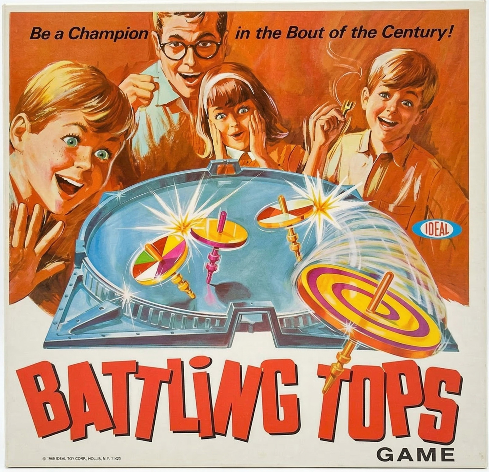
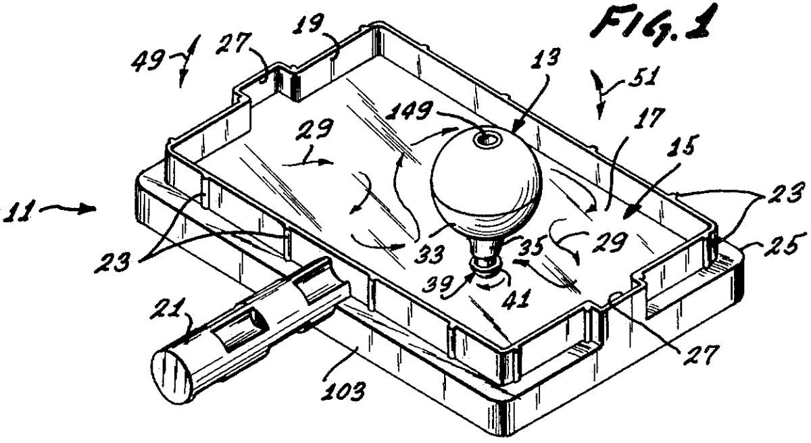

At about that time, the late Albert Baginski and Jacob de Gelder worked together, deep in Mattel's R&D, to create the [Mattel Wiz-z-zer](https://toytales.ca/wizzzers-from-mattel-1969/), a single top that could do tricks with its applied centrifugal force on a pinpoint. As seen in [a patent](https://patents.google.com/patent/US3674271A/en), these crafters were on their way to creating a battle-tray arena.

As American-Japanese tensions began to cool a generation after World War II, co-invention occurred. Battling Tops, a game from Ideal, was invented by the legendary Eddy Goldfarb. Toy historians believe that the game is the modern start of the American phase of a spinning-top obsession.

[RetroDaze](https://www.youtube.com/watch?v=7mmDshCJBFE) continued, "Spinjas were sold as a self-contained battle unit with two character tops and two launchers packed into a case that doubled as a mini fighting area."

, said, "I'm easily amused by these . . . very neat, kind of reminiscent of a transformer."](images/99-06.jpeg)
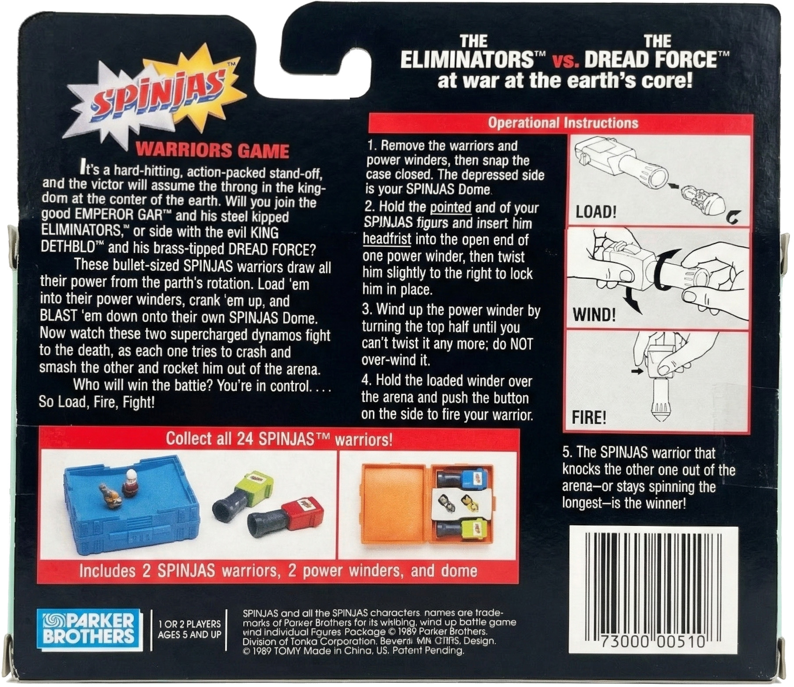

"Anyone who grew up in the 80s might remember these. They're called Spinjas . . . The top portion is a plastic construction, and the bottom spinner is a metal design, which you don't see too many metal toys nowadays," said [BiteSize Spotlight](https://www.youtube.com/watch?v=MOJyybHYXq8).

While the artists and designers remain silent due to Japanese cultural norms, the mechanical engineering of the launchers was developed (legally declared) by [Takayuki Onoda](https://patents.google.com/patent/US4932918A/en) at TOMY sometime in 1987, and the battle arena sculpted by [Takahiko Ichimura](https://patents.google.com/patent/US4982961A/en) in 1988.

[RetroSpectives](https://www.youtube.com/watch?v=JR0xfiVBbAg), the YouTuber who swore he had the toy in 1985, said, ". . . There was a product called the supercharger that fit inside that socket and gave the spinner an extra powerful boost." That author had tracked down the origins. Yes, the supercharger was a device developed in TOMY's Tokyo R&D, shown in the original patent.

However, the souped-up device never made it into the European and U.S. releases because it was deemed too dangerous for children, or *more likely* due to cost-cutting.

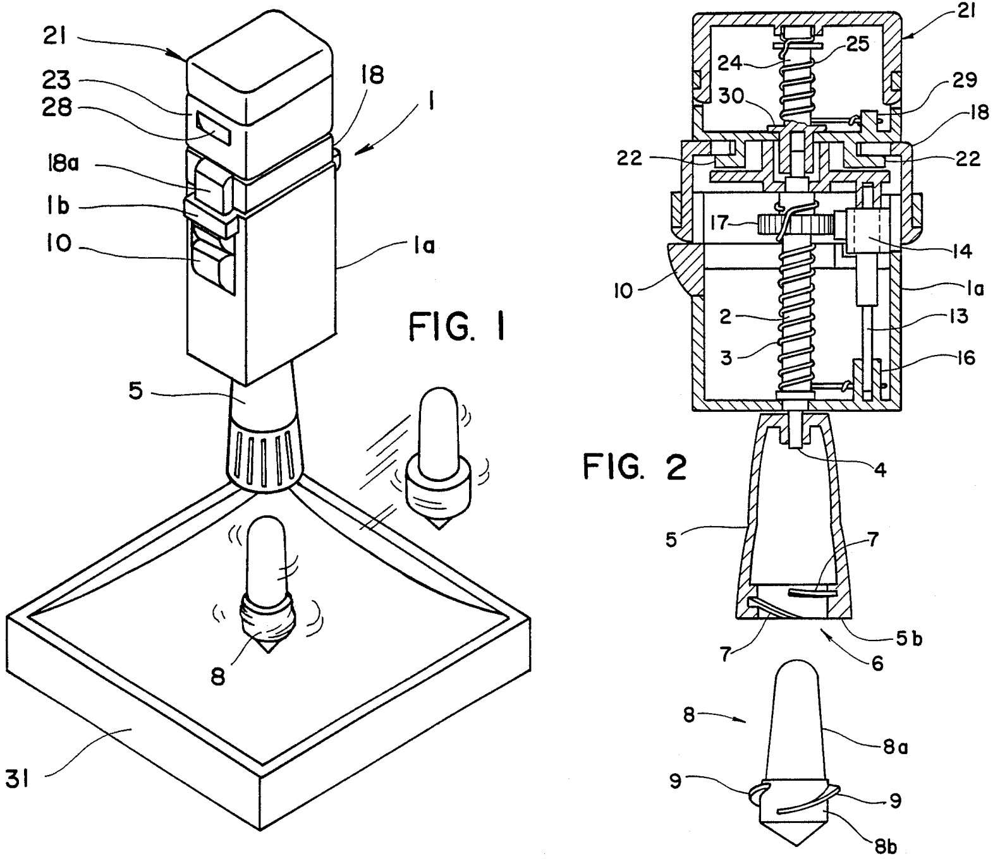
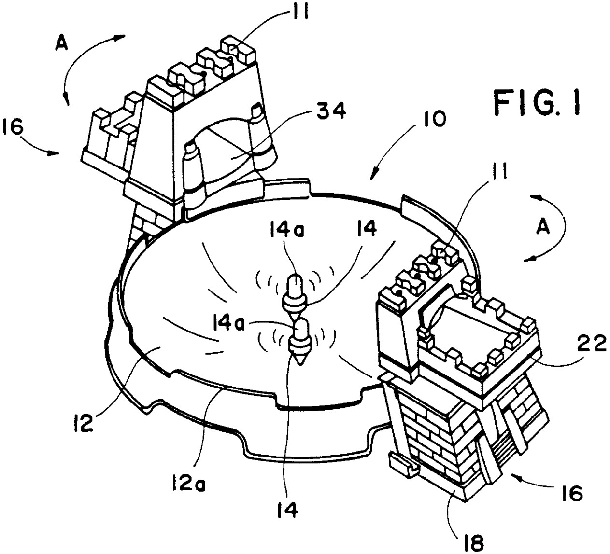

While Spinjas was essentially fighting itself, Battling Tops and the Wiz-z-zer underwent a Buddhist reincarnation to re-enter the arena.

Matchbox and Tyco got into a top-spinning fight. In the late 1980s, Matchbox obtained the rights to the defunct Wiz-z-zer, whereas Tyco exported Sega's [Card Power](https://segaretro.org/Card_Power#No._2:_Battle_Top) as Pocket Power, Top Fight. They saw the potential as Spinjas took the trophy for best in a spin-show.

However, not everyone was fond of the competing toy weaponry. One enjoyer said on [Tets' Toys](https://www.youtube.com/watch?v=awLp2qgqj64) YouTube channel, "I had [Top Fight] back when I was a kid… It was a piece of garbage." And a check of the modern-day Internet reveals no such Spinjas comment-wobble.

Unlike Pocket Power, Spinjas attracts memories into its legacy orbit. And just as the toy battle started in 1989, it faded. Every American top toy spun out by 1992. [ByteSize Spotlight](https://www.youtube.com/watch?v=MOJyybHYXq8) said, "There might be someone that might pick this up and re-release it." And they were right, *at least four times*.

---

## Three Strikes on Spinjas Revitalization

**IN THE 21ST CENTURY**, the Spinjas brand wound up to regain market dominance. [TidyCthulhu](https://www.youtube.com/shorts/D6Jae5ykSz0), a masked personality on YouTube, said, "[Spinjas is a] tiny battle arena where people have been known to actually bet money on the outcome of these fights."

Would anyone in a corporate suit bet money on the brand? Of course, the U.S. trademark legal trail told the whole story. Suits were betting big on the Spinjas re-launch.

In 2002, the defunct Long Island toy company Toymax geared up for the re-release of its Spinjas line. As electronics became cheaper, toymakers introduced a special touch, an LED built into the spinner.

 to the Pocket Power Series. In their first iteration, a tops version named "Top Fight" was created for the American market.](images/99-10.jpeg)
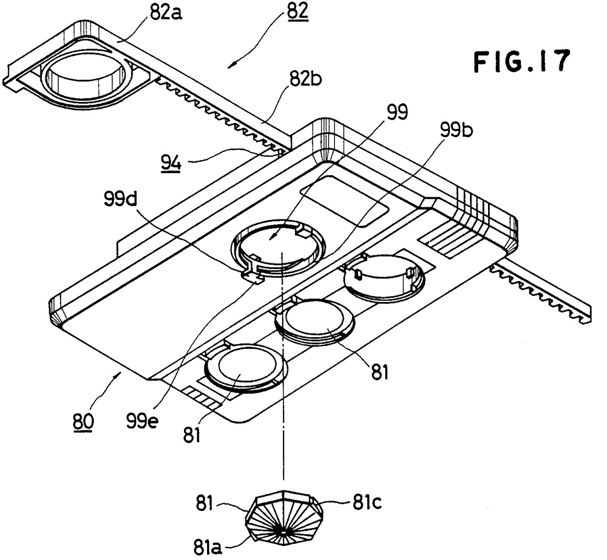
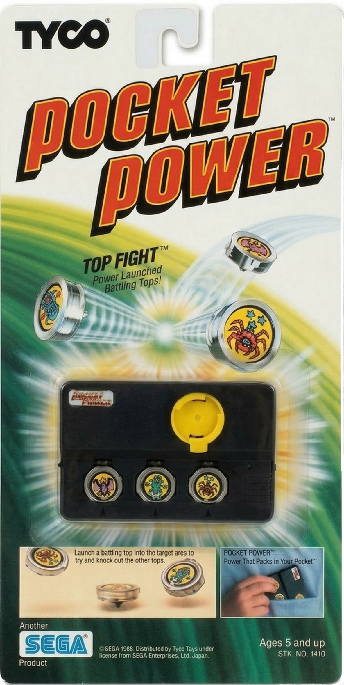

Abigail Goldman from *The Los Angeles Times* [wrote](https://www.newspapers.com/image/189930916), "Hasbro's lead with Beyblade will be hard to beat, many in the toy industry say . . . [others include] Toymax Inc.'s Spinjas, with flashing lights and launcher."

Reporter Craig Wilson recognized the trend and [wrote](https://www.newspapers.com/image/273978434/), "Spinjas (ToyMax, $2.99; in stores August [2002]) claim to be even faster and more powerful and have the bonus of lighting up while they spin."

It all came to a draw when a corporate takeover placed the battle on pause. "Jakks Pacific buys Toymax International for $54.7 million," as written by AP reporter [Gary Gentile](https://www.newspapers.com/image/1049229416/). Toymax International was sold at the time of the Spinjas relaunch.

Effectively, Spinjas was bumped right out of the plastic arena and dissolved in the merger. The management Shoguns gave the product the blade.

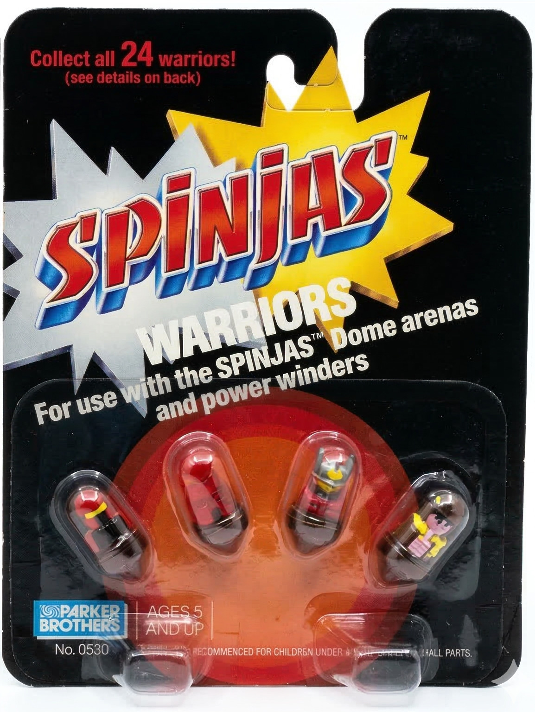
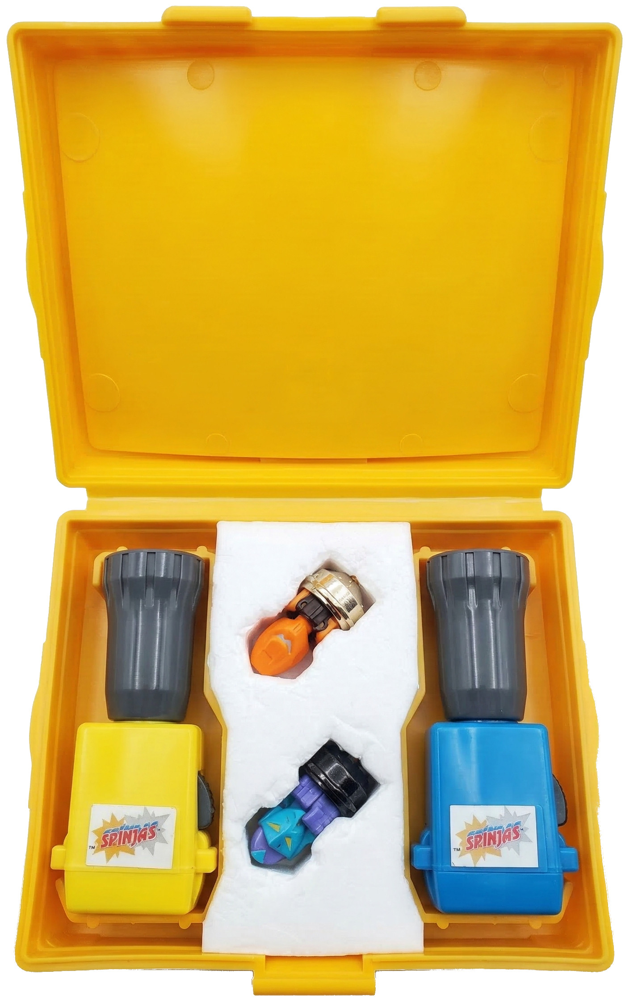
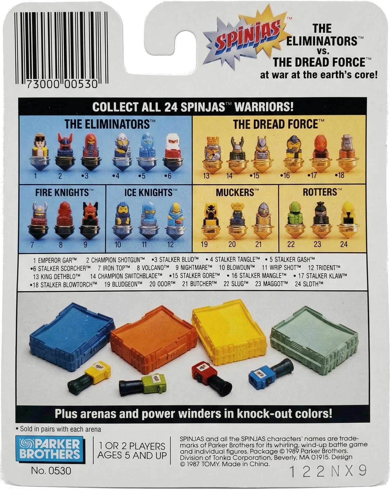

All was not lost. Some five years later, Planet Toys Inc. [picked up the brand](https://tsdr.uspto.gov/#caseNumber=78974610&caseSearchType=US_APPLICATION&caseType=DEFAULT&searchType=statusSearch) and planned to resell it. However, before they accomplished launching, they were also tossed out of the arena for selling toys dangerous to children.

*[The Daily News](https://www.newspapers.com/image/411174948/)*, through the AP, reported, "Just days before Christmas [2007], Planet Toys, Inc. wants stores to remove the company's CSI Fingerprint Examination Kit from their shelves after some tests revealed samples of asbestos included in the kits."

And thus, they were eliminated by the dread forces known as the CPSC, a federal agency that monitors and protects consumers.

Then, by 2015, another kiseki occurred. A dream team of creative artists brought a full re-imagining of the brand, fueled by real nostalgia for the toy from long ago. 16bit.com [wrote](http://www.16bit.com/toyfair2016-spinjas.asp), "Spinjas! The 1980s Tomy game is back, sort of, from Nowstalgic Toys."

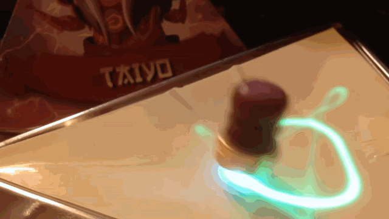

Nowstalgic Toys invested in the brand and had sunk [at least a year's](https://tsdr.uspto.gov/#caseNumber=85967006&caseSearchType=US_APPLICATION&caseType=DEFAULT&searchType=statusSearch) development costs. Complete with new character design, an iOS and Android gaming app with fluid-spinning mechanics, and new boxed art. The reveal appeared at Toy Fair 2016.

Kohdok, a YouTuber who had early access to the brand, described the new spinner unit, which was [much larger](https://www.youtube.com/watch?v=9MDcDXjTbsY). "This Mercury or Soyuz-looking thing here, and how appropriate, because it actually docks with another thing, and what it does when you put it into this charger here, it charges up a light inside of Tayio."

The toy added UV light tracer technology, making it look radioactive for what was essentially a gimmick. And for a third time in the brand's history, Spinjas proper fell again to the eliminators. Perhaps there wasn't much interest, and the company decided to bail before they took losses?

Their creative director, Scott Ulliman, wrote on his website, "Our team was about 6 people total . . . Spinjas was presented at the NY Toy Fair 2016 with the toy + game, both playable."

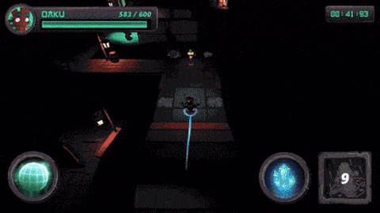
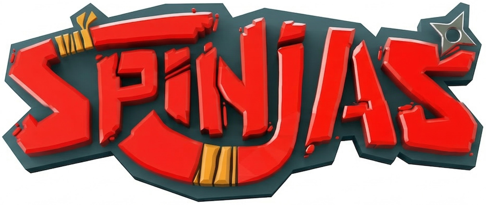

And designer, Mark Fitzpatrick [wrote](https://www.mf-3d.com/#/spinjas/), "I was responsible for creating all the characters for the toy line and the mobile game. I created 24 characters for the app, then converted them to print-ready models."

This author's messages to both Mr. Ulliman and Mr. Fitzpatrick went unanswered, and the reasons for halting Spinjas' revitalization remain unexplained. Thus, the brand spun out once again, ending in a draw.

---

## The Fourth Spin - A Legacy or a Curse?

**JAPANESE CULTURE BELIEVES** that the number four is unlucky. And while a reader would believe the battle for Spinjas has ended, not so. At the time of this writing, many 21st-century competitors have filed trademark claims on the brand while being unjustly rejected from the arena.

 in 2024.](images/99-19.jpeg)
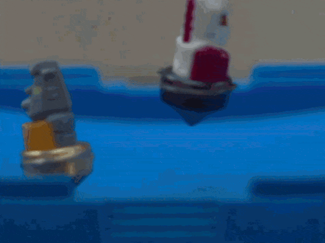

With three tales covered above, *the fourth saga* is by Legacy II, LLC, known for its legacy brand acquisition and tabletop games. At the time of this writing, their company is awaiting a [2026 trademark opposition](https://tsdr.uspto.gov/#caseNumber=99251109&caseSearchType=US_APPLICATION&caseType=DEFAULT&searchType=statusSearch) to Spinjas. It's anyone's guess what the company will spin out if they secure the launcher and find the right spin angle that breaks the curse.

Perhaps Legacy II, LLC believes in tossing its competitors. As does [Millionaire Playboy](https://www.millionaireplayboy.com/toys/spinja.php), who wrote, "Spinjas' current incarnation is the BeyBlades, but frankly, spinning disks do not hold a candle to these guys. Kids these days, they just don't know what they're missing."

While the future of Spinjas remains uncertain, the crown of popularity goes to the brand, Beyblade. But for those on the side of Spinjas, its nostalgic prowess is a legacy.

, "I am still looking for the main Battle Arena, which I have not been able to find, uh, economically that is . . . they are definitely very expensive if you can even find them nowadays," he said. [The Collector Gene](http://collectorgene.com/2012/08/sonic-the-hedgehog-spinjas/) shared a 1990s Sonic the Hedgehog version. As mentioned above, Sega was involved in Top Fight.](images/99-21.gif)
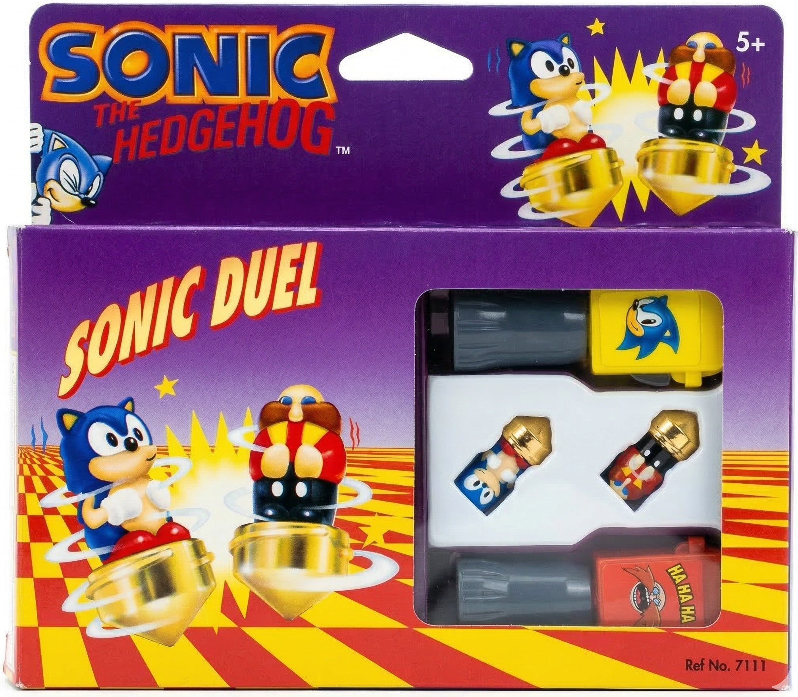

There are countless people on the Internet who care deeply about this microgame, Spinjas. And they come at a premium price on the secondary market.

[RetroDaze](https://www.youtube.com/watch?v=7mmDshCJBFE) said, "This is one of those toys that had a small enough run to cause the secondary market prices on eBay to be higher than you're going to want to pay." For instance, this author spun out over $50.

While the money-to-value is questionable, its emotional value spun true. The Ebayer who sold the item to this author left a note in the package. On handwritten paper, he wrote, "Thank you for buying the Spinjas. A favorite from my childhood. Hope that they are enjoyed. Wishing you all the best."

And random people on the Internet talk about the toy all the time. On Facebook, "It was 40 years ago this year that my father gave me this Spinjas game," said one man. Thus, Spinjas remains in the center arena of childhood memories.

---

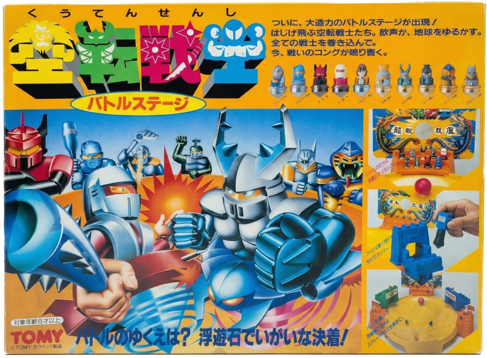
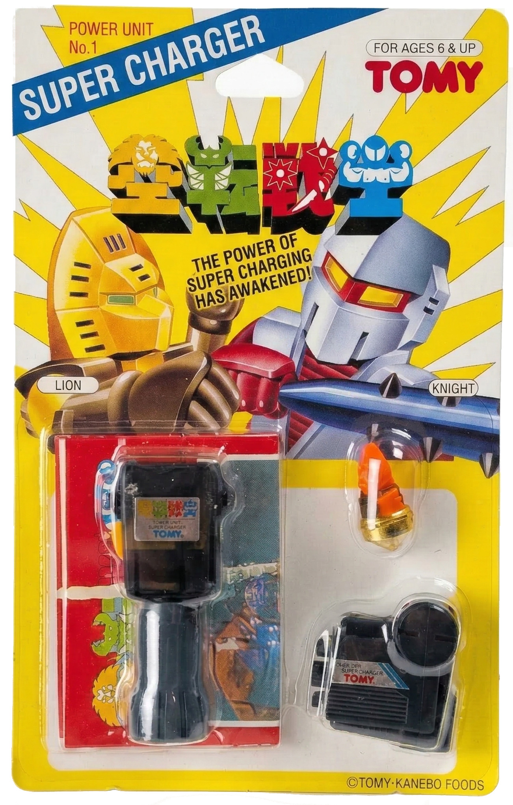

*Note: Product images above were restored with Nano Banana 2. While the author ensured that the accuracy is close to the original representation, computed images may exhibit minor differences. Some images were translated into English.*

---

"The phrase was Kuuten Senshi, anglicized as #Spinjas. On its instructions, a fabled battle between good and evil was described . . . At the time of this writing, [the #USPTO] is awaiting a 2026 #trademark opposition to Spinjas."

The beloved brand, Spinjas, is back up for grabs. And here is its backstory. Will Spinjas spin-out again in 2026 for a fourth time? Time will tell.

#takara #tomy #beyblade #retro #hasbro #parkerbrothers #retro #legacy #toyhistory #games #ideal #battlingtops 

https://medium.com/@solidi/the-tomy-spinjas-978a183a5eb3
